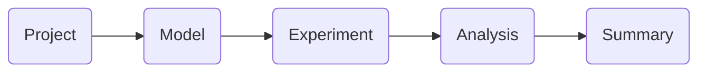

# Analysis Workflow

To streamline the **data analysis process**, EasyDiffraction follows a
structured workflow divided into **five key steps**:

- [:material-archive: Project](project.md) – Establish a **project** as a
  container for sample model and experiment parameters, measured and calculated
  data, analysis settings and results.
- [:material-puzzle: Sample Model](model.md) – Load an existing
  **crystallographic model** in CIF format or define a new one from scratch.
- [:material-microscope: Experiment](experiment.md) – Import **experimental
  diffraction data** and configure **instrumental** and other relevant
  parameters.
- [:material-calculator: Analysis](analysis.md) – **Calculate the diffraction
  pattern** and **optimize the structural model** by refining its parameters to
  match experimental measurements.
- [:material-clipboard-text: Summary](summary.md) – Generate a **report**
  summarizing the results of the analysis, including refined parameters.

Each step is described in detail in its respective section, guiding users
through the **entire diffraction data analysis workflow** in EasyDiffraction.
