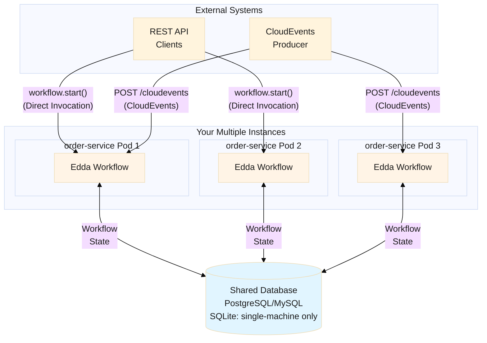

# Edda

**Edda** - Primary sources of Norse mythology, comprising two Icelandic collections: the poetic 'Elder Edda' and the prose 'Younger Edda', which preserve ancient sagas.

> Lightweight durable execution framework - no separate server required

[](https://opensource.org/licenses/MIT)
[](https://www.python.org/downloads/)

---

## Overview

Edda is a lightweight durable execution framework for Python that runs as a **library** in your application - no separate workflow server required. It provides automatic crash recovery through deterministic replay, allowing **long-running workflows** to survive process restarts and failures without losing progress.

**Perfect for**: Order processing, distributed transactions (Saga pattern), AI agent orchestration, and any workflow that must survive crashes.

## Key Features

- ✨ **Lightweight Library**: Runs in your application process - no separate server infrastructure
- 🔄 **Durable Execution**: Deterministic replay with workflow history for automatic crash recovery
- 🎯 **Workflow & Activity**: Clear separation between orchestration logic and business logic
- 🔁 **Saga Pattern**: Automatic compensation on failure with `@on_failure` decorator
- 🌐 **Multi-worker Execution**: Run workflows safely across multiple servers or containers
- 🔒 **Pydantic Integration**: Type-safe workflows with automatic validation
- 📦 **Transactional Outbox**: Reliable event publishing with guaranteed delivery
- ☁️ **CloudEvents Support**: Native support for CloudEvents protocol
- ⏱️ **Event & Timer Waiting**: Free up worker resources while waiting for events or timers, resume on any available worker
- 📬 **Message Passing**: Channel-based messaging (broadcast/competing modes) and direct workflow-to-workflow communication
- ⚡ **Instant Notifications**: Optional PostgreSQL LISTEN/NOTIFY for near-instant event delivery

## Use Cases

Edda excels at orchestrating **long-running workflows** that must survive failures:

- **🏢 Long-Running Jobs**: Order processing, data pipelines, batch jobs - from minutes to days, weeks, or even months
- **🔄 Distributed Transactions**: Coordinate microservices with automatic compensation (Saga pattern)
- **🤖 AI Agent Workflows**: Orchestrate multi-step AI tasks (LLM calls, tool usage, long-running inference)
- **📡 Event-Driven Workflows**: React to external events with guaranteed delivery and automatic retry

### Business Process Automation

Edda's waiting functions make it ideal for time-based and event-driven business processes:

- **📧 User Onboarding**: Send reminders if users haven't completed setup after N days
- **🎁 Campaign Processing**: Evaluate conditions and notify winners after campaign ends
- **💳 Payment Reminders**: Send escalating reminders before payment deadlines
- **📦 Scheduled Notifications**: Shipping updates, subscription renewals, appointment reminders

**Waiting functions**:

- `sleep(seconds)`: Wait for a relative duration
- `sleep_until(target_time)`: Wait until an absolute datetime (e.g., campaign end date)
- `wait_event(event_type)`: Wait for external events (near real-time response)

```python
@workflow
async def onboarding_reminder(ctx: WorkflowContext, user_id: str):
    await sleep(ctx, seconds=3*24*60*60)  # Wait 3 days
    if not await check_completed(ctx, user_id):
        await send_reminder(ctx, user_id)
```

**Key benefit**: Workflows **never lose progress** - crashes and restarts are handled automatically through deterministic replay.

## Architecture

Edda runs as a lightweight library in your applications, with all workflow state stored in a shared database:



**Key Points**:

- Multiple workers can run simultaneously across different pods/servers
- Each workflow instance runs on only one worker at a time (automatic coordination)
- `wait_event()` and `sleep()` free up worker resources while waiting, resume on any worker when event arrives or timer expires
- Automatic crash recovery with stale lock cleanup and workflow auto-resume

## Quick Start

```python
from edda import EddaApp, workflow, activity, WorkflowContext

@activity
async def process_payment(ctx: WorkflowContext, amount: float):
    print(f"Processing payment: ${amount}")
    return {"status": "paid", "amount": amount}

@workflow
async def order_workflow(ctx: WorkflowContext, order_id: str, amount: float):
    result = await process_payment(ctx, amount)
    return {"order_id": order_id, **result}

async def main():
    app = EddaApp(service_name="demo-service", db_url="sqlite:///workflow.db")
    await app.initialize()
    try:
        instance_id = await order_workflow.start(order_id="ORD-123", amount=99.99)
        print(f"Started workflow: {instance_id}")
    finally:
        await app.shutdown()
```

**What happens on crash?**

1. Activities already executed return cached results from history
2. Workflow resumes from the last checkpoint
3. No manual intervention required

## Installation

Install Edda from PyPI using uv:

```bash
# Basic installation (includes SQLite support)
uv add edda-framework

# With PostgreSQL support
uv add edda-framework --extra postgresql

# With MySQL support
uv add edda-framework --extra mysql

# With Viewer UI
uv add edda-framework --extra viewer

# All extras (PostgreSQL, MySQL, Viewer UI)
uv add edda-framework --extra postgresql --extra mysql --extra viewer
```

**Database Drivers**:

- **SQLite**: Included by default (via `aiosqlite`) - Single-machine deployments only (not for distributed systems)
- **PostgreSQL**: Add `--extra postgresql` for `asyncpg` driver - **Recommended for production** (distributed deployments)
- **MySQL**: Add `--extra mysql` for `aiomysql` driver - Production (distributed deployments)
- **Viewer UI**: Add `--extra viewer` for workflow visualization

**Important**: For distributed execution (multiple worker pods/containers), you **must** use PostgreSQL or MySQL. SQLite's single-writer limitation makes it unsuitable for multi-pod deployments.

## Serialization

Edda supports both **JSON (dict)** and **binary (bytes)** data for event storage and transport.

### JSON Mode (Observability-Focused)

For debugging and human-readable logs:

```python
from google.protobuf import json_format

# Send: Protobuf → JSON dict
msg = OrderCreated(order_id="123", amount=99.99)
await send_event("order.created", "orders", json_format.MessageToDict(msg))

# Receive: JSON dict → Protobuf
payment = json_format.ParseDict(event.data, PaymentCompleted())
```

**Benefits**: Human-readable in database and logs, easy debugging, full Viewer UI compatibility.

### Binary Mode (Performance-Optimized)

For maximum performance and zero storage overhead:

```python
# Send binary data (e.g., Protobuf)
msg = OrderCreated(order_id="123", amount=99.99)
await send_event("order.created", "orders", msg.SerializeToString())  # bytes → BLOB

# Receive binary data
payment = PaymentCompleted()
payment.ParseFromString(event.data)  # bytes from BLOB
```

**Benefits**: Zero overhead (100 bytes → 100 bytes), maximum performance, CloudEvents Binary Content Mode compatible.

**Both modes are production-ready** - choose based on your operational priorities: observability/debugging (JSON) or performance/storage efficiency (Binary).

## Next Steps

- **[Getting Started](getting-started/installation.md)**: Installation and setup guide
- **[Core Concepts](getting-started/concepts.md)**: Learn about workflows, activities, and durable execution
- **[Examples](examples/simple.md)**: See Edda in action with real-world examples
- **[FastAPI Integration](examples/fastapi-integration.md)**: Integrate with FastAPI (direct invocation + CloudEvents)
- **[Transactional Outbox](core-features/transactional-outbox.md)**: Reliable event publishing with guaranteed delivery
- **[Viewer UI](viewer-ui/setup.md)**: Visualize and monitor your workflows
- **[Lifecycle Hooks](core-features/hooks.md)**: Add observability and monitoring with custom hooks
- **[CloudEvents HTTP Binding](core-features/events/cloudevents-http-binding.md)**: CloudEvents specification compliance and error handling
- **[Message Passing](core-features/messages.md)**: Actor-model style workflow-to-workflow communication

## License

This project is licensed under the MIT License - see the [LICENSE](https://github.com/i2y/edda/blob/main/LICENSE) file for details.

## Support

- **GitHub Issues**: [https://github.com/i2y/edda/issues](https://github.com/i2y/edda/issues)
- **GitHub Repository**: [https://github.com/i2y/edda](https://github.com/i2y/edda)
