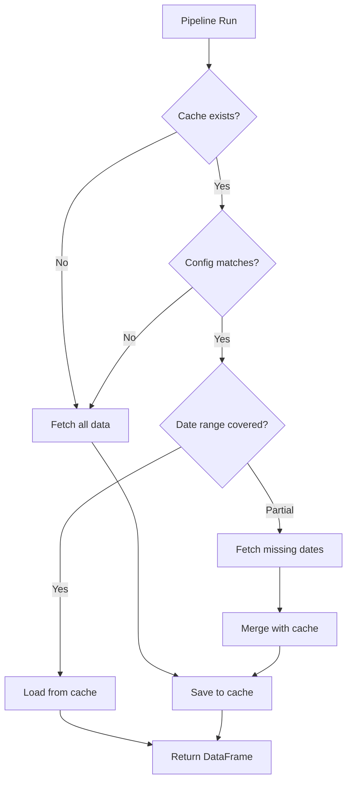

import { Steps, Aside, FileTree } from '@astrojs/starlight/components';

# Data Caching

epftoolbox2 caches downloaded data to avoid redundant API calls and speed up subsequent runs.

## Cache Flow

<Steps>

1. **Check cache** - Pipeline checks if data exists in cache

2. **Validate metadata** - Verify source configuration matches

3. **Fetch missing data** - Only download data not in cache

4. **Merge and store** - Combine with cached data and save

</Steps>

## Enabling Caching

```python
# Enable source-level caching (recommended)
df = pipeline.run(start="2024-01-01", end="2024-06-01", cache=True)

# Or cache entire pipeline output to a single file
df = pipeline.run(start="2024-01-01", end="2024-06-01", cache="my_data.csv")
```

## Cache Directory Structure

<FileTree>

- .cache/
  - sources/
    - a1b2c3d4e5f6/ (EntsoeSource hash)
      - metadata.json
      - data_20230101_20240101.csv
      - data_20240101_20240601.csv
    - f6e5d4c3b2a1/ (OpenMeteoSource hash)
      - metadata.json
      - data_20230101_20240601.csv

</FileTree>

## How It Works



## Cache Key Generation

Each source generates a unique cache key based on its configuration:

```python
# These create different cache directories:
EntsoeSource(country_code="PL", type=["load"])
EntsoeSource(country_code="PL", type=["load", "price"])
EntsoeSource(country_code="DE", type=["load"])
```

## Supported Sources

| Source | Caching |
|--------|---------|
| `EntsoeSource` | ✅ Yes |
| `OpenMeteoSource` | ✅ Yes |
| `CalendarSource` | ❌ No (generated locally) |
| `CsvSource` | ❌ No (reads from file) |

## Clearing Cache

```python
import shutil

# Clear all cache
shutil.rmtree(".cache")

# Or clear specific source cache
shutil.rmtree(".cache/sources/a1b2c3d4e5f6")
```

<Aside type="tip">
  Cache is stored relative to your working directory. Use version control to ignore the `.cache` folder.
</Aside>
