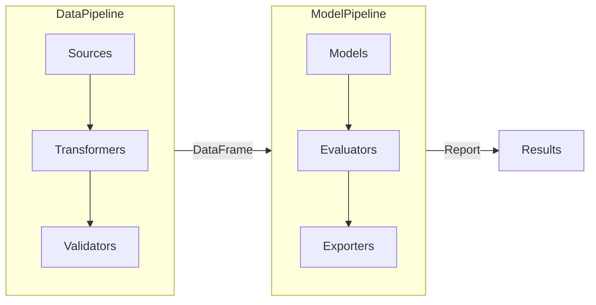

import { Card, CardGrid, LinkCard, Aside } from '@astrojs/starlight/components';

# epftoolbox2

A Python library for electricity price forecasting with modular data pipelines and model evaluation. **Epftoolbox2** is a continuation of the original [epftoolbox](https://github.com/jeslago/epftoolbox) project. It provides a modernized, modular architecture while maintaining the core focus on electricity price forecasting research and applications.

## What is epftoolbox2?

<CardGrid stagger>
  <Card title="Download Data" icon="document">
    Electricity market data from ENTSOE, weather forecasts from Open-Meteo, and calendar features
  </Card>
  <Card title="Process Data" icon="setting">
    Resample, create lag features, convert timezones with flexible transformers
  </Card>
  <Card title="Validate Quality" icon="approve-check">
    Check for nulls, continuity gaps, and view EDA statistics
  </Card>
  <Card title="Train Models" icon="rocket">
    OLS and LassoCV models with rolling-window evaluation
  </Card>
  <Card title="Multi-Horizon Forecasting" icon="list-format">
    Forecast multiple days ahead (1-7+ days) with horizon-specific evaluation
  </Card>
  <Card title="Export Reports" icon="open-book">
    Excel with conditional formatting or rich terminal tables
  </Card>
</CardGrid>

## Architecture

The library follows a modular design where each component (sources, transformers, validators, models, evaluators, exporters) can be used independently or combined into automated pipelines that handle everything from data fetching to report exporting.

## Key Features

<CardGrid>
  <Card title="Fluent API" icon="pencil">
    Method chaining for clean, readable pipeline construction
  </Card>
  <Card title="Built-in Caching" icon="seti:folder">
    Avoid redundant API calls with automatic data caching
  </Card>
  <Card title="Incremental Training" icon="forward-slash">
    Resume interrupted model training runs
  </Card>
  <Card title="GIL-Free Multithreading" icon="random">
    True parallel execution with Python 3.13t+
  </Card>
  <Card title="Extensible" icon="puzzle">
    Easy to add custom sources, transformers, models, etc.
  </Card>
  <Card title="AI Ready" icon="star">
    Documentation for AI agents via llms.txt
  </Card>
</CardGrid>

## Next Steps

<CardGrid>
  <LinkCard
    title="Installation"
    description="Install the library and configure your environment"
    href="/epftoolbox2/getting-started/installation/"
  />
  <LinkCard
    title="Quick Start"
    description="Run your first electricity price forecast"
    href="/epftoolbox2/getting-started/quickstart/"
  />
</CardGrid>
