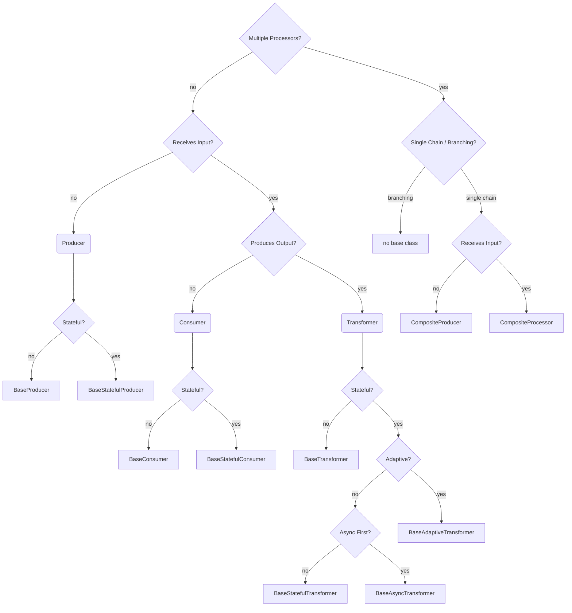

## Processor Base Classes

The `ezmsg.baseproc` module contains the base classes for message processors. The base classes are designed to allow users to create custom processors with minimal errors and minimal repetition of boilerplate code.

> The information below was written at the time of a major refactor to help collate the design decisions and to help with future refactoring. However, it may be outdated or incomplete. Please refer to the source code for the most accurate information.

### Generic TypeVars

| Idx | Class                      | Description                                                                |
|-----|----------------------------|----------------------------------------------------------------------------|
| 1   | `MessageInType` (Mi)       | for messages passed to a consumer, processor, or transformer               |
| 2   | `MessageOutType` (Mo)      | for messages returned by a producer, processor, or transformer             |
| 3   | `SettingsType`             | bound to ez.Settings                                                       |
| 4   | `StateType` (St)           | bound to ProcessorState which is simply ez.State with a `hash: int` field. |
| 5   | `ClockDrivenSettingsType`  | bound to `ClockDrivenSettings` (provides `fs` and `n_time`)                |


### Protocols

| Idx | Class                 | Parent | State | `__call__` sig           | @state | partial_fit |
|-----|-----------------------|--------|-------|--------------------------|--------|-------------|
| 1   | `Processor`           | -      | No    | Any -> Any               | -      | -           |
| 2   | `Producer`            | -      | No    | None -> Mo               | -      | -           |
| 3   | `Consumer`            | 1      | No    | Mi -> None               | -      | -           |
| 4   | `Transformer`         | 1      | No    | Mi -> Mo                 | -      | -           |
| 5   | `StatefulProcessor`   | -      | Yes   | Any -> Any               | Y      | -           |
| 6   | `StatefulProducer`    | -      | Yes   | None -> Mo               | Y      | -           |
| 7   | `StatefulConsumer`    | 5      | Yes   | Mi -> None               | Y      | -           |
| 8   | `StatefulTransformer` | 5      | Yes   | Mi -> Mo                 | Y      | -           |
| 9   | `AdaptiveTransformer` | 8      | Yes   | Mi -> Mo                 | Y      | Y           |

Note: `__call__` and `partial_fit` both have asynchronous alternatives: `__acall__` and `apartial_fit` respectively.


### Abstract implementations (Base Classes) for standalone processors

| Idx | Class                     | Parent | Protocol | Features                                                                                   |
|-----|---------------------------|--------|----------|--------------------------------------------------------------------------------------------|
| 1   | `BaseProcessor`           | -      | 1        | `__init__` for settings; `__call__` (alias: `send`) wraps abstract `_process`.             |
| 2   | `BaseProducer`            | -      | 2        | Similar to `BaseProcessor`; `next`/`anext` instead of `send`/`asend` aliases. async first! |
| 3   | `BaseConsumer`            | 1      | 3        | Overrides return type to None                                                              |
| 4   | `BaseTransformer`         | 1      | 4        | Overrides input and return types                                                           |
| 5   | `BaseStatefulProcessor`   | 1      | 5        | `state` setter unpickles arg; `stateful_op` wraps `__call__`                               |
| 6   | `BaseStatefulProducer`    | 2      | 6        | `state` setter and getter; `stateful_op` wraps `__call__` which runs `__acall__`.          |
| 7   | `BaseStatefulConsumer`    | 5      | 7        | Overrides return type to None                                                              |
| 8   | `BaseStatefulTransformer` | 5      | 8        | Overrides input and return types                                                           |
| 9   | `BaseAdaptiveTransformer` | 8      | 9        | Implements `partial_fit`. `__call__` may call `partial_fit` if message has `.trigger`.     |
| 10  | `BaseAsyncTransformer`    | 8      | 8        | `__acall__` wraps abstract `_aprocess`; `__call__` runs `__acall__`.                       |
| 11  | `CompositeProcessor`      | 1      | 5        | Methods iterate over sequence of processors created in `_initialize_processors`.           |
| 12  | `CompositeProducer`       | 2      | 6        | Similar to `CompositeProcessor`, but first processor must be a producer.                   |
| 13  | `BaseClockDrivenProducer` | 5      | 8        | Clock-driven data generator. Implements `_produce(n_samples, time_axis)`.                  |

NOTES:
1. Producers do not inherit from `BaseProcessor`, so concrete implementations should subclass `BaseProducer` or `BaseStatefulProducer`.
2. For concrete implementations of non-producer processors, inherit from the base subclasses of `BaseProcessor` (eg. `BaseConsumer`, `BaseTransformer`) and from base subclasses of `BaseStatefulProcessor`. These two processor classes are primarily used for efficient abstract base class construction.
3. For most base classes, the async methods simply call the synchronous methods where the processor logic is expected. Exceptions are `BaseProducer` (and its children) and `BaseAsyncTransformer` which are async-first and should be strongly considered for operations that are I/O bound.
4. For async-first classes, the logic is implemented in the async methods and the sync methods are thin wrappers around the async methods. The wrapper uses a helper method called `run_coroutine_sync` to run the async method in a synchronous context, but this adds some noticeable processing overhead.
5. If you need to call your processor outside ezmsg (which uses async), and you cannot easily add an async context* in your processing, then you might want to consider duplicating the processor logic in the sync methods. __Note__: Jupyter notebooks are async by default, so you can await async code in a notebook without any extra setup.
6. `CompositeProcessor` and `CompositeProducer` are stateful, and structurally subclass the `StatefulProcessor` and `StatefulProducer` protocols, but they
do not inherit from `BaseStatefulProcessor` and `BaseStatefulProducer`. They accomplish statefulness by inheriting from the mixin abstract base class `CompositeStateful`, which implements the state related methods: `get_state_type`, `state.setter`, `state.getter`, `_hash_message`, `_reset_state`, and `stateful_op` (as well as composite processor chain related methods). However, `BaseStatefulProcessor`, `BaseStatefulProducer` implement `stateful_op` method for a single processor in an incompatible way to what is required for composite chains of processors.


### Generic TypeVars for ezmsg Units

| Idx | Class                      | Description                                                                                                      |
|-----|----------------------------|------------------------------------------------------------------------------------------------------------------|
| 5   | `ProducerType`             | bound to `BaseProducer` (hence, also `BaseStatefulProducer`, `CompositeProducer`)                                |
| 6   | `ConsumerType`             | bound to `BaseConsumer`, `BaseStatefulConsumer`                                                                  |
| 7   | `TransformerType`          | bound to `BaseTransformer`, `BaseStatefulTransformer`, `CompositeProcessor` (hence, also `BaseAsyncTransformer`) |
| 8   | `AdaptiveTransformerType`  | bound to `BaseAdaptiveTransformer`                                                                               |
| 9   | `ClockDrivenProducerType`  | bound to `BaseClockDrivenProducer`                                                                               |


### Abstract implementations (Base Classes) for ezmsg Units using processors:

| Idx | Class                          | Parents | Expected TypeVars          |
|-----|--------------------------------|---------|----------------------------|
| 1   | `BaseProcessorUnit`            | -       | -                          |
| 2   | `BaseProducerUnit`             | -       | `ProducerType`             |
| 3   | `BaseConsumerUnit`             | 1       | `ConsumerType`             |
| 4   | `BaseTransformerUnit`          | 1       | `TransformerType`          |
| 5   | `BaseAdaptiveTransformerUnit`  | 1       | `AdaptiveTransformerType`  |
| 6   | `BaseClockDrivenUnit`  | 1       | `ClockDrivenProducerType`  |

Note, it is strongly recommended to use `BaseConsumerUnit`, `BaseTransformerUnit`, `BaseAdaptiveTransformerUnit`, or `BaseClockDrivenUnit` for implementing concrete subclasses rather than `BaseProcessorUnit`.


## Implementing a custom standalone processor

1. Create a new settings dataclass: `class MySettings(ez.Settings):`
2. Create a new state dataclass:
```
@processor_state
class MyState:
```
3. Decide on your base processor class, considering the protocol, whether it should be async-first, and other factors.



4. Implement the child class.
    * The minimum implementation is `_process` for sync processors, `_aprocess` for async processors, and `_produce` for producers.
    * For any stateful processor, implement `_reset_state`.
    * For stateful processors that need to respond to a change in the incoming data, implement `_hash_message`.
    * For adaptive transformers, implement `partial_fit`.
    * For chains of processors (`CompositeProcessor`/ `CompositeProducer`), need to implement `_initialize_processors`.
    * For clock-driven producers (`BaseClockDrivenProducer`), implement `_reset_state(time_axis)` and `_produce(n_samples, time_axis)`. See the [clock-driven how-to guide](how-tos/processors/clockdriven.rst).
    * See processors in `ezmsg.sigproc` for signal processing examples, or `ezmsg.learn` for machine learning examples.
5. Override non-abstract methods if you need special behaviour.


## Implementing a custom ezmsg Unit

1. Create and test custom standalone processor as above.
2. Decide which base unit to implement.
    * Use the "Generic TypeVars for ezmsg Units" table above to determine the expected TypeVar.
    * Find the Expected TypeVar in the "ezmsg Units" table.
3. Create the derived class.

Often, all that is required is the following (e.g., for a custom transformer):

```Python
import ezmsg.core as ez
from ezmsg.baseproc import BaseTransformer, BaseTransformerUnit


class CustomTransformerSettings(ez.Settings):
    scale: float = 1.0


class CustomTransformer(BaseTransformer[CustomTransformerSettings, float, float]):
    def _process(self, message: float) -> float:
        return message * self.settings.scale


class CustomUnit(BaseTransformerUnit[
        CustomTransformerSettings,    # SettingsType
        float,                        # MessageInType
        float,                        # MessageOutType
        CustomTransformer,            # TransformerType
    ]):
        SETTINGS = CustomTransformerSettings
```

__Note__, the type of ProcessorUnit is based on the internal processor and not the input or output of the unit. Input streams are allowed in ProducerUnits and output streams in ConsumerUnits.
