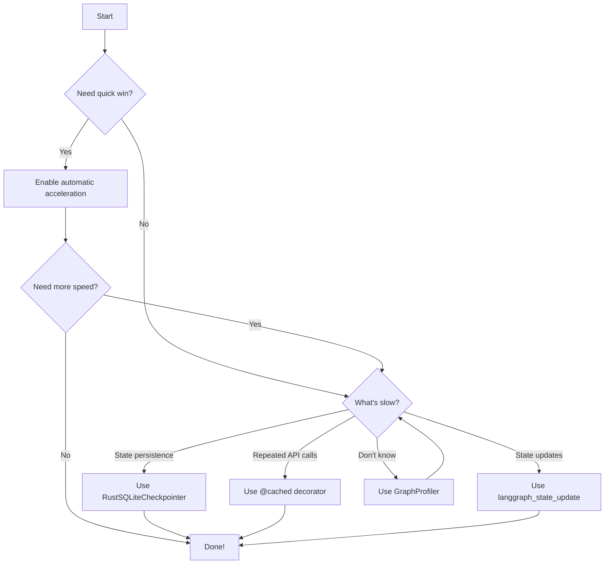

# User Guide Overview

Fast-LangGraph provides two complementary acceleration approaches that can be used independently or together.

## Acceleration Modes

### Automatic Acceleration (via Shim)

Transparent patching that requires **no code changes** to your existing LangGraph application.

| Component | Speedup | Description |
|-----------|---------|-------------|
| Executor Caching | **2.3x** | Reuses ThreadPoolExecutor across invocations |
| apply_writes | **1.2x** | Rust-based channel batch updates |

**Combined automatic speedup: ~2.8x** for typical graph invocations.

[:octicons-arrow-right-24: Learn about Automatic Acceleration](automatic-acceleration.md)

### Manual Acceleration (Explicit Usage)

Direct usage of Rust components for **maximum performance**. Requires small code changes.

| Component | Speedup | When to Use |
|-----------|---------|-------------|
| `RustSQLiteCheckpointer` | **5-6x** | State persistence |
| `@cached` decorator | **10x+** | Repeated LLM calls (with 90% hit rate) |
| `langgraph_state_update` | **13-46x** | High-frequency state updates |

[:octicons-arrow-right-24: Learn about Manual Acceleration](manual-acceleration.md)

## Feature Overview

### Caching

Cache function results and LLM responses to avoid redundant computation.

```python
from fast_langgraph import cached

@cached(max_size=1000)
def call_llm(prompt):
    return llm.invoke(prompt)
```

[:octicons-arrow-right-24: Caching Guide](caching.md)

### Checkpointing

Fast state persistence for conversation history and time-travel debugging.

```python
from fast_langgraph import RustSQLiteCheckpointer

checkpointer = RustSQLiteCheckpointer("state.db")
app = graph.compile(checkpointer=checkpointer)
```

[:octicons-arrow-right-24: Checkpointing Guide](checkpointing.md)

### State Operations

Efficient state merging for complex graph operations.

```python
from fast_langgraph import langgraph_state_update

new_state = langgraph_state_update(
    current_state,
    updates,
    append_keys=["messages"]
)
```

[:octicons-arrow-right-24: State Operations Guide](state-operations.md)

### Profiling

Low-overhead performance analysis to find bottlenecks.

```python
from fast_langgraph.profiler import GraphProfiler

profiler = GraphProfiler()
with profiler.profile_run():
    result = graph.invoke(input_data)
profiler.print_report()
```

[:octicons-arrow-right-24: Profiling Guide](profiling.md)

## Decision Guide

Use this guide to choose the right features for your use case:



## Combining Features

All features work together seamlessly:

```python
import fast_langgraph
from fast_langgraph import RustSQLiteCheckpointer, cached
from fast_langgraph.profiler import GraphProfiler

# 1. Enable automatic acceleration
fast_langgraph.shim.patch_langgraph()

# 2. Cache LLM calls
@cached(max_size=500)
def call_llm(prompt):
    return llm.invoke(prompt)

# 3. Use fast checkpointing
checkpointer = RustSQLiteCheckpointer("state.db")
app = graph.compile(checkpointer=checkpointer)

# 4. Profile to verify improvements
profiler = GraphProfiler()
with profiler.profile_run():
    result = app.invoke(input_data)
profiler.print_report()
```

## Next Steps

Choose a topic to dive deeper:

- [Automatic Acceleration](automatic-acceleration.md) - Zero-effort speedups
- [Manual Acceleration](manual-acceleration.md) - Maximum performance
- [Caching](caching.md) - Function and LLM response caching
- [Checkpointing](checkpointing.md) - Fast state persistence
- [State Operations](state-operations.md) - Efficient state merging
- [Profiling](profiling.md) - Performance analysis
