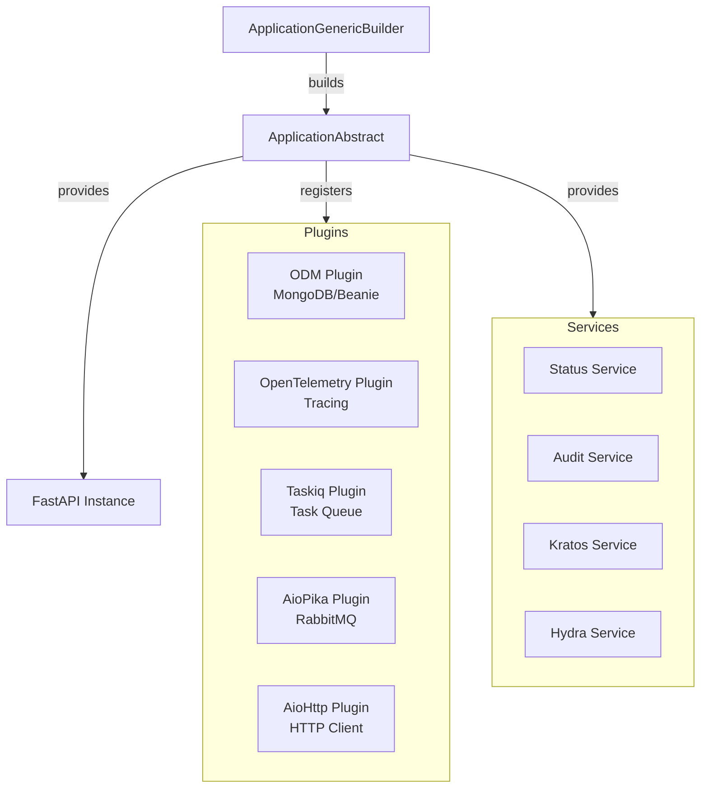

# FastAPI Factory Utilities

[](https://www.python.org/downloads/)
[](https://opensource.org/licenses/MIT)
[](https://github.com/DeerHide/fastapi_factory_utilities)

**A comprehensive library to build production-ready microservices with FastAPI, Beanie, Taskiq, AioPika, and OpenTelemetry.**

This library consolidates common patterns, plugins, and utilities for creating modern Python microservices with observability, security, and message-driven architectures built-in from the start.

---

## Features

### 🏗️ Application Framework
- **Abstract Application Builder** with plugin architecture for composable microservices
- **Configuration Management** using YAML files and environment variables
- **Environment-aware** configuration (development, staging, production)
- **Lifecycle Management** with startup/shutdown hooks

### 🔐 Security & Authentication
- **JWT Bearer Authentication** with token verification and decoding
- **Ory Kratos Integration** for identity and user management
- **Ory Hydra Integration** for OAuth2 and OpenID Connect flows
- **Flexible Authentication** with custom JWT verifiers and JWK stores

### 🗄️ Database & ODM
- **Beanie ODM Plugin** for MongoDB with async operations
- **Document Models** with Pydantic v2 validation
- **Repository Pattern** support for clean architecture

### 📨 Message Broker & Task Queue
- **AioPika Plugin** for RabbitMQ message broker integration
- **Taskiq Plugin** for distributed task queue with Redis backend
- **Message-Driven Architecture** support with async consumers/producers

### 📊 Observability & Monitoring
- **OpenTelemetry Plugin** with automatic instrumentation for:
  - FastAPI endpoints
  - MongoDB operations
  - HTTP client requests (aiohttp)
  - RabbitMQ messaging (AioPika)
- **Distributed Tracing** with OTLP exporters (HTTP/gRPC)
- **Structured Logging** with structlog integration
- **Status Endpoint** for health checks and monitoring

### 🌐 HTTP Client
- **AioHttp Plugin** with OpenTelemetry instrumentation
- **Async HTTP operations** with connection pooling
- **Automatic tracing** of outbound HTTP requests

### 🛠️ Services
- **Status Service** - Health check endpoints
- **Audit Service** - Event auditing capabilities
- **Kratos Service** - Identity management operations
- **Hydra Service** - OAuth2/OIDC operations

---

## Requirements

- **Python:** >= 3.12
- **Key Dependencies:**
  - FastAPI >= 0.115.13
  - Beanie ^2.0.0
  - Taskiq with Redis backend
  - AioPika ^9.5.7
  - OpenTelemetry SDK ^1.26.0
  - Pydantic ^2.8.2
  - Structlog >= 24.1

---

## Installation

### Using pip

```bash
pip install fastapi-factory-utilities
```

### Using Poetry

```bash
poetry add fastapi-factory-utilities
```

---

## Quick Start

Here's a minimal example to create a microservice with MongoDB and OpenTelemetry:

```python
from typing import ClassVar
from beanie import Document
from fastapi_factory_utilities.core.app import (
    ApplicationAbstract,
    ApplicationGenericBuilder,
    RootConfig,
)
from fastapi_factory_utilities.core.plugins import PluginAbstract
from fastapi_factory_utilities.core.plugins.odm_plugin import ODMPlugin
from fastapi_factory_utilities.core.plugins.opentelemetry_plugin import OpenTelemetryPlugin


class MyAppConfig(RootConfig):
    """Custom application configuration."""
    pass


class MyApp(ApplicationAbstract):
    """Your microservice application."""

    CONFIG_CLASS: ClassVar[type[RootConfig]] = MyAppConfig
    PACKAGE_NAME: ClassVar[str] = "my_app"
    ODM_DOCUMENT_MODELS: ClassVar[list[type[Document]]] = []

    def configure(self) -> None:
        """Configure your application routes and middleware."""
        # Add your API routers here
        pass

    async def on_startup(self) -> None:
        """Actions to perform on application startup."""
        pass

    async def on_shutdown(self) -> None:
        """Actions to perform on application shutdown."""
        pass


class MyAppBuilder(ApplicationGenericBuilder[MyApp]):
    """Application builder."""

    def get_default_plugins(self) -> list[PluginAbstract]:
        """Get the default plugins."""
        return [
            ODMPlugin(),
            OpenTelemetryPlugin(),
        ]

    def __init__(self, plugins: list[PluginAbstract] | None = None) -> None:
        """Initialize the builder."""
        if plugins is None:
            plugins = self.get_default_plugins()
        super().__init__(plugins=plugins)


# Build and run your application
if __name__ == "__main__":
    MyAppBuilder().build_and_serve()
```

Create an `application.yaml` configuration file in your package:

```yaml
application:
  service_namespace: "my-company"
  service_name: "my-app"
  description: "My awesome microservice"
  version: "1.0.0"
  environment: "development"

server:
  host: "0.0.0.0"
  port: 8000

cors:
  allow_origins: ["*"]
  allow_credentials: true
  allow_methods: ["*"]
  allow_headers: ["*"]
```

---

## Core Components

### Application Framework

The `ApplicationAbstract` class provides the foundation for your microservice:

- **Plugin System**: Extend functionality through composable plugins
- **Configuration**: Type-safe configuration with Pydantic models
- **Lifecycle Management**: Control startup and shutdown behavior
- **FastAPI Integration**: Built-in FastAPI application with customizable routes

The `ApplicationGenericBuilder` handles:
- Configuration loading from YAML files
- Plugin initialization and registration
- FastAPI application setup
- Uvicorn server management

### Available Plugins

Each plugin extends your application with specific capabilities:

- **`ODMPlugin`** - Integrates Beanie ODM for MongoDB operations with document models
- **`OpenTelemetryPlugin`** - Adds distributed tracing and metrics collection
- **`TaskiqPlugin`** - Enables background task processing with Redis broker
- **`AioPikaPlugin`** - Provides RabbitMQ messaging capabilities
- **`AioHttpPlugin`** - Adds instrumented HTTP client for external API calls

Plugins follow a consistent lifecycle:
1. `on_load()` - Initial setup when plugin is registered
2. `on_startup()` - Async initialization during application startup
3. `on_shutdown()` - Cleanup during application shutdown

### Security & Authentication

#### JWT Authentication

```python
from fastapi_factory_utilities.core.security.jwt import (
    JWTAuthenticationService,
    JWTBearerAuthenticationConfig,
)

# Configure JWT authentication
jwt_config = JWTBearerAuthenticationConfig(
    issuer="https://your-auth-server.com",
    audience="your-api",
)

# Use in FastAPI dependencies
from fastapi import Depends

async def get_current_user(
    token: str = Depends(JWTAuthenticationService),
):
    # Token is automatically verified
    return token.sub
```

#### Ory Kratos Integration

```python
from fastapi_factory_utilities.core.services.kratos import (
    KratosIdentityGenericService,
    KratosGenericWhoamiService,
)

# Identity management
kratos_service = KratosIdentityGenericService(base_url="http://kratos:4434")
identity = await kratos_service.get_identity(identity_id="...")

# Session validation
whoami_service = KratosGenericWhoamiService(base_url="http://kratos:4433")
session = await whoami_service.whoami(cookie="...")
```

### Configuration System

The configuration system supports:

- **YAML Files**: Store configuration in `application.yaml`
- **Environment Variables**: Override values via environment variables
- **Type Safety**: Pydantic models ensure type correctness
- **Environment-Specific**: Different configs for dev/staging/production
- **Frozen Models**: Immutable configuration prevents accidental changes

Configuration is loaded from a YAML file in your package and validated against your configuration model:

```python
from fastapi_factory_utilities.core.app.config import (
    RootConfig,
    BaseApplicationConfig,
)
from pydantic import Field

class MyCustomConfig(BaseModel):
    """Custom configuration section."""
    api_key: str = Field(description="External API key")
    timeout: int = Field(default=30, description="Request timeout")

class MyAppConfig(RootConfig):
    """Extended application configuration."""
    my_custom: MyCustomConfig = Field(description="Custom configuration")
```

---

## Example Application

This library includes a complete example application demonstrating key features:

```bash
# Run the example application
fastapi_factory_utilities-example
```

The example shows:
- Application structure with plugins
- Configuration management
- API router organization
- Document models with Beanie
- OpenTelemetry instrumentation

Source code: [`src/fastapi_factory_utilities/example/`](src/fastapi_factory_utilities/example/)

---

## Development

### Prerequisites

- Python 3.12+
- Poetry for dependency management
- Docker (optional, for containerized development)

### Setup Development Environment

```bash
# Clone the repository
git clone https://github.com/DeerHide/fastapi_factory_utilities.git
cd fastapi_factory_utilities

# Run the setup script
./scripts/setup_dev_env.sh

# Or manually:
poetry install --with test
poetry run pre-commit install
```

### Running Tests

```bash
# Run all tests with coverage
poetry run pytest --cov=src --cov-report=html --cov-report=term

# Run specific tests
poetry run pytest tests/units/test_exceptions.py

# Run tests in parallel
poetry run pytest -n auto
```

### Code Quality

```bash
# Run all pre-commit hooks
poetry run pre-commit run --all-files

# Format code
poetry run ruff format src tests
poetry run ruff check --fix src tests

# Type checking
poetry run mypy
```

### Docker Development

```bash
# Build and run in container
./scripts/dev-in-container.sh
```

---

## Architecture



---

## Contributing

Contributions are welcome! This project follows clean architecture principles and emphasizes:

- Type safety with comprehensive type annotations
- Async/await patterns for I/O operations
- Plugin-based extensibility
- Comprehensive testing
- Clean code with proper documentation

Please ensure:
- All tests pass (`poetry run pytest`)
- Code is properly formatted (`poetry run ruff format`)
- Type checking passes (`poetry run mypy`)
- Pre-commit hooks pass (`poetry run pre-commit run --all-files`)

---

## Security

For security concerns, please review our [Security Policy](SECURITY.md).

---

## License

This project is licensed under the MIT License - see the [LICENSE](LICENSE) file for details.

**Copyright (c) 2024 VANROYE Victorien**

---

## Resources

- **Repository**: [https://github.com/DeerHide/fastapi_factory_utilities](https://github.com/DeerHide/fastapi_factory_utilities)
- **Issues**: [https://github.com/DeerHide/fastapi_factory_utilities/issues](https://github.com/DeerHide/fastapi_factory_utilities/issues)
- **PyPI**: [https://pypi.org/project/fastapi-factory-utilities/](https://pypi.org/project/fastapi-factory-utilities/)

### Related Projects

- [FastAPI](https://fastapi.tiangolo.com/) - Modern web framework
- [Beanie](https://beanie-odm.dev/) - MongoDB ODM
- [Taskiq](https://taskiq-python.github.io/) - Distributed task queue
- [AioPika](https://aio-pika.readthedocs.io/) - RabbitMQ client
- [OpenTelemetry](https://opentelemetry.io/) - Observability framework
- [Ory](https://www.ory.sh/) - Identity & access management

---

**Built with ❤️ for modern Python microservices**
