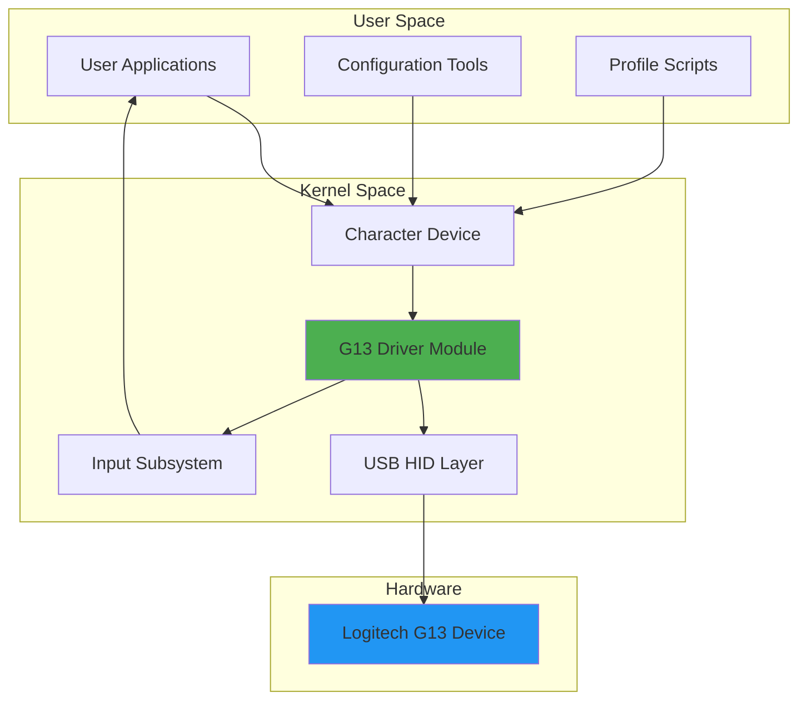

# G13_Linux

[](https://github.com/AreteDriver/G13LogitechOPS/releases)
[](https://opensource.org/licenses/MIT)
[](https://www.python.org/downloads/)
[](https://www.kernel.org/)

Python userspace driver for the Logitech G13 Gaming Keyboard on Linux.

## CI/CD Status


## Overview

This repository contains the kernel driver for the Logitech G13 Gaming Keyboard, enabling full functionality on Linux systems.

## Development

This project uses GitHub Actions for continuous integration and deployment:

- **Testing Pipeline**: Automatically builds and tests the driver on every push and pull request
- **Deployment Pipeline**: Automatically packages and releases the driver when version tags are created

For detailed information about the CI/CD workflows, see [WORKFLOW_DOCUMENTATION.md](WORKFLOW_DOCUMENTATION.md).

## Installation

Download the latest release from the [Releases](https://github.com/AreteDriver/G13_Linux/releases) page.

### Debian/Ubuntu (.deb package)

```bash
sudo dpkg -i g13-driver_*.deb
```

### Source Installation (.tar.gz)

```bash
tar -xzf g13-driver-*.tar.gz
cd g13-driver-*
sudo make install
```

## Building from Source

```bash
# Install build dependencies
sudo apt-get install build-essential linux-headers-$(uname -r) kmod libusb-1.0-0-dev pkg-config

# Build the driver
make

# Install (optional)
sudo make install
```

## License

This project is licensed under the MIT License - see the [LICENSE](LICENSE) file for details.

> **Advanced Linux kernel driver for Logitech G13 programmable keyboard**

A comprehensive kernel-space driver enabling full hardware integration and automation capabilities for the Logitech G13 Gaming Keyboard on Linux systems. Supports macro programming, LED control, and LCD display management.

---

## 🚀 Features

- **Kernel-Level Driver Integration**: Direct hardware access through USB HID interface
- **Macro Programming**: Configure and execute complex macro sequences
- **LED Control**: Programmable RGB lighting with custom patterns
- **LCD Display Management**: 160x43 monochrome display support with custom graphics
- **Hardware Integration**: Seamless integration with Linux input subsystem
- **Automation Support**: Profile-based configuration for different applications

---

## 📋 Table of Contents

- [Architecture](#architecture)
- [Installation](#installation)
- [Usage](#usage)
- [Configuration](#configuration)
- [Examples](#examples)
- [Troubleshooting](#troubleshooting)
- [Contributing](#contributing)
- [License](#license)

---

## 🏗️ Architecture

The G13_Linux driver operates across kernel and user space, providing robust hardware integration:



### Component Overview

- **G13 Driver Module**: Core kernel module handling USB communication and device management
- **USB HID Layer**: Low-level USB Human Interface Device protocol handler
- **Input Subsystem**: Integration with Linux input event system for key events
- **Character Device**: User-space interface for LED and LCD control (`/dev/g13-*`)

---

## 💻 Installation

For detailed installation instructions, including dependencies and compilation steps, see [INSTALLATION.md](INSTALLATION.md).

### Quick Start

```bash
# Clone the repository
git clone https://github.com/AreteDriver/G13_Linux.git
cd G13_Linux

# Build the kernel module
make

# Install the module
sudo make install

# Load the module
sudo modprobe g13
```

---

## 📖 Usage

### Basic Operation

Once the driver is loaded, the G13 device will be automatically detected and initialized:

```bash
# Check if device is detected
lsusb | grep "046d:c21c"

# Verify module is loaded
lsmod | grep g13

# Check kernel messages
dmesg | grep g13
```

### Setting Up Macros

Configure macros using the character device interface:

```bash
# Set macro for G1 key (example: press Ctrl+C)
echo "macro G1 KEY_LEFTCTRL KEY_C" > /dev/g13-0

# Set macro for G2 key (example: type text)
echo "macro G2 type 'Hello World'" > /dev/g13-0

# List current macros
cat /proc/g13/macros
```

### LED Control

Control the RGB LED backlight:

```bash
# Set LED to red (RGB: 255, 0, 0)
echo "led 255 0 0" > /dev/g13-0

# Set LED to blue
echo "led 0 0 255" > /dev/g13-0

# Turn off LED
echo "led 0 0 0" > /dev/g13-0
```

### LCD Display Management

Control the 160x43 pixel monochrome LCD:

```bash
# Display text on LCD
echo "lcd_text 'G13 Active'" > /dev/g13-0

# Load bitmap image to LCD
./scripts/load_lcd_image image.pbm /dev/g13-0

# Clear LCD
echo "lcd_clear" > /dev/g13-0
```

---

## ⚙️ Configuration

### Profile-Based Configuration

Create profile scripts for different applications:

```bash
# Load gaming profile
./examples/g13_gaming.sh

# Load productivity profile
./examples/g13_productivity.sh

# Load static configuration
./examples/g13_static.sh
```

### Automatic Profile Switching

Configure automatic profile switching based on active window:

```bash
# Using udev rules
sudo cp udev/99-g13.rules /etc/udev/rules.d/
sudo udevadm control --reload-rules

# Using window manager hooks
./scripts/setup_autoswitch.sh
```

---

## 📚 Examples

### Example 1: Static Configuration Profile

```bash
#!/bin/bash
# examples/g13_static.sh - Basic static configuration

# Set LED to green
echo "led 0 255 0" > /dev/g13-0

# Configure common macros
echo "macro G1 KEY_LEFTCTRL KEY_C" > /dev/g13-0  # Copy
echo "macro G2 KEY_LEFTCTRL KEY_V" > /dev/g13-0  # Paste
echo "macro G3 KEY_LEFTCTRL KEY_Z" > /dev/g13-0  # Undo

# Display status on LCD
echo "lcd_text 'G13 Ready'" > /dev/g13-0
```

### Example 2: Gaming Profile

```bash
#!/bin/bash
# Configure WASD on analog stick
echo "stick_mode wasd" > /dev/g13-0

# Set red LED for gaming
echo "led 255 0 0" > /dev/g13-0

# Bind weapon keys
echo "macro G1 KEY_1" > /dev/g13-0  # Weapon 1
echo "macro G2 KEY_2" > /dev/g13-0  # Weapon 2
echo "macro G3 KEY_R" > /dev/g13-0  # Reload
```

### Example 3: Multimedia Control

```bash
#!/bin/bash
# Media control setup
echo "macro G1 KEY_PLAYPAUSE" > /dev/g13-0  # Play/Pause
echo "macro G2 KEY_NEXTSONG" > /dev/g13-0   # Next Track
echo "macro G3 KEY_PREVIOUSSONG" > /dev/g13-0  # Previous Track
echo "macro G4 KEY_VOLUMEUP" > /dev/g13-0   # Volume Up
echo "macro G5 KEY_VOLUMEDOWN" > /dev/g13-0 # Volume Down
```

---

## 🔧 Troubleshooting

For common issues and solutions, see [TROUBLESHOOTING.md](TROUBLESHOOTING.md).

### Quick Diagnostics

```bash
# Check USB connection
lsusb -v -d 046d:c21c

# Verify permissions
ls -l /dev/g13-*

# Check module parameters
modinfo g13

# View detailed logs
journalctl -k | grep g13
```

---

## 🤝 Contributing

Contributions are welcome! Please feel free to submit pull requests or open issues for bugs and feature requests.

### Development Setup

1. Fork the repository
2. Create your feature branch (`git checkout -b feature/amazing-feature`)
3. Commit your changes (`git commit -m 'Add amazing feature'`)
4. Push to the branch (`git push origin feature/amazing-feature`)
5. Open a Pull Request

---

## 📄 License

This project is licensed under the GNU General Public License v3.0 - see the [LICENSE](LICENSE) file for details.

### GPL v3 Notice

```
G13_Linux - Linux kernel driver for Logitech G13
Copyright (C) 2025 AreteDriver

This program is free software: you can redistribute it and/or modify
it under the terms of the GNU General Public License as published by
the Free Software Foundation, either version 3 of the License, or
(at your option) any later version.

This program is distributed in the hope that it will be useful,
but WITHOUT ANY WARRANTY; without even the implied warranty of
MERCHANTABILITY or FITNESS FOR A PARTICULAR PURPOSE.  See the
GNU General Public License for more details.
```

---

## 🔗 Related Projects

- [libg13](https://github.com/ecraven/g13) - User-space G13 driver
- [Linux USB HID Documentation](https://www.kernel.org/doc/html/latest/hid/index.html)
- [Logitech G13 Specifications](https://support.logi.com/hc/en-us/articles/360024844133)

---

## 📞 Support

- **Issues**: [GitHub Issues](https://github.com/AreteDriver/G13_Linux/issues)
- **Discussions**: [GitHub Discussions](https://github.com/AreteDriver/G13_Linux/discussions)

---

**Made with ❤️ for the Linux gaming and automation community**
