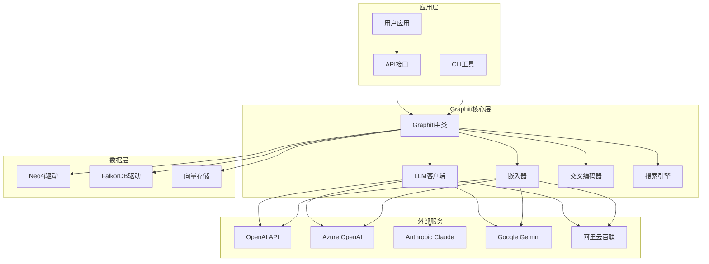
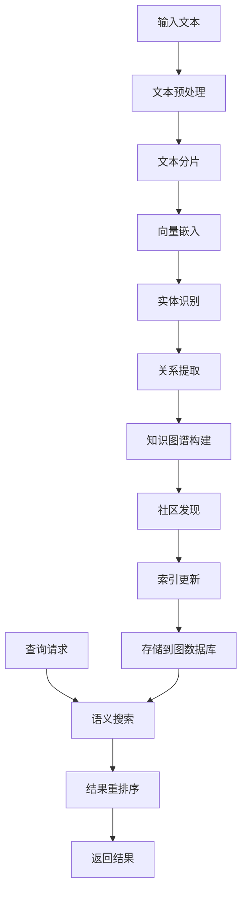
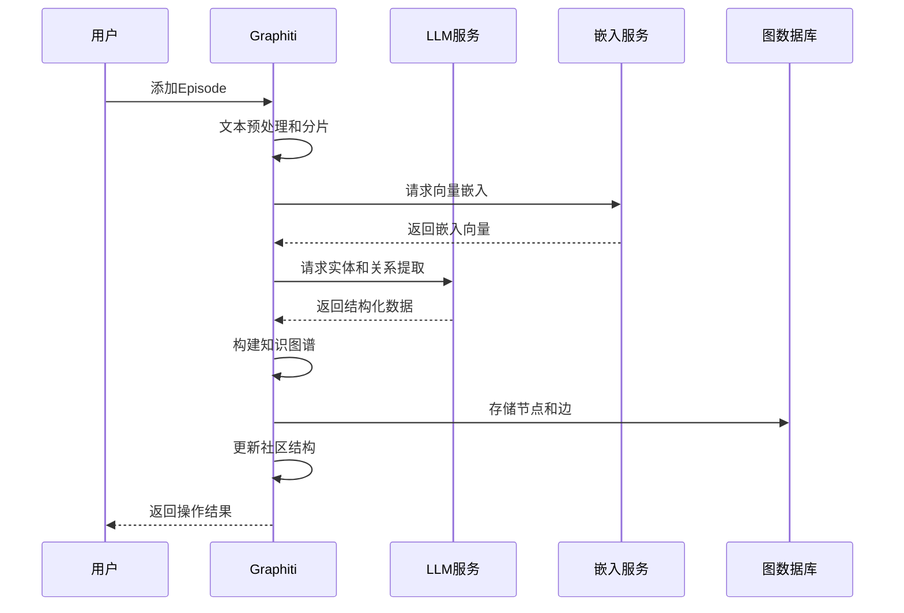
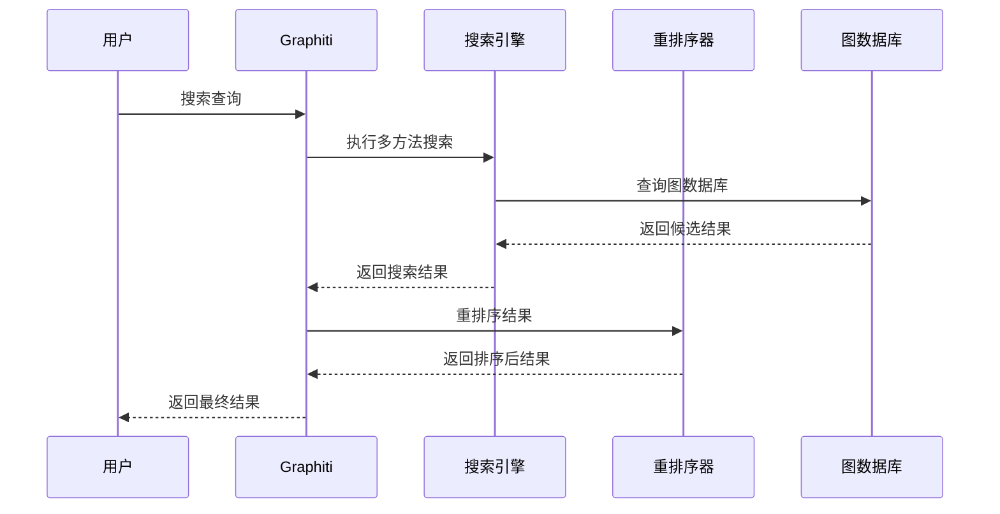

# Graphiti 介绍文档

## 目录
- [概述](#概述)
- [核心特性](#核心特性)
- [架构设计](#架构设计)
- [工作流程](#工作流程)
- [时序图](#时序图)
- [组件详解](#组件详解)
- [使用场景](#使用场景)
- [技术优势](#技术优势)

## 概述

Graphiti 是一个强大的知识图谱构建和管理框架，专为处理大规模文本数据和构建复杂关系网络而设计。它结合了先进的自然语言处理技术、向量嵌入和图形数据库，能够自动从非结构化文本中提取实体、关系和事件，构建丰富的知识图谱。

### 主要特点
- **自动化知识提取**：从文本中自动识别实体、关系和事件
- **智能关系推理**：基于语义相似性自动发现隐藏关系
- **时序数据支持**：支持时间维度的数据管理和查询
- **社区发现**：自动识别和更新知识社区
- **多模态支持**：支持文本、JSON等多种数据格式

## 核心特性

### 1. 智能文本处理
- 自动文本分片和嵌入
- 语义相似性计算
- 实体识别和关系提取

### 2. 知识图谱构建
- 自动节点和边创建
- 关系类型推断
- 社区结构识别

### 3. 高级搜索能力
- 语义搜索
- 多方法融合搜索
- 重排序和优化

### 4. 数据管理
- 不可变数据模型
- 版本控制和追踪
- 批量操作支持

## 架构设计

## 工作流程

## 时序图

### 知识图谱构建流程

### 搜索查询流程

## 组件详解

### 1. Graphiti主类
- **功能**：核心协调器，管理整个工作流程
- **职责**：初始化组件、协调操作、管理连接

### 2. LLM客户端
- **支持模型**：OpenAI、Azure OpenAI、Anthropic Claude、Google Gemini、阿里云百联
- **功能**：自然语言理解、实体提取、关系推理

### 3. 嵌入器
- **功能**：将文本转换为向量表示
- **支持模型**：OpenAI、Azure OpenAI、Google Gemini、Voyage AI
- **特性**：批量处理、自动重试、错误处理

### 4. 交叉编码器
- **功能**：搜索结果重排序和优化
- **支持模型**：BGE、Gemini、OpenAI
- **优势**：提高搜索精度和相关性

### 5. 搜索引擎
- **搜索方法**：BM25、余弦相似性、混合搜索
- **重排序策略**：RRF、交叉编码器、节点距离
- **配置选项**：灵活的搜索参数配置

### 6. 数据库驱动
- **Neo4j**：成熟的图数据库，支持Cypher查询
- **FalkorDB**：高性能图数据库，专为大规模数据设计

## 使用场景

### 1. 企业知识管理
- 文档智能分析
- 知识库构建
- 专家系统开发

### 2. 学术研究
- 文献分析
- 研究网络构建
- 知识发现

### 3. 商业智能
- 客户关系分析
- 市场趋势研究
- 竞争情报收集

### 4. 内容推荐
- 个性化推荐
- 内容相似性分析
- 用户兴趣建模

## 技术优势

### 1. 自动化程度高
- 减少人工标注工作
- 自动发现隐藏关系
- 智能文本理解

### 2. 扩展性强
- 支持多种LLM模型
- 插件化架构设计
- 易于集成和扩展

### 3. 性能优异
- 高效的向量搜索
- 智能缓存机制
- 批量操作优化

### 4. 可靠性高
- 完善的错误处理
- 自动重试机制
- 数据一致性保证

### 5. 开发友好
- 清晰的API设计
- 丰富的配置选项
- 完善的文档和示例

## 总结

Graphiti 是一个功能强大、设计优雅的知识图谱构建框架。它通过结合先进的AI技术和图数据库，为构建和管理复杂知识网络提供了完整的解决方案。无论是企业级应用还是学术研究，Graphiti都能提供强大的支持和灵活的配置选项。

通过其模块化设计和丰富的功能特性，Graphiti能够适应各种不同的使用场景，并随着AI技术的进步而持续演进。对于需要处理大规模文本数据并构建知识图谱的应用来说，Graphiti是一个理想的选择。
