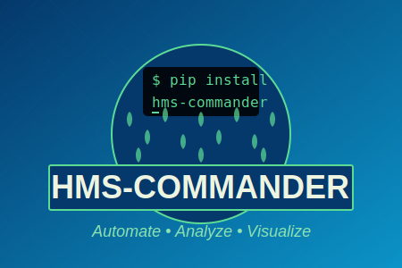

# hms-commander

<p align="center">
  
</p>

[](https://pypi.org/project/hms-commander/)
[](https://hms-commander.readthedocs.io/en/latest/?badge=latest)
[](https://www.python.org/downloads/)
[](https://opensource.org/licenses/MIT)

**[📖 Full Documentation](https://hms-commander.readthedocs.io/)**

> **Beta Software - Engineering Oversight Required**
>
> This library is in active development and should be used with caution. Many workflows have only been tested with HEC-HMS example projects, not production watersheds.
>
> **Real-world hydrologic modeling requires professional engineering judgment.** Every watershed has unique characteristics and nuances that automated workflows cannot fully capture. AI agent workflows are tools to assist engineers, not replace them.
>
> **Human-in-the-Loop is essential.** Licensed Professional Engineers must pilot these systems, guide their application, and verify all outputs before use in engineering decisions. Always validate results against established engineering practices and local knowledge.

## Why HMS Commander?

**HMS→RAS linked models are an industry standard** for watershed-to-river hydraulic analysis, yet there is no straightforward way to automate the linkage between HEC-HMS (hydrology) and HEC-RAS (hydraulics).

This library exists to **bridge that gap**—extending the [ras-commander](https://github.com/gpt-cmdr/ras-commander) effort for HEC-RAS automation to include HEC-HMS workflows. While HEC-HMS provides robust internal functionality for standalone hydrologic models, the real power emerges when HMS hydrographs flow into RAS hydraulic models for flood inundation mapping, bridge analysis, and infrastructure design.

**HMS Commander enables:**
- Automated HMS simulation execution and results extraction
- DSS file operations for seamless HMS→RAS boundary condition transfer
- Consistent API patterns across both HMS and RAS automation
- LLM-assisted workflows for complex multi-model scenarios

**LLM Forward Hydrologic Modeling Automation**

A Python library for automating HEC-HMS operations, built using [CLB Engineering's LLM Forward Approach](https://clbengineering.com/). Follows the architectural patterns established by [ras-commander](https://github.com/gpt-cmdr/ras-commander).

## LLM Forward Approach

HMS Commander implements [CLB Engineering's five core principles](docs/CLB_ENGINEERING_APPROACH.md):

1. **GUI Verifiability** - All changes inspectable in HEC-HMS GUI (no coding required for QAQC)
2. **Traceability** - Complete audit trail of model modifications
3. **QAQC-able Workflows** - Automated quality checks with pass/fail criteria
4. **Non-Destructive Operations** - Original models preserved via cloning
5. **Professional Documentation** - Client-ready reports and modeling logs

**Result:** Automate tedious tasks while maintaining professional engineering standards.

## ⚠️ Breaking Changes in v0.2.0

**Precipitation hyetograph methods now return DataFrame instead of ndarray**

If upgrading from v0.1.x, note that `Atlas14Storm`, `FrequencyStorm`, and `ScsTypeStorm` now return `pd.DataFrame` with columns `['hour', 'incremental_depth', 'cumulative_depth']` instead of `np.ndarray`.

**Quick Migration:**
```python
# OLD (v0.1.x)
hyeto = Atlas14Storm.generate_hyetograph(total_depth_inches=17.0, ...)
total = hyeto.sum()
peak = hyeto.max()

# NEW (v0.2.0+)
hyeto = Atlas14Storm.generate_hyetograph(total_depth_inches=17.0, ...)
total = hyeto['cumulative_depth'].iloc[-1]
peak = hyeto['incremental_depth'].max()
```

**Why this change?** Standardizes API for HMS→RAS integration and includes time axis.

See [CHANGELOG.md](CHANGELOG.md) for complete migration guide.

## Features

- **Project Management**: Initialize and manage HEC-HMS projects with DataFrames
- **File Operations**: Read and modify basin, met, control, and gage files
- **Simulation Execution**: Run HEC-HMS via Jython scripts (single, batch, parallel)
- **Results Analysis**: Extract peak flows, volumes, hydrograph statistics
- **DSS Integration**: Read/write DSS files (via ras-commander)
- **GIS Extraction**: Export model elements to GeoJSON
- **Clone Operations**: Non-destructive model cloning for QAQC workflows

## Installation

### From PyPI (Recommended)

```bash
# Create conda environment (recommended)
conda create -n hms python=3.11
conda activate hms

# Install hms-commander
pip install hms-commander

# Verify installation
python -c "import hms_commander; print(hms_commander.__version__)"
```

### Optional Dependencies

```bash
# DSS file support (requires Java 8+)
pip install hms-commander[dss]

# GIS features (geopandas, shapely)
pip install hms-commander[gis]

# All optional features
pip install hms-commander[all]
```

### From Source (Development)

```bash
# Clone repository
git clone https://github.com/gpt-cmdr/hms-commander.git
cd hms-commander

# Create development environment
conda create -n hmscmdr_local python=3.11
conda activate hmscmdr_local

# Install in editable mode with all dependencies
pip install -e ".[all]"

# Verify using local copy
python -c "import hms_commander; print(hms_commander.__file__)"
# Should show: /path/to/hms-commander/hms_commander/__init__.py
```

## Quick Start

```python
from hms_commander import (
    init_hms_project, hms,
    HmsBasin, HmsControl, HmsCmdr, HmsResults
)

# Initialize project
init_hms_project(
    r"C:/HMS_Projects/MyProject",
    hms_exe_path=r"C:/HEC/HEC-HMS/4.9/hec-hms.cmd"
)

# View project data
print(hms.basin_df)
print(hms.run_df)

# Run simulation
success = HmsCmdr.compute_run("Run 1")

# Extract results
peaks = HmsResults.get_peak_flows("results.dss")
print(peaks)
```

## Example Notebooks

Comprehensive Jupyter notebooks demonstrating workflows:

| Notebook | Description |
|----------|-------------|
| [01_multi_version_execution.ipynb](examples/01_multi_version_execution.ipynb) | Execute across multiple HMS versions |
| [02_run_all_hms413_projects.ipynb](examples/02_run_all_hms413_projects.ipynb) | Batch processing of example projects |
| [03_project_dataframes.ipynb](examples/03_project_dataframes.ipynb) | Explore project DataFrames and component structure |
| [04_hms_workflow.ipynb](examples/04_hms_workflow.ipynb) | Complete HMS workflow from init to results |
| [05_run_management.ipynb](examples/05_run_management.ipynb) | Comprehensive run configuration guide |
| [clone_workflow.ipynb](examples/clone_workflow.ipynb) | Non-destructive QAQC with model cloning |

**Run Configuration Management (Phase 1)**:
```python
from hms_commander import HmsRun

# Modify run parameters with validation
HmsRun.set_description("Run 1", "Updated scenario", hms_object=hms)
HmsRun.set_basin("Run 1", "Basin_Model", hms_object=hms)  # Validates component exists!
HmsRun.set_dss_file("Run 1", "output.dss", hms_object=hms)

# Prevents HMS from auto-deleting runs with invalid component references
```

See [05_run_management.ipynb](examples/05_run_management.ipynb) for complete examples.

## Library Structure

| Class | Purpose |
|-------|---------|
| `HmsPrj` | Project manager (stateful singleton) |
| `HmsBasin` | Basin model operations (.basin) |
| `HmsControl` | Control specifications (.control) |
| `HmsMet` | Meteorologic models (.met) |
| `HmsGage` | Time-series gages (.gage) |
| `HmsRun` | Run configuration management (.run) **NEW Phase 1** |
| `HmsCmdr` | Simulation execution engine |
| `HmsJython` | Jython script generation |
| `HmsDss` | DSS file operations |
| `HmsResults` | Results extraction & analysis |
| `HmsGeo` | GIS data extraction |
| `HmsUtils` | Utility functions |

## Key Methods

### Project Management
```python
init_hms_project(path, hms_exe_path)  # Initialize project
hms.basin_df                           # Basin models DataFrame
hms.run_df                             # Simulation runs DataFrame
```

### Basin Operations
```python
HmsBasin.get_subbasins(basin_path)                    # Get all subbasins
HmsBasin.get_loss_parameters(basin_path, subbasin)    # Get loss params
HmsBasin.set_loss_parameters(basin_path, subbasin, curve_number=80)
```

### Run Configuration (NEW Phase 1)
```python
HmsRun.set_description("Run 1", "Updated scenario", hms_object=hms)
HmsRun.set_basin("Run 1", "Basin_Model", hms_object=hms)  # Validates!
HmsRun.set_precip("Run 1", "Met_Model", hms_object=hms)   # Validates!
HmsRun.set_control("Run 1", "Control_Spec", hms_object=hms)  # Validates!
HmsRun.set_dss_file("Run 1", "output.dss", hms_object=hms)
```

### Simulation Execution
```python
HmsCmdr.compute_run("Run 1")                          # Single run
HmsCmdr.compute_parallel(["Run 1", "Run 2"], max_workers=2)  # Parallel
HmsCmdr.compute_batch(["Run 1", "Run 2", "Run 3"])    # Sequential
```

### Results Analysis
```python
HmsResults.get_peak_flows("results.dss")              # Peak flow summary
HmsResults.get_volume_summary("results.dss")          # Runoff volumes
HmsResults.get_hydrograph_statistics("results.dss", "Outlet")
HmsResults.compare_runs(["run1.dss", "run2.dss"], "Outlet")
```

### DSS Operations
```python
HmsDss.get_catalog("results.dss")                     # List all paths
HmsDss.read_timeseries("results.dss", pathname)       # Read time series
HmsDss.extract_hms_results("results.dss", result_type="flow")
```

## Requirements

- Python 3.10+
- pandas, numpy, tqdm, requests

### Optional
- **DSS**: ras-commander, pyjnius (Java 8+)
- **GIS**: geopandas, pyproj, shapely

## Related Projects

- [ras-commander](https://github.com/billk-FM/ras-commander) - HEC-RAS automation
- [HEC-HMS](https://www.hec.usace.army.mil/software/hec-hms/) - USACE software

## Author

**William Katzenmeyer, PE, CFM** - [CLB Engineering](https://clbengineering.com/)

## License

MIT License
