# CLB Engineering LLM Forward Approach

**Philosophy:** Changes must be verifiable by H&H engineers using only the HEC-HMS GUI

---

## Core Principles

### 1. GUI Verifiability

**Principle:** All model changes must be inspectable in HEC-HMS GUI without requiring Python or programming knowledge.

**Implementation:**
- Clone original models before modifications
- Side-by-side comparison in GUI
- Clear naming conventions
- Updated descriptions with change metadata

**Why It Matters:**
- H&H engineers use GUI as primary tool
- QAQC requires visual inspection
- Peer review by non-programmers
- Industry standard workflows

**Example:**
```python
# Engineer opens HEC-HMS GUI and sees:
# Runs:
#   - "100yr Storm - TP40 Baseline"          → results_baseline.dss
#   - "100yr Storm - Atlas14 Updated"        → results_updated.dss
#
# Basins:
#   - "Tifton - Original"
#   - "Tifton - Atlas14 Precip"
#
# Met Models:
#   - "Design Storms TP40"
#   - "Design Storms Atlas14"
#
# Engineer can click through both models and verify changes visually
```

---

### 2. Traceability

**Principle:** Complete audit trail of all changes from baseline to final model.

**Implementation:**
- MODELING_LOG.md documents every change
- Baseline models preserved unchanged
- Version metadata in descriptions
- Change timestamps and justifications

**Why It Matters:**
- Regulatory compliance (FEMA, state agencies)
- Project documentation requirements
- Future model updates reference baseline
- Litigation protection

**Example MODELING_LOG.md:**
```markdown
## Change Log: TP-40 to Atlas 14 Update

### 2025-12-11 14:30 - Precipitation Update
**Category:** Data Source Change
**Action:** Replace TP-40 with NOAA Atlas 14 precipitation frequency estimates
**File:** Tifton.met
**Element:** Gage "100yr-24hr"
**Old Value:** 7.2 inches (TP-40)
**New Value:** 8.4 inches (Atlas 14, 50% AEP)
**Justification:** TP-40 deprecated; Atlas 14 is current NOAA standard
**Impact:** +16.7% precipitation → higher runoff volumes expected
**Source:** NOAA Atlas 14 Point Precipitation Frequency Estimates
**Location:** 31.4504°N, 83.5285°W (Tifton, GA)
```

---

### 3. QAQC-able Workflows

**Principle:** Automated workflows must produce outputs that can be quality-checked by standard engineering review processes.

**Implementation:**
- Comparison reports (baseline vs. updated)
- Acceptance criteria with pass/fail thresholds
- Statistical summaries (peak flow, volume, timing)
- Visual plots (hydrographs, scatter plots)
- Quality verdicts (GREEN/YELLOW/RED)

**Why It Matters:**
- Engineering review is required step
- Senior engineers may not code
- Standard QAQC checklists apply
- Client deliverable requirements

**Diagram 9: LLM Forward QAQC Cycle**

```mermaid
flowchart TD
    A[Original Model] --> B{Clone Operation}
    B -->|Non-Destructive| C[Baseline Model<br/>Preserved]
    B -->|Create| D[Updated Model<br/>Modified]

    C --> E[Execute Baseline]
    D --> F[Execute Updated]

    E --> G[baseline_results.dss]
    F --> H[updated_results.dss]

    G --> I[HmsResults.compare_runs]
    H --> I

    I --> J{Acceptance<br/>Criteria?}
    J -->|Pass| K[🟢 GREEN<br/>Approved]
    J -->|Borderline| L[🟡 YELLOW<br/>Review Required]
    J -->|Fail| M[🔴 RED<br/>Rejected]

    K --> N[Engineer Opens HMS GUI]
    L --> N
    M --> N

    N --> O[Visual Inspection<br/>Side-by-Side]
    O --> P{Engineer<br/>Approves?}
    P -->|Yes| Q[Deploy Updated Model]
    P -->|No| R[Iterate Parameters]
    R --> D

    style C fill:#ccffcc
    style D fill:#ffcccc
    style K fill:#ccffcc
    style L fill:#ffffcc
    style M fill:#ffcccc
```



**Example Comparison Report:**
```markdown
## Results Comparison: TP-40 vs. Atlas 14

### Peak Flow Analysis
| Location | TP-40 Peak (cfs) | Atlas 14 Peak (cfs) | Difference | % Change |
|----------|------------------|---------------------|------------|----------|
| Outlet   | 2,450            | 2,680               | +230       | +9.4%    |
| Junc-1   | 1,820            | 1,950               | +130       | +7.1%    |

### Volume Analysis
| Location | TP-40 Volume (ac-ft) | Atlas 14 Volume (ac-ft) | Difference | % Change |
|----------|----------------------|-------------------------|------------|----------|
| Outlet   | 145                  | 158                     | +13        | +9.0%    |

### Quality Verdict: 🟢 GREEN
- Peak flow increase < 15% (acceptable for precip update)
- Volume increase consistent with precipitation change
- Timing differences < 30 minutes (negligible)
- No errors or warnings in model execution

**Reviewer Notes:**
_Increases are within expected range for Atlas 14 update.
Recommend proceeding with updated model for design calculations._
```

---

### 4. Non-Destructive Operations

**Principle:** Never modify original model files. Always create clones for comparison.

**Implementation:**
- `clone_run()`, `clone_basin()`, `clone_met()` methods
- Separate DSS output files
- Original model remains untouched
- Clear file organization

**Why It Matters:**
- Preserve baseline for future reference
- Enable rollback if issues discovered
- Maintain project continuity
- Avoid accidental data loss

**File Organization:**
```
Tifton_Project/
├── Tifton.hms
├── Tifton_Original.basin          # Baseline - never modified
├── Tifton_Atlas14.basin            # Updated - new clone
├── Design_Storms_TP40.met          # Baseline
├── Design_Storms_Atlas14.met       # Updated
├── results_baseline.dss            # Baseline results
├── results_updated.dss             # Updated results
└── MODELING_LOG.md                 # Change documentation
```

---

### 5. Professional Documentation

**Principle:** All automated workflows must produce professional-grade documentation suitable for client deliverables.

**Implementation:**
- AGENT.md - Methodology and technical approach
- MODELING_LOG.md - Comprehensive change log
- RESULTS_TEMPLATE.md - Standardized reporting
- Quality verdicts with acceptance criteria

**Why It Matters:**
- Client deliverable requirements
- Project archival and handoff
- Regulatory submission documentation
- Industry best practices

**Required Documentation:**

1. **AGENT.md** - Workflow methodology
   - Objectives and scope
   - Technical approach
   - Acceptance criteria
   - Limitations and assumptions

2. **MODELING_LOG.md** - Change tracking
   - Timestamp of every change
   - Before/after values
   - Justification and impact
   - Data sources and references

3. **RESULTS_TEMPLATE.md** - Comparison report
   - Executive summary
   - Detailed results tables
   - Statistical analysis
   - Quality verdict
   - Reviewer sign-off section

---

## Implementation in hms-commander

### Agent Design Pattern

All hms-commander agents must follow this pattern:

```python
from agents._shared import AgentWorkflow, QualityVerdict

class MyAgentWorkflow(AgentWorkflow):
    def __init__(self, project_path, acceptance_criteria):
        super().__init__(
            agent_name="MyAgent",
            project_path=project_path,
            acceptance_criteria=acceptance_criteria
        )

    def execute(self) -> QualityVerdict:
        """Execute workflow with CLB Engineering principles."""

        # 1. Clone baseline (non-destructive)
        new_basin = self.clone_basin("Original", "Updated")
        new_run = self.clone_run("Baseline", "Updated")

        # 2. Make changes with logging
        self.log_change(
            category="Parameter Update",
            action="Update precipitation frequency",
            file="model.met",
            element="Gage-1",
            old_value="TP-40: 7.2 inches",
            new_value="Atlas 14: 8.4 inches",
            justification="TP-40 deprecated; Atlas 14 current standard",
            impact="+16.7% precipitation"
        )

        # 3. Execute both baseline and updated
        self.run_baseline()
        self.run_updated()

        # 4. Compare results (QAQC)
        comparison = self.compare_results()

        # 5. Validate acceptance criteria
        self.update_criterion("peak_deviation", "9.4%", True)

        # 6. Generate verdict and reports
        verdict = self.generate_verdict()
        self.export_modeling_log()
        self.export_comparison_report()

        return verdict
```

### Clone Functionality Requirements

**Must implement:**
```python
class HmsRun:
    @staticmethod
    def clone_run(source_run, new_run_name, update_description=True)
    # - Copies all run parameters
    # - Updates DSS output path
    # - Updates description with clone metadata

class HmsBasin:
    @staticmethod
    def clone_basin(source_basin, new_basin_name)
    # - Copies all subbasins, junctions, reaches
    # - Updates all references

class HmsMet:
    @staticmethod
    def clone_met(source_met, new_met_name)
    # - Copies all gage assignments
    # - Preserves temporal patterns
```

### Naming Conventions

**Runs:**
- Baseline: `"100yr Storm - TP40 Baseline"`
- Updated: `"100yr Storm - Atlas14 Updated"`

**Basins:**
- Original: `"Tifton - Original"`
- Updated: `"Tifton - Atlas14 Precip"`

**DSS Files:**
- Baseline: `results_baseline.dss`
- Updated: `results_updated.dss`

**Descriptions:**
- Include change metadata
- Reference baseline model
- Timestamp of update
- Brief summary of changes

---

## Benefits of This Approach

### For H&H Engineers
- ✅ No programming required for QAQC
- ✅ Use familiar GUI tools
- ✅ Standard review workflows apply
- ✅ Clear audit trail

### For Project Managers
- ✅ Deliverable-ready documentation
- ✅ Client-facing quality reports
- ✅ Regulatory compliance
- ✅ Reduced review time

### For Organizations
- ✅ Industry best practices
- ✅ Consistent quality standards
- ✅ Knowledge transfer (non-coders can review)
- ✅ Risk mitigation (baseline preserved)

### For Automation
- ✅ Repeatable workflows
- ✅ Consistent documentation
- ✅ Automated QAQC checks
- ✅ Version control integration

---

## Comparison to Academic/Research Approaches

| Aspect | Academic Tools | CLB Engineering Approach |
|--------|----------------|--------------------------|
| **Modification Style** | In-place edits | Non-destructive clones |
| **Verification** | Code review | GUI inspection |
| **Documentation** | Jupyter notebooks | Professional reports |
| **QAQC** | Manual checks | Automated criteria |
| **Audience** | Programmers | H&H engineers |
| **Deliverables** | Research papers | Client reports |
| **Traceability** | Git commits | MODELING_LOG.md |

---

## Real-World Example: Atlas 14 Update

### Traditional Approach (Manual)
1. Engineer opens HMS GUI
2. Manually updates each gage precipitation value
3. Re-runs model
4. Exports results to Excel
5. Creates comparison spreadsheet
6. Documents changes in Word document
7. **Time:** 4-8 hours per model

### CLB Engineering LLM Forward Approach
1. Run automated agent
2. Agent clones all models (preserves baseline)
3. Agent queries Atlas 14 API for updated values
4. Agent updates cloned models
5. Agent executes both baseline and updated runs
6. Agent generates comparison report with QAQC
7. Engineer reviews side-by-side in GUI
8. Engineer approves or requests modifications
9. **Time:** 30 minutes (mostly review)

**Key Difference:** Engineer still does QAQC inspection in GUI, but automation handles tedious data entry and report generation.

---

## Implementation Checklist

For each new agent, verify:

- [ ] Implements clone functionality (non-destructive)
- [ ] Generates MODELING_LOG.md with all changes
- [ ] Creates comparison report with acceptance criteria
- [ ] Writes to separate DSS files (baseline vs. updated)
- [ ] Updates descriptions with change metadata
- [ ] Provides quality verdict (GREEN/YELLOW/RED)
- [ ] Includes GUI inspection guidance in documentation
- [ ] Enables engineer review without coding knowledge
- [ ] Follows professional documentation standards
- [ ] Preserves baseline model unchanged

---

## Related Documentation

- **Agent Framework:** `agents/README.md`
- **Development Priorities:** `.agent/PRIORITIES.md`
- **Development Roadmap:** `DEVELOPMENT_ROADMAP.md`
- **Example Agent:** `hms_agents/Update_3_to_4/AGENT.md`

---

## Acknowledgments

This approach was developed by CLB Engineering to bridge the gap between AI automation and professional engineering practice. It ensures that automated workflows meet the same quality standards as manual engineering work while dramatically improving efficiency.

**Core Insight:** The GUI is not the enemy of automation. It's the verification tool that gives engineers confidence in automated results.
