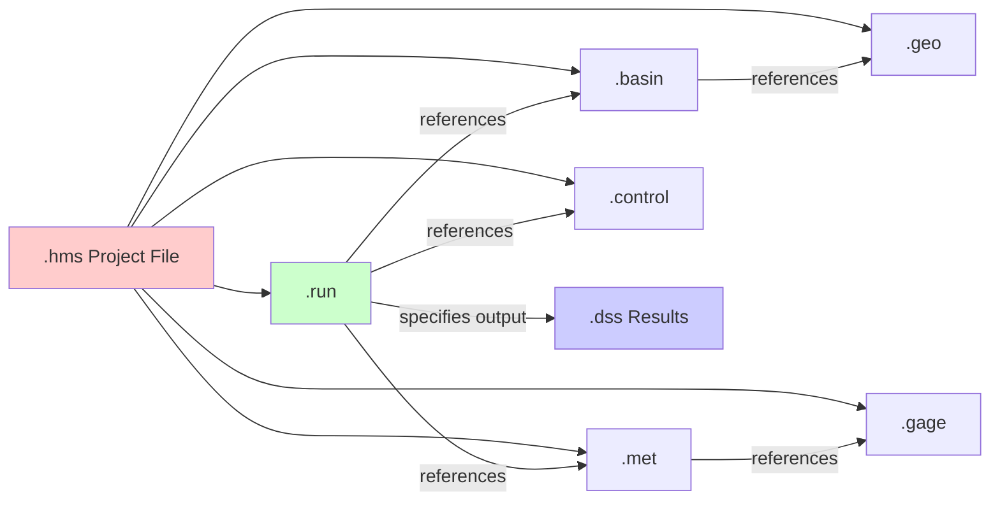

# HEC-HMS File Formats Overview

## Introduction

HEC-HMS (Hydrologic Engineering Center's Hydrologic Modeling System) uses a collection of ASCII text files to store hydrologic model data. Understanding these file formats is essential for programmatic manipulation, automation, and debugging of HMS models.

## File Format Philosophy

Unlike many modern engineering software packages that use binary or database formats, HEC-HMS stores its data in human-readable ASCII text files. This design decision provides several advantages:

- **Transparency**: Model data can be inspected and debugged with any text editor
- **Version Control**: Text files work well with Git and other version control systems
- **Automation**: Files can be easily parsed and modified programmatically
- **Portability**: No proprietary database dependencies
- **Longevity**: Plain text files remain accessible decades later

## Core File Types

### Project Management Files

| File Extension | Purpose | Primary Class |
|---------------|---------|---------------|
| `.hms` | Project configuration and file registry | `HmsPrj` |
| `.run` | Simulation run configurations | `HmsRun` |

### Model Definition Files

| File Extension | Purpose | Primary Class |
|---------------|---------|---------------|
| `.basin` | Basin model (subbasins, reaches, junctions) | `HmsBasin` |
| `.met` | Meteorologic model (precipitation, ET) | `HmsMet` |
| `.control` | Control specifications (time window, interval) | `HmsControl` |
| `.gage` | Time-series gage data references | `HmsGage` |

### Geospatial Files

| File Extension | Purpose | Primary Class |
|---------------|---------|---------------|
| `.geo` | Geospatial coordinates for basin elements | `HmsGeo` |
| `.map` | Map background features (boundaries, rivers) | `HmsGeo` |

### Results Files

| File Extension | Purpose | Primary Class |
|---------------|---------|---------------|
| `.dss` | Binary results (time-series output) | `HmsDss`, `HmsResults` |

## File Structure Pattern

Most HMS text files follow a consistent structural pattern:

```
ElementType: ElementName
     Parameter1: Value1
     Parameter2: Value2
     NestedElement: NestedName
          NestedParameter: NestedValue
     End:
End:
```

### Key Characteristics

- **Indentation**: Parameters are indented with 5 spaces
- **Delimiters**: Colon (`:`) separates parameter names from values
- **Blocks**: Each element starts with `ElementType: ElementName` and ends with `End:`
- **Nesting**: Some elements can contain nested sub-elements
- **Case Sensitivity**: Parameter names are case-sensitive

## Common Parsing Challenges

### Encoding Issues

HMS files may use different text encodings depending on their creation source:
- **Primary encoding**: UTF-8 (modern HMS versions)
- **Fallback encoding**: Latin-1/ISO-8859-1 (legacy files)

The `HmsFileParser` class handles encoding detection automatically.

### Whitespace Sensitivity

HMS files use specific indentation patterns that must be preserved:
- 5 spaces for parameter indentation
- Consistent line endings (typically Windows CRLF)

### Date and Time Formats

HMS uses specific date/time formats:
- **Date format**: `DDMmmYYYY` (e.g., `01Jan2020`)
- **Time format**: `HH:MM` (24-hour format, e.g., `14:30`)

See `HmsUtils.parse_hms_date()` and `HmsUtils.format_hms_date()` for conversions.

## File Relationships



HMS files are interconnected through references:

```
.hms (Project File)
├── References .basin file
├── References .met file
├── References .control file
├── References .gage file
└── References .run file(s)

.run (Run Configuration)
├── References basin model (from .basin)
├── References met model (from .met)
├── References control spec (from .control)
└── Specifies output .dss file

.met (Meteorologic Model)
└── References gages (from .gage)

.basin (Basin Model)
└── May reference coordinates (from .geo)
```

## Working with HMS Files

### Reading Files

Use the `HmsFileParser` for low-level operations:

```python
from hms_commander._parsing import HmsFileParser

# Read with automatic encoding detection
content = HmsFileParser.read_file("model.basin")
```

### Parsing Structure

Use specialized methods for different element types:

```python
# Parse named blocks (Subbasin:, Reach:, etc.)
subbasins = HmsFileParser.parse_blocks(content, "Subbasin")

# Parse named sections (Basin:, Meteorology:, etc.)
name, params = HmsFileParser.parse_named_section(content, "Basin")
```

### Modifying Files

Use high-level class methods when possible:

```python
from hms_commander import HmsBasin, HmsControl

# High-level API (recommended)
HmsBasin.set_loss_parameters("model.basin", "Sub1", curve_number=85)
HmsControl.set_time_interval("control.control", 15)
```

For advanced modifications, use `HmsFileParser` directly:

```python
# Low-level modifications
updated_content, changed = HmsFileParser.update_parameter(
    content, "Curve Number", "85.0"
)
```

## Version Compatibility

File formats vary slightly between HMS versions:

| HMS Version | File Format Notes |
|-------------|-------------------|
| HMS 4.4.1+ | Current format, UTF-8 encoding preferred |
| HMS 3.3-3.5 | Legacy format, Latin-1 encoding common |
| HMS 4.0-4.3 | Transitional format (not fully supported) |

The hms-commander library handles version differences automatically in most cases.

## Best Practices

1. **Always use encoding-aware readers**: Use `HmsFileParser.read_file()` instead of Python's built-in `open()`
2. **Preserve formatting**: Maintain original indentation and line endings
3. **Validate after modifications**: Use `HmsUtils.validate_project()` to check file integrity
4. **Use high-level APIs**: Prefer `HmsBasin`, `HmsMet`, etc. over manual text manipulation
5. **Version control**: Track changes to HMS files in Git for traceability

## Related Documentation

- [Project File Format](project_file.md) - `.hms` file structure
- [Basin File Format](basin_file.md) - `.basin` file structure
- [Meteorologic File Format](met_file.md) - `.met` file structure
- [Control File Format](control_file.md) - `.control` file structure
- [Gage File Format](gage_file.md) - `.gage` file structure
- [Run File Format](run_file.md) - `.run` file structure
- [Geospatial Files](geo_files.md) - `.geo` and `.map` file formats
- [DSS Integration](dss_integration.md) - Working with `.dss` results files

## API Reference

See the [API Reference](../api/hms_prj.md) for complete API documentation:
- `HmsFileParser` - Internal parsing utilities
- File-specific classes: `HmsBasin`, `HmsMet`, `HmsControl`, `HmsGage`, `HmsGeo`, `HmsRun`
