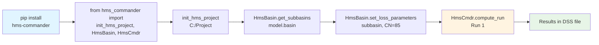

# Quick Start Guide

Get up and running with HMS Commander in minutes.

## Workflow Overview



## Your First Script

### 1. Initialize a Project

```python
from hms_commander import init_hms_project, hms

# Point to your HMS project folder
init_hms_project(r"C:/Projects/MyHmsModel")

# Access project data
print(hms.basin_df)      # Basin models
print(hms.met_df)        # Meteorologic models
print(hms.control_df)    # Control specifications
print(hms.run_df)        # Simulation runs
```

### 2. Explore Basin Model

```python
from hms_commander import HmsBasin

# Get subbasins
subbasins = HmsBasin.get_subbasins("MyModel.basin")
print(subbasins)

# Get specific parameters
loss_params = HmsBasin.get_loss_parameters(
    "MyModel.basin",
    "Subbasin-1"
)
print(f"Curve Number: {loss_params['curve_number']}")
```

### 3. Modify Parameters

```python
# Update loss parameters
HmsBasin.set_loss_parameters(
    "MyModel.basin",
    "Subbasin-1",
    curve_number=85,
    initial_abstraction=0.5
)

# Update control time window
from hms_commander import HmsControl

HmsControl.set_time_window(
    "MyControl.control",
    start_date="01Jan2020",
    start_time="00:00",
    end_date="03Jan2020",
    end_time="00:00"
)
```

### 4. Execute Simulation

```python
from hms_commander import HmsCmdr

# Run single simulation
success = HmsCmdr.compute_run("Run 1")

if success:
    print("Simulation completed successfully!")
```

### 5. Extract Results

```python
from hms_commander import HmsResults

# Get peak flows
peaks = HmsResults.get_peak_flows("results.dss")
print(peaks)

# Get specific hydrograph
flow_ts = HmsResults.get_outflow_timeseries(
    "results.dss",
    "Junction-1"
)
flow_ts.plot()
```

## Common Workflows

### Clone and Compare Workflow

Perfect for QAQC - run baseline vs. updated model side-by-side:

```python
from hms_commander import HmsRun, HmsCmdr

# Clone existing run with new DSS output
HmsRun.clone_run(
    source_run="Baseline",
    new_run_name="Updated_Scenario",
    output_dss="updated_results.dss"
)

# Modify parameters in updated basin...

# Run both simulations in parallel
HmsCmdr.compute_parallel(
    ["Baseline", "Updated_Scenario"],
    max_workers=2
)

# Compare results
from hms_commander import HmsResults
comparison = HmsResults.compare_runs(
    ["baseline_results.dss", "updated_results.dss"],
    "Outlet"
)
```

### Atlas 14 Update Workflow

Update precipitation from TP40 to Atlas 14:

```python
from hms_commander import HmsMet, HmsGeo

# Get project centroid for Atlas 14 download
lat, lon = HmsGeo.get_project_centroid_latlon(
    "model.geo",
    crs_epsg="EPSG:2278"  # Texas State Plane
)

# Download Atlas 14 data (separate tool/API)
# atlas14_depths = download_atlas14(lat, lon, duration="24hr", return_period=100)

# Update HMS met model
HmsMet.update_tp40_to_atlas14(
    "model.met",
    atlas14_depths=[1.2, 2.5, 3.8, 4.2, 3.5, 2.1]  # Example depths
)
```

### Multi-Version Testing

Test models across HMS versions:

```python
from hms_commander import HmsExamples, HmsJython

# List installed HMS versions
versions = HmsExamples.detect_installed_versions()
print(f"Found HMS versions: {list(versions.keys())}")

# Get HMS executables
hms_4x = HmsExamples.get_hms_exe("4.13")
hms_3x = HmsExamples.get_hms_exe("3.5")

# Generate appropriate script
script_4x = HmsJython.generate_compute_script(
    "project", "Run1",
    python2_compatible=False
)

script_3x = HmsJython.generate_compute_script(
    "project", "Run1",
    python2_compatible=True  # Required for HMS 3.x
)

# Execute on different versions
HmsJython.execute_script(script_4x, hms_4x)
HmsJython.execute_script(script_3x, hms_3x)
```

## Working with Example Projects

HMS Commander can extract HEC-HMS example projects for testing:

```python
from hms_commander import HmsExamples

# List available projects
projects = HmsExamples.list_projects()
print(projects)

# Extract example project
project_path = HmsExamples.extract_project("castro")

# Use it
init_hms_project(project_path)
HmsCmdr.compute_run("Run 1")
```

## Multiple Projects

Work with multiple projects simultaneously:

```python
from hms_commander import HmsPrj, init_hms_project

# Create separate project instances
project1 = HmsPrj()
project2 = HmsPrj()

# Initialize each
init_hms_project(r"C:/Projects/Project1", hms_object=project1)
init_hms_project(r"C:/Projects/Project2", hms_object=project2)

# Access each project's data
print(project1.basin_df)
print(project2.basin_df)

# Use with operations
HmsBasin.get_subbasins("model.basin", hms_object=project1)
```

## Next Steps

- **[User Guide](../user_guide/overview.md)** - Deep dive into all features
- **[Example Notebooks](../examples/overview.md)** - Jupyter notebook examples
- **[API Reference](../api/hms_prj.md)** - Complete API documentation

## Getting Help

- **Documentation**: [hms-commander.readthedocs.io](https://gpt-cmdr.github.io/hms-commander/)
- **Issues**: [GitHub Issues](https://github.com/gpt-cmdr/hms-commander/issues)
- **Examples**: Check the `examples/` folder in the repository
