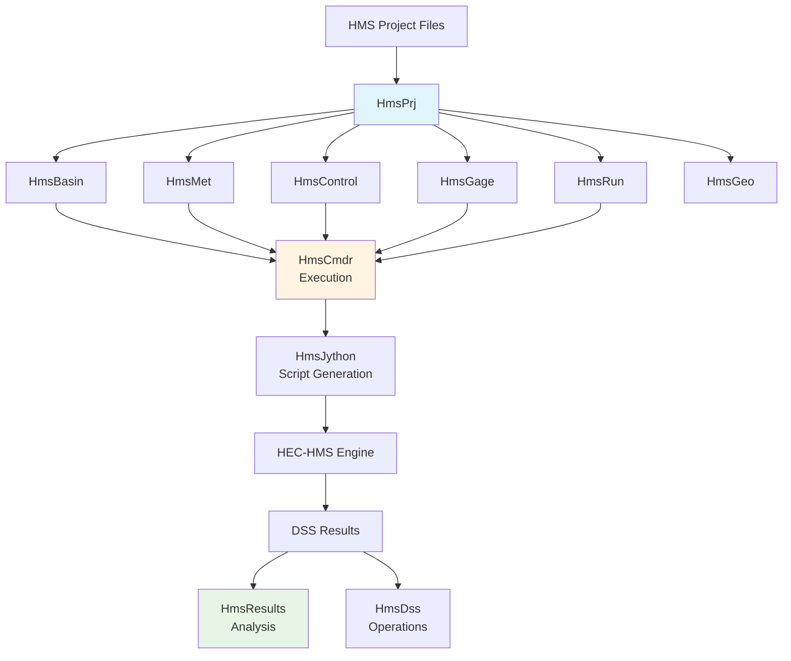
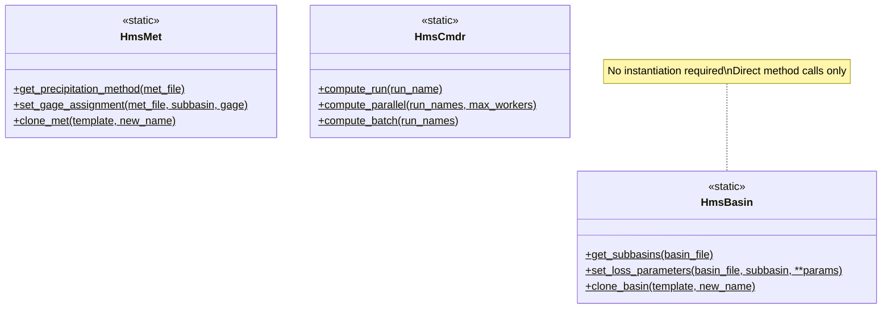

# HMS Commander Documentation

<div align="center">
  
  <p><strong>Automate • Analyze • Visualize</strong></p>
</div>

---

**HMS Commander** is a Python library for automating HEC-HMS (Hydrologic Engineering Center's Hydrologic Modeling System) operations. It provides a comprehensive API for interacting with HEC-HMS project files, executing simulations, and processing results.

## Key Features

### 🔧 **Comprehensive HMS Automation**
- Complete project management through Python API
- Basin model, meteorologic model, and control specification operations
- Run configuration and execution engine with parallel compute support

### 📊 **Data Integration**
- DSS file operations (via ras-commander integration)
- Time-series gage management
- Results extraction and analysis
- GeoJSON export for spatial visualization

### 🚀 **Modern Workflows**
- Clone operations for QAQC workflows (baseline vs. updated models)
- Atlas 14 precipitation updates
- Multi-version HMS support (3.x and 4.x)
- Jython script generation for HEC-HMS automation

### 🤖 **LLM Forward Engineering**
- Built using CLB Engineering's LLM Forward Approach
- Comprehensive CLAUDE.md for AI context
- Static class architecture for simple, predictable API
- Example-based testing with real HMS projects

## Quick Start

### Installation

```bash
# Basic installation
pip install hms-commander

# With DSS support (includes ras-commander)
pip install hms-commander[dss]
```

### Basic Usage

```python
from hms_commander import init_hms_project, HmsBasin, HmsCmdr

# Initialize project
init_hms_project(r"C:/Projects/MyHmsModel")

# Get subbasin information
subbasins = HmsBasin.get_subbasins("MyModel.basin")
print(subbasins.head())

# Modify loss parameters
HmsBasin.set_loss_parameters(
    "MyModel.basin",
    "Subbasin-1",
    curve_number=85
)

# Execute simulation
HmsCmdr.compute_run("Run 1")
```

## Architecture



HMS Commander follows the proven patterns established by [ras-commander](https://github.com/gpt-cmdr/ras-commander):

### Static Class Pattern



- **Static Class Pattern**: Direct method calls without instantiation
- **Flexible Imports**: Supports both installed package and local development
- **Example-Based Testing**: Uses real HMS example projects instead of unit tests
- **Comprehensive Logging**: Centralized logging with `@log_call` decorators

## HMS Version Support

| Version | Support | Notes |
|---------|---------|-------|
| **HMS 4.4.1+** | ✅ Full | 64-bit, recommended |
| **HMS 3.3-3.5** | ✅ Full | 32-bit, requires `python2_compatible=True` |
| HMS 4.0-4.3 | ❌ | Legacy classpath structure not supported |
| HMS 3.0-3.2 | ❓ | Untested |

## Documentation Structure

<div class="grid cards" markdown>

-   :material-clock-fast:{ .lg .middle } **Getting Started**

    ---

    Installation, quick start, and project initialization

    [:octicons-arrow-right-24: Get Started](getting_started/installation.md)

-   :material-book-open-variant:{ .lg .middle } **User Guide**

    ---

    Comprehensive guide to all HMS Commander features

    [:octicons-arrow-right-24: Read Guide](user_guide/overview.md)

-   :material-code-braces:{ .lg .middle } **Example Notebooks**

    ---

    Working examples with Jupyter notebooks

    [:octicons-arrow-right-24: View Examples](examples/overview.md)

-   :material-api:{ .lg .middle } **API Reference**

    ---

    Complete API documentation for all classes

    [:octicons-arrow-right-24: API Docs](api/hms_prj.md)

</div>

## Related Projects

- **[ras-commander](https://github.com/gpt-cmdr/ras-commander)** - Python API for HEC-RAS automation
- **[HEC-Commander](https://github.com/gpt-cmdr/HEC-Commander)** - Open-source suite for HEC software automation

## Contributing

HMS Commander is an open-source project built with LLM-driven development. Contributions are welcome!

See the [Contributing Guide](llm_dev/contributing.md) for details.

## License

MIT License - See LICENSE file for details

## Acknowledgments

Developed following the "CLB Engineering LLM Forward Approach" - leveraging AI-assisted coding to build comprehensive, well-documented hydrologic engineering tools.

---

<div align="center">
  <p>Built with ❤️ for the hydrologic engineering community</p>
</div>
