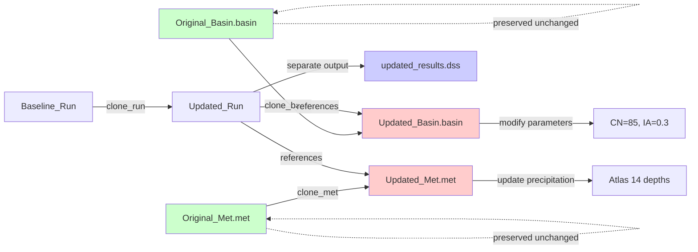
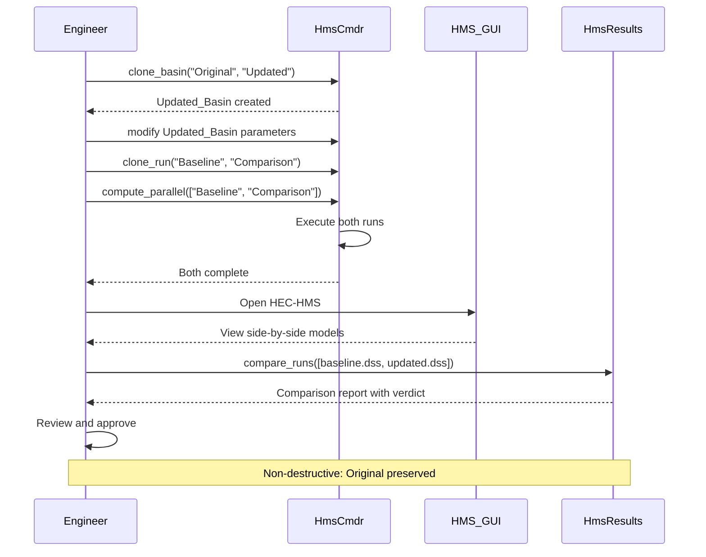

# Clone Workflows

Non-destructive clone operations for QAQC and model comparison workflows.

## Overview

Clone operations are central to HMS Commander's LLM Forward approach. They enable non-destructive model modifications with side-by-side GUI comparison.

## LLM Forward Clone Principles

Clone operations follow these principles:

✅ **Non-Destructive** - Original models preserved
✅ **GUI Verifiable** - Side-by-side comparison in HEC-HMS
✅ **Traceable** - Modification metadata in descriptions
✅ **QAQC-able** - Separate outputs for validation
✅ **Professional** - Client-ready comparison reports

### Non-Destructive Clone Pattern



## Quick Examples

### Clone Basin for Parameter Study

```python
from hms_commander import HmsBasin

# Create modified basin
HmsBasin.clone_basin(
    template="Original_Basin",
    new_name="Calibrated_Basin",
    description="Calibrated parameters from 2020 storm event"
)

# Now modify parameters in the clone
HmsBasin.set_loss_parameters(
    "Calibrated_Basin.basin",
    "Subbasin1",
    curve_number=85
)
```

### Clone Met Model for Atlas 14

```python
from hms_commander import HmsMet

# Clone and update precipitation
HmsMet.clone_met(
    template="TP40_Met",
    new_name="Atlas14_Met",
    description="Updated with NOAA Atlas 14 precipitation depths"
)

# Update depths in clone
atlas14_depths = [2.5, 3.1, 3.8, 4.5, 5.2, 6.0]
HmsMet.update_tp40_to_atlas14("Atlas14_Met.met", atlas14_depths)
```

### Clone Run for QAQC Comparison

```python
from hms_commander import HmsRun

# Create comparison run with separate output
HmsRun.clone_run(
    source_run="Baseline_Run",
    new_run_name="Updated_Run",
    new_basin="Calibrated_Basin",
    new_met="Atlas14_Met",
    output_dss="updated_results.dss",
    description="Calibrated basin + Atlas 14 precipitation"
)
```

## Complete QAQC Workflow

```python
# 1. Clone basin for parameter modifications
HmsBasin.clone_basin(
    template="Existing_Basin",
    new_name="Test_Basin"
)

# 2. Modify clone (original untouched)
HmsBasin.set_loss_parameters(
    "Test_Basin.basin",
    "Sub1",
    curve_number=80
)

# 3. Clone met for updated precipitation
HmsMet.clone_met(
    template="Existing_Met",
    new_name="Test_Met"
)

# 4. Create comparison run
HmsRun.clone_run(
    source_run="Baseline",
    new_run_name="Test",
    new_basin="Test_Basin",
    new_met="Test_Met",
    output_dss="test_results.dss"
)

# 5. Execute both runs
from hms_commander import HmsCmdr
HmsCmdr.compute_parallel(["Baseline", "Test"])

# 6. Compare results
from hms_commander import HmsResults
comparison = HmsResults.compare_runs(
    dss_files=["baseline_results.dss", "test_results.dss"],
    element="Outlet"
)
print(comparison)
```

### Workflow Sequence



## GUI Verification

After cloning, both models appear in HEC-HMS:

```
Components Manager:
├── Basin Models
│   ├── Original_Basin         (preserved)
│   └── Calibrated_Basin       (modified)
├── Meteorologic Models
│   ├── TP40_Met              (preserved)
│   └── Atlas14_Met           (modified)
└── Simulation Runs
    ├── Baseline_Run          (original)
    └── Updated_Run           (comparison)
```

**Verification Steps:**
1. Open HEC-HMS GUI
2. View both basin models side-by-side
3. Compare parameters visually
4. Run both simulations
5. Compare hydrographs in results viewer

## Clone Utilities

All clone operations use `HmsUtils.clone_file()`:

```python
from hms_commander import HmsUtils

# Core clone utility
HmsUtils.clone_file(
    template_path="original.basin",
    new_path="modified.basin",
    modify_func=lambda content: content.replace("CN: 75", "CN: 85")
)

# Register in project file
HmsUtils.update_project_file(
    hms_file="project.hms",
    entry_type="Basin",
    entry_name="modified"
)
```

## Common Clone Patterns

### 1. Parameter Sensitivity Study

```python
# Clone for multiple CN values
for cn in [70, 75, 80, 85, 90]:
    HmsBasin.clone_basin(
        template="Base",
        new_name=f"CN_{cn}"
    )
    HmsBasin.set_loss_parameters(f"CN_{cn}.basin", "Sub1", curve_number=cn)
```

### 2. Calibration Iterations

```python
# Clone for calibration attempts
HmsBasin.clone_basin(
    template="PreCalibration",
    new_name="Calibration_v1"
)
```

### 3. Storm Event Comparison

```python
# Clone control for different events
for event in ["2018_Storm", "2019_Storm", "2020_Storm"]:
    HmsControl.clone_control(
        template="Base_Control",
        new_name=event
    )
```

## Best Practices

1. **Use descriptive names** - `Atlas14_Updated` not `Model_Copy_2`
2. **Add descriptions** - Document what changed and why
3. **Separate outputs** - Use different DSS files for each run
4. **Preserve originals** - Never modify template files
5. **Version control** - Commit clones to track progression

## Related Topics

- [API Reference: HmsBasin](../api/hms_basin.md) - `clone_basin()`
- [API Reference: HmsMet](../api/hms_met.md) - `clone_met()`
- [API Reference: HmsRun](../api/hms_run.md) - `clone_run()`
- [API Reference: HmsUtils](../api/hms_utils.md) - `clone_file()`
- [Results Analysis](results_analysis.md) - Comparing results

---

*For the LLM Forward approach philosophy, see [CLB Engineering's LLM Forward Approach](../llm_dev/contributing.md)*
