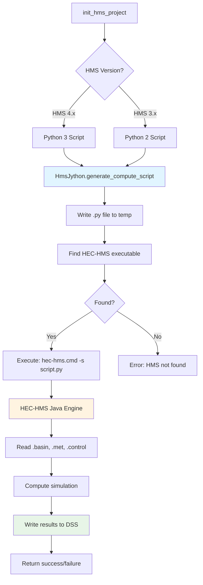

# Execution

Execute HEC-HMS simulations - single runs, parallel execution, and batch processing.

## Overview

The `HmsCmdr` class provides methods for executing HEC-HMS simulations via Jython scripts. Supports single runs, parallel execution, and batch processing.



## Quick Examples

### Single Run

```python
from hms_commander import HmsCmdr

# Execute one simulation
HmsCmdr.compute_run("Run 1")
```

### Parallel Execution

```python
# Run multiple simulations in parallel
runs = ["Run 1", "Run 2", "Run 3", "Run 4"]
HmsCmdr.compute_parallel(runs, max_workers=4)
```

### Batch Processing

```python
# Sequential batch execution
HmsCmdr.compute_batch(["Run 1", "Run 2", "Run 3"])
```

### Execution with Modified Parameters

```python
# Run with temporary parameter modifications
HmsCmdr.compute_with_parameters(
    run_name="Run 1",
    basin_file="model.basin",
    modifications={
        "Subbasin1": {"curve_number": 85},
        "Subbasin2": {"curve_number": 78}
    }
)
```

## HMS Version Support

HMS Commander supports both HMS 3.x (32-bit) and HMS 4.x (64-bit):

### HMS 4.x (Recommended)
```python
# Auto-detected for HMS 4.x
HmsCmdr.compute_run("Run 1")
```

### HMS 3.x (Legacy)
```python
# Requires Python 2 compatible scripts
from hms_commander import HmsJython

script = HmsJython.generate_compute_script(
    project_path="C:/Project",
    run_name="Run 1",
    python2_compatible=True  # Important for HMS 3.x
)

HmsJython.execute_script(script, hms_exe_path="C:/Program Files (x86)/HEC/HEC-HMS/3.5")
```

## Execution Methods

### HmsCmdr (Simplified)
- `compute_run()` - Single simulation
- `compute_parallel()` - Multiple runs in parallel
- `compute_batch()` - Sequential batch processing
- `compute_with_parameters()` - Temporary modifications

### HmsJython (Advanced)
- `generate_compute_script()` - Create Jython script
- `execute_script()` - Run Jython via HEC-HMS
- `find_hms_executable()` - Locate HMS installation
- Version-aware script generation (Python 2 vs 3)

## Parallel Execution Best Practices

```python
import os

# Determine optimal worker count
cpu_count = os.cpu_count()
max_workers = max(2, cpu_count - 2)  # Leave cores for system

# Execute in parallel
HmsCmdr.compute_parallel(
    run_names=["Run_A", "Run_B", "Run_C", "Run_D"],
    max_workers=max_workers
)
```

## Memory Configuration

For large models, configure Java heap memory:

```python
# Custom memory allocation
script = HmsJython.generate_compute_script("project", "Run 1")
HmsJython.execute_script(script, hms_exe_path="path/to/hms", max_memory="8G")
```

## Related Topics

- [API Reference: HmsCmdr](../api/hms_cmdr.md) - Execution methods
- [API Reference: HmsJython](../api/hms_jython.md) - Jython script generation
- [Run Configuration](run_configuration.md) - Setting up runs
- [Results Analysis](results_analysis.md) - Processing results

---

*For complete API documentation, see [HmsCmdr](../api/hms_cmdr.md) and [HmsJython](../api/hms_jython.md) API references*
