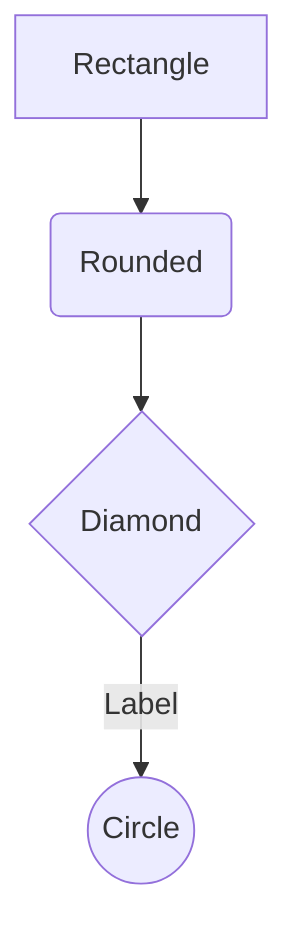
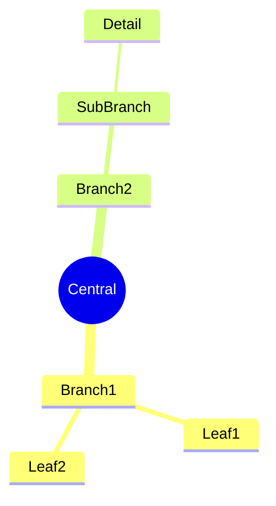
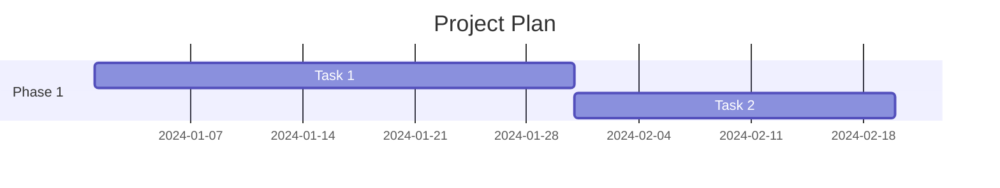
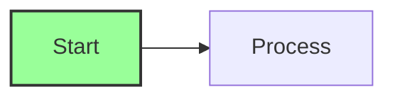
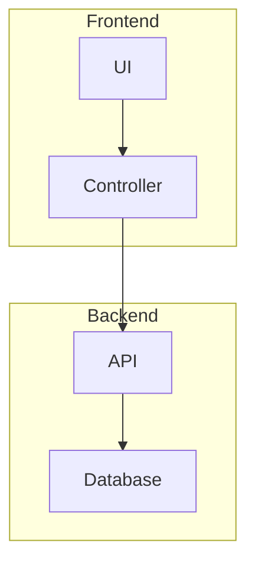

# AI Guidance for MCP Diagram Server

## Overview
This MCP server provides powerful tools for creating and manipulating diagrams using Mermaid syntax. Below are best practices and examples for effectively using these tools.

## Quick Start Guide

### 1. Creating Your First Diagram

To create a simple flowchart:
```
Tool: create_diagram
Args:
  diagram_type: "flowchart"
  use_template: true
  name: "my_first_diagram"
```

### 2. Custom Diagram Creation

For a custom flowchart:
```
Tool: create_diagram
Args:
  diagram_type: "flowchart"
  content: |
    flowchart TD
        A[User Request] --> B{Valid?}
        B -->|Yes| C[Process]
        B -->|No| D[Error]
        C --> E[Response]
        D --> E
  name: "validation_flow"
```

## Mermaid Syntax Reference

### Flowchart Syntax


### Sequence Diagram Syntax
```mermaid
sequenceDiagram
    Actor->>Service: Request
    Service-->>Actor: Response
    Note over Actor: Think
    Service->>Database: Query
    Database-->>Service: Result
```

### Mind Map Syntax


### Gantt Chart Syntax


## Best Practices

### 1. Diagram Organization
- Use clear, descriptive node labels
- Keep diagrams focused on a single concept
- Use consistent naming conventions
- Group related elements together

### 2. Color and Styling
Mermaid supports CSS styling:


### 3. Subgraphs for Organization


## Common Workflows

### Workflow 1: Create and Analyze
1. Create diagram with template
2. Analyze for insights
3. Get improvement suggestions
4. Update with improvements
5. Save to file

### Workflow 2: Markdown to Visual
1. Write content in markdown
2. Convert to mind map
3. Review and refine
4. Export for presentation

### Workflow 3: Iterative Development
1. Start with simple diagram
2. Get AI suggestions
3. Incrementally add detail
4. Validate structure
5. Finalize and save

## Advanced Features

### AI-Powered Analysis
Use `analyze_diagram` to get:
- Structure insights
- Flow optimization suggestions
- Consistency checks
- Completeness validation

### Improvement Suggestions
Use `suggest_diagram_improvements` with types:
- `general` - Overall improvements
- `clarity` - Readability enhancements
- `performance` - Efficiency optimizations
- `visual` - Layout and appearance

## Troubleshooting

### Common Issues
1. **Syntax Errors**: Check Mermaid syntax documentation
2. **Complex Diagrams**: Break into subgraphs
3. **Performance**: Limit node count to <100 for best results
4. **Rendering**: Ensure proper arrow syntax

### Tips
- Test incrementally with small changes
- Use templates as starting points
- Leverage AI analysis for validation
- Save frequently to avoid data loss

## Resources
- [Mermaid Documentation](https://mermaid.js.org)
- [Diagram Best Practices](https://www.visual-paradigm.com/guide/)
- [MCP Documentation](https://modelcontextprotocol.io)

---
*This guide is part of the MCP Diagram Server AI Guidance system*