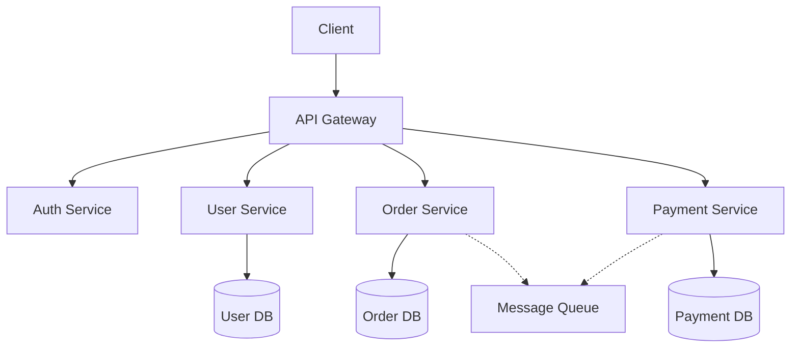
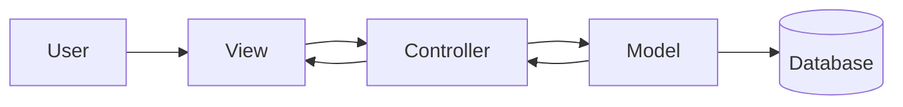
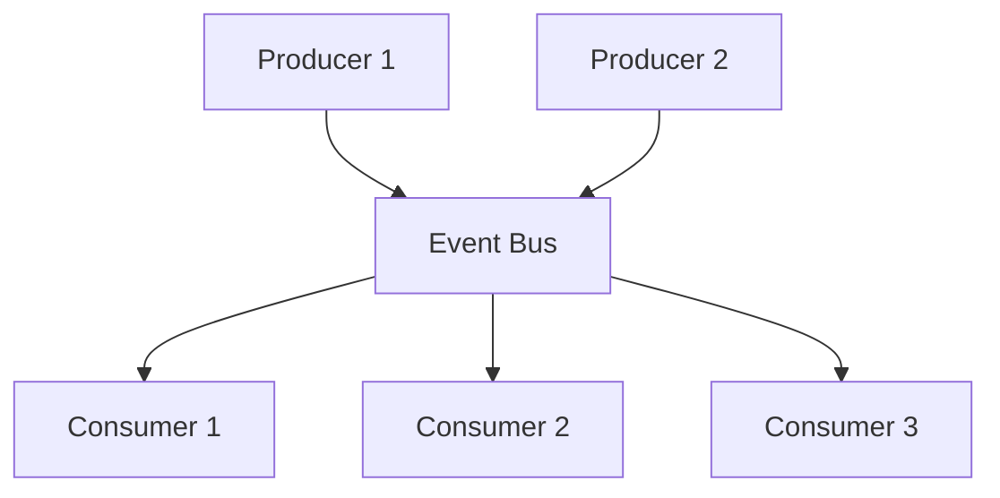
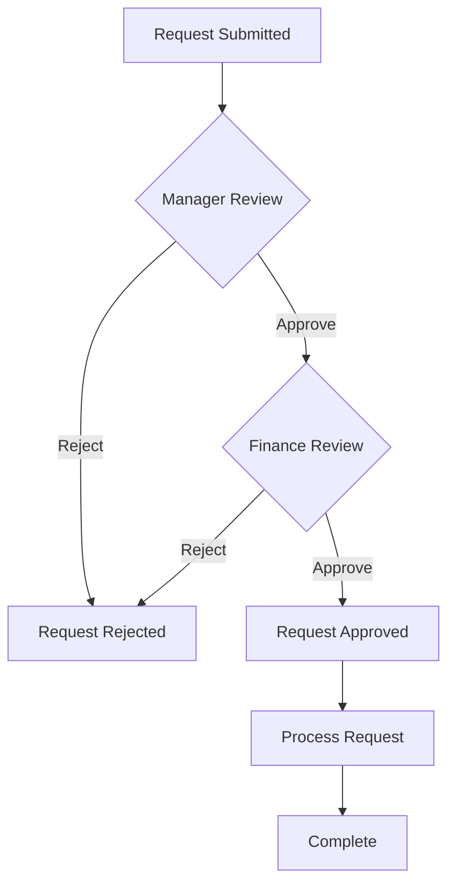
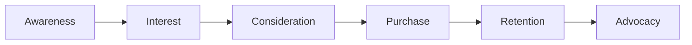
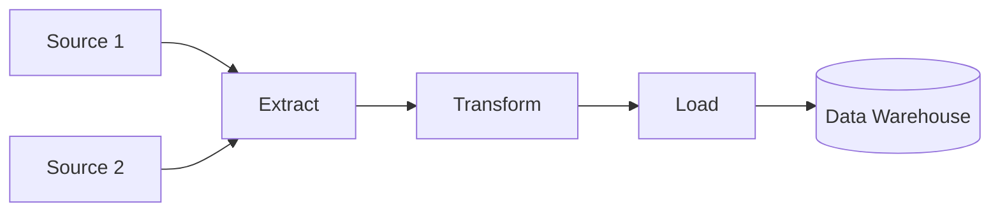
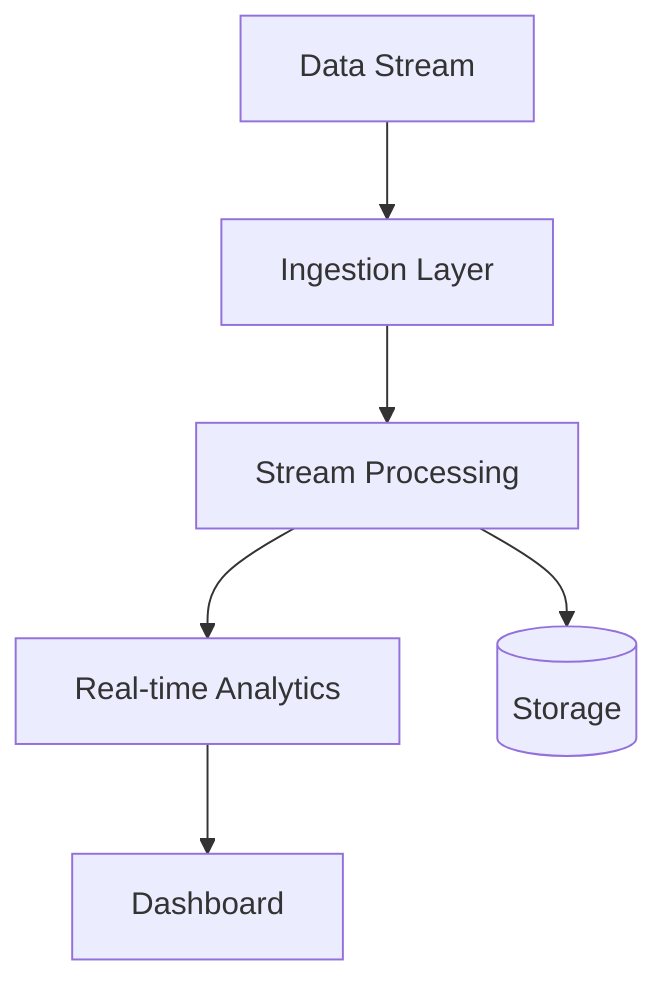
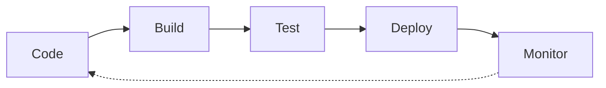
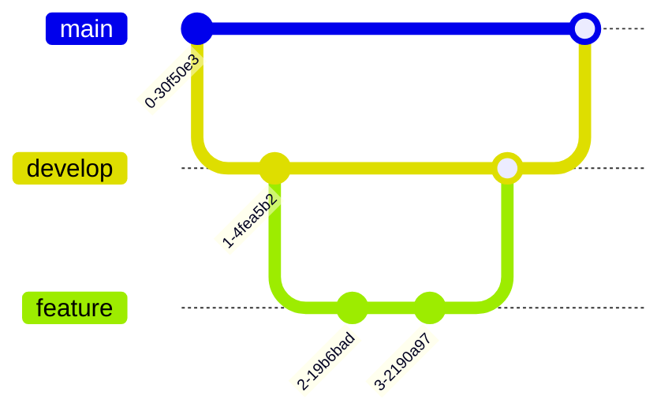
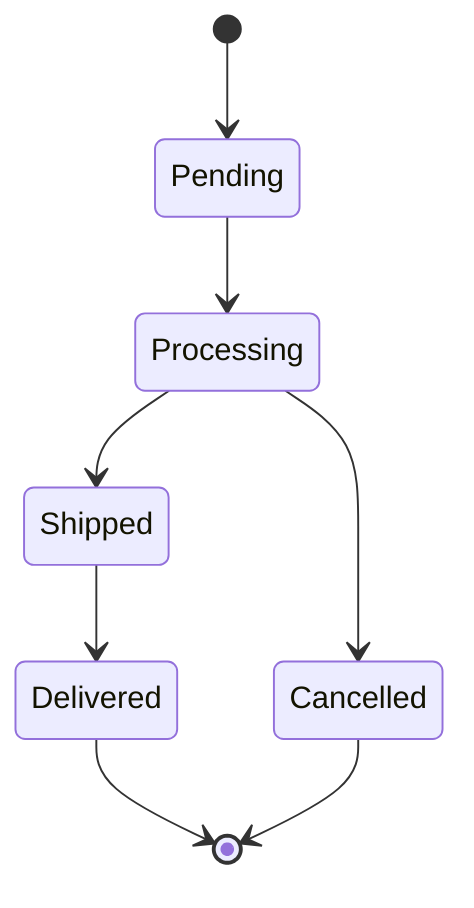

# Common Diagram Patterns

## Software Architecture Patterns

### 1. Microservices Architecture

### 2. MVC Pattern

### 3. Event-Driven Architecture

## Business Process Patterns

### 1. Approval Workflow

### 2. Customer Journey

## Data Flow Patterns

### 1. ETL Pipeline

### 2. Real-time Processing

## Development Patterns

### 1. CI/CD Pipeline

### 2. Git Flow

## State Machine Patterns

### 1. Order Status

---
*Use these patterns as templates for your own diagrams*