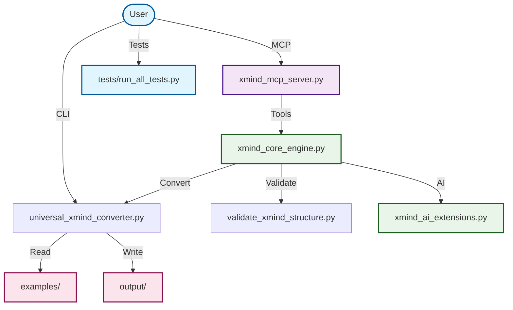

# 🧠 XMind AI MCP – Intelligent Mind Mapping Toolkit

A robust toolkit for converting multiple formats to XMind, with AI analysis and a UVX-deployed MCP server.

## Changelog
- 1.3.1: Fix `analyze_mind_map` compatibility with new read structure (no `data.structure`).

[](https://opensource.org/licenses/MIT)
[](https://lobehub.com/mcp/master-frank-xmindmcp)

## 🚀 Core Features

### 1. Universal File Converter
- Multi-format conversion: Markdown, Text, HTML, Word, Excel → XMind
- Smart detection: Auto-detect file types and structure
- Batch processing: Convert multiple files at once
- Flexible output: Custom output paths and naming

### 2. MCP Server (UVX)
- UVX-only deployment: no direct `python` or `pip`
- IDE integration: Works seamlessly with Trae and MCP tools
- FastMCP and STDIO modes supported

### 3. AI-Powered Analysis
- Structure analysis: Optimize mind map structure
- Topic suggestions: AI-generated recommendations
- Quality metrics: Comprehensive assessment and validation

## 📁 Project Structure

```
XmindMcp/
├── configs/                      # MCP server config
├── docs/                         # Documentation and guides
├── examples/                     # Sample inputs
├── output/                       # Generated XMind files
├── tests/                        # Test suite
├── universal_xmind_converter.py  # Standalone converter CLI
├── xmind_core_engine.py          # Core engine
├── xmind_mcp_server.py           # MCP server (FastMCP / STDIO)
├── xmind_mcp/                    # Package entry (`xmind-mcp`)
│   ├── __init__.py
│   └── __main__.py
└── configs/mcp_config.json       # MCP server configuration (env only)
```

## 🔄 Architecture Overview



## 🔧 Quick Start (UVX)

### Install UV (if not installed)
```bash
powershell -c "irm https://astral.sh/uv/install.ps1 | iex"
```

### Run (published package)
```bash
uvx xmind-mcp --mode fastmcp
uvx xmind-mcp --version
uvx xmind-mcp --help
```

### Local development (in repo root)
```bash
uvx --from . xmind-mcp --mode fastmcp
# Fallback (STDIO)
uvx xmind-mcp --stdio
```

## 🖥️ Trae MCP Integration (UVX)

### Standard configuration (recommended)
```json
{
  "mcpServers": {
    "xmind-mcp": {
      "command": "uvx",
      "args": ["xmind-mcp"],
      "env": {
        "PYTHONIOENCODING": "utf-8",
        "PYTHONUTF8": "1"
      },
      "description": "XMind MCP - UVX installed",
      "disabled": false,
      "autoApprove": []
    }
  }
}
```

### Local development configuration (no absolute paths)
```json
{
  "mcpServers": {
    "xmind-mcp": {
      "command": "uvx",
      "args": ["--from", ".", "xmind-mcp"],
      "env": {
        "PYTHONIOENCODING": "utf-8",
        "PYTHONUTF8": "1"
      },
      "description": "XMind MCP - local development",
      "disabled": false,
      "autoApprove": []
    }
  }
}
```

## 📦 Standalone Conversion (CLI)

### Single file
```bash
python universal_xmind_converter.py examples/test_markdown.md
python universal_xmind_converter.py examples/test_document.docx --output output/my_mind_map.xmind
```

### Batch conversion
```bash
python universal_xmind_converter.py examples/ --batch
python universal_xmind_converter.py examples/ --batch --format markdown,html,txt
```

## 🛠️ Available MCP Tools
- `read_xmind_file(file_path)` – read XMind content
- `create_mind_map(title, topics_json, output_path?)` – create a new map
- `analyze_mind_map(file_path)` – analyze structure and metrics
- `convert_to_xmind(source_filepath, output_filepath?)` – convert files to XMind
- `list_xmind_files(directory?, recursive?)` – list XMind files
- `translate_xmind_titles(source_filepath, output_filepath?, target_lang?, overwrite?)`

## ✅ Usage Examples (Trae MCP)

### Convert a Markdown file
```python
convert_to_xmind({
  "source_filepath": "examples/test_markdown.md"
  # omit output_filepath to use the server's default absolute output directory (if configured)
})
```

### Create a mind map (use default_output_dir in config)
```python
create_mind_map({
  "title": "Project Plan",
  "topics_json": [{"title": "Milestone 1"}, {"title": "Milestone 2"}]
  # do not pass output_path if a default absolute output directory is configured
})
```

### Analyze an existing map
```python
analyze_mind_map({
  "file_path": "output/test_markdown.xmind"
})
```

## ⚙️ Paths & Configuration
- Examples in docs use project-relative paths for readability.
- For MCP output tools, configure a default absolute output directory via MCP config env (`configs/mcp_config.json`) or CLI `--default-output-dir`.
- If no default is configured, pass an explicit absolute `output_path`/`output_filepath` in tool calls; relative paths are rejected by MCP output tools.

## 🧪 Run Tests
```bash
python tests/run_all_tests.py
python tests/run_all_tests.py --english
python tests/test_setup.py
python tests/test_core.py
```

## 📖 Documentation
- `docs/TRAE_MCP_SETUP.md` – IDE MCP configuration
- `docs/UNIVERSAL_CONVERTER_USAGE.md` – standalone converter usage
- `docs/xmind_ai_mcp_design.md` – architecture and design

## 🎨 Supported Formats
- Markdown (`.md`, `.markdown`)
- Text (`.txt`, `.text`)
- HTML (`.html`, `.htm`)
- Word (`.docx`)
- Excel (`.xlsx`)
- CSV (`.csv`)
- JSON (`.json`)
- XML (`.xml`)
- YAML (`.yaml`, `.yml`)

## 🤝 Contributing
- Fork the repository
- Create a feature branch (`git checkout -b feature/your-feature`)
- Commit (`git commit -m "feat: add your feature"`)
- Push (`git push origin feature/your-feature`)
- Open a Pull Request

## 🔍 Validation & Quality
- 9 file formats validated for conversion
- Structure integrity maintained
- Content fidelity preserved
- XMind format compliance ensured

## 📝 License
MIT License – see `LICENSE` for details.

## 🙏 Acknowledgments

- XMind team for the excellent mind mapping tool
- Trae IDE for the powerful development environment
- All contributors who helped improve this project