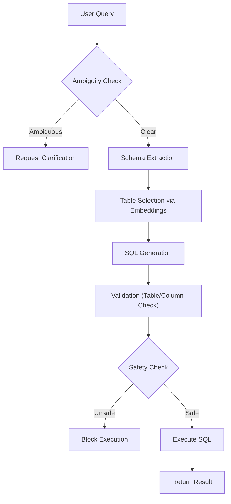

<div align="center">

# 🧠 Intelligent Text-to-SQL

**An offline-first, schema-aware engine that safeguards your database while unlocking natural language queries.**


[Features](#-features) • [Installation](#-installation) • [Quick Start](#-quick-start) • [Architecture](#-how-the-system-works) • [LLM Backends](#-llm-backends)

</div>

---

**Intelligent Text-to-SQL** is a robust Python library designed to convert natural language questions into **safe, executable SQL queries**. It bridges the gap between human language and database schemas without relying on expensive cloud APIs, prioritizing **correctness**, **security**, and **privacy**.

> **Why use this?**
> *   🚀 **Zero Cost**: Runs entirely offline or with local LLMs.
> *   🔒 **Safe**: Strict read-only enforcement; no accidental `DROP TABLE`.
> *   🧠 **Smart**: Understands your schema and detects ambiguity.

---

## ✨ Features

| Feature | Description |
| :--- | :--- |
| 🔌 **Offline & Zero-Cost** | Designed to work without paid APIs. Complete privacy for your data. |
| 🏗️ **Schema-Aware** | Intelligently builds queries based on your actual database structure. |
| 🤖 **Optional LLM Support** | Plug in local LLMs (like Ollama) for enhanced natural language understanding. |
| 🛡️ **Safety First** | Strictly prohibits `INSERT`, `UPDATE`, `DELETE`, and other destructive commands. |
| 🔍 **Smart Detection** | Identifies ambiguous queries and potential hallucinations. |
| 📦 **Easy Integration** | Pip-installable and backend-agnostic. Works with SQLite (PostgreSQL exp.). |

---

## 📦 Installation

Install the package directly from PyPI:

```bash
pip install intelligent-text2sql
```

For development usage:
```bash
git clone https://github.com/vatsaPatel0097/intelligent_text2sql
cd intelligent_text2sql
pip install -e .
```

---

## 🚀 Quick Start

Get running in seconds with a SQLite database.

```python
from intelligent_text2sql import Text2SQL

# Initialize the engine with your database URI
engine = Text2SQL("sqlite:///data/sales.db")

# Run a natural language query
result = engine.run("Show total sales per customer")

# Access the results
print(f"SQL: {result['sql']}")
print(f"Data:\n{result['data']}")
```

### Example Output

```json
{
  "sql": "SELECT customer_id, SUM(total_amount) AS total_sales FROM orders GROUP BY customer_id;",
  "data": "   customer_id  total_sales\n0          101       500.00\n1          102       750.50",
  "confidence": 0.9,
  "explanation": "Aggregates total sales per customer."
}
```

---

## 🛠️ How the System Works

The engine follows a multi-step pipeline to ensure accuracy and safety:



1.  **Schema Extraction**: Analyzes the database structure.
2.  **Ambiguity Detection**: Checks if the user's intent is clear.
3.  **Table Selection**: Uses embeddings to find relevant tables (vector search).
4.  **Generation**: Constructs SQL (Rule-based or LLM).
5.  **Validation**: Ensures tables and columns actually exist.
6.  **Safety**: Blocks any write/destructive operations.
7.  **Execution**: Runs the query and returns results.

---

## 🧠 LLM Backends

You can choose between a deterministic rule-based mode or an AI-enhanced mode.

### 1. Default Mode (No LLM)

Best for rigid schemas and simple queries. Fast and distinct.

```python
engine = Text2SQL("sqlite:///data/sales.db")
```

### 2. Local LLM (via Ollama)

Best for complex queries and natural language flexibility.

**Prerequisites:**
1.  [Install Ollama](https://ollama.com)
2.  Pull a model (e.g., `phi`, `mistral`, `llama3`):
    ```bash
    ollama run phi
    ```

**Usage:**

```python
engine = Text2SQL(
    "sqlite:///data/sales.db",
    llm_backend="ollama"
)
```

---

## 🖥️ Streamlit Demo

Visualize the engine in action with the built-in demo.

```bash
streamlit run app.py
```

The demo provides a UI to:
*   Input queries.
*   View generated SQL.
*   See the resulting data table.
*   Understand confidence scores and errors.

---

## ⚖️ License

Distributed under the **MIT License**. See `LICENSE` for more information.

---

<div align="center">

**Created by [Vatsal Patel](https://github.com/vatsaPatel0097)**

</div>
