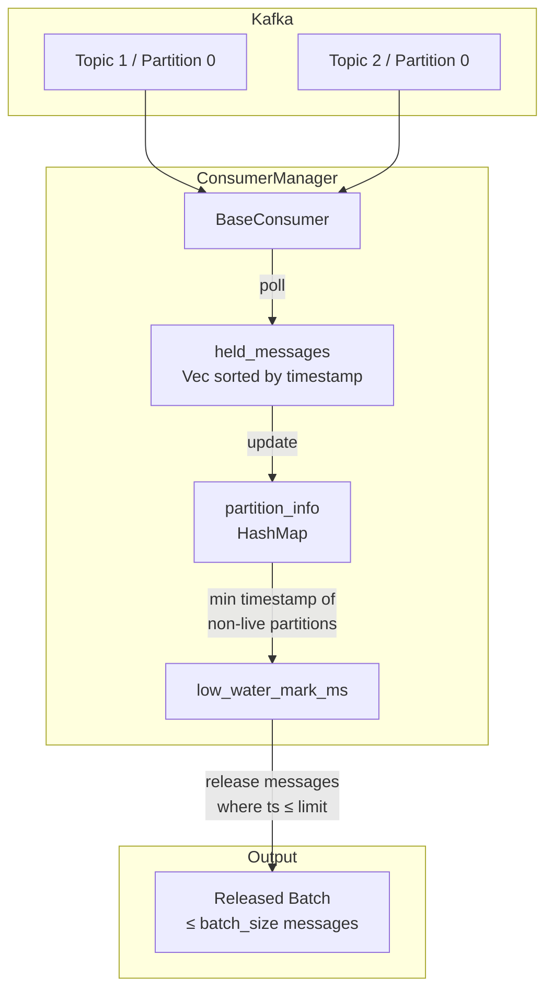
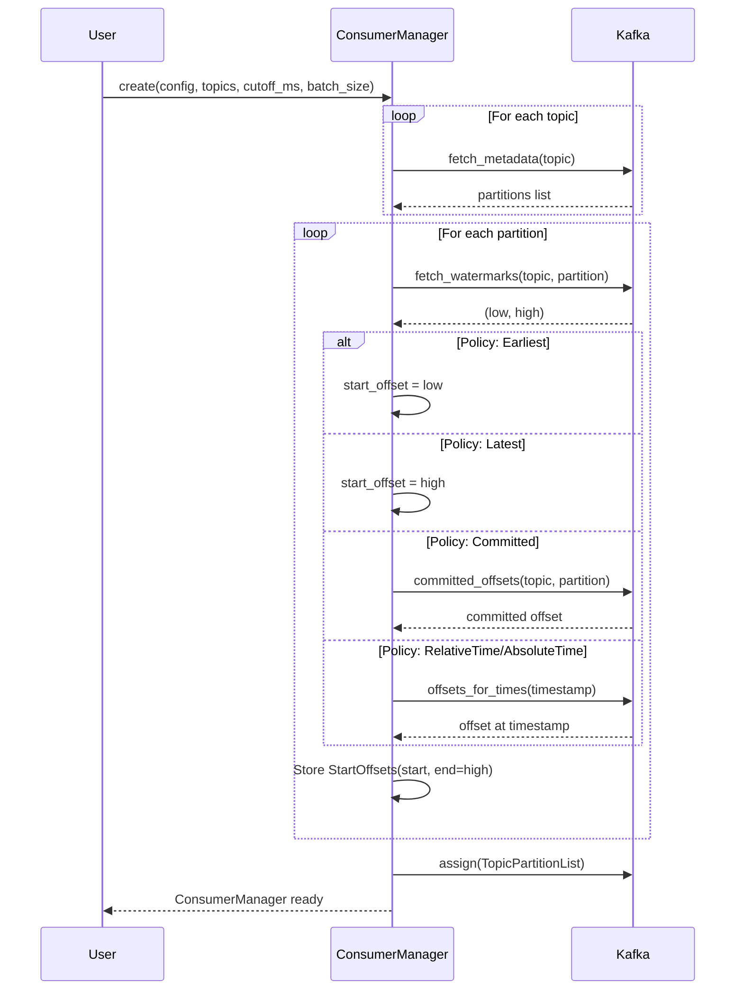
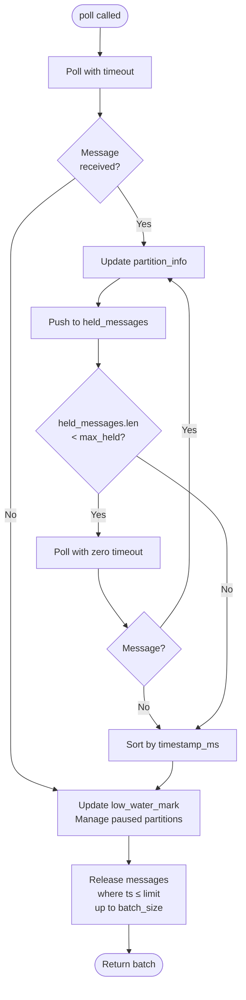
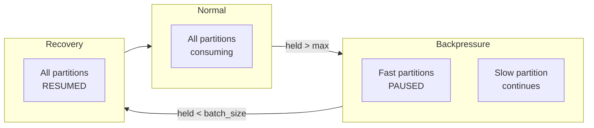

# Kafkars Architecture

## Overview

Kafkars is a Rust-based Kafka consumer library with Python bindings that provides:

- **Ordered message delivery**: Messages are released in timestamp order across all partitions
- **Offset resolution**: Supports multiple offset policies (earliest, latest, committed, time-based)
- **Backpressure management**: Pauses fast partitions to prevent memory overflow

## Core Components

```text
┌─────────────────────────────────────────────────────────────────────────────┐
│                              ConsumerManager                                │
├─────────────────────────────────────────────────────────────────────────────┤
│                                                                             │
│  ┌──────────────┐    ┌──────────────────┐    ┌────────────────────────┐     │
│  │ BaseConsumer │    │  StartOffsets    │    │    PartitionInfo       │     │
│  │   (rdkafka)  │    │  (immutable)     │    │    (per partition)     │     │
│  └──────────────┘    └──────────────────┘    └────────────────────────┘     │
│         │                    │                         │                    │
│         │            ┌───────┴───────┐         ┌───────┴───────┐            │
│         │            │ start_offset  │         │ current_offset│            │
│         │            │ end_offset    │         │ timestamp_ms  │            │
│         │            │ (per partition)│        │ is_live       │            │
│         │            └───────────────┘         └───────────────┘            │
│         ▼                                                                   │
│  ┌──────────────────────────────────────────────────────────────────┐       │
│  │                      held_messages: Vec<TimestampedMessage>      │       │
│  │                         (sorted by timestamp_ms)                 │       │
│  └──────────────────────────────────────────────────────────────────┘       │
│                                                                             │
└─────────────────────────────────────────────────────────────────────────────┘
```

## Message Flow



## Offset Resolution at Startup

When `ConsumerManager::create()` is called, offsets are resolved synchronously for all topic/partitions before any messages are consumed:



## Data Structures

### StartOffsets (Immutable)

Captured at creation time and never modified:

```rust
struct PartitionStartOffset {
    topic: String,
    partition: i32,
    start_offset: i64,   // Where we started consuming
    end_offset: i64,     // High watermark at creation time
}
```

### PartitionInfo (Mutable)

Updated as messages are consumed:

```rust
struct PartitionInfo {
    topic: String,
    partition: i32,
    current_offset: i64,     // Last consumed offset
    timestamp_ms: Option<i64>, // Last message timestamp
    is_live: bool,           // True when caught up to end_offset
}
```

### TimestampedMessage

Messages held in memory before release:

```rust
struct TimestampedMessage {
    key: Option<Vec<u8>>,
    value: Option<Vec<u8>>,
    topic: String,
    partition: i32,
    offset: i64,
    timestamp_ms: i64,
}
```

## Poll Cycle



## Watermark-Based Release

The release mechanism ensures messages are returned in timestamp order:

```text
Timeline →

Partition 1:  [msg@100] [msg@200] [msg@300] [msg@400]  ← is_live=false (ts=400)
Partition 2:  [msg@150] [msg@250]                      ← is_live=false (ts=250)
                                   ↑
                            low_water_mark = 250

held_messages (sorted): [100, 150, 200, 250, 300, 400]
                         ↑_______________↑
                         Released (ts ≤ 250)
```

### Release Conditions

A message is released when:

1. `timestamp_ms <= low_water_mark_ms` (or `cutoff_ms` if all partitions are live)
2. `released.len() < batch_size`

### Partition Liveness

A partition becomes **live** when either:

1. Message timestamp >= `cutoff_ms`, OR
2. Current offset reaches the `end_offset` captured at creation time

```rust
info.is_live = msg.timestamp_ms >= self.cutoff_ms
            || (msg.offset + 1) >= end_offset;
```

## Backpressure Management

When `held_messages` exceeds `max_held_messages` (default: `batch_size * 5`):



Partitions with timestamps ahead of the low water mark are paused to let slower partitions catch up.

## Python Interface

```python
from kafkars import ConsumerManager, SourceTopic

# Create source topics with offset policies
topics = [
    SourceTopic.from_earliest("events"),
    SourceTopic.from_relative_time("metrics", 3600000),  # 1 hour ago
]

# Create consumer manager
manager = ConsumerManager(
    config={"bootstrap.servers": "localhost:9092", "group.id": "my-group"},
    topics=topics,
    cutoff_ms=int(time.time() * 1000),  # Now
    batch_size=1000,
)

# Poll returns PyArrow RecordBatch
while True:
    batch = manager.poll(timeout_ms=1000)
    if batch.num_rows > 0:
        df = batch.to_pandas()
        process(df)

    if manager.is_live():
        break  # All partitions caught up
```

## File Structure

```text
src/
├── lib.rs              # Python bindings (PyO3)
├── consumer_manager.rs # Core consumer logic
└── source_topic.rs     # SourceTopic and OffsetPolicy types

bench/
├── poll_messages.py    # CLI tool for testing
└── README.md           # Usage instructions
```
