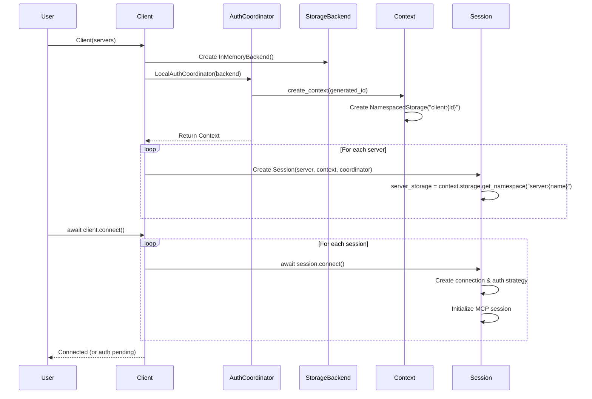
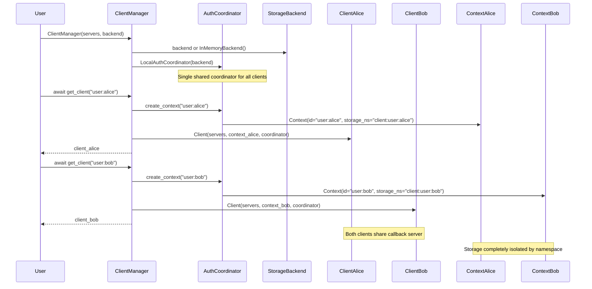
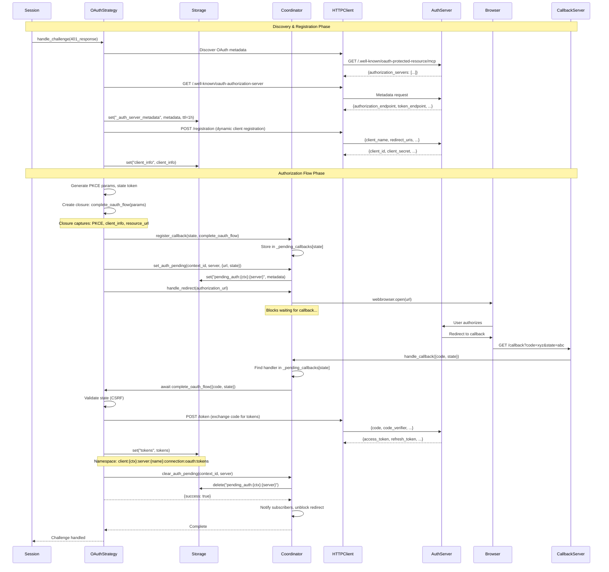
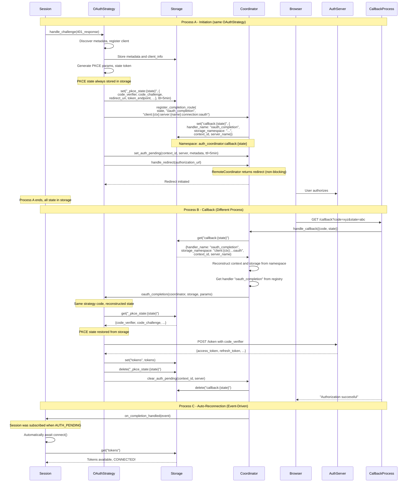
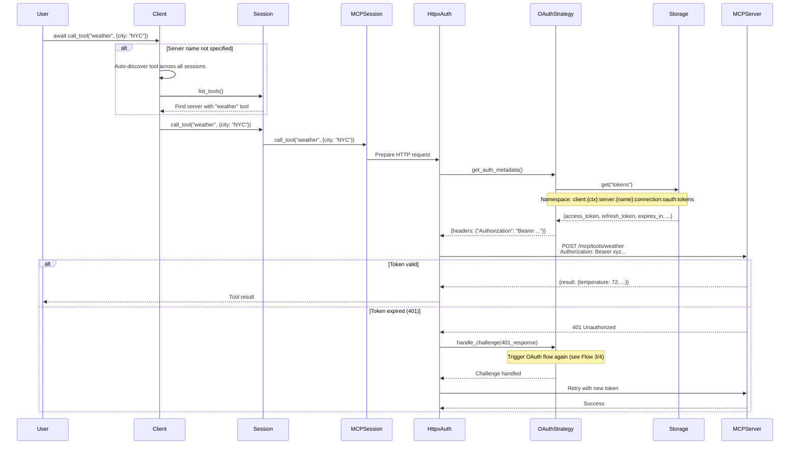
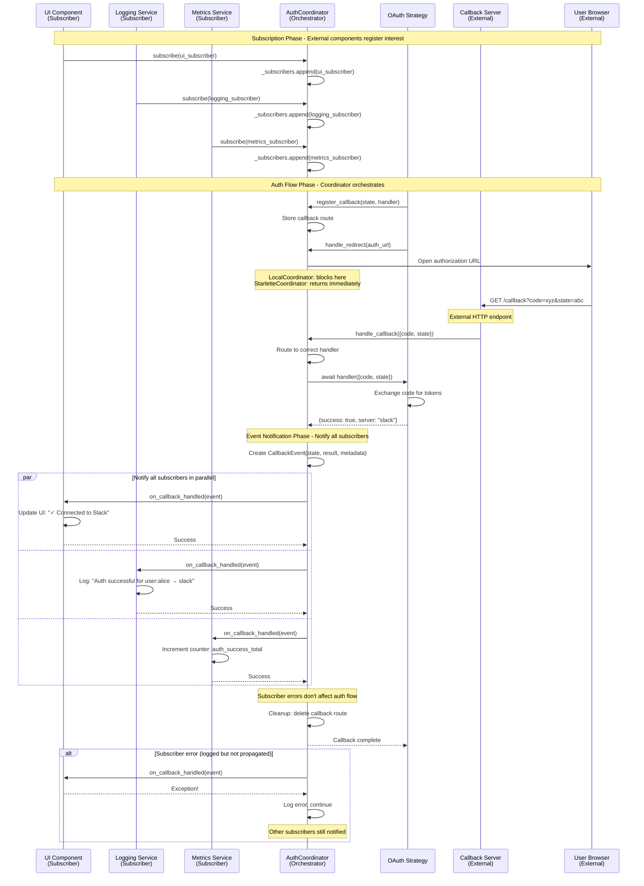
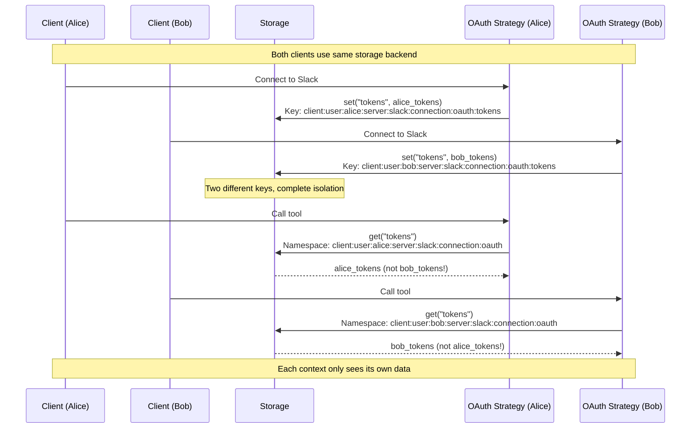

# MCP Client - Contributors Guide

Welcome to the MCP Client implementation! This document provides a comprehensive overview of the architecture, design decisions, and implementation patterns to help you understand and contribute to the codebase effectively.

## Table of Contents

- [Overview](#overview)
- [Core Architecture](#core-architecture)
- [Session Status Lifecycle](#session-status-lifecycle)
- [Storage Architecture](#storage-architecture)
- [Key Use Cases & Flows](#key-use-cases--flows)
- [Architectural Decisions](#architectural-decisions)
- [Component Responsibilities](#component-responsibilities)
- [Development Guidelines](#development-guidelines)
- [Testing Strategy](#testing-strategy)

---

## Overview

The MCP Client is a Python SDK designed to make **authenticated MCP connections** easy in **headless and stateless environments** (serverless, web applications, CLI tools).

### Key Goals

1. **Headless OAuth Authentication**: Handle OAuth flows without user interaction in the same process - the client manages callbacks, token storage, and re-authentication automatically.

2. **Stateless & Distributed**: Work across process boundaries - start auth in one Lambda invocation, complete callback in another. All state stored in pluggable backends (InMemory, SQLite, Redis, DynamoDB).

3. **Event-Driven Extensibility**: Subscribe to authentication events to automatically resume operations:
   - Resume request processing when auth completes (no polling needed)
   - Update UI to reflect connection status
   - Log authentication events for compliance
   - Track metrics for monitoring
---

## Core Architecture

The architecture centers on **AuthCoordinator**, which manages authentication flows between external components and the client:

```
  External Components                                      Client Components
  
  ┌─────────────────────┐                              ┌──────────────────┐
  │ OAuth Callbacks     │◄────┐                   ┌───►│ Client           │
  │ (HTTP endpoints)    │     │                   │    │ • Sessions       │
  └─────────────────────┘     │                   │    │ • Auth Strategies│
                              │                   │    └──────────────────┘
  ┌─────────────────────┐     │                   │
  │ Event Subscribers   │◄────┤                   │
  │ • User notifications│     │                   │
  │ • Logging           │     │                   │
  │ • Metrics           │     │                   │
  └─────────────────────┘     │                   │
                              │                   │
  ┌─────────────────────┐     │                   │
  │ User Browsers       │─────┤                   │
  │ (OAuth redirects)   │     │                   │
  └─────────────────────┘     │                   │
                              │                   │
                              ▼                   │
                    ┌─────────────────────────────┴────┐
                    │       AuthCoordinator            │
                    │  (Authentication Flow Manager)   │
                    │                                  │
                    │  • Routes OAuth callbacks        │
                    │  • Notifies event subscribers    │
                    │  • Manages auth state            │
                    │  • Provides callback URIs        │
                    │  • Creates isolated contexts     │
                    └──────────────────────────────────┘
```

**Key Insight**: AuthCoordinator bridges external OAuth infrastructure and your client code. When OAuth completes, it routes callbacks to the correct client session and notifies subscribers (e.g., to automatically resume the original request).

### Component Overview

- **Client**: Main API for connecting to MCP servers and calling tools
- **AuthCoordinator**: Manages authentication flows, callbacks, and event notifications  
- **Context**: Isolated execution environment with per-user/session storage
- **Session**: Per-server connection with authentication
- **AuthStrategy**: Implements auth protocol (OAuth 2.0 PKCE, API Key, None)
- **Storage**: Pluggable backends for state (InMemory, SQLite, Redis, DynamoDB)

---

## Real-World Example: Multi-Tenant Slack Bot

This example shows how to build a production Slack bot where multiple users can access their own Google Calendar/Drive through MCP servers. We'll start with the requirements, identify the architectural challenges, then show how the SDK solves them.

### Requirements

You need to build a Slack bot where:

1. **Each user authenticates separately** to their own Google account (multi-tenant)
2. **OAuth happens in the background** - users click a link, authorize, and the bot automatically continues
3. **No polling** - when OAuth completes, the bot resumes the request immediately
4. **Event-driven architecture** - bot responds to Slack events, with OAuth callbacks arriving separately
5. **Persistent authentication** - users stay authenticated across bot restarts

### Architectural Challenges

Without the right primitives, this is hard to build:

❌ **Challenge 1: Multi-Tenant Isolation**
- Each user needs separate OAuth tokens stored securely
- User A's tokens must never be accessible to User B
- Need to manage hundreds/thousands of user connections efficiently

❌ **Challenge 2: Event-Driven OAuth Callbacks**
- User message arrives as Slack event → Triggers OAuth
- OAuth callback arrives as separate HTTP request (different lifecycle)
- How do you route the callback to the correct user?
- How do you store PKCE state between these separate events?

❌ **Challenge 3: Automatic Request Resumption**
- When OAuth completes, you need to re-run the original request
- Traditional approach: poll auth state periodically (inefficient!)
- Better approach: event-driven notification when auth completes

❌ **Challenge 4: Integration Complexity**
- Need to integrate MCP client + OAuth + Agent framework + Slack SDK
- Each has its own patterns and lifecycle requirements
- Easy to create tight coupling and spaghetti code

### How the SDK Solves These Challenges

The SDK provides four key architectural patterns that make this easy:

✅ **Solution 1: ClientManager + Namespaced Storage**
- `ClientManager` creates isolated clients per user
- Hierarchical namespaces ensure complete data isolation: `client:user:alice:*` vs `client:user:bob:*`
- Pluggable storage backends (SQLite, Redis, DynamoDB)

✅ **Solution 2: StarletteAuthCoordinator**
- Manages OAuth callbacks as separate HTTP requests
- Stores callback routing info in storage: `callback:{state}` → handler + user context
- Routes callback to correct user even though it arrives in a different request lifecycle

✅ **Solution 3: CompletionSubscriber (Observer Pattern)**
- Subscribe to auth completion events
- Automatically triggered when OAuth succeeds (no polling!)
- Receives user metadata to resume the original request

✅ **Solution 4: Decoupled Components**
- Client, Coordinator, Storage are independent - mix and match
- OpenAI agents adapter provides clean MCP integration
- Each component has clear boundaries

### Architecture Overview

```
┌─────────────────────────────────────────────────────────────────────┐
│                         Slack User                                  │
│  "Get my calendar events" → Slack Thread                            │
└────────────────┬────────────────────────────────────────────────────┘
                 │
                 ▼
┌─────────────────────────────────────────────────────────────────────┐
│                    Starlette Web App                                │
│  POST /slack/events (Slack Bolt)                                    │
└────────────────┬────────────────────────────────────────────────────┘
                 │
                 ▼
┌─────────────────────────────────────────────────────────────────────┐
│                   Message Handler                                   │
│  1. Extract user_id, thread_id, message                             │
│  2. Get MCP client for user: client_manager.get_client(user_id)     │
└────────────────┬────────────────────────────────────────────────────┘
                 │
                 ▼
┌─────────────────────────────────────────────────────────────────────┐
│                    ClientManager                                    │
│  • One shared StarletteAuthCoordinator                              │
│  • One shared SQLiteBackend                                         │
│  • Creates isolated client per user_id                              │
└────────────────┬────────────────────────────────────────────────────┘
                 │
                 ├──────────────┬──────────────┬────────────────┐
                 ▼              ▼              ▼                ▼
         ┌─────────────┐  ┌─────────────┐  ┌──────────┐  ┌──────────┐
         │ Client      │  │ Client      │  │ Storage  │  │  Auth    │
         │ (user:alice)│  │ (user:bob)  │  │ (SQLite) │  │Coordinator│
         │             │  │             │  │          │  │(Starlette)│
         └─────────────┘  └─────────────┘  └──────────┘  └──────────┘
                 │
                 │ Namespace: client:user:alice:*
                 ▼
┌─────────────────────────────────────────────────────────────────────┐
│                  OpenAI Agents Integration                          │
│  async with openai_agents.get_client(mcp_client) as openai_client: │
│    agent = Agent(                                                   │
│      instructions=openai_client.get_system_prompt(...),             │
│      mcp_servers=openai_client.get_mcp_servers(),  # MCP tools     │
│      tools=openai_client.get_auth_tools()  # Auth request tool     │
│    )                                                                │
│    response = await Runner.run(agent, message, session=session)    │
└────────────────┬────────────────────────────────────────────────────┘
                 │
    ┌────────────┴───────────┐
    │                        │
    ▼                        ▼
┌──────────────┐      ┌─────────────────────────────────┐
│ MCP Request  │      │ Auth Needed? (401 from server)  │
│ (if auth OK) │      └──────────┬──────────────────────┘
└──────────────┘                 │
                                 ▼
                    ┌────────────────────────────────────┐
                    │  OAuth Flow (via AuthCoordinator)  │
                    │  1. Strategy discovers OAuth       │
                    │  2. Strategy registers client      │
                    │  3. Coordinator provides callback  │
                    │  4. User authorizes in browser     │
                    └──────────┬─────────────────────────┘
                               │
                               ▼
                    ┌────────────────────────────────────┐
                    │  GET /oauth/callback?code=...      │
                    │  (StarletteAuthCoordinator)        │
                    └──────────┬─────────────────────────┘
                               │
                               ▼
                    ┌────────────────────────────────────┐
                    │  Coordinator notifies subscribers  │
                    │  → AuthRetryHandler                │
                    └──────────┬─────────────────────────┘
                               │
                               ▼
                    ┌────────────────────────────────────┐
                    │  AuthRetryHandler:                 │
                    │  Automatically re-run agent with   │
                    │  original message (no polling!)    │
                    └──────────┬─────────────────────────┘
                               │
                               ▼
                    ┌────────────────────────────────────┐
                    │  Agent runs again                  │
                    │  → Now has MCP tools               │
                    │  → Gets calendar events            │
                    │  → Responds to user                │
                    └────────────────────────────────────┘
```

### What the SDK Provides vs. What You Build

**The SDK handles:**
- ✅ Multi-tenant client isolation (ClientManager + namespaced storage)
- ✅ OAuth flow coordination (discovery, registration, PKCE, token exchange)
- ✅ Event-driven callback routing (route callbacks to correct user)
- ✅ Auth completion notifications (publish events when OAuth succeeds)
- ✅ Persistent token storage (OAuth tokens survive restarts)

**You still implement:**

**1. Slack Bot Server** (~20 lines)
- Use Slack Bolt framework with appropriate adapter (Starlette, FastAPI, etc.)
- Configure OAuth callback route to use coordinator's handler
- Wire up message event handlers

```python
from slack_bolt.adapter.starlette.async_handler import AsyncSlackRequestHandler
from starlette.routing import Route

app = AsyncApp(...)  # Your Slack Bolt app
handler = AsyncSlackRequestHandler(app)

starlette_app = Starlette(routes=[
    Route("/slack/events", handler.handle, methods=["POST"]),
    Route("/oauth/callback", coordinator.get_callback_handler(), methods=["GET"]),
])
```

**2. Request Management & Retry Logic** (~30 lines)
- Subscribe to auth completion events from coordinator
- Store pending request context (user_id, thread_id, original_message)
- Re-execute the agent/request when notified

```python
class AuthRetryHandler(CompletionSubscriber):
    def __init__(self):
        self.pending_requests = {}  # Track requests waiting for auth
    
    def register_pending(self, context_id, request_info):
        """Call this before OAuth to track the request"""
        self.pending_requests[context_id] = request_info
    
    async def on_completion_handled(self, event: CompletionEvent):
        """Called by coordinator when OAuth completes"""
        context_id = f"{event.metadata['user_id']}:{event.metadata['thread_id']}"
        request_info = self.pending_requests.get(context_id)
        
        if request_info:
            # Re-run the agent with original message
            await run_agent(
                user_id=request_info['user_id'],
                thread_id=request_info['thread_id'],
                message=request_info['original_message']
            )
            del self.pending_requests[context_id]

# Subscribe to coordinator
coordinator.subscribe(AuthRetryHandler())
```

**Key Point**: The SDK provides the infrastructure (multi-tenant clients, OAuth coordination, event notifications). You provide the application logic (Slack integration, request retry strategy).

### Flow Walkthrough

**First request** (needs auth):
1. User: "Get my calendar events"
2. Handler gets MCP client for user → Tries to connect
3. Google MCP server returns 401 (needs auth)
4. OAuth flow starts, agent receives auth tool
5. Agent calls `request_authentication(service="google")`
6. User receives Slack message with OAuth URL
7. User authorizes in browser
8. Callback hits `/oauth/callback` → Tokens stored
9. AuthRetryHandler automatically triggered (no polling!)
10. Agent re-runs original request → Now has calendar tools → Returns events

**Subsequent requests** (already auth'd):
1. User: "Show next week's events"
2. Handler gets MCP client for user
3. Client connects using stored OAuth tokens
4. Agent receives calendar MCP tools directly
5. Agent calls calendar tool, returns results

### SDK Primitives Used

This example demonstrates:

- **ClientManager**: Multi-tenant client factory with shared infrastructure
- **StarletteAuthCoordinator**: Event-driven OAuth callback routing
- **CompletionSubscriber**: Event-driven notification on auth completion
- **SQLiteBackend**: Pluggable storage (swap to Redis/DynamoDB as needed)
- **Namespaced Storage**: Automatic isolation (`client:user:alice:*` vs `client:user:bob:*`)

Each primitive solves a specific architectural challenge. You can mix and match them based on your deployment model (CLI vs web vs serverless).


---

## Session Status Lifecycle

Sessions track their connection state through a comprehensive status lifecycle. This allows applications to handle connection failures gracefully without exceptions.

**Design Philosophy:**

The `connect()` method **does not raise exceptions** for connection failures. Instead, it sets the appropriate session status. This design enables:
- Connecting to multiple servers where some may be unavailable
- Graceful failure handling without try/catch blocks
- Clear status inspection to determine appropriate actions

### Status States

Sessions can be in one of the following states:

| State | Category | Description |
|-------|----------|-------------|
| `INITIALIZING` | Initial | Session created but not yet connected |
| `CONNECTING` | Active | Establishing connection to server |
| `AUTHENTICATING` | Active | Connection established, authentication in progress |
| `AUTH_PENDING` | Pending | Waiting for external auth (e.g., OAuth callback) |
| `CONNECTED` | Active | Fully connected and operational |
| `RECONNECTING` | Recovery | Attempting to reconnect after failure |
| `DISCONNECTING` | Disconnection | Gracefully closing connection |
| `DISCONNECTED` | Terminal | Clean disconnect, can reconnect |
| `CONNECTION_FAILED` | Failure | Failed to establish connection |
| `SERVER_UNREACHABLE` | Failure | Server not responding/not available |
| `AUTH_FAILED` | Failure | Authentication failed |
| `FAILED` | Failure | General failure state |

### Status Categories

Status states are organized into logical groups:

**Active States:** Session is attempting or maintaining a connection
- `CONNECTING`, `AUTHENTICATING`, `CONNECTED`, `RECONNECTING`

**Failure States:** Session encountered an error
- `AUTH_FAILED`, `CONNECTION_FAILED`, `SERVER_UNREACHABLE`, `FAILED`

**Recoverable States:** Failure states that can be retried
- `CONNECTION_FAILED`, `SERVER_UNREACHABLE`, `AUTH_FAILED`

**Terminal States:** Session is not connected and requires action
- `DISCONNECTED`, `FAILED`

**Pending States:** Session is waiting for external action
- `AUTH_PENDING`

### Status Properties

Sessions provide convenient properties for checking status:

```python
session = client.sessions["my-server"]

# Check if ready to use
if session.is_operational:  # Only true when CONNECTED
    result = await client.call_tool("my_tool", {})

# Check for failures
if session.is_failed:  # Any failure state
    print(f"Connection failed: {session.status}")
    if session.can_retry:  # Recoverable failure
        await client.connect(server="my-server", force_reconnect=True)

# Check if waiting for user action
if session.requires_user_action:  # AUTH_PENDING
    challenges = await client.get_auth_challenges()
    # Handle OAuth flow

# Check if currently connecting
if session.is_connecting:  # CONNECTING, AUTHENTICATING, or RECONNECTING
    print("Connection in progress...")

# Check connection health
is_healthy = await session.check_connection_health()
if not is_healthy:
    print(f"Connection unhealthy: {session.status}")
```

### Auto-Reconnection on Auth Completion

**Important:** Sessions automatically reconnect when authentication completes. You **do not** need to manually call `connect()` after OAuth finishes.

**How it works:**
1. Session enters `AUTH_PENDING` state when authentication is required
2. Session subscribes to the coordinator's completion events
3. When OAuth callback completes, the coordinator notifies all subscribers
4. Session receives notification and automatically reconnects
5. Status updates from `AUTH_PENDING` → `CONNECTING` → `AUTHENTICATING` → `CONNECTED`

### Usage Patterns

**Pattern 1: Check Status After Connection**

```python
await client.connect()

for server_name, session in client.sessions.items():
    if session.is_operational:
        print(f"{server_name}: Ready")
    elif session.is_failed:
        print(f"{server_name}: Failed - {session.status}")
    elif session.requires_user_action:
        print(f"{server_name}: Requires authentication")
```

**Pattern 2: Handle Mixed Server Availability**

```python
# Connect to all servers (some may fail)
await client.connect()

# Use only operational servers
operational_servers = [
    name for name, session in client.sessions.items()
    if session.is_operational
]

if operational_servers:
    tools = await client.list_tools()
    # Work with available servers
else:
    print("No servers available")
```

**Pattern 3: Retry Failed Connections**

```python
await client.connect()

for server_name, session in client.sessions.items():
    if session.is_failed and session.can_retry:
        print(f"Retrying {server_name}...")
        await client.connect(server=server_name, force_reconnect=True)
```

**Pattern 4: Health Check for Long-Running Sessions**

```python
# Periodically check connection health
async def monitor_connections(client):
    while True:
        await asyncio.sleep(60)  # Check every minute
        
        for server_name, session in client.sessions.items():
            if session.is_operational:
                is_healthy = await session.check_connection_health()
                if not is_healthy:
                    print(f"{server_name} unhealthy, reconnecting...")
                    await client.connect(server=server_name, force_reconnect=True)
```

### State Transition Examples

**Successful Connection (No Auth):**
```
INITIALIZING → CONNECTING → AUTHENTICATING → CONNECTED
```

**Connection with OAuth:**
```
INITIALIZING → CONNECTING → AUTHENTICATING → AUTH_PENDING
(user completes OAuth)
→ CONNECTING → AUTHENTICATING → CONNECTED
```

**Server Unreachable:**
```
INITIALIZING → CONNECTING → SERVER_UNREACHABLE
(retry)
→ CONNECTING → AUTHENTICATING → CONNECTED
```

**Graceful Disconnect:**
```
CONNECTED → DISCONNECTING → DISCONNECTED
```

**Connection Lost During Operation:**
```
CONNECTED → CONNECTION_FAILED
(health check detects failure)
```

See [`SESSION_STATUS_DESIGN.md`](SESSION_STATUS_DESIGN.md) and [`SESSION_LIFECYCLE.md`](SESSION_LIFECYCLE.md) for detailed state transitions and sequence diagrams.

---

## Storage Architecture

Storage is **fully pluggable** via the `StorageBackend` protocol. The client works with any storage implementation - InMemory for development, SQLite for local persistence, or Redis/DynamoDB for production deployments.

**Built-in Implementations**:
- `InMemoryBackend`: Fast, ephemeral (testing, single-process)
- `SQLiteBackend`: Persistent, file-based (local development)
- Custom: Redis, DynamoDB, PostgreSQL (implement the protocol)

### Hierarchical Namespace Pattern

The client uses **hierarchical namespaces** on top of any storage backend to provide complete isolation:

```
StorageBackend (pluggable: InMemory/SQLite/Redis/etc.)
│
├─ auth_coordinator:*                           # Coordinator's namespace
│  ├─ pending_auth:{context_id}:{server}        # Pending auth challenges
│  ├─ callback:{state}                          # Callback routing
│  └─ ...
│
└─ client:{context_id}:*                        # Client/Context namespace
   └─ server:{server_name}:*                    # Server-specific namespace
      └─ connection:*                           # Connection namespace
         └─ oauth:*                             # OAuth strategy namespace
            ├─ tokens                           # Access/refresh tokens
            ├─ client_info                      # OAuth client registration
            ├─ _auth_server_metadata            # Cached metadata (1h TTL)
            └─ _pkce_state:{state}              # PKCE state (5min TTL)
```

**Namespace Principles**:
1. **Pluggable base**: Any StorageBackend implementation works
2. **Layer isolation**: Each layer adds a prefix (Session → `server:{name}`, Strategy → `oauth`)
3. **Complete isolation**: Different contexts never see each other's data
4. **Easy cleanup**: Delete entire namespace with prefix scan
5. **No collisions**: Different strategies can use same key names

### Example Storage Keys

For context `user:alice` connecting to `slack` server with OAuth:

- Tokens: `client:user:alice:server:slack:connection:oauth:tokens`
- Client info: `client:user:alice:server:slack:connection:oauth:client_info`
- PKCE state: `client:user:alice:server:slack:connection:oauth:_pkce_state:abc123`

For coordinator managing auth:

- Pending auth: `auth_coordinator:pending_auth:user:alice:slack`
- Callback route: `auth_coordinator:callback:xyz789`

---

## Key Use Cases & Flows

This section presents the main use cases as sequence diagrams, showing how components interact to accomplish different tasks. **Pay special attention to how AuthCoordinator orchestrates flows between internal components (Sessions, Strategies) and external components (Callback Servers, Subscribers, Browsers).**

### Flow 1: Simple Client Initialization

The most basic use case - a single client connecting to servers.



**Key Points:**
- Client creates own coordinator if not provided (standalone mode)
- Each server gets isolated namespace: `client:{id}:server:{name}`
- Auto-generated context ID for simple usage

---

### Flow 2: Multi-Context via ClientManager

Enterprise scenario - multiple users/contexts sharing infrastructure.



**Key Points:**
- One coordinator shared across all clients
- Each context gets isolated storage: `client:{context_id}:`
- Efficient resource usage (one callback server)
- Complete data isolation between contexts

---

### Flow 3: OAuth Authentication (LocalAuthCoordinator)

For CLI/desktop apps using LocalAuthCoordinator, which blocks until the callback completes.



**Key Points:**
- **Single OAuthStrategy** handles all OAuth protocol logic
- LocalCoordinator **blocks** on redirect using asyncio.Event until callback completes
- Discovery results cached for 1 hour
- Client registration stored for future invocations
- PKCE state stored in strategy storage (works across process boundaries)
- All auth state stored in strategy namespace

---

### Flow 4: OAuth Authentication (StarletteAuthCoordinator)

For serverless/web applications using StarletteAuthCoordinator, where callback may be handled by a different process invocation.



**Key Points:**
- **Single OAuthStrategy** works with StarletteAuthCoordinator for cross-process flows
- PKCE params always stored in storage: `_pkce_state:{state}` (5min TTL)
- Callback routing info: `callback:{state}` → handler name + storage namespace
- Different process can handle callback
- StarletteAuthCoordinator **doesn't block** on redirect (returns HTTP response)
- Same strategy code as LocalAuthCoordinator, different coordinator behavior
- **Auto-reconnection**: Session subscribes to completion events and reconnects automatically (no manual `connect()` needed)

---

### Flow 5: Making Authenticated Tool Calls

How tokens are used for making MCP tool calls.



**Key Points:**
- Tokens retrieved from storage on each request
- HttpxAuth adapter integrates with httpx library
- 401 responses automatically trigger re-authentication
- Retry happens transparently for user

---

### Flow 6: Callback Subscribers & External Integration

This flow demonstrates how AuthCoordinator acts as the central orchestrator, notifying external subscribers about auth events for observability, UI updates, and monitoring.



**Key Points:**
- **Coordinator as Event Hub**: All auth events flow through coordinator
- **Observer Pattern**: Subscribers register once, get notified of all auth events
- **External Integration**: UI components, logging, metrics all treated uniformly
- **Error Isolation**: Subscriber errors logged but don't affect auth flow
- **Decoupling**: Strategies don't know about subscribers, coordinator handles notification
- **Event Details**: Subscribers receive: state, params, result, metadata, success flag, error (if any)

**Subscriber Interface**:
```python
class CallbackSubscriber(Protocol):
    async def on_callback_handled(self, event: CallbackEvent) -> None:
        """Called after auth callback is successfully handled."""
        ...
```

**Example Subscribers**:
1. **UI Updates**: Show "Connected to Slack" notification
2. **Logging**: Structured logs for auth events
3. **Metrics**: Track auth success/failure rates
4. **Analytics**: User behavior tracking
5. **Webhooks**: Notify external systems of auth state changes

---

### Flow 7: Namespace Hierarchy in Action

Concrete example showing how storage namespaces provide isolation.



**Key Points:**
- Same key name "tokens" used in different namespaces
- No risk of collision or data leakage
- Clean mental model: each context owns its namespace
- Easy cleanup: delete entire `client:user:alice:` prefix

---

## AuthCoordinator: The Orchestration Hub

The following diagram and explanation clarify how AuthCoordinator serves as the central orchestration point for all authentication flows, bridging internal components with external systems.

### Orchestration Patterns

```
┌─────────────────────────────────────────────────────────────────────┐
│                     AuthCoordinator                                 │
│                  (Central Orchestrator)                             │
│                                                                     │
│  ┌───────────────────────────────────────────────────────────────┐ │
│  │  Core Orchestration Functions                                 │ │
│  │  • Route callbacks to correct handlers                        │ │
│  │  • Manage callback infrastructure lifecycle                   │ │
│  │  • Coordinate auth flows across contexts                      │ │
│  │  • Notify subscribers of auth events                          │ │
│  │  • Create & cache isolated contexts                           │ │
│  │  • Provide callback URIs to strategies                        │ │
│  └───────────────────────────────────────────────────────────────┘ │
└──┬────────────┬────────────┬────────────┬───────────────────────────┘
   │            │            │            │
   │ Internal   │ External   │ External   │ State
   │ Components │ Callback   │ Subscribers│ Management
   │            │ Server     │            │
   ▼            ▼            ▼            ▼
┌──────────┐ ┌────────┐  ┌─────────┐  ┌──────────┐
│ Sessions │ │ HTTP   │  │ UI      │  │ Storage  │
│ &        │ │ Server │  │ Logging │  │ (State)  │
│Strategy  │ │ :12345 │  │ Metrics │  │ Backend  │
└────┬─────┘ └────────┘  └─────────┘  └──────────┘
     │
     │ Strategies communicate with auth servers
     ▼
┌──────────┐
│ OAuth    │
│ Provider │  ← Strategy handles all OAuth server communication
│ /auth    │
└──────────┘
```

### 1. Internal Component Coordination

**Pattern**: Sessions/Strategies request auth → Coordinator orchestrates → Response flows back

```
Session → "I need auth for Slack"
       ↓
Coordinator:
  • Creates/retrieves context
  • Initiates auth strategy
  • Stores pending state
  • Coordinates callback flow
       ↓
Strategy ← "Here's your isolated context & storage"
```

### 2. External Callback Server Integration

**Pattern**: Coordinator manages callback server lifecycle and routes incoming requests

```
Startup:
  Coordinator → Start callback server on :12345
  Server → Ready to receive callbacks
  
Registration:
  Strategy → register_callback(state, handler)
  Coordinator → Store routing: state → handler
  
Callback:
  Browser → GET /callback?state=abc123
  Server → Forward to coordinator
  Coordinator → Route to correct handler by state
  Handler → Complete auth flow
```

**LocalAuthCoordinator** (Embedded Server):
- Owns the HTTP server lifecycle
- Blocks on redirects until callback completes
- Uses asyncio.Event for synchronization

**StarletteAuthCoordinator** (Delegated):
- Delegates to external Starlette/FastAPI app
- Non-blocking, returns HTTP redirect responses
- Routes via storage for cross-process operation

### 3. Subscriber Notification (Observer Pattern)

**Pattern**: Coordinator broadcasts auth events to all registered subscribers

```
Event Occurs:
  Strategy completes auth → Result returned to coordinator
       ↓
Coordinator:
  • Creates CallbackEvent (state, result, metadata)
  • Notifies all subscribers in parallel
  • Logs but doesn't propagate subscriber errors
       ↓
Subscribers:
  • UI Component → Show "✓ Connected" notification
  • Logger → Structured log entry
  • Metrics → Increment success counter
  • Analytics → Track user behavior
  • Webhooks → Notify external systems
```

**Benefits**:
- **Decoupling**: Strategies don't know about subscribers
- **Extensibility**: Add new subscribers without changing core code
- **Observability**: Centralized auth event stream
- **Resilience**: Subscriber failures don't affect auth flow

### 4. Multi-Context Coordination

**Pattern**: Single coordinator manages auth for multiple isolated contexts

```
Context "user:alice":
  Session(slack) → Coordinator → OAuth flow → state=abc123
  Coordinator → Store: pending_auth:user:alice:slack
  Coordinator → Register callback: abc123 → handler_alice

Context "user:bob":
  Session(gmail) → Coordinator → OAuth flow → state=xyz789
  Coordinator → Store: pending_auth:user:bob:gmail
  Coordinator → Register callback: xyz789 → handler_bob

Callbacks (same server):
  Browser → /callback?state=abc123
  Coordinator → Route to handler_alice → Tokens stored in alice's namespace
  
  Browser → /callback?state=xyz789
  Coordinator → Route to handler_bob → Tokens stored in bob's namespace
```

**Key Insight**: State parameter enables routing while namespace isolation ensures security.

### 5. Cross-Process Coordination (Serverless)

**Pattern**: Coordinator reconstructs state from storage across process boundaries (StarletteAuthCoordinator)

```
Process A (Request):
  Strategy → Start OAuth flow
  Coordinator → Store callback route: state → {callback_name, namespace, context_id}
  Coordinator → Store PKCE state: state → {verifier, challenge, ...}
  Response → Redirect to auth server

Process B (Callback):
  Browser → /callback?state=xyz
  New Coordinator Instance → Load callback route from storage
  Coordinator → Reconstruct: context, storage namespace, handler
  Coordinator → Execute oauth_completion handler
  Handler → Load PKCE from storage → Complete auth
  Coordinator → Store tokens in correct namespace
  Coordinator → Notify subscribers
```

**Critical Features**:
- **No process affinity**: Different process can handle callback (StarletteAuthCoordinator)
- **Storage as state**: All coordination state persists in storage (both coordinator types)
- **Callback registry**: Maps handler names to functions (`oauth_completion` handler)
- **Namespace reconstruction**: Correct storage context restored from routing info
- **Single OAuth strategy**: Same `OAuthStrategy` code, different coordinator behavior

### 6. Callback URI Provision (Not OAuth Server Communication)

**Pattern**: Coordinator provides callback URIs to strategies; strategies handle all OAuth server communication

```
Dynamic Client Registration (Strategy's Responsibility):
  Strategy → "I need callback URIs for OAuth registration"
  Strategy → get_callback_uris() from coordinator
  Coordinator → Return ["http://localhost:12345/callback"] (or production URL)
  
  Strategy → Discover OAuth metadata (/.well-known/...)
  Strategy → POST /register with redirect_uris to OAuth server
  Auth Server → Validate and store callback URLs
  Auth Server → Return client_id, client_secret
  Strategy → Store client credentials
  
Later (Authorization Flow - Strategy initiates):
  Strategy → Build authorization URL with callback URI
  Strategy → register_callback(state, handler) with coordinator
  Strategy → Trigger redirect to auth server
  User → Authorizes in browser
  Auth Server → Validates redirect_uri against stored URIs
  Browser → Redirected to coordinator's callback URL
  Coordinator → Receives callback, routes to strategy's handler
  Strategy → Exchanges code for tokens with auth server
```

**Key Point**: Coordinator never talks to OAuth servers directly. It only:
- Provides callback URIs (infrastructure info)
- Manages the callback server that receives responses
- Routes incoming callbacks to the correct strategy handler

All OAuth protocol communication (discovery, registration, token exchange) is done by the strategy.

### Summary: Why Coordinator is Central

1. **Single Source of Truth**: All auth state flows through coordinator
2. **Abstraction Layer**: Hides callback infrastructure from strategies
3. **Coordination Logic**: Routes callbacks, manages lifecycle, isolates contexts
4. **Observable**: Subscribers can monitor all auth activity
5. **Pluggable**: Swap LocalAuthCoordinator ↔ StarletteAuthCoordinator without changing strategies
6. **Scalable**: Same pattern works for single-user CLI and multi-tenant web apps

Without AuthCoordinator, each strategy would need to:
- Manage its own callback server (port conflicts!)
- Handle routing (state → handler mapping)
- Implement notification logic
- Coordinate with other strategies

By centralizing callback infrastructure in AuthCoordinator, we achieve clean separation:
- **Coordinator**: Manages callback infrastructure (servers, routing, notifications)
- **Strategy**: Implements auth protocol (OAuth discovery, registration, token exchange)

Neither component steps on the other's toes.

---

## Component Responsibilities

Clear boundaries help maintain clean architecture.

### ClientManager
- **Purpose**: Factory for multi-context scenarios
- **Responsibilities**:
  - Create and cache clients by context_id
  - Manage shared AuthCoordinator
  - Lifecycle management (startup/shutdown)
- **Does NOT**:
  - Access storage directly
  - Implement auth logic
  - Manage connections

### Client
- **Purpose**: Main API entry point
- **Responsibilities**:
  - Create sessions for each server
  - Provide high-level API (`call_tool`, `list_tools`, etc.)
  - Auto-discover tools across servers
  - Own or share AuthCoordinator
- **Does NOT**:
  - Implement transport logic
  - Handle auth challenges directly
  - Manage storage namespaces

### Context
- **Purpose**: Isolated execution context
- **Responsibilities**:
  - Provide unique identity (context_id)
  - Provide namespaced storage
  - Store metadata (user info, session data)
  - Reference to coordinator
- **Does NOT**:
  - Manage connections
  - Implement auth logic
  - Create sessions

### Session
- **Purpose**: Per-server connection manager
- **Responsibilities**:
  - Manage lifecycle (connect/disconnect)
  - Create server-specific namespace
  - Detect and expose auth challenges
  - Subscribe to auth completion events (auto-reconnect)
  - Delegate to upstream MCP ClientSession
- **Does NOT**:
  - Implement transport (delegates to Connection)
  - Implement auth (delegates to AuthStrategy)
  - Parse MCP protocol (delegates to ClientSession)

### Connection
- **Purpose**: Transport-specific implementation
- **Responsibilities**:
  - Create connection-level namespace
  - Instantiate transport (HTTP, stdio, SSE)
  - Create and configure auth strategy
  - Provide read/write streams
- **Does NOT**:
  - Handle MCP protocol
  - Manage session state
  - Implement callback logic

### AuthCoordinator (Abstract) 🎯 Central Flow Coordinator

- **Purpose**: Orchestrate auth flows between internal and external components
- **Role**: Acts as the "control plane" for all authentication across the system

**Core Responsibilities**:
- **Callback Infrastructure**: Manage callback servers/endpoints and route incoming callbacks
- **Flow Coordination**: Bridge between Strategies (internal), Callback Servers (external), and Subscribers (observers)
- **State Management**: Track auth pending state across contexts
- **Context Creation**: Create and cache isolated Contexts with proper namespacing
- **Event Notification**: Notify subscribers of auth events (success, failure, state changes)
- **Storage Ownership**: Own `auth_coordinator:` namespace for cross-context data

**Coordination Flows**:

1. **Strategy → Coordinator → Callback Server**:
   ```
   Strategy initiates auth → Coordinator registers callback route
   → Browser redirects → Callback Server receives
   → Coordinator routes to handler → Strategy completes
   ```

2. **Coordinator → Subscribers** (Observability):
   ```
   Auth event occurs → Coordinator notifies all subscribers
   → Subscribers log/update UI/send metrics
   ```

3. **Multi-Context Coordination**:
   ```
   Multiple Sessions request auth → Coordinator manages state isolation
   → Single callback server handles all → Routes by state parameter
   ```

**Does NOT**:
  - Implement specific auth protocols (OAuth, API key)
  - Parse OAuth responses (Strategy responsibility)
  - Store per-connection tokens (Strategy responsibility)
  - Implement transport logic

---

**LocalAuthCoordinator** (CLI/Desktop):
- Runs embedded HTTP callback server on localhost
- Blocks on redirects using asyncio.Event (waits for callback) - **configurable**
- Opens browser automatically (`webbrowser.open()`) - **configurable**
- Suitable for single-process applications
- Parameters:
  - `auto_open_browser` (default: `True`): Whether to automatically open browser
  - `block_until_callback` (default: `True`): Whether to block until callback received

**StarletteAuthCoordinator** (Web/Serverless):
- Delegates to remote callback endpoint (Starlette/FastAPI)
- Non-blocking redirects (returns HTTP 302 response)
- Cross-process callback routing via storage
- Suitable for multi-process/distributed applications
- Works with same `OAuthStrategy` as LocalAuthCoordinator

### AuthStrategy (Abstract)
- **Purpose**: Per-connection authentication
- **Responsibilities**:
  - Handle auth challenges (401 responses)
  - Provide auth metadata (headers/tokens)
  - Store tokens and credentials
  - Own strategy namespace (e.g., `oauth:`)
- **Does NOT**:
  - Manage callback infrastructure
  - Route callbacks across contexts
  - Create connections

**OAuthStrategy** (OAuth 2.0 PKCE):
- Single implementation that adapts to coordinator type
- Discovery and dynamic client registration
- PKCE flow with state validation
- Stores PKCE params in storage (works across processes)
- Adapts cleanup behavior based on `coordinator.requires_synchronous_cleanup`
- Works with both LocalAuthCoordinator and StarletteAuthCoordinator

**ApiKeyStrategy** (subclass):
- Adds API key header
- No discovery or callbacks

**NoAuthStrategy** (subclass):
- Returns empty auth metadata

### StorageBackend
- **Purpose**: Low-level key-value operations
- **Responsibilities**:
  - Get/set/delete operations
  - TTL support
  - List keys by prefix
- **Does NOT**:
  - Know about namespaces
  - Implement business logic
  - Manage connections

### NamespacedStorage
- **Purpose**: Add namespace isolation
- **Responsibilities**:
  - Wrap backend with namespace prefix
  - Support hierarchical namespaces (`get_namespace()`)
  - Automatic key prefixing
  - Bulk cleanup by namespace
- **Does NOT**:
  - Implement storage backend
  - Know about auth or connections

---

## Development Guidelines

### Adding a New Auth Strategy

1. Subclass `AuthStrategy` (see `keycardai/mcp/client/auth/strategies/base.py`)
2. Implement required methods:
   ```python
   async def get_auth_metadata(self) -> dict[str, Any]: ...
   async def handle_challenge(self, response, resource_url: str) -> bool: ...
   ```
3. Create strategy namespace in `__init__`:
   ```python
   self.storage = connection_storage.get_namespace("my_strategy")
   ```
4. Register in factory function `create_auth_strategy()`
5. Add tests for both LocalAuthCoordinator and StarletteAuthCoordinator (if applicable)

### Adding a New Storage Backend

1. Implement `StorageBackend` protocol (see `keycardai/mcp/client/storage/backend.py`)
2. Required methods:
   ```python
   async def get(self, key: str) -> str | None: ...
   async def set(self, key: str, value: str, ttl: int | None = None) -> None: ...
   async def delete(self, key: str) -> None: ...
   async def list_keys(self, prefix: str) -> list[str]: ...
   ```
3. Handle TTL appropriately for your backend
4. Add to `__init__.py` exports
5. Add integration tests with real backend

### Adding a New Transport

1. Subclass `Connection` (see `keycardai/mcp/client/connection/`)
2. Implement:
   ```python
   async def start(self) -> tuple[ReadStream, WriteStream]: ...
   async def stop(self) -> None: ...
   ```
3. Register in `create_connection()` factory
4. Add tests for connection lifecycle

### Storage Best Practices

1. **Always use NamespacedStorage**: Never access backend directly
2. **Create sub-namespaces**: Use `storage.get_namespace("subsystem")`
3. **Use clear key names**: `"tokens"`, `"client_info"`, not `"t"`, `"ci"`
4. **Prefix internals with `_`**: `"_pkce_state"`, `"_cache"`
5. **Use TTLs for temporary data**: Auth challenges, PKCE state
6. **Document namespace structure**: In docstrings and this guide

### Testing Strategy

**Unit Tests** (fast, isolated):
- Mock `StorageBackend` with `InMemoryBackend`
- Test namespace isolation
- Verify key patterns
- Test error handling

**Integration Tests** (slower, realistic):
- Use real `InMemoryBackend` or `SQLiteBackend`
- Test full OAuth flow with mock auth server
- Verify storage state at each step
- Test multi-context scenarios

**Cross-Process Tests** (StarletteAuthCoordinator):
- Simulate process boundaries
- Use storage to pass state between processes
- Verify callback can complete in different process
- Test both LocalAuthCoordinator and StarletteAuthCoordinator patterns

### Code Style

- **Type hints**: Use comprehensive type hints (Python 3.10+)
- **Docstrings**: Google style for all public APIs
- **Logging**: Use `get_logger(__name__)`, log at appropriate levels
- **Errors**: Raise specific exceptions (`ClientConfigurationError`, `ToolNotFoundException`)
- **Async**: Use `async`/`await` consistently, no sync wrappers

---

## Testing Strategy

### Unit Testing

Test individual components in isolation:

```python
from keycardai.mcp.client import Context, InMemoryBackend
from keycardai.mcp.client.storage import NamespacedStorage

async def test_namespace_isolation():
    backend = InMemoryBackend()
    
    storage_alice = NamespacedStorage(backend, "client:alice")
    storage_bob = NamespacedStorage(backend, "client:bob")
    
    await storage_alice.set("tokens", "alice_token")
    await storage_bob.set("tokens", "bob_token")
    
    assert await storage_alice.get("tokens") == "alice_token"
    assert await storage_bob.get("tokens") == "bob_token"
```

### Integration Testing

Test full flows with real components:

```python
from keycardai.mcp.client import Client, ClientManager, InMemoryBackend

async def test_multi_context_isolation():
    backend = InMemoryBackend()
    
    async with ClientManager(servers, storage_backend=backend) as manager:
        client_alice = await manager.get_client("user:alice")
        client_bob = await manager.get_client("user:bob")
        
        await client_alice.connect()
        await client_bob.connect()
        
        # Verify isolated storage
        alice_keys = await backend.list_keys("client:user:alice:")
        bob_keys = await backend.list_keys("client:user:bob:")
        
        assert not any(key.startswith("client:user:bob:") for key in alice_keys)
        assert not any(key.startswith("client:user:alice:") for key in bob_keys)
```

### Mocking External Services

Use `pytest-httpx` for mocking HTTP calls:

```python
import pytest
from pytest_httpx import HTTPXMock

@pytest.mark.asyncio
async def test_oauth_discovery(httpx_mock: HTTPXMock):
    httpx_mock.add_response(
        url="https://server.com/.well-known/oauth-protected-resource/mcp",
        json={"authorization_servers": ["https://auth.server.com"]}
    )
    
    # Test OAuth discovery flow
    ...
```

---

## Key Files Reference

### Core Components
- `client.py` - Main Client class
- `manager.py` - ClientManager factory
- `context.py` - Context abstraction
- `session.py` - Session wrapper
- `session.pyi` - Type stubs for IDE support

### Auth System
- `auth/coordinators/base.py` - AuthCoordinator protocol
- `auth/coordinators/local.py` - LocalAuthCoordinator (CLI/desktop)
- `auth/coordinators/remote.py` - StarletteAuthCoordinator (web/serverless)
- `auth/strategies/oauth.py` - Contains AuthStrategy protocol, OAuthStrategy, ApiKeyStrategy, NoAuthStrategy
- `auth/oauth/` - OAuth services (discovery, registration, flow initiation, token exchange)

### Storage
- `storage/backend.py` - StorageBackend protocol
- `storage/namespaced.py` - NamespacedStorage implementation
- `storage/backends/memory.py` - InMemoryBackend
- `storage/backends/sqlite.py` - SQLiteBackend

### Connection & Transport
- `connection/base.py` - Connection protocol
- `connection/http.py` - HTTP transport
- `connection/stdio.py` - Stdio transport

### Supporting Files
- `types.py` - Type definitions (AuthChallenge, ToolInfo)
- `exceptions.py` - Custom exception classes
- `logging_config.py` - Logging setup

---

## Additional Resources

- **Architecture Diagrams**: See `docs/diagrams/client-flow.md` for detailed sequence diagrams
- **Usage Examples**: See `packages/mcp/examples/` for complete examples
- **API Documentation**: See `docs/sdk/` for API reference
- **Standards**: See `docs/standards/` for OAuth and storage standards

