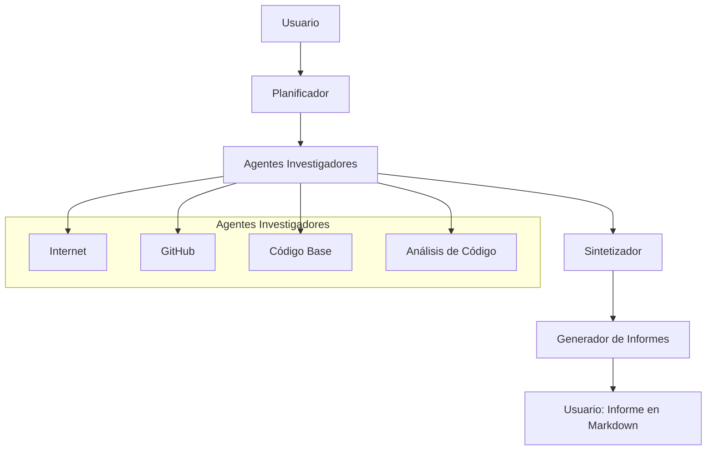

# Flujo de Trabajo del Nuevo ResearcherAgent con CrewAI

## Diagrama de Flujo

## Descripción del Flujo

1. **Usuario**: Envía una consulta o solicitud de investigación.
2. **Planificador**: Decide qué agentes investigadores son necesarios para responder a la consulta.
3. **Agentes Investigadores**: Cada agente realiza su tarea específica:
   - **Internet**: Busca información en la web.
   - **GitHub**: Investiga repositorios y código en GitHub.
   - **Código Base**: Analiza el código local.
   - **Análisis de Código**: Realiza análisis estático y métricas.
4. **Sintetizador**: Recopila los resultados de los investigadores y genera un JSON estructurado.
5. **Generador de Informes**: Convierte el JSON en un informe en Markdown para el usuario.
