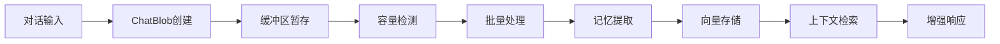

# LindormMemobase

**智能记忆管理系统** - 为LLM应用提供强大的记忆提取和用户画像管理能力

LindormMemobase是一个专为大语言模型应用设计的轻量级记忆管理库，能够从对话中自动提取结构化信息、管理用户画像，并提供高效的向量搜索能力。基于阿里云Lindorm数据库，支持海量数据的高性能存储和检索。需要在阿里云Lindorm购买并开通以下引擎
* 宽表引擎
* 搜索引擎
* 向量引擎
* LTS引擎
* AI引擎


## 核心特性

**智能记忆提取** - 自动从对话中提取用户偏好、习惯和个人信息  
**结构化画像** - 按主题和子主题组织用户信息，构建完整用户画像  
**向量语义搜索** - 基于embedding的高效相似度搜索和上下文检索  
**高性能存储** - 支持Lindorm宽表和Search引擎，处理大规模数据  
**多语言支持** - 完善的中英文处理能力和本地化提示词  
**异步处理** - 高效的异步处理管道，支持批量数据处理  
**缓冲区管理** - 智能的数据缓冲和批量处理机制，提高处理效率  
**灵活配置** - 支持多种LLM和嵌入模型，可插拔的存储后端

## 快速开始

### 安装

```bash
# 开发环境安装
pip install -e .

# 从源码安装
git clone <repository-url>
cd lindorm-memobase
pip install -e .

# from pip
pip install lindormmemobase
```

### 基本使用

```python
import asyncio
from lindormmemobase import LindormMemobase, Config
from lindormmemobase.models.blob import ChatBlob, BlobType, OpenAICompatibleMessage
from datetime import datetime

async def main():
    # 加载配置
    config = Config.load_config()
    memobase = LindormMemobase(config)
    
    # 创建对话数据
    messages = [
        OpenAICompatibleMessage(role="user", content="我最喜欢在周末弹吉他，特别是爵士乐"),
        OpenAICompatibleMessage(role="assistant", content="太棒了！爵士乐很有魅力，周末弹吉他是很好的放松方式")
    ]
    
    conversation_blob = ChatBlob(
        messages=messages,
        fields={"user_id": "user123", "session_id": "chat_001"},
        created_at=datetime.now()
    )
    
    # 提取记忆并构建用户画像
    result = await memobase.extract_memories(
        user_id="user123",
        blobs=[conversation_blob]
    )
    
    if result:
        print("记忆提取成功！")
        
        # 查看用户画像
        profiles = await memobase.get_user_profiles("user123")
        for profile in profiles:
            print(f"主题: {profile.topic}")
            for subtopic, entry in profile.subtopics.items():
                print(f"  └── {subtopic}: {entry.content}")

asyncio.run(main())
```

### 缓冲区管理示例

```python
# 添加对话数据到缓冲区
chat_blob = ChatBlob(
    messages=[OpenAICompatibleMessage(role="user", content="我喜欢喝咖啡")],
    type=BlobType.chat
)

# 添加到缓冲区
blob_id = await memobase.add_blob_to_buffer("user123", chat_blob)
print(f"已添加到缓冲区: {blob_id}")

# 检查缓冲区状态
status = await memobase.detect_buffer_full_or_not("user123", BlobType.chat)
print(f"缓冲区状态: {status}")

# 处理缓冲区中的数据
if status["is_full"]:
    result = await memobase.process_buffer("user123", BlobType.chat)
    print("缓冲区已处理完成")
```

### 上下文增强示例

```python
# 获取LLM记忆增强的对话上下文
context = await memobase.get_conversation_context(
    user_id="user123",
    conversation=current_messages,
    max_token_size=2000
)

print(f"智能上下文: {context}")
```

## 缓冲区管理

LindormMemobase 提供智能的缓冲区管理功能，能够自动收集和批量处理对话数据，提高记忆提取的效率。

### 核心概念

- **缓冲区**: 临时存储待处理的对话数据
- **批量处理**: 当缓冲区达到一定容量时自动触发处理
- **状态管理**: 跟踪每个数据块的处理状态
- **智能调度**: 根据token大小和数据量智能决定处理时机

### 缓冲区API

#### 添加数据到缓冲区

```python
# 添加聊天数据到缓冲区
blob_id = await memobase.add_blob_to_buffer(
    user_id="user123",
    blob=chat_blob,
    blob_id="optional_custom_id"  # 可选，默认生成UUID
)
```

#### 检测缓冲区状态

```python
# 检查缓冲区是否已满
status = await memobase.detect_buffer_full_or_not(
    user_id="user123",
    blob_type=BlobType.chat
)

print(f"缓冲区已满: {status['is_full']}")
print(f"待处理的数据块ID: {status['buffer_full_ids']}")
```

#### 处理缓冲区数据

```python
# 处理所有未处理的数据
result = await memobase.process_buffer(
    user_id="user123",
    blob_type=BlobType.chat,
    profile_config=None  # 可选的配置
)

# 处理特定的数据块
result = await memobase.process_buffer(
    user_id="user123",
    blob_type=BlobType.chat,
    blob_ids=["blob_id_1", "blob_id_2"]
)
```

### 自动化工作流程

```python
async def chat_with_memory(user_id: str, message: str):
    """带记忆的聊天处理流程"""
    
    # 1. 创建聊天数据
    chat_blob = ChatBlob(
        messages=[OpenAICompatibleMessage(role="user", content=message)],
        type=BlobType.chat
    )
    
    # 2. 添加到缓冲区
    await memobase.add_blob_to_buffer(user_id, chat_blob)
    
    # 3. 检查是否需要处理缓冲区
    status = await memobase.detect_buffer_full_or_not(user_id, BlobType.chat)
    
    # 4. 自动处理满载的缓冲区
    if status["is_full"]:
        result = await memobase.process_buffer(
            user_id=user_id,
            blob_type=BlobType.chat,
            blob_ids=status["buffer_full_ids"]
        )
        print(f"已处理 {len(status['buffer_full_ids'])} 个数据块")
    
    # 5. 获取增强的上下文进行回复
    context = await memobase.get_conversation_context(
        user_id=user_id,
        conversation=[OpenAICompatibleMessage(role="user", content=message)]
    )
    
    return f"基于记忆的回复: {context}"
```

### 配置缓冲区参数

在 `config.yaml` 中配置缓冲区行为：

```yaml
# 缓冲区配置
max_chat_blob_buffer_token_size: 8192  # 缓冲区最大token数
max_chat_blob_buffer_process_token_size: 16384  # 单次处理最大token数
```

## 配置设置

### 环境变量配置

1. 复制环境变量模板：
   ```bash
   cp example.env .env
   ```

2. 编辑 `.env` 文件，设置必要的API密钥：
   ```bash
   # LLM配置
   MEMOBASE_LLM_API_KEY=your-openai-api-key
   MEMOBASE_LLM_BASE_URL=https://api.openai.com/v1
   MEMOBASE_LLM_MODEL=gpt-3.5-turbo
   
   # 嵌入模型配置
   MEMOBASE_EMBEDDING_API_KEY=your-embedding-api-key
   MEMOBASE_EMBEDDING_MODEL=text-embedding-3-small
   
   # Lindorm数据库配置
   MEMOBASE_LINDORM_TABLE_HOST=your-lindorm-host
   MEMOBASE_LINDORM_TABLE_PORT=33060
   MEMOBASE_LINDORM_TABLE_USERNAME=your-username
   MEMOBASE_LINDORM_TABLE_PASSWORD=your-password
   MEMOBASE_LINDORM_TABLE_DATABASE=memobase
   
   # Lindorm Search配置
   MEMOBASE_LINDORM_SEARCH_HOST=your-search-host
   MEMOBASE_LINDORM_SEARCH_PORT=30070
   MEMOBASE_LINDORM_SEARCH_USERNAME=your-search-username
   MEMOBASE_LINDORM_SEARCH_PASSWORD=your-search-password
   ```

3. 复制并自定义配置文件：
   ```bash
   cp cookbooks/config.yaml.example cookbooks/config.yaml
   ```

### 配置文件说明

- **`.env`**: 敏感信息（API密钥、数据库凭证）
- **`config.yaml`**: 应用配置（模型参数、功能开关、处理限制）
- **优先级**: 默认值 < `config.yaml` < 环境变量

## 系统架构

### 核心组件

- **`core/extraction/`**: 记忆提取处理管道
  - `processor/`: 数据处理器（摘要、提取、合并、组织）
  - `prompts/`: 智能提示词（支持中英文）
- **`models/`**: 数据模型（Blob、Profile、Response类型）
- **`core/storage/`**: 存储后端（Lindorm宽表、Search引擎、缓冲区管理）
- **`embedding/`**: 嵌入服务（OpenAI、Jina等）
- **`llm/`**: 大语言模型接口和完成服务
- **`core/search/`**: 搜索服务（用户画像、事件、上下文检索）

### 处理流水线

```
原始对话数据 → 缓冲区暂存 → 智能调度 → 批量处理 → 记忆提取 → 结构化存储
    ↓
  ChatBlob → 缓冲区管理 → LLM分析 → 向量化存储 → 检索增强
```

### 数据流向



## 开发构建

### 开发环境搭建

```bash
# 开发模式安装
pip install -e .

# 运行测试
pytest tests/ -v

# 运行测试并生成覆盖率报告
pytest tests/ --cov=lindormmemobase --cov-report=html
```

### 生产环境构建

使用 `build` 工具（推荐）:
```bash
# 安装构建工具
pip install build

# 构建wheel和源码分发包
python -m build

# 输出文件位于 dist/ 目录
ls dist/
# lindormmemobase-0.1.0-py3-none-any.whl
# lindormmemobase-0.1.0.tar.gz
```

直接使用 `setuptools`:
```bash
# 构建wheel包
python setup.py bdist_wheel

# 构建源码分发包
python setup.py sdist
```

### 从构建包安装

```bash
# 从wheel包安装
pip install dist/lindormmemobase-0.1.0-py3-none-any.whl

# 或从源码分发包安装
pip install dist/lindormmemobase-0.1.0.tar.gz
```

### 发布到PyPI

```bash
# 安装发布工具
pip install twine

# 先上传到TestPyPI测试
twine upload --repository-url https://test.pypi.org/legacy/ dist/*

# 正式发布到PyPI
twine upload dist/*
```

## 测试

```bash
# 运行所有测试
pytest tests/ -v

# 运行特定测试文件
pytest tests/test_lindorm_storage.py -v

# 生成HTML覆盖率报告
pytest tests/ --cov=lindormmemobase --cov-report=html
```

## 系统要求

- **Python**: 3.12+
- **API服务**: OpenAI API密钥（LLM和嵌入服务）
- **数据库**: Lindorm宽表 或 MySQL
- **搜索引擎**: Lindorm Search 或 OpenSearch
