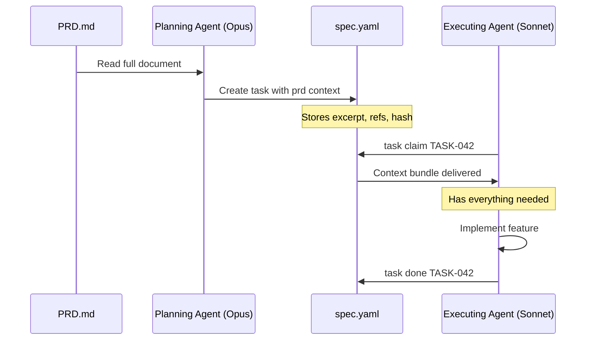

# PRD Context Delivery

Lodestar enables tasks to carry just-enough product intent from a PRD (Product Requirements Document) without requiring agents to re-read the entire document. This guide explains how PRD context works and how to use it effectively.

## The Problem

When a planning agent (like Opus) creates tasks from a PRD, it has full context about product intent, constraints, and acceptance criteria. But when an executing agent (like Sonnet) later claims that task, it may not have access to the original PRD—or may have a limited context window.

The result: executing agents lack the "why" behind their work, leading to misaligned implementations.

## The Mental Model

Think of it this way:

| Role | Contents |
|------|----------|
| **PRD** | Encyclopedia of product requirements |
| **Task** | Mission card with focused context |

Mission cards should either:

1. **Embed what you need** — frozen excerpt captured at task creation
2. **Point to exactly where to fetch it** — stable section anchors with live extraction

Lodestar supports both approaches.

## How It Works

### Task Creation: Capture Context

When creating a task, the planning agent can attach PRD context:

```bash
lodestar task create \
    --id "TASK-042" \
    --title "Implement lease expiry" \
    --description "Add automatic lease expiration handling." \
    --prd-source PRD.md \
    --prd-ref "#lease-semantics" \
    --prd-ref "#task-claiming" \
    --prd-excerpt "Leases auto-expire without manual intervention. Commands that read active claims filter out expired leases automatically."
```

This stores:

- **`prd.source`** — Path to the PRD file (e.g., `PRD.md`)
- **`prd.refs`** — Section anchors and optional line ranges
- **`prd.excerpt`** — Frozen snapshot of key paragraphs
- **`prd.prd_hash`** — SHA256 hash for drift detection (auto-computed)

### Task Claim: Context Bundle Delivery

When an agent claims a task, context is delivered automatically:

```bash
$ lodestar task claim TASK-042 --agent A1234ABCD
Claimed task TASK-042
  Lease: L5678EFGH
  Expires in: 15m

Task Context:
  Implement lease expiry
  Add automatic lease expiration handling.
  PRD: PRD.md

Remember to:
  - Renew with lodestar task renew TASK-042 before expiry
  - Mark done with lodestar task done TASK-042 when complete
```

The `--json` output includes the full context bundle:

```json
{
  "data": {
    "lease_id": "L5678EFGH",
    "task_id": "TASK-042",
    "context": {
      "title": "Implement lease expiry",
      "description": "Add automatic lease expiration handling.",
      "prd_source": "PRD.md",
      "prd_excerpt": "Leases auto-expire without manual intervention..."
    }
  }
}
```

Use `--no-context` to skip the context bundle (useful for scripts).

### On-Demand Context: `task context`

For deeper context, use the dedicated command:

```bash
$ lodestar task context TASK-042
Context for TASK-042

PRD Source: PRD.md
References: #lease-semantics, #task-claiming

Content:
  Implement lease expiry
  Add automatic lease expiration handling.

  Leases auto-expire without manual intervention. Commands that read
  active claims filter out expired leases automatically.
```

This command:

- Respects a character budget (`--max-chars`) for context window management
- Extracts live PRD sections if the PRD file exists
- Warns if the PRD has drifted since task creation

## The PRD Context Fields

Tasks can include a `prd` field with these properties:

| Field | Type | Description |
|-------|------|-------------|
| `source` | string | Path to PRD file (e.g., `PRD.md`) |
| `refs` | list | Section references with anchors and optional line ranges |
| `excerpt` | string | Frozen snapshot captured at task creation |
| `prd_hash` | string | SHA256 hash of PRD content for drift detection |

### PrdRef Structure

Each reference in `refs` contains:

| Field | Type | Description |
|-------|------|-------------|
| `anchor` | string | Section anchor (e.g., `#task-claiming`) |
| `lines` | list | Optional `[start, end]` line range |

### Example in spec.yaml

```yaml
tasks:
  TASK-042:
    id: TASK-042
    title: "Implement lease expiry"
    description: "Add automatic lease expiration handling."
    status: ready
    priority: 1
    prd:
      source: PRD.md
      refs:
        - anchor: "#lease-semantics"
          lines: [280, 335]
        - anchor: "#task-claiming"
      excerpt: |
        Leases auto-expire without manual intervention. Commands that
        read active claims filter out expired leases automatically.
      prd_hash: "sha256:abc123..."
```

## Drift Detection

PRDs evolve. Lodestar detects when the PRD has changed since task creation:

```bash
$ lodestar task context TASK-042
⚠ PRD has changed since task creation. Review PRD.md for updates.

Context for TASK-042
...
```

This happens when:

1. The task was created with a `prd_hash`
2. The current PRD file content produces a different hash

When drift is detected:

- The frozen `excerpt` remains stable (what was known at creation time)
- The `task context` command can still extract live sections
- Agents are warned to review the source for updates

## Workflow: Planning → Executing Agent

The PRD context feature enables clean handoffs between planning and executing agents:



### Best Practices

1. **Planning agents should include excerpts**: Copy the key paragraphs that executing agents need
2. **Keep excerpts focused**: 150-300 tokens is usually sufficient
3. **Include multiple refs**: Point to related sections for comprehensive context
4. **Use clear anchors**: Markdown headers make natural section anchors

## Progressive Context Levels

Lodestar supports progressive disclosure of context:

| Level | What | When |
|-------|------|------|
| 0 | Task title + description | Always shown |
| 1 | Frozen excerpt | On claim (default) |
| 2 | PRD section extraction | On `task context` |
| 3 | Full PRD | Manual read (rare) |

Most tasks are completable with Level 1. Complex or ambiguous tasks may need Level 2+.

## Summary

PRD context delivery solves the "lost context" problem in multi-agent workflows:

- **Task creation** captures intent from the planning agent
- **Task claim** delivers that intent to executing agents
- **Drift detection** warns when the source has evolved
- **On-demand extraction** provides deeper context when needed

This aligns with Lodestar's two-plane model: PRD context is part of the spec plane (committed), ensuring all agents see the same intent.
