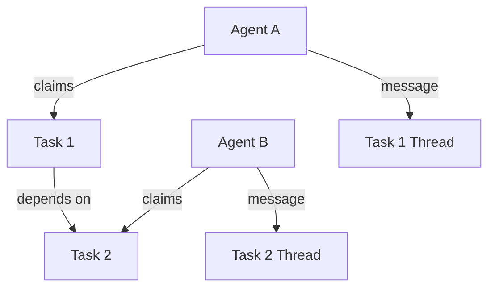
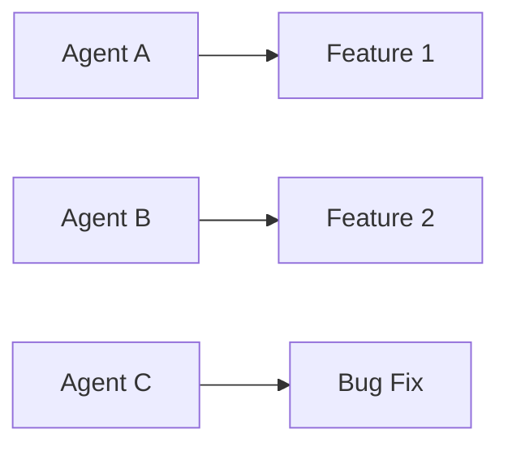
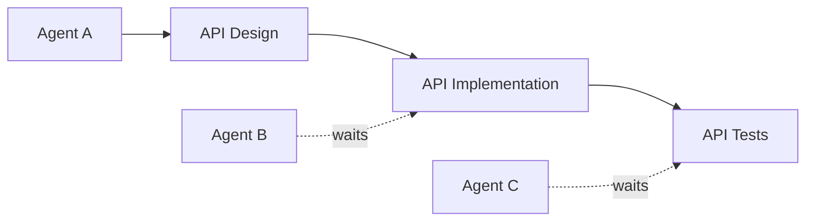
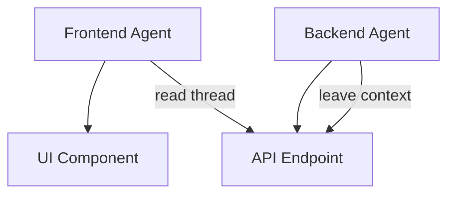

# Agent Coordination Guide

This guide covers how multiple agents coordinate work on shared repositories using Lodestar. Whether you're running parallel agents, handing off work between sessions, or collaborating on dependent tasks, these patterns help prevent conflicts and ensure smooth cooperation.

## Coordination Overview



!!! info "Task-Based Messaging"
    Lodestar uses **task threads** for all communication. There is no direct agent-to-agent messaging. All messages are sent to task threads and visible to any agent working on that task. This encourages context sharing and prevents scattered conversations.

## Parallel Work Patterns

### Pattern 1: Independent Parallel Work

Multiple agents work on unrelated tasks simultaneously. This is the simplest pattern.



**Workflow:**

```bash
# Agent A
$ lodestar task claim F001 --agent A1234ABCD
Claimed task F001

# Agent B (simultaneously)
$ lodestar task claim F002 --agent A5678EFGH
Claimed task F002

# Agent C (simultaneously)
$ lodestar task claim B001 --agent A9999WXYZ
Claimed task B001
```

No coordination needed - each agent works independently.

### Pattern 2: Dependent Task Chain

Tasks have dependencies that must complete in order. Agents coordinate via task status.



**Workflow:**

```bash
# Agent A works on API design
$ lodestar task claim D001 --agent A1234ABCD
$ lodestar task done D001
$ lodestar task verify D001
Verified D001
Unblocked tasks: F001

# Agent B sees F001 is now claimable
$ lodestar task next
Next Claimable Tasks (1 available)
  F001 P1  Implement API endpoints

$ lodestar task claim F001 --agent A5678EFGH
```

### Pattern 3: Collaborative Implementation

Multiple agents work on related parts of a feature, communicating through task threads.



**Workflow:**

```bash
# Backend agent starts API work
$ lodestar task claim API-001 --agent A1234ABCD

# Backend agent documents the API in the task thread
$ lodestar msg send \
    --task API-001 \
    --from A1234ABCD \
    --text "API contract for GET /users:
Response: {users: [{id, name, email}], total: int, page: int}
See src/api/users.py for implementation."

$ lodestar task done API-001

# Frontend agent reads the API task thread before starting UI work
$ lodestar msg thread API-001
Thread for API-001 (1 message)
  A1234ABCD  5m ago
  API contract for GET /users...

$ lodestar task claim UI-001 --agent A5678EFGH
```

## Message Templates

### Requesting Clarification

```bash
lodestar msg send \
    --task F002 \
    --from YOUR_AGENT_ID \
    --text "Need clarification on design:
- Should password reset tokens expire?
- What's the email template format?
- Should we rate limit reset requests?"
```

### Confirming Requirements

```bash
lodestar msg send \
    --task F002 \
    --from YOUR_AGENT_ID \
    --text "Requirements confirmed:
- Token expiry: 24 hours
- Email template: HTML with plain text fallback
- Rate limit: 3 requests per hour per email
Proceeding with implementation."
```

### Announcing Completion

```bash
lodestar msg send \
    --task F002 \
    --from YOUR_AGENT_ID \
    --subject "Implementation complete" \
    --text "Implementation complete:
- Added PasswordResetToken model
- Created /auth/reset endpoint
- Integrated email service
- Added rate limiting middleware
Ready for review."
```

### Documenting for Review

```bash
lodestar msg send \
    --task F002 \
    --from YOUR_AGENT_ID \
    --subject "Ready for review" \
    --text "F002 implementation complete. Changes in:
- src/auth/reset.py (new)
- src/api/auth.py (modified)
- tests/test_reset.py (new)
Branch: feature/password-reset
All tests passing."
```

### Handoff When Blocked

```bash
# Release the task
$ lodestar task release F002

# Leave detailed context
lodestar msg send \
    --task F002 \
    --from YOUR_AGENT_ID \
    --text "Blocked: Need SMTP credentials for email service.
Progress:
- Token generation: DONE
- Reset endpoint: DONE
- Email sending: BLOCKED
Files: src/auth/reset.py (80% complete)
Next steps: Add SMTP config to .env, complete send_reset_email()"
```

### Asking for Help

```bash
lodestar msg send \
    --task F002 \
    --from YOUR_AGENT_ID \
    --subject "Need security review" \
    --severity warning \
    --text "Need security review on token generation.
Using secrets.token_urlsafe(32) - is this sufficient?
See src/auth/reset.py:45"
```

## Multi-Agent Scenario Examples

### Scenario 1: Feature Development Pipeline

A complete feature flows through multiple specialized agents.

**Agents involved:**

- Design Agent (role: design)
- Backend Agent (role: backend)
- Frontend Agent (role: frontend)
- Test Agent (role: testing)

**Task flow:**

```bash
# 1. Design Agent creates the spec
$ lodestar task claim D001 --agent DESIGN_AGENT
# ... creates API specification ...
$ lodestar msg send \
    --task D001 \
    --from DESIGN_AGENT \
    --text "API spec complete. Endpoints:
POST /auth/reset - initiate reset
GET /auth/reset/:token - validate token
POST /auth/reset/:token - set new password
OpenAPI spec in docs/api/reset.yaml"
$ lodestar task done D001
$ lodestar task verify D001

# 2. Backend Agent implements API
$ lodestar task next
Next Claimable Tasks (1 available)
  F001 P1  Implement password reset API
$ lodestar task claim F001 --agent BACKEND_AGENT
# ... implements endpoints ...
$ lodestar msg send \
    --task F001 \
    --from BACKEND_AGENT \
    --text "API implementation complete. Tests passing.
Ready for frontend integration."
$ lodestar task done F001
$ lodestar task verify F001

# 3. Frontend Agent builds UI
$ lodestar task next
Next Claimable Tasks (1 available)
  F002 P1  Build password reset UI
$ lodestar task claim F002 --agent FRONTEND_AGENT
# ... before starting, check API details ...
$ lodestar msg thread F001
Thread for F001 (2 messages)
  DESIGN_AGENT  1h ago
  API spec complete...
  BACKEND_AGENT  30m ago
  API implementation complete...

# 4. Test Agent runs E2E tests
$ lodestar task next
Next Claimable Tasks (1 available)
  T001 P2  E2E tests for password reset
$ lodestar task claim T001 --agent TEST_AGENT
```

### Scenario 2: Parallel Feature Sprint

Three agents work on three features simultaneously, then a fourth agent reviews all.

```bash
# Three agents claim different features
$ lodestar task claim F010 --agent AGENT_A  # User profiles
$ lodestar task claim F011 --agent AGENT_B  # Notifications
$ lodestar task claim F012 --agent AGENT_C  # Settings page

# Each agent works independently
# ...

# When done, each announces in their task thread
$ lodestar msg send --task F010 --from AGENT_A \
    --text "User profiles complete. Branch: feature/profiles"
$ lodestar msg send --task F011 --from AGENT_B \
    --text "Notifications complete. Branch: feature/notifications"
$ lodestar msg send --task F012 --from AGENT_C \
    --text "Settings complete. Branch: feature/settings"

# Mark tasks done
$ lodestar task done F010
$ lodestar task done F011
$ lodestar task done F012

# Review agent picks up the review task (depends on F010, F011, F012)
$ lodestar task next
Next Claimable Tasks (1 available)
  R001 P1  Review sprint features

$ lodestar task claim R001 --agent REVIEW_AGENT

# Review agent checks all task threads for context
$ lodestar msg thread F010
$ lodestar msg thread F011
$ lodestar msg thread F012
```

### Scenario 3: Bug Fix With Coordination

A bug requires both backend and frontend changes. Two agents coordinate the fix.

```bash
# Backend agent finds the root cause
$ lodestar task claim BUG-042 --agent BACKEND_AGENT
$ lodestar msg send \
    --task BUG-042 \
    --from BACKEND_AGENT \
    --subject "Root cause identified" \
    --text "Root cause found: API returns wrong status code on validation error.
Returns 500 instead of 400.
Fix: src/api/users.py:validate_user()
Frontend may need to handle 400 status."

# Backend agent documents the needed frontend work
$ lodestar msg send \
    --task BUG-042 \
    --from BACKEND_AGENT \
    --severity warning \
    --text "API will now return 400 on validation errors.
Frontend needs to update error handler to show user-friendly message for 400s.
Currently it only handles 500."

# Backend agent completes their part
$ lodestar msg send \
    --task BUG-042 \
    --from BACKEND_AGENT \
    --text "API fix merged and deployed to staging.
Ready for frontend changes."

# Both changes complete, bug is fixed
$ lodestar task done BUG-042
$ lodestar task verify BUG-042
```

## Best Practices

### Communication

| Do | Don't |
|----|-------|
| Leave detailed context in task threads | Assume others know what you did |
| Use structured messages with clear sections | Write vague one-liners |
| Announce blockers immediately | Wait until lease expires |
| Use subject and severity for important messages | Write undifferentiated messages |
| Check task threads before starting work | Start without reading context |

### Task Management

| Do | Don't |
|----|-------|
| Claim before starting work | Work on unclaimed tasks |
| Renew leases proactively | Let leases expire silently |
| Release and message when blocked | Abandon tasks without context |
| Verify immediately after testing | Batch verifications |
| Check dependencies before claiming | Claim blocked tasks |

### Message Etiquette

1. **Be specific**: Include file paths, line numbers, and concrete details
2. **Be actionable**: Clearly state what you need from the recipient
3. **Be timely**: Send messages before leaving or getting blocked
4. **Be contextual**: Reference task IDs and previous messages

### Handling Conflicts

If two agents accidentally work on the same area:

1. Check who has the active claim (`lodestar task show <id>`)
2. The unclaimed agent should stop and coordinate
3. Use messages to divide the work or hand off
4. Consider splitting into separate tasks if scope is large

## Quick Reference

### Coordination Commands

```bash
# Send message to task thread
lodestar msg send --task ID --from YOUR_ID --text "..."

# Read task thread
lodestar msg thread TASK_ID

# Mark task messages as read
lodestar msg mark-read --task TASK_ID --agent YOUR_ID

# Search messages
lodestar msg search --keyword "blocked"
```

### Task Coordination

```bash
# See what's available
lodestar task next

# Check task dependencies
lodestar task show TASK_ID

# Get brief for handoff
lodestar agent brief --task TASK_ID --format claude
```
