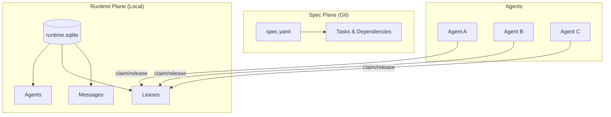
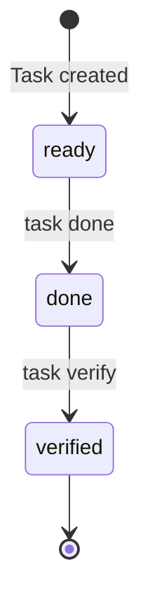
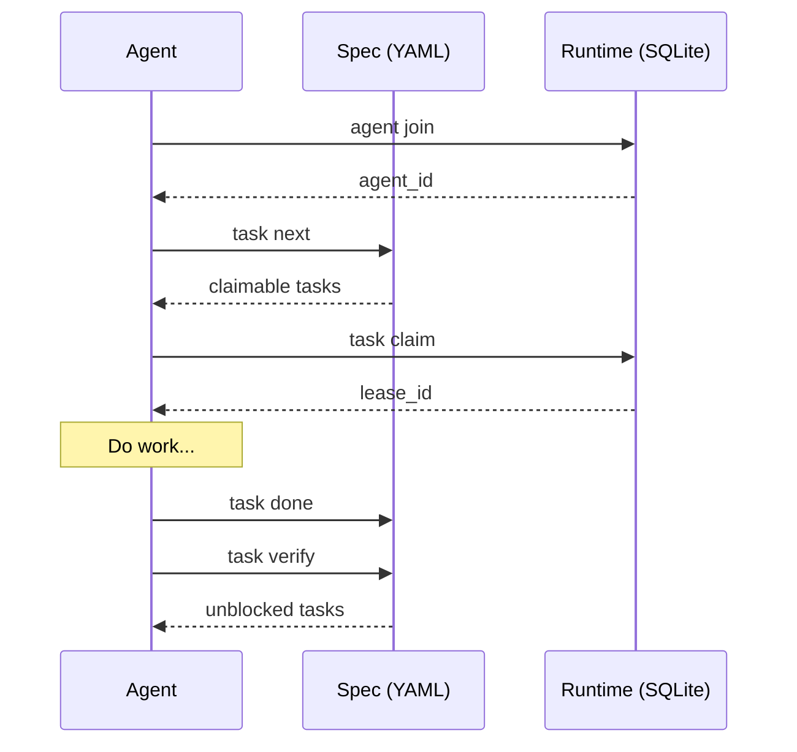

# Concepts

Understanding Lodestar's core concepts will help you work effectively with the tool.

## Architecture Overview

Lodestar is built around a simple but powerful architecture:



## Core Architecture

Lodestar uses a **two-plane state model** to separate what needs to be done (spec) from who is doing it (runtime):

| Plane | Purpose | Location | Git Status |
|-------|---------|----------|------------|
| **Spec** | Tasks, dependencies, acceptance criteria | `.lodestar/spec.yaml` | Committed |
| **Runtime** | Agents, leases, heartbeats, messages | `.lodestar/runtime.sqlite` | Gitignored |

## Key Concepts

### [Two-Plane Model](two-plane-model.md)

How Lodestar separates task definitions from execution state. This separation enables:

- Clean git history focused on what changed, not who was working
- Easy resets by deleting runtime.sqlite
- Multi-machine coordination with shared spec

### [Task Lifecycle](task-lifecycle.md)

The states a task moves through from creation to verification:



### [Lease Mechanics](lease-mechanics.md)

How task claiming works with time-limited leases:

- Atomic claiming prevents race conditions
- TTL-based expiry without daemons
- Renew/release patterns for coordination

### [PRD Context Delivery](prd-context.md)

How tasks carry product intent from PRDs:

- PRD = encyclopedia, task = mission card
- Frozen excerpts for stable context
- Drift detection when PRDs change
- Automatic context bundle on claim

## Design Principles

### 1. No Daemon Required

Lease expiry is checked at read time, not by a background process. This means:

- Zero infrastructure overhead
- Works on any machine with the repository
- Survives restarts and disconnections

### 2. Git-Native

The spec plane is version controlled. Benefits:

- Task changes are auditable
- Rollback is just `git revert`
- Branches can have different task sets

### 3. Agent-Agnostic

Works the same for human developers and AI agents:

- Same CLI for all agent types
- No special privileges or modes
- Coordination through shared state

### 4. Progressive Discovery

Commands suggest next actions based on context:

```bash
$ lodestar status
...
Next Actions
  lodestar task next - Get next claimable task (5 available)
  lodestar task list - See all tasks
```

## Data Flow



## Further Reading

- [Two-Plane Model](two-plane-model.md) - Deep dive into state separation
- [Task Lifecycle](task-lifecycle.md) - Understanding task states
- [Lease Mechanics](lease-mechanics.md) - How claiming works
