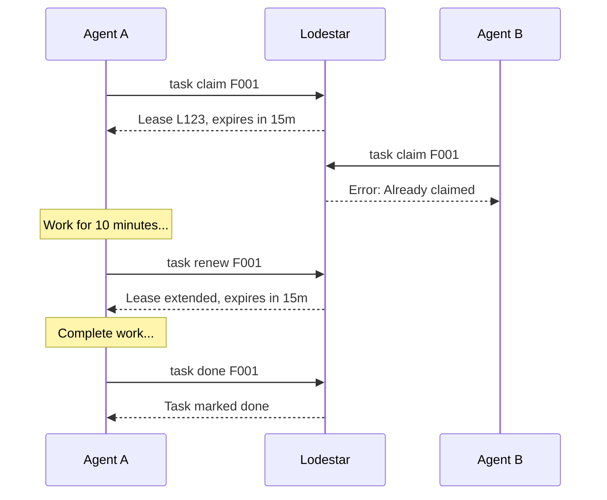
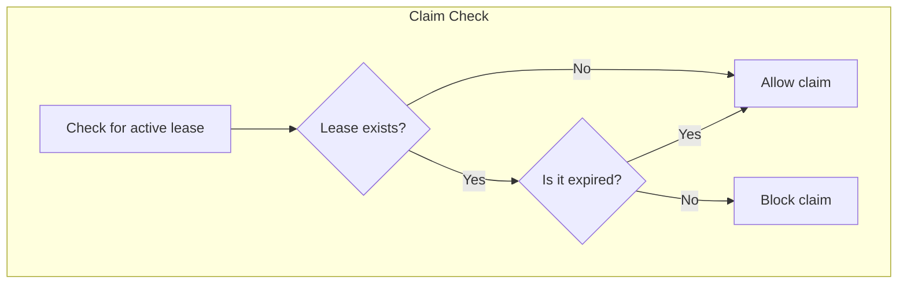
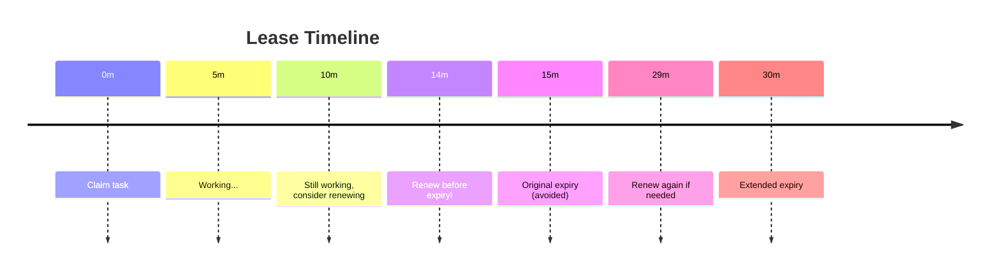
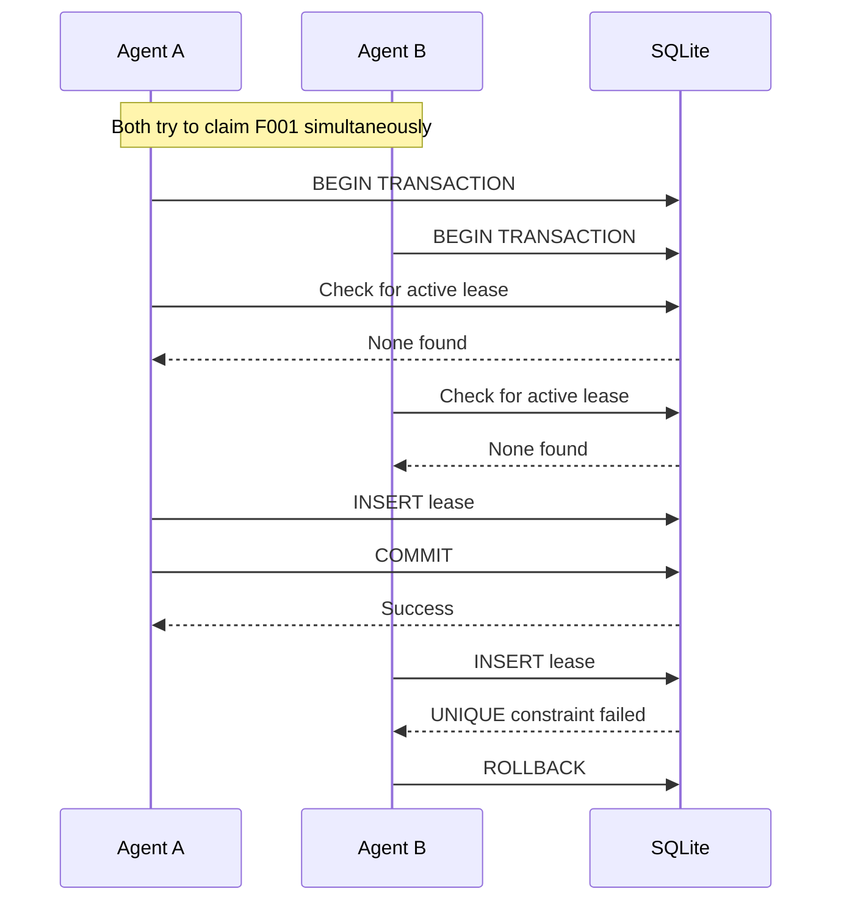
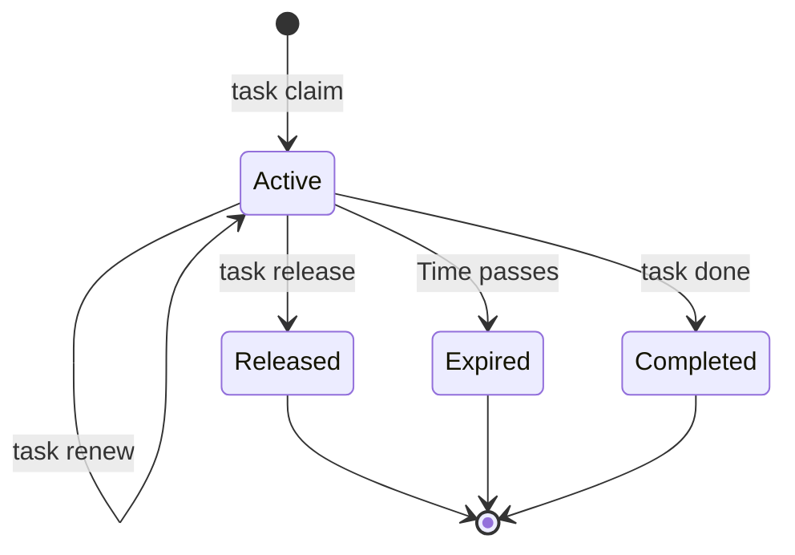

# Lease Mechanics

Leases are time-limited claims that prevent multiple agents from working on the same task.

## Overview



## How Leases Work

When you claim a task, you get a **lease** with:

| Property | Description |
|----------|-------------|
| Lease ID | Unique identifier (e.g., `L1234ABCD`) |
| Task ID | The claimed task |
| Agent ID | Your agent identity |
| Expires At | When the lease becomes invalid |

```bash
$ lodestar task claim F001 --agent A1234ABCD
Claimed task F001
  Lease: L5678EFGH
  Expires in: 15m

Remember to:
  - Renew with lodestar task renew F001 before expiry
  - Mark done with lodestar task done F001 when complete
```

## Lease Expiry

Leases are checked **at read time**, not by a background daemon:



### Benefits of Read-Time Expiry

1. **No background process needed**
2. **Stateless between CLI invocations**
3. **Works on any machine**
4. **Survives restarts and disconnections**

### How It Works

1. When listing claimable tasks, expired leases are filtered out
2. When attempting to claim, existing expired leases don't block
3. When renewing, only non-expired leases can be extended

## Renewing Leases

If your work takes longer than expected:

```bash
$ lodestar task renew F001
Renewed lease for F001
  Expires in: 15m
```

### When to Renew



## Releasing Leases

If you need to stop working without completing:

```bash
$ lodestar task release F001
Released task F001
```

### When to Release

- You're blocked and can't continue
- You need to switch to a higher-priority task
- You realize the task needs different expertise
- Your context window is ending (AI agents)

After releasing, leave a message for the next agent:

```bash
$ lodestar msg send --task F001 --from A1234ABCD \
    --text "Released: blocked on API credentials"
```

## Atomicity

Lease operations are atomic using SQLite transactions:



Only one agent can successfully claim a task, even with concurrent attempts.

## Configuration

### Default TTL

The default lease duration is 15 minutes. Override per-claim:

```bash
# Short task
$ lodestar task claim F001 --agent A1234ABCD --ttl 5m

# Long task
$ lodestar task claim F001 --agent A1234ABCD --ttl 1h
```

### Environment Variable

Set a default TTL for all claims:

```bash
export LODESTAR_LEASE_TTL=30m
```

### Recommended TTLs

| Task Type | Recommended TTL |
|-----------|-----------------|
| Quick fix | 5-10m |
| Standard task | 15-30m |
| Complex feature | 1h |
| Large refactor | 2h |

## Lease States



## Best Practices

### Do

- Claim before starting work
- Renew proactively (don't wait for expiry)
- Release if you can't complete
- Leave context messages when releasing

### Don't

- Claim tasks you won't work on immediately
- Let leases expire silently
- Assume a lease is still valid without checking
- Work on unclaimed tasks

## Monitoring Leases

Check your active leases:

```bash
$ lodestar status
...
Runtime
  Agents registered: 3
  Active claims: 2
```

See who has which task:

```bash
$ lodestar task show F001
F001 - Implement authentication

Status: ready
Claimed by: A1234ABCD
Lease expires: 10m remaining
```
