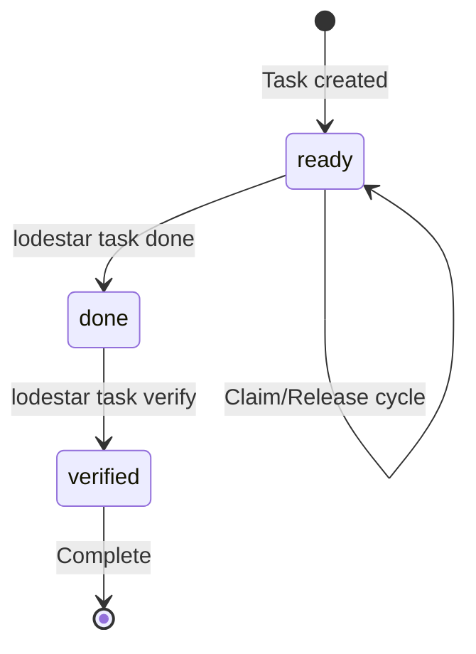
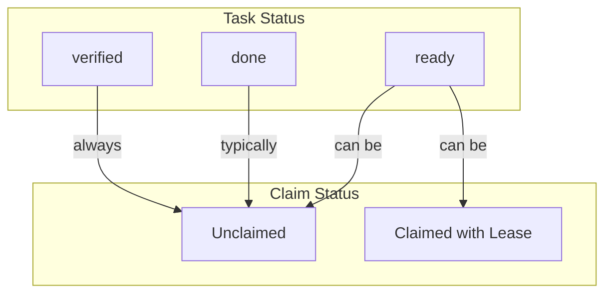
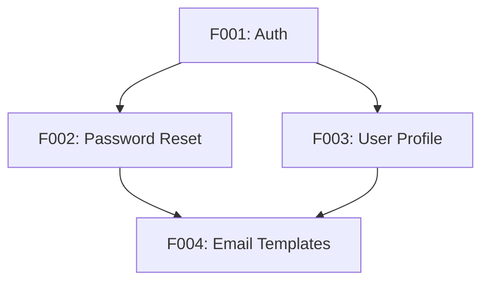
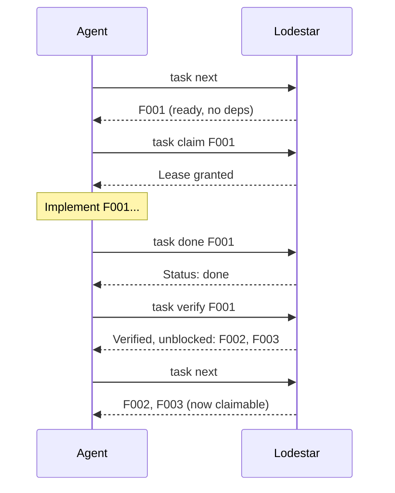

# Task Lifecycle

Tasks in Lodestar move through a defined lifecycle from creation to verification.

## Task States



### ready

Initial state when a task is created or added to spec.

A task in `ready` status is **claimable** if:

- All tasks in `depends_on` are in `verified` status
- No active (non-expired) lease exists

```bash
$ lodestar task show F002
F002 - Add password reset

Status: ready
...
Claimable - run lodestar task claim F002 to claim
```

### done

Work is complete. The agent has finished the implementation but it hasn't been verified yet.

```bash
$ lodestar task done F002
Marked F002 as done
Run lodestar task verify F002 after review
```

### verified

The task has been tested and confirmed working. Dependent tasks can now be claimed.

```bash
$ lodestar task verify F002
Verified F002
Unblocked tasks: F005, F006
```

## State Transitions

| From | To | Command | Effect |
|------|-----|---------|--------|
| ready | done | `task done` | Marks implementation complete |
| done | verified | `task verify` | Confirms task meets criteria, unblocks dependents |

## Claiming vs Status

Claiming (leases) and status are **orthogonal** concepts:



A task can be:

| Status | Claim State | Meaning |
|--------|-------------|---------|
| `ready` | unclaimed | Available to work on |
| `ready` | claimed | Someone is working on it |
| `done` | unclaimed | Waiting for verification |
| `done` | claimed | Being verified |
| `verified` | unclaimed | Complete (no need to claim) |

## Dependency Resolution

Tasks form a Directed Acyclic Graph (DAG):



### Scheduling Rules

A task is **claimable** when:

1. Status is `ready`
2. All dependencies are `verified`
3. No active lease exists

```bash
$ lodestar task next
Next Claimable Tasks (2 available)

  F001 P1  Implement authentication  # No deps, claimable
  F005 P2  Add logging              # No deps, claimable

# F002, F003 not shown - waiting on F001
```

### Unblocking

When you verify a task, its dependents may become claimable:

```bash
$ lodestar task verify F001
Verified F001
Unblocked tasks: F002, F003
```

## Example Workflow



## Edge Cases

### Blocked Tasks

If dependencies aren't verified, the task won't appear in `task next`:

```bash
$ lodestar task show F002
F002 - Add password reset

Status: ready
Depends on: F001 (ready)  # Not verified yet!

Blocked - waiting on: F001
```

### Cycle Detection

Lodestar validates the DAG on every spec change:

```bash
$ lodestar doctor
Health Check
  ✗ dependencies: Cycle detected: F001 -> F002 -> F003 -> F001
```

Cycles must be resolved before tasks can be claimed.

### Re-verification

You can verify a task multiple times (idempotent):

```bash
$ lodestar task verify F001
Already verified: F001
```
