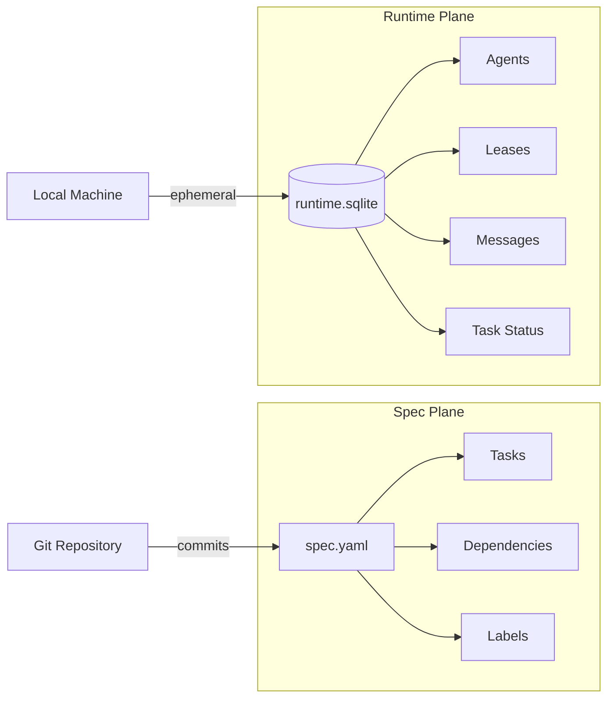
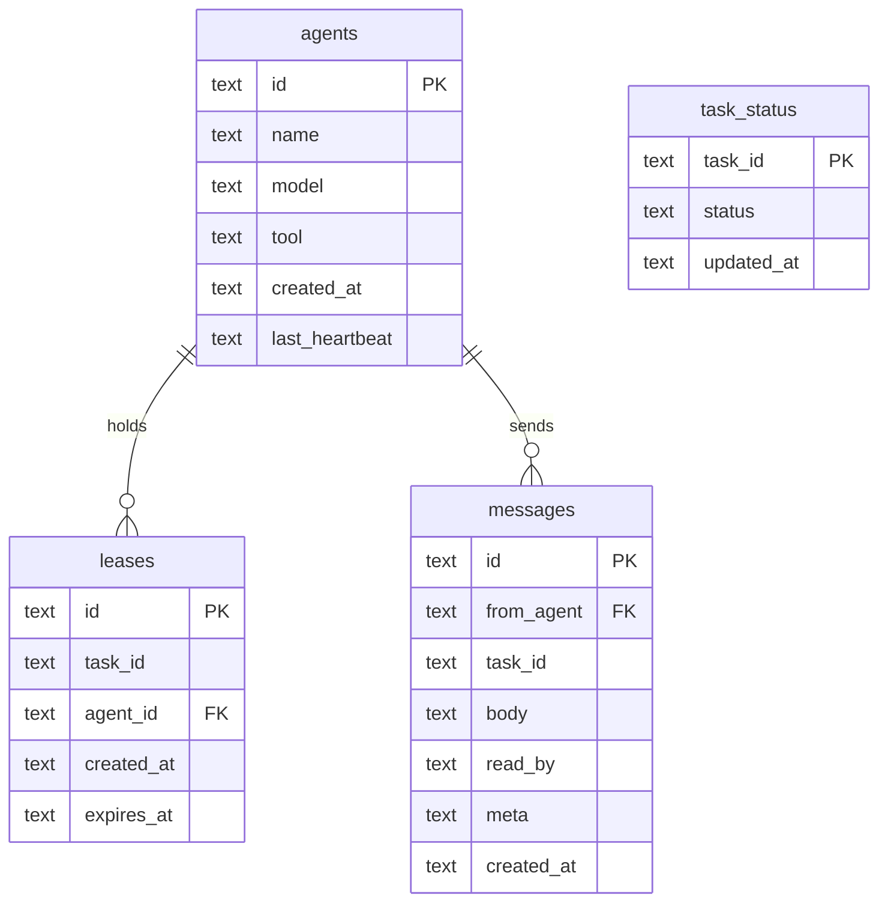
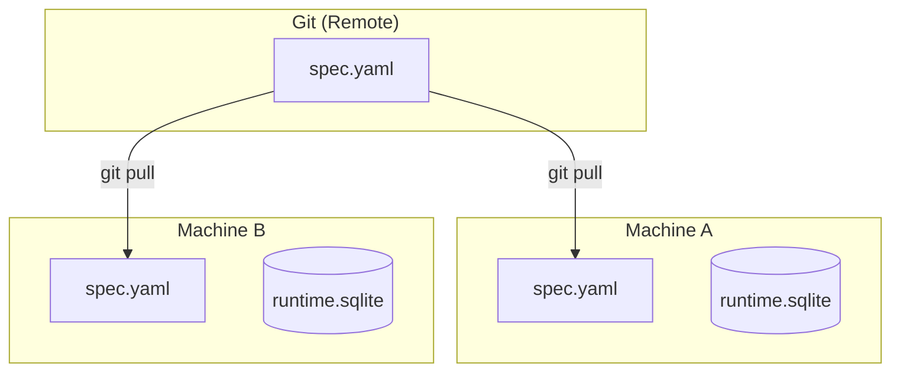

# Two-Plane Model

Lodestar separates state into two distinct planes, each with different characteristics and purposes.

## Overview



## Spec Plane

The spec plane contains the **definition of work**:

- Task definitions with titles, descriptions, and labels
- Dependencies between tasks (DAG structure)
- Priority assignments
- Acceptance criteria

**Location**: `.lodestar/spec.yaml`
**Git Status**: Committed and version controlled

### Spec Schema

```yaml
name: my-project
tasks:
  - id: F001
    title: Implement user authentication
    description: Add OAuth2 login flow
    priority: 1
    labels: [feature, security]
    depends_on: []

  - id: F002
    title: Add password reset
    description: Email-based password reset flow
    priority: 2
    labels: [feature]
    depends_on: [F001]
```

### What Goes in Spec

| Include | Exclude |
|---------|---------|
| Task definitions | Who is working on what |
| Dependencies | Current lease holders |
| Priority ordering | Heartbeat timestamps |
| Labels and categories | Messages between agents |
| Acceptance criteria | Temporary status |

## Runtime Plane

The runtime plane contains the **execution state**:

- Registered agents and their heartbeats
- Active leases (task claims)
- Task status (ready, done, verified)
- Inter-agent messages

**Location**: `.lodestar/runtime.sqlite`
**Git Status**: Gitignored

### Runtime Schema



### Why SQLite?

- **Atomic transactions**: Lease claims are race-condition free
- **WAL mode**: Concurrent read access
- **No external dependencies**: Just a file
- **Fast queries**: Indexes on common lookups
- **Portable**: Works everywhere Python runs

## Benefits of Separation

### 1. Clean History

Git history shows what changed, not who was working on what:

```bash
$ git log --oneline
a1b2c3d Add password reset task (F002)
e4f5g6h Define authentication requirements (F001)
```

No noise from lease claims, heartbeats, or messages.

### 2. Easy Resets

Reset all execution state without touching tasks:

```bash
rm .lodestar/runtime.sqlite
```

Useful for:
- Starting fresh after a failed run
- Testing with clean state
- Resetting after context switches

### 3. Reproducibility

Same spec produces the same task graph:

```bash
$ lodestar task graph --format dot
# Identical output on any machine
```

### 4. Multi-Machine Support



Each machine has its own runtime database, but they all see the same tasks.

## Syncing State

### Task Status

Task status lives in runtime but is derived from spec + actions:

1. New task in spec → status: `ready`
2. `task done` → status: `done`
3. `task verify` → status: `verified`

### Conflict Resolution

Since runtime is local, there are no merge conflicts. The spec is the source of truth for task definitions.

## Best Practices

### Do

- Commit spec changes frequently
- Delete runtime.sqlite when starting fresh
- Use `lodestar doctor` to verify consistency

### Don't

- Manually edit runtime.sqlite
- Commit runtime.sqlite to git
- Assume runtime state persists across machines
