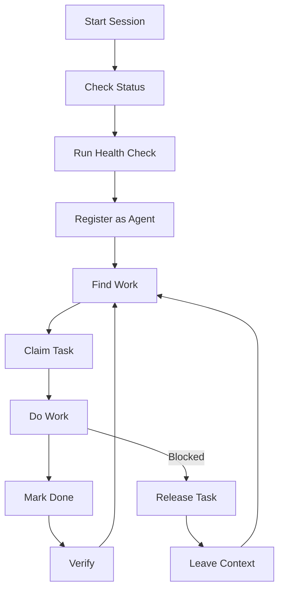

# Agent Workflow Guide

This guide covers how to work effectively as an agent with Lodestar, whether you're a human developer or an AI agent.

## Workflow Overview



## Starting a Session

### 1. Check Repository Status

```bash
$ lodestar status
┌─────────────────────────────────────────────────────────────────────────────┐
│ my-project                                                                  │
└─────────────────────────────── Branch: main ────────────────────────────────┘

Tasks
 Status    Count
 ready         5
 done          2
 verified     10

Runtime
  Agents registered: 2
  Active claims: 1

Next Actions
  lodestar task next - Get next claimable task (5 available)
```

This gives you:

- Current branch
- Task counts by status
- Number of active agents
- Suggested next actions

### 2. Run Health Checks

```bash
$ lodestar doctor
Health Check

  ✓ repository: Repository found
  ✓ spec.yaml: Valid spec with 17 tasks
  ✓ dependencies: No cycles or missing dependencies
  ✓ runtime.sqlite: Database is healthy
  ✓ .gitignore: Runtime files are gitignored

All checks passed!
```

Fix any issues before proceeding.

### 3. Register as an Agent

```bash
$ lodestar agent join --name "Dev Session" --model claude-3.5-sonnet
Registered as agent A1234ABCD

Next steps:
  lodestar task next - Get next task
  lodestar task list - See all tasks
```

!!! tip "Save your agent ID"
    Store your agent ID for use in subsequent commands. For AI agents, include it in your system prompt or context.

### 4. Find Available Work

```bash
$ lodestar task next
Next Claimable Tasks (3 available)

  F002 P1  Add password reset
  F005 P2  Implement search
  D001 P2  Write documentation

Run lodestar task claim F002 to claim
```

Claimable tasks are:

- In `ready` status
- Have all dependencies verified
- Not currently claimed

## Working on a Task

### Claim Before Starting

**Always claim a task before beginning work:**

```bash
$ lodestar task claim F002 --agent A1234ABCD
Claimed task F002
  Lease: L5678EFGH
  Expires in: 15m

Remember to:
  - Renew with lodestar task renew F002 before expiry
  - Mark done with lodestar task done F002 when complete
```

This prevents duplicate work and signals to others what you're working on.

### Review Task Details

```bash
$ lodestar task show F002
F002 - Add password reset

Status: ready
Priority: 1
Labels: feature, security
Depends on: F001 (verified)

Description:
  Implement email-based password reset flow with secure token generation.

Claimed by: A1234ABCD
Lease expires: 14m remaining
```

### Check Thread for Context

```bash
$ lodestar msg thread F002
Thread for F002 (2 messages)

  A9999WXYZ  2h ago
  Started work but got blocked on email service credentials

  A9999WXYZ  2h ago
  Released: need API keys from DevOps
```

## Understanding Task Context

Tasks can carry PRD context—frozen excerpts and section references from the product requirements document. This ensures you receive the "why" behind your work without re-reading the full PRD.

### Context on Claim

When you claim a task, context is delivered automatically:

```bash
$ lodestar task claim F002 --agent A1234ABCD
Claimed task F002
  Lease: L5678EFGH
  Expires in: 15m

Task Context:
  Add password reset
  Email-based password reset flow with secure token generation.
  PRD: PRD.md

Remember to:
  - Renew with lodestar task renew F002 before expiry
  - Mark done with lodestar task done F002 when complete
```

Use `--no-context` if you don't need the context bundle (e.g., for scripts).

### Getting Deeper Context

For the full context including live PRD sections:

```bash
$ lodestar task context F002
Context for F002

PRD Source: PRD.md
References: #password-reset, #security-requirements

Content:
  Add password reset
  Email-based password reset flow with secure token generation.

  Reset tokens must expire after 15 minutes and be single-use.
  ...
```

### Check for Drift Warnings

If the PRD has changed since the task was created, you'll see a warning:

```bash
$ lodestar task claim F002 --agent A1234ABCD
Claimed task F002
  ...

⚠ PRD has changed since task creation. Review PRD.md for updates.
```

**Best practice**: Always check for drift warnings and review the PRD if intent may have changed.

### Monitor Your Lease

Leases expire after 15 minutes by default. Renew before expiry:

```bash
$ lodestar task renew F002
Renewed lease for F002
  Expires in: 15m
```

### When You Get Blocked

If you can't complete the task:

```bash
# Release the task
$ lodestar task release F002
Released task F002

# Leave context for the next agent
$ lodestar msg send \
    --task F002 \
    --from A1234ABCD \
    --text "60% done. Token generation works. Blocked on email template approval."
```

## Completing a Task

### 1. Finish Implementation

Before marking done:

- Ensure all tests pass
- Commit your changes
- Update documentation if needed

### 2. Mark as Done

```bash
$ lodestar task done F002
Marked F002 as done
Run lodestar task verify F002 after review
```

### 3. Verify

Verification confirms the task meets acceptance criteria:

```bash
$ lodestar task verify F002
Verified F002
Unblocked tasks: F005, F006
```

After verification, dependent tasks become claimable.

## Handoffs Between Agents

### When to Hand Off

- Context window is ending (AI agents)
- Shift is ending (human developers)
- Different expertise needed
- Blocked and moving to other work

### Sending Context

Leave detailed context in the task thread:

```bash
$ lodestar msg send \
    --to task:F002 \
    --from A1234ABCD \
    --text "Progress: Token model done, endpoints done. TODO: Email templates, frontend integration. Key files: src/auth/reset.py, src/api/auth.py"
```

### Receiving Handoffs

When picking up someone else's task:

1. Read the task thread
2. Check recent commits
3. Look for linked issues/PRs

```bash
# Read context
$ lodestar msg thread F002

# Claim the task
$ lodestar task claim F002 --agent A5678EFGH
```

## Human vs AI Agent Patterns

### Human Developers

**Session Pattern:**

```bash
# Morning
lodestar agent join --name "Alice"
lodestar task next

# Throughout the day
lodestar task claim <id> --agent <id>
# ... work ...
lodestar task done <id>
lodestar task verify <id>

# End of day
# Leave context messages for incomplete work
```

**Tips:**

- Use longer TTLs for complex tasks: `--ttl 1h`
- Renew before meetings or breaks
- Leave detailed handoff notes

### AI Agents

**Single-Task Pattern:**

```bash
# At start of context
lodestar agent join --model claude-3.5-sonnet
lodestar task next

# Claim and work on ONE task
lodestar task claim <id> --agent <id>
# ... implement ...
lodestar task done <id>
lodestar task verify <id>
```

**Multi-Turn Pattern:**

```bash
# Check for existing work
lodestar status

# Continue or start new
lodestar task next
```

**Tips:**

- Keep tasks small and focused
- Release proactively if context is running low
- Use `agent brief` for spawning sub-agents

### Sub-Agent Spawning

For AI agents that spawn helpers:

```bash
# Get context for a sub-agent
$ lodestar agent brief --task F002 --format claude
Task: F002 - Add password reset

Status: ready
Priority: 1
Dependencies: F001 (verified)

Description:
  Implement email-based password reset flow...

Context:
  Previous work in thread...

Files to review:
  - src/auth/reset.py
  - src/api/auth.py
```

## Best Practices

### Do

- **Claim before working**: Always claim before you start
- **Renew proactively**: Don't wait for expiry
- **One task at a time**: Focus on completion
- **Leave context**: Help the next agent
- **Verify thoroughly**: Test before marking verified
- **Commit often**: Make progress visible
- **Check for drift**: Review drift warnings when claiming tasks with PRD context

### Don't

- **Don't claim speculatively**: Only claim what you'll work on now
- **Don't let leases expire**: Renew or release explicitly
- **Don't skip verification**: It unblocks dependent work
- **Don't work unclaimed**: Others might be working too
- **Don't batch completions**: Mark done immediately
- **Don't ignore drift warnings**: PRD changes may affect intent

## Quick Reference

```bash
# Session start
lodestar status
lodestar doctor
lodestar agent join

# Finding work
lodestar task next
lodestar task list
lodestar task show <id>
lodestar task context <id>  # Get PRD context

# Working
lodestar task claim <id> --agent <agent-id>
lodestar task renew <id>
lodestar task release <id>

# Completing
lodestar task done <id>
lodestar task verify <id>

# Communication
lodestar msg send --task <id> --from <agent-id> --text "..."
lodestar msg thread <task-id>
lodestar msg mark-read --task <id> --agent <agent-id>
```
