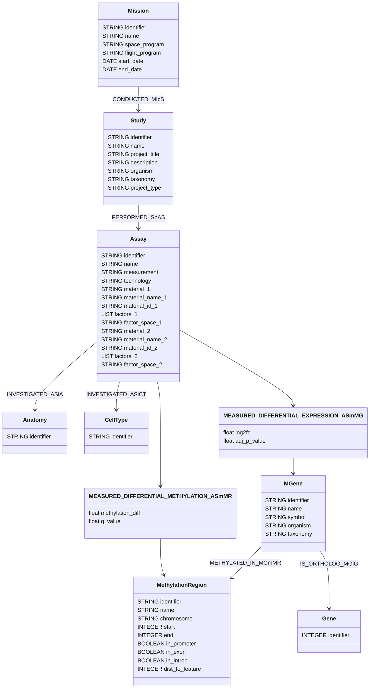

# Chat Transcript: GeneLab Knowledge Graph Schema Visualization

## Chat Transcript

👤 **User**  
@spoke-genelab

---

🧠 **Assistant**  
I can help you explore the NASA GeneLab knowledge graph! This database contains information about spaceflight experiments, gene expression data, and biological responses to space environments.

Here are some things I can help you with:

**Explore Studies & Experiments**
- Search for specific studies (e.g., OSD-253, GLDS-47)
- Find experiments by organism, tissue type, or spaceflight conditions
- Compare different assays within a study

**Analyze Gene Expression**
- Find differentially expressed genes (upregulated/downregulated)
- Compare gene expression across multiple experiments
- Create volcano plots and Venn diagrams
- Identify common genes across different conditions

**Knowledge Graph Queries**
- Explore relationships between genes, diseases, pathways, and compounds
- Custom Cypher queries for complex analyses
- Visualize the knowledge graph schema

**Example questions you could ask:**
- "What studies involve mouse muscle tissue in spaceflight?"
- "Show me the top upregulated genes in study OSD-253"
- "Compare gene expression between microgravity and ground control conditions"
- "What pathways are associated with bone loss in spaceflight?"

What would you like to explore in the GeneLab knowledge graph?

---

👤 **User**  
Visualize the schema

---

🧠 **Assistant**  
Here's the GeneLab knowledge graph schema! The diagram shows:

**Core Entities:**
- **Mission** → **Study** → **Assay**: The hierarchical structure of spaceflight experiments
- **MGene**: Mouse genes with differential expression data
- **Gene**: Generic gene references (for ortholog relationships)
- **MethylationRegion**: DNA methylation sites
- **Anatomy** & **CellType**: Tissue and cell type annotations

**Key Relationships with Properties:**
- **MEASURED_DIFFERENTIAL_EXPRESSION**: Links assays to genes with `log2fc` (fold change) and `adj_p_value` (statistical significance)
- **MEASURED_DIFFERENTIAL_METHYLATION**: Links assays to methylation regions with `methylation_diff` and `q_value`

This structure allows you to query everything from mission-level metadata down to individual gene expression changes, making it possible to compare experiments across different spaceflight conditions, organisms, and tissue types.

---

*Created by [mcp-genelab](https://github.com/sbl-sdsc/mcp-genelab) 0.4.0 on 2026-01-06*  
*Model: claude-sonnet-4-20250514*
