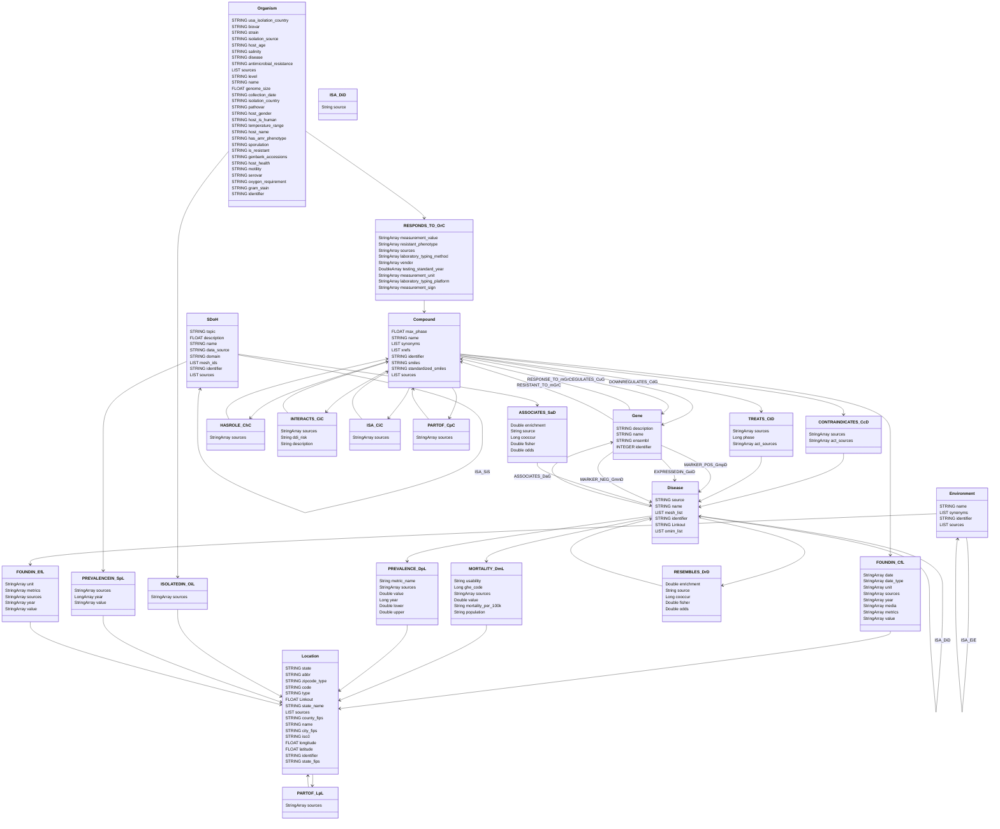

# SPOKE Knowledge Graph Schema Visualization

👤 **User**  
@spoke-okn

---

🧠 **Assistant**  
I can help you work with the SPOKE (Scalable Precision Medicine Open Knowledge Engine) knowledge graph! This is a biomedical knowledge graph that integrates data from various sources.

Let me start by getting information about the schema to understand what's available in this knowledge graph.

Great! I can see the SPOKE knowledge graph contains several types of nodes:

**Node Types:**
- **Compound** - Chemical compounds and drugs with properties like name, SMILES structures, and clinical trial phases
- **Disease** - Diseases with identifiers from MeSH and OMIM
- **Gene** - Genes with Ensembl IDs and descriptions
- **Location** - Geographic locations (countries, states, cities, etc.)
- **Organism** - Biological organisms with antimicrobial resistance data
- **SDoH** - Social Determinants of Health
- **Environment** - Environmental factors

**Key Relationships:**
- Compounds can treat diseases, upregulate/downregulate genes, and interact with other compounds
- Diseases associate with genes and can resemble other diseases
- Genes can be markers for diseases and respond to compounds
- Locations track disease prevalence and mortality
- Social determinants of health associate with diseases

What would you like to explore in the SPOKE knowledge graph? I can help you:
- Search for specific compounds, diseases, or genes
- Find relationships between entities
- Explore treatment options for diseases
- Investigate gene-disease associations
- Query location-based health data

What interests you?

---

👤 **User**  
Visualize the schema

---

🧠 **Assistant**  
I've created a visualization of the SPOKE knowledge graph schema! The diagram shows:

**Main Entity Types:**
- **Compound** - Chemical compounds with properties like max phase, SMILES structures
- **Disease** - Diseases with MeSH and OMIM identifiers
- **Gene** - Genes with Ensembl IDs and descriptions
- **Location** - Geographic locations with coordinates
- **Organism** - Biological organisms with antimicrobial resistance data
- **SDoH** - Social Determinants of Health
- **Environment** - Environmental factors

**Key Relationship Patterns:**
- Relationships with properties are shown as intermediary classes (e.g., TREATS_CtD contains sources and phase information)
- Simple relationships are shown as direct arrows with labels
- The diagram flows top to bottom for better readability

The schema reveals a rich biomedical knowledge graph connecting drugs, diseases, genes, and locations with detailed metadata on each relationship.

---

*Created by [mcp-genelab](https://github.com/sbl-sdsc/mcp-genelab) 0.4.0 on 2026-01-06*

*Model: Claude Sonnet 4.5 (claude-sonnet-4-5-20250929)*
