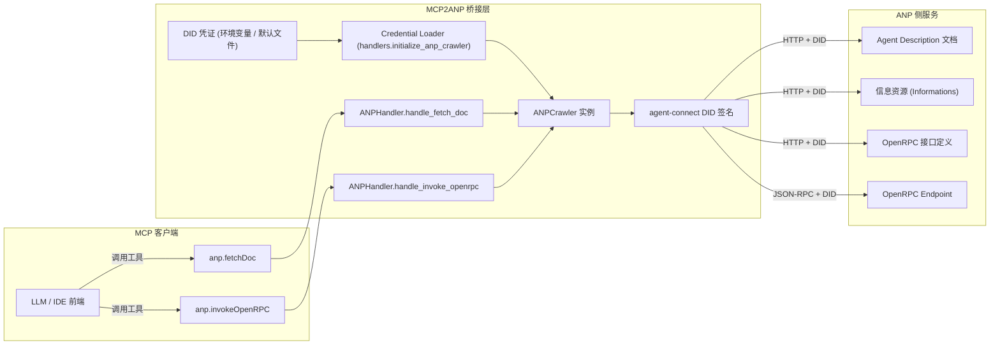

# MCP2ANP

> MCP ↔ ANP 桥接服务，让支持 MCP 的客户端像调用本地工具一样使用 ANP 智能体。

[](https://www.python.org/downloads/)
[](https://opensource.org/licenses/MIT)

## 项目简介

MCP2ANP 面向 Claude 、Cursor 等 MCP 客户端，将 ANP（Agent Network Protocol）的“爬虫式”交互流程映射成 MCP 工具调用，免去客户端改造。
桥接层提供两个工具：`anp.fetchDoc` 负责探索，`anp.invokeOpenRPC` 负责执行。

## 核心特性

- 两个稳定的核心工具，覆盖 ANP 资源发现与操作执行。
- DID 凭证加载与签名能力，支持本地文件或自定义路径。
- 本地 stdio 与远程 HTTP 双模式，适配桌面与服务端部署。
- 结构化日志，方便追踪调用链路与调试。
- 官方示例、单元测试与集成测试辅助验证。

## 运行模式速览

| 模式       | 传输方式     | 认证方式                | 典型场景               |
| ---------- | ------------ | ----------------------- | ---------------------- |
| 远程 HTTP  | FastMCP HTTP | Header 中的 `X-API-Key` | 多租户服务端、共享实例 |
| 本地 stdio | stdin/stdout | 环境变量或默认 DID 文件 | 桌面客户端、单机调试   |

## 架构设计

桥接层由 `mcp2anp.server`（stdio）与 `mcp2anp.server_remote`（HTTP）两种入口组成，二者都会加载共享的 `ANPHandler`（定义于 `mcp2anp/core/handlers.py`）。处理流程包括以下关键阶段：



本地模式将 `server.py` 通过 stdio 暴露为 MCP 工具；远程模式则由 `server_remote.py` 基于 FastMCP HTTP 端口化，并在请求头中完成 API Key → DID 凭证映射。无论模式如何，工具调用最终都通过 `agent-connect` 客户端对接 ANP 网络。


## 快速上手

### 1. **使用官方托管端点（推荐，无需安装）**

   ```bash
   claude mcp add --transport http mcp2anp-remote https://agent-connect.ai/mcp2anp/mcp  \
     --header "X-API-Key: mcp2anp_5K7WT-GDKVX-GWKJ3-T5Y7V-P7DFV-K3ZZZ-FYXWS-4PUFU-C4"
   ```

  > API Key 生成步骤
  >1. 访问 [DID-HOST](https://didhost.cc) 并登录账户。
  >2. 新建 DID Card，在创建流程中勾选“生成 API Key”。
    > _注:_ 将生成的私钥与 API Key 安全保存；它们仅显示一次，丢失后无法恢复。

   可选：校验 API Key 是否有效（需 `jq`）：

   ```bash
   curl -sS -H "X-API-Key: YOUR_API_KEY" \
     "https://didhost.cc/api/v1/mcp-sk-api-keys/verify" | jq .
   ```

### 2. **自托管远程 HTTP 服务（推荐用于服务端/多人共享）**

- 先安装依赖：

   ```bash
   git clone git@github.com:agent-network-protocol/mcp2anp.git
   cd mcp2anp
   uv venv --python 3.11
   uv sync
   ```

- 启动服务：

   ```bash
   uv run python -m mcp2anp.server_remote --host 0.0.0.0 --port 9880
   ```

-  在 Claude 中以 HTTP 方式注册（将地址替换为你的部署域名或 IP）：

   ```bash
   claude mcp add --transport http mcp2anp-remote http://localhost:9880/mcp \
     --header "X-API-Key: YOUR_API_KEY"
   ```

### 3. **本地 stdio 模式（用于桌面/单机调试）**

   确保已完成上文“安装依赖”：

   >1. [DID-HOST](https://didhost.cc) 来创建一个新的 DID。
   >2. 创建成功后，下载生成的压缩包。
   >3. 解压该压缩包（例如，解压到项目下的 docs/did_public/ 目录），您将得到 public-did-doc.json（DID 文档）和 public-private-key.pem（私钥）两个文件。

- 直接添加到环境变量

  ```bash
  # 设置 DID 文件的路径
  export ANP_DID_DOCUMENT_PATH="docs/did_public/public-did-doc.json"
  export ANP_DID_PRIVATE_KEY_PATH="docs/did_public/public-private-key.pem"

  # 使用 uv 启动服务
  uv run python -m mcp2anp.server --log-level INFO
  ```

- 在 Claude 中添加：

   ```bash
    # 将仓库根目录赋值给变量（替换为你的实际路径）
    MCP2ANP_DIR=/Users/cs/work/mcp2anp
    
    claude mcp add mcp2anp \
      --env ANP_DID_DOCUMENT_PATH=$MCP2ANP_DIR/docs/did_public/public-did-doc.json \
      --env ANP_DID_PRIVATE_KEY_PATH=$MCP2ANP_DIR/docs/did_public/public-private-key.pem \
      -- uv run --directory $MCP2ANP_DIR python -m mcp2anp.server
   ```

### 4. **运行官方 Demo**

   ```bash
   uv run python examples/mcp_client_demo.py
   ```

   Demo 会列出工具、加载示例凭证并演示 `anp.fetchDoc` 与 `anp.invokeOpenRPC` 的完整闭环。

### 使用 uvx 快速体验

如果尚未在系统中安装 `uv`，也可以使用随发行版提供的 `uvx` 临时运行本项目：

```bash
# 在当前仓库目录下执行，uvx 会读取 pyproject.toml 解析依赖
uvx --from . python -m mcp2anp.server --log-level INFO

# 执行单元测试（示例）
uvx --from . pytest --maxfail=1
```

`uvx` 会为每次调用创建并缓存隔离环境，适合快速体验或 CI 场景；若需重复开发，仍推荐使用上文的 `uv venv` + `uv sync` 方式。

## 工具详解

### `anp.fetchDoc`

- 输入：`url`
- 输出：资源内容（`text` 或 `json`），以及待探索的结构化 `links`
- 用法：递归遍历 ANP 网络，读取描述、接口或下一跳链接

### `anp.invokeOpenRPC`

- 输入：`endpoint`、`method`、`params`
- 输出：OpenRPC 定义的调用结果
- 用法：先用 `fetchDoc` 获取 OpenRPC 规范，再据此构造参数完成操作执行

## 常见问题

- **本地模式认证失败**：确认 DID 文档和私钥路径无误且具备读取权限。
- **远程模式返回 401**：检查 `X-API-Key` 是否正确并对应到验证服务。
- **MCP 客户端未显示工具**：确认传输方式（stdio/HTTP）与运行模式一致。
- **需更多日志**：运行时增加 `--log-level DEBUG`，或查看 `logs/` 目录。

## 更多资料

- 远程部署说明：`docs/server_remote.md`
- 示例载荷：`docs/examples/`
- 客户端脚本与迁移说明：`examples/`

## 参与贡献

开发流程、代码规范、测试要求请参考 `CONTRIBUTING.md`。

## 许可证

MIT License
