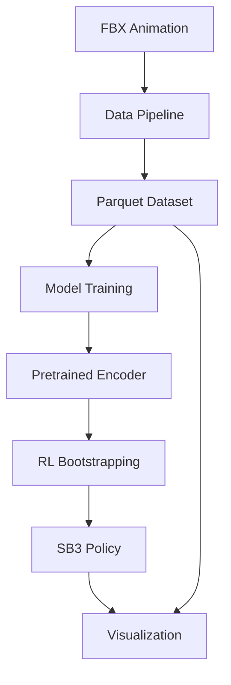

# optiq: imitation-first motion learning

[](https://pypi.org/project/optiq/)
[](https://www.python.org/downloads/)
[](https://www.gnu.org/licenses/gpl-3.0)
[](https://optiq.readthedocs.io/en/latest/)

optiq ingests FBX animations, converts them to Parquet/HDF5 datasets, trains sequence models (Transformer/MLP/UNet1D), and can bootstrap stable-baselines3 RL policies from pretrained encoders. Blender capture helpers remain available, but the primary flow is motion → dataset → model → RL/viz.

## Quick Start

### Installation

optiq uses optional dependency groups ("extras") to keep the base install lightweight. Install only what you need:

=== "Minimal (Core Only)"
    ```bash
    pip install optiq
    # Includes: numpy, torch, pydantic, click, scipy, trimesh
    ```

=== "With ML Training"
    ```bash
    pip install optiq[ml]
    # + pytorch-lightning, torchmetrics, mlflow, h5py, pyarrow
    ```

=== "With RL Support"
    ```bash
    pip install optiq[rl]
    # + stable-baselines3, gymnasium[mujoco], mujoco
    ```

=== "With Visualization"
    ```bash
    pip install optiq[viz]
    # + plotly, moviepy, matplotlib, opencv
    ```

=== "Everything"
    ```bash
    pip install optiq[all]
    # All features + web interface + monitoring
    ```

### Basic Usage

```python
from optiq import load_sequence, build_imitation_dataset

# Load motion data
seq = load_sequence("walking.parquet")

# Create training dataset
dataset = build_imitation_dataset(seq, mode="next", horizon=1)
```

## Key Features

### 📊 Data Pipeline
- **FBX Animation Processing**: Convert FBX files to structured datasets
- **Sequence Management**: Handle temporal motion sequences with metadata
- **Dataset Creation**: Build imitation learning and RL datasets

### 🧠 Model Training
- **Multiple Architectures**: Transformer, MLP, and UNet1D models
- **Sequence Modeling**: Autoregressive and diffusion-based approaches
- **Experiment Tracking**: MLflow integration for reproducible training

### 🎮 Reinforcement Learning
- **Policy Bootstrapping**: Transfer pretrained encoders to RL policies
- **Stable-Baselines3 Integration**: Seamless RL training and evaluation
- **Environment Support**: Mujoco and custom environments

### 📈 Visualization & Analysis
- **Interactive Plots**: Plotly-based motion visualization
- **Video Rendering**: Generate training videos and rollouts
- **Data Inspection**: Explore datasets and model predictions

## CLI Overview

optiq provides a unified CLI with global options for reproducibility:

```bash
optiq [--seed INT] [--device cpu|cuda|mps|auto] COMMAND
```

### Data Commands

```bash
# Convert JSON → Parquet with velocity computation
optiq data convert --in ground_truth.json --out seq.parquet --compute-velocities

# Attach sequence and frame labels
optiq data label --in seq.parquet --out seq_labeled.parquet \
  --label movement=walk \
  --frame-labels frame_labels.json \
  --label-names phase
```

### Training Commands

```bash
# Train a model (transformer, mlp, or unet1d)
optiq train model --config configs/model.yaml --arch transformer --out ckpt.pt

# Train an RL policy with optional pretrained encoder
optiq train rl --env Humanoid-v5 --algo ppo --total-steps 300000 --out policy.zip
```

### Visualization Commands

```bash
# Plotly animation from predictions or dataset
optiq viz plotly --pred pred.json --out viz.html --tubes
optiq viz plotly --dataset seq.parquet --out viz.html

# Render policy rollout to video
optiq viz video --policy policy.zip --env Humanoid-v5 --out rollout.mp4
```

## Architecture



## Contributing

We welcome contributions! Please see our [contributing guide](contributing.md) for details on:

- Setting up a development environment
- Running tests and linting
- Submitting pull requests
- Code style guidelines

## License

optiq is released under the [GNU General Public License v3.0](https://www.gnu.org/licenses/gpl-3.0.en.html).

---

**Ready to get started?** Check out the [installation guide](installation.md) or jump into the [quick start tutorial](quickstart.md).
