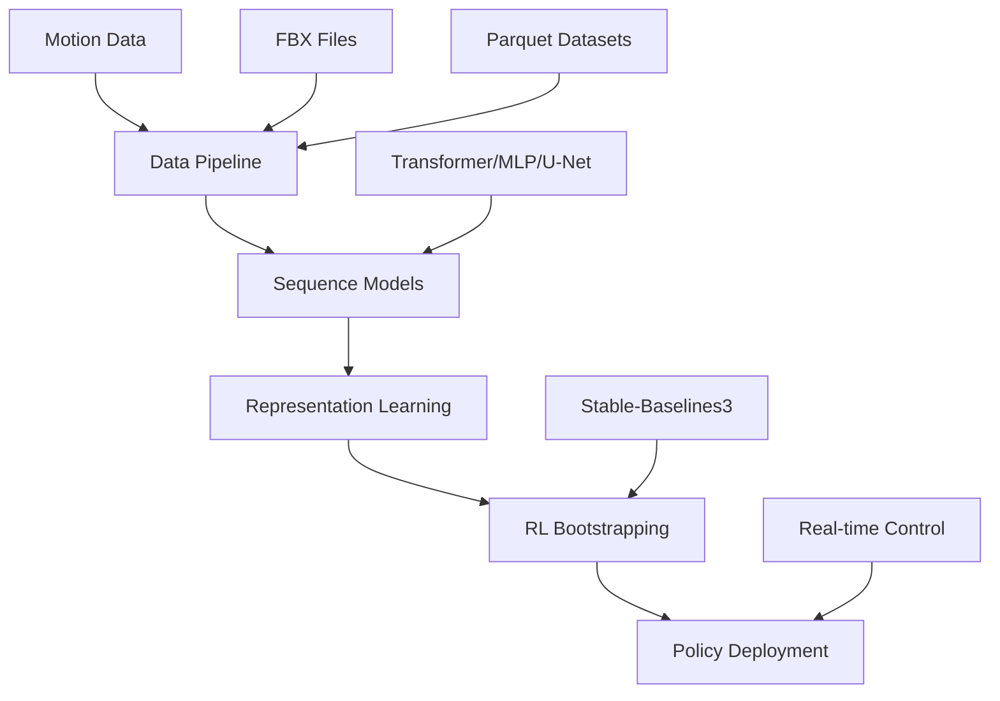

# Overview

optiq is a comprehensive framework for imitation-first motion learning, designed to bridge the gap between motion capture data and reinforcement learning applications.

## Core Philosophy

optiq follows an **imitation-first approach** to motion learning:

1. **Collect & Process**: Ingest motion capture data from FBX files
2. **Model & Predict**: Train sequence models to understand motion patterns
3. **Bootstrap RL**: Use learned representations to accelerate RL training
4. **Deploy & Control**: Apply trained policies to real-world tasks

## Architecture



## Key Components

### Data Pipeline
- **FBX Processing**: Convert animation files to structured datasets
- **Sequence Management**: Handle temporal dependencies and metadata
- **Dataset Creation**: Build training sets for imitation and RL

### Model Zoo
- **Transformer**: For long-range dependencies and complex motions
- **MLP**: Lightweight solution for simpler prediction tasks
- **U-Net**: Specialized for autoregressive generation tasks

### RL Integration
- **Pretrained Encoders**: Transfer learned representations to RL
- **Policy Bootstrapping**: Warm-start RL training with imitation data
- **Stable-Baselines3**: Seamless integration with popular RL framework

### Visualization & Analysis
- **Interactive Plots**: 3D motion visualization with Plotly
- **Video Generation**: Create training progress videos
- **Comparative Analysis**: Evaluate model performance side-by-side

## Workflow

### 1. Data Preparation
```bash
# Convert FBX to dataset
optiq data convert --in walking.fbx --out dataset.parquet --compute-velocities

# Add motion labels
optiq data label --in dataset.parquet --out labeled.parquet \
  --label movement=walk --frame-labels phase_labels.json
```

### 2. Model Training
```bash
# Train motion model
optiq train model \
  --config configs/model_transformer.yaml \
  --data labeled.parquet \
  --out motion_model.pt
```

### 3. RL Bootstrapping
```bash
# Bootstrap RL policy
optiq train rl \
  --env Humanoid-v5 \
  --pretrained motion_model.pt \
  --adapter-mode feature \
  --total-steps 100000 \
  --out humanoid_policy.zip
```

### 4. Evaluation & Deployment
```bash
# Generate rollout video
optiq viz video \
  --policy humanoid_policy.zip \
  --env Humanoid-v5 \
  --out evaluation.mp4

# Interactive motion plots
optiq viz plotly \
  --dataset labeled.parquet \
  --pred predictions.json \
  --out analysis.html
```

## Design Principles

### Imitation-First Approach
- Learn from expert demonstrations before exploration
- Build strong inductive biases from real motion data
- Transfer knowledge across related tasks

### Modularity
- Mix and match components for different use cases
- Easy experimentation with different architectures
- Extensible plugin system for custom components

### Reproducibility
- Deterministic training with seed control
- Comprehensive experiment tracking with MLflow
- Versioned configurations and checkpoints

### Performance
- GPU-accelerated training and inference
- Memory-efficient data loading
- Optimized for both research and production use

## Use Cases

### Robotics
- **Motion Planning**: Generate natural robot movements
- **Imitation Learning**: Learn from human demonstrations
- **Control Policies**: Deploy trained policies on hardware

### Animation & Games
- **Procedural Animation**: Generate realistic character motions
- **Motion Synthesis**: Create new animations from existing data
- **Style Transfer**: Adapt motions between different characters

### Research
- **Motion Analysis**: Study patterns in human movement
- **Model Evaluation**: Compare different learning approaches
- **Benchmarking**: Standardized evaluation protocols

## Integration

optiq integrates seamlessly with the broader ML ecosystem:

- **PyTorch**: Native PyTorch models and training loops
- **Stable-Baselines3**: Industry-standard RL framework
- **MLflow**: Experiment tracking and model registry
- **Plotly**: Interactive visualization and analysis
- **Pandas/Polars**: Efficient data manipulation

## Getting Started

Ready to try optiq? Start with the [installation guide](../installation.md) or jump into the [quick start tutorial](../quickstart.md).

For detailed API documentation, see the [API reference](api.md) or explore the [examples](../examples/index.md).
