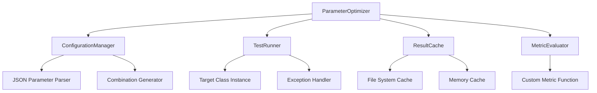

# Design Document: Parameter Optimizer

## Overview

The Parameter Optimizer is a reusable Python package that systematically tests parameter combinations for any class to find optimal configurations. It uses a grid search approach with intelligent caching, supports fixed parameters, and provides comprehensive result tracking. The system is designed to be flexible, efficient, and easy to integrate with existing codebases.

## Architecture

The system follows a modular architecture with clear separation of concerns:



## Components and Interfaces

### ParameterOptimizer (Main Class)

The primary interface for the optimization system.

```python
class ParameterOptimizer:
    def __init__(self, target_class, parameters_json_path, metric_function, 
                 cache_dir="./optimization_cache", fixed_parameters=None):
        """
        Initialize the parameter optimizer.
        
        Args:
            target_class: Class to optimize parameters for
            parameters_json_path: Path to JSON file with parameter ranges
            metric_function: Function that takes class instance and returns score
            cache_dir: Directory for caching results
            fixed_parameters: Dict of parameters to keep constant
        """
    
    def optimize(self, max_combinations=None, progress_callback=None):
        """Run optimization and return best configuration."""
    
    def get_results(self, sort_by_metric=True):
        """Get all test results."""
    
    def get_progress(self):
        """Get current optimization progress."""
```

### ConfigurationManager

Handles parameter configuration parsing and combination generation.

```python
class ConfigurationManager:
    def __init__(self, json_path, fixed_parameters=None):
        """Initialize with parameter configuration."""
    
    def load_parameters(self):
        """Load and validate parameter ranges from JSON."""
    
    def generate_combinations(self):
        """Generate all parameter combinations using itertools.product."""
    
    def apply_fixed_parameters(self, combination):
        """Apply fixed parameter values to a combination."""
```

### TestRunner

Executes tests with different parameter combinations.

```python
class TestRunner:
    def __init__(self, target_class, metric_function):
        """Initialize test runner."""
    
    def run_test(self, parameters):
        """Execute single test with given parameters."""
    
    def validate_parameters(self, parameters):
        """Validate parameters match class constructor."""
```

### ResultCache

Manages caching of test results to avoid duplicate runs.

```python
class ResultCache:
    def __init__(self, cache_dir, target_class_name):
        """Initialize cache with directory and class identifier."""
    
    def get_cached_result(self, parameters):
        """Retrieve cached result for parameter combination."""
    
    def cache_result(self, parameters, result, metric_score):
        """Store test result in cache."""
    
    def get_cache_stats(self):
        """Get statistics about cached vs new tests."""
```

### MetricEvaluator

Handles metric calculation and result comparison.

```python
class MetricEvaluator:
    def __init__(self, metric_function):
        """Initialize with custom metric function."""
    
    def evaluate(self, class_instance):
        """Calculate metric score for class instance."""
    
    def compare_results(self, results):
        """Find best result based on metric scores."""
```

## Data Models

### Parameter Configuration (JSON Format)

```json
{
    "learning_rate": [0.001, 0.01, 0.1],
    "batch_size": [16, 32, 64, 128],
    "epochs": [10, 20, 50],
    "optimizer": ["adam", "sgd", "rmsprop"],
    "dropout_rate": [0.0, 0.2, 0.5]
}
```

### Test Result

```python
@dataclass
class TestResult:
    parameters: Dict[str, Any]
    metric_score: float
    execution_time: float
    timestamp: datetime
    success: bool
    error_message: Optional[str] = None
```

### Optimization Summary

```python
@dataclass
class OptimizationSummary:
    best_configuration: Dict[str, Any]
    best_score: float
    total_combinations: int
    completed_tests: int
    cached_results: int
    failed_tests: int
    execution_time: float
```

## Correctness Properties

*A property is a characteristic or behavior that should hold true across all valid executions of a system-essentially, a formal statement about what the system should do. Properties serve as the bridge between human-readable specifications and machine-verifiable correctness guarantees.*

### Property Reflection

After analyzing all acceptance criteria, several properties can be consolidated to eliminate redundancy:

- Properties 3.1 and 3.3 (caching and persistence) can be combined into a comprehensive caching round-trip property
- Properties 4.1 and 4.2 (fixed parameter behavior) can be combined into a single fixed parameter consistency property
- Properties 5.1, 5.2, and 5.5 (progress reporting) can be combined into a comprehensive progress tracking property

### Core Properties

**Property 1: JSON Configuration Parsing**
*For any* valid JSON configuration containing parameter lists with multiple data types, parsing should produce a dictionary where each key maps to its corresponding list of values
**Validates: Requirements 1.1, 1.4**

**Property 2: Parameter Combination Generation**
*For any* set of parameter lists, the generated combinations should equal the Cartesian product of all lists, with the total count matching the product of individual list lengths
**Validates: Requirements 1.2**

**Property 3: Error Handling for Invalid JSON**
*For any* malformed or invalid JSON input, the system should return a descriptive error message without crashing
**Validates: Requirements 1.3**

**Property 4: Test Execution Completeness**
*For any* target class and parameter combinations, each combination should be used exactly once to instantiate the class, and a metric should be calculated for each successful instantiation
**Validates: Requirements 2.1, 2.2**

**Property 5: Optimal Configuration Identification**
*For any* set of test results with different metric scores, the system should correctly identify the configuration with the best (highest or lowest, depending on optimization direction) metric value
**Validates: Requirements 2.3**

**Property 6: Graceful Failure Handling**
*For any* test that throws an exception, the system should log the error, mark the test as failed, and continue processing remaining combinations
**Validates: Requirements 2.4, 6.4**

**Property 7: Caching Round-Trip Consistency**
*For any* parameter combination that is tested, storing the result and then retrieving it should return the same result, and the result should persist across system restarts
**Validates: Requirements 3.1, 3.2, 3.3**

**Property 8: Cache Validation**
*For any* cached result, if the target class or metric function changes, the cached result should be invalidated and not used
**Validates: Requirements 3.4**

**Property 9: Fixed Parameter Consistency**
*For any* set of fixed parameters, all generated combinations should contain exactly those fixed values, and fixed parameters should not appear in the variable parameter space
**Validates: Requirements 4.1, 4.2, 4.3**

**Property 10: Progress Tracking Accuracy**
*For any* optimization run, the reported total combinations should match the actual combinations generated, and progress updates should accurately reflect completed vs remaining tests
**Validates: Requirements 5.1, 5.2, 5.5**

**Property 11: Result Summary Completeness**
*For any* completed optimization, the summary should contain the best configuration, best score, and accurate counts of total, completed, cached, and failed tests
**Validates: Requirements 5.3, 5.4**

**Property 12: Class Compatibility**
*For any* class that can be instantiated with keyword arguments, the system should successfully create instances using the provided parameter combinations
**Validates: Requirements 6.1**

**Property 13: Parameter Validation**
*For any* parameter combination, if it contains parameters not accepted by the target class constructor, the system should detect and report the validation error
**Validates: Requirements 6.2**

**Property 14: Custom Metric Function Support**
*For any* valid metric function that takes a class instance and returns a numeric score, the system should successfully use it to evaluate test results
**Validates: Requirements 6.3**

## Error Handling

The system implements comprehensive error handling at multiple levels:

### Configuration Errors
- **Invalid JSON**: Catch JSON parsing errors and provide descriptive messages
- **Missing Files**: Handle missing parameter configuration files gracefully
- **Invalid Parameter Types**: Validate that parameter values are serializable and compatible

### Runtime Errors
- **Class Instantiation Failures**: Catch and log constructor exceptions
- **Metric Calculation Errors**: Handle metric function failures without stopping optimization
- **Cache Corruption**: Detect and recover from corrupted cache files

### Resource Management
- **Memory Management**: Use iterators for large parameter spaces to avoid memory exhaustion
- **File System Errors**: Handle disk space and permission issues for cache storage
- **Timeout Handling**: Implement optional timeouts for long-running tests

## Testing Strategy

The testing approach combines unit tests for specific scenarios with property-based tests for comprehensive validation:

### Unit Testing
- **Configuration Parsing**: Test specific JSON configurations and edge cases
- **Cache Operations**: Test cache hit/miss scenarios and persistence
- **Error Conditions**: Test specific error scenarios and recovery
- **Integration Points**: Test component interactions and data flow

### Property-Based Testing
- **Framework**: Use Hypothesis for Python property-based testing
- **Test Configuration**: Minimum 100 iterations per property test
- **Coverage**: Each correctness property implemented as a separate property test
- **Generators**: Smart generators for parameter configurations, class instances, and metric functions

### Test Organization
```python
# Property test example with required annotation
@given(parameter_config=parameter_configs(), fixed_params=fixed_parameters())
def test_fixed_parameter_consistency(parameter_config, fixed_params):
    """Feature: parameter-optimizer, Property 9: Fixed Parameter Consistency"""
    # Test implementation
```

### Performance Testing
- **Large Parameter Spaces**: Test with thousands of parameter combinations
- **Memory Usage**: Monitor memory consumption during optimization
- **Cache Performance**: Measure cache hit rates and lookup times
- **Concurrent Access**: Test thread safety for parallel optimization runs

<function_calls>
<invoke name="prework">
<parameter name="featureName">parameter-optimizer