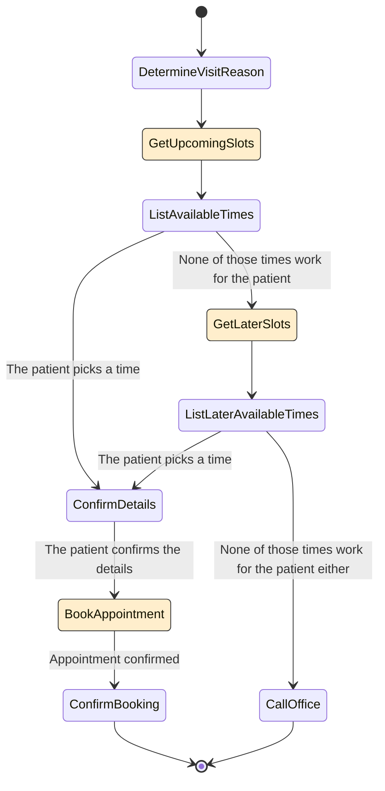

# Healthcare Agent Example

This page walks you through using Parlant to design and build a healthcare agent with two customer journeys.
1. **Schedule an appointment**: The agent helps the patient find a time for their appointment.
1. **Lab results**: The agent retrieves the patient's lab results and explains them.


You'll learn how to:
- Align your agent with basic domain knowledge.
- Define **journeys** with **states** and **transitions**.
- Use **guidelines** to control the agent's behavior in conversational edge cases.
- Use **tools** to connect your agent to real actions and data.
- Disambiguate vague user queries.

While this section is by no means a comprehensive guide to Parlant's features, it will give you a solid idea of what the basics look like, and how to think about building your own agents with Parlant. Let's get started!

> **Info: The Art of Behavior Modeling**
>
> Building complex and reliable customer-facing AI agents is a challenging task. Don't let the hype-machine tell you otherwise.
>
> It isn't just about having the right framework. When we automate conversations, we are automating the complex semantics of human conversations. In very real terms, this means we need to design our instructions and behavior models carefully. They need to be clear, and be at the right level of specificity, to ensure that the agent truly behaves as we expect it to.
>
> While Parlant gives you the tools to express and enforce your instructions, _designing them_ is an art in itself, requiring practice to get right. But once you do, you can build agents that are not only functional and reliable, but also engaging and effective.


## Preparing the Environment
Before getting started, make sure you've
1. [Installed](https://parlant.io/docs/quickstart/installation) Parlant and have a Python environment set up.
1. Chosen your NLP provider and connected it to your server (also on the [installation page](https://parlant.io/docs/quickstart/installation)).

> **Tip: Download the Code**
>
> The runnable code for this fully worked example can be found in the `examples/` folder of [Parlant's GitHub repository](https://github.com/emcie-co/parlant).

## Overview

We'll implement the agent in the following steps:

1. Create the baseline program with a simple agent description.
1. Add the **scheduling** journey, with states, transitions, and tools.
1. Add the **lab results** journey in a similar way.

## Getting Started
We'll implement the entire program in a single file, `healthcare.py`, but in real-world use cases you would likely want to split it into multiple files for better organization. A good approach in those cases is to have a file per journey.

But now let's get to creating our initial agent.

```python
# healthcare.py

import parlant.sdk as p
import asyncio

async def add_domain_glossary(agent: p.Agent) -> None:
  await agent.create_term(
    name="Office Phone Number",
    description="The phone number of our office, at +1-234-567-8900",
  )

  await agent.create_term(
    name="Office Hours",
    description="Office hours are Monday to Friday, 9 AM to 5 PM",
  )

  await agent.create_term(
    name="Charles Xavier",
    synonyms=["Professor X"],
    description="The renowned doctor who specializes in neurology",
  )

  # Add other specific terms and definitions here, as needed...

async def main() -> None:
    async with p.Server() as server:
        agent = await server.create_agent(
            name="Healthcare Agent",
            description="Is empathetic and calming to the patient.",
        )

        await add_domain_glossary(agent)


if __name__ == "__main__":
    asyncio.run(main())
```

## Creating the Scheduling Journey
To understand how journeys work in Parlant, please check out the [Journeys documentation](https://parlant.io/docs/concepts/customization/journeys). Here, we'll jump straight into it, but it's recommended to review their documentation first.

### Adding Tools
First, add the tools we need to support this journey.

```python
from datetime import datetime

@p.tool
async def get_upcoming_slots(context: p.ToolContext) -> p.ToolResult:
  # Simulate fetching available times from a database or API
  return p.ToolResult(data=["Monday 10 AM", "Tuesday 2 PM", "Wednesday 1 PM"])

@p.tool
async def get_later_slots(context: p.ToolContext) -> p.ToolResult:
  # Simulate fetching later available times
  return p.ToolResult(data=["November 3, 11:30 AM", "November 12, 3 PM"])

@p.tool
async def schedule_appointment(context: p.ToolContext, datetime: datetime) -> p.ToolResult:
  # Simulate scheduling the appointment
  return p.ToolResult(data=f"Appointment scheduled for {datetime}")
```

> **Tip: Tools in Parlant**
>
> Parlant has a more intricate tool system than most agentic frameworks, since it is optimized for conversational, sensitive customer-facing use cases. We highly recommend perusing the documentation in the [Tools section](https://parlant.io/docs/concepts/customization/tools) to learn its power.

### Building the Journey
We'll now create the journey according to the following diagram:



```python
# <<Add this function>>
async def create_scheduling_journey(server: p.Server, agent: p.Agent) -> p.Journey:
  # Create the journey
  journey = await agent.create_journey(
    title="Schedule an Appointment",
    description="Helps the patient find a time for their appointment.",
    conditions=["The patient wants to schedule an appointment"],
  )

  # First, determine the reason for the appointment
  t0 = await journey.initial_state.transition_to(chat_state="Determine the reason for the visit")

  # Load upcoming appointment slots into context
  t1 = await t0.target.transition_to(tool_state=get_upcoming_slots)

  # Ask which one works for them
  # We will transition conditionally from here based on the patient's response
  t2 = await t1.target.transition_to(chat_state="List available times and ask which ones works for them")

  # We'll start with the happy path where the patient picks a time
  t3 = await t2.target.transition_to(
    chat_state="Confirm the details with the patient before scheduling",
    condition="The patient picks a time",
  )

  t4 = await t3.target.transition_to(
    tool_state=schedule_appointment,
    condition="The patient confirms the details",
  )
  t5 = await t4.target.transition_to(chat_state="Confirm the appointment has been scheduled")
  await t5.target.transition_to(state=p.END_JOURNEY)

  # Otherwise, if they say none of the times work, ask for later slots
  t6 = await t2.target.transition_to(
    tool_state=get_later_slots,
    condition="None of those times work for the patient",
  )
  t7 = await t6.target.transition_to(chat_state="List later times and ask if any of them works")

  # Transition back to our happy-path if they pick a time
  await t7.target.transition_to(state=t3.target, condition="The patient picks a time")

  # Otherwise, ask them to call the office
  t8 = await t7.target.transition_to(
    chat_state="Ask the patient to call the office to schedule an appointment",
    condition="None of those times work for the patient either",
  )
  await t8.target.transition_to(state=p.END_JOURNEY)

  return journey
```

Then call this function in your `main` function to add the journey to your agent:

```python
async def main() -> None:
  async with p.Server() as server:
    agent = await server.create_agent(
      name="Healthcare Agent",
      description="Is empathetic and calming to the patient.",
    )

    # <<Add this line>>
    scheduling_journey = await create_scheduling_journey(server, agent)
```

### Handling Edge Cases
In real-world scenarios, patients do not always followed the scripted path of your journeys. They might ask questions, express concerns, or provide other unexpected responses.

For Parlant agents, this is their bread and butter! While they will still be able to respond contextually to the patient, you might still like to guide and improve *how* they respond in particular scenarios that you've observed.

To do this, you can add **guidelines** to your agent. Guidelines are like contextual rules that tell the agent how to respond in specific situations. And you can scope them to specific journeys, so they only apply when the agent is in that journey.

Let's add a few guidelines to our agent to handle some common edge cases in the scheduling journey.

```python
async def create_scheduling_journey(server: p.Server, agent: p.Agent) -> p.Journey:
  # ... continued

  # <<Add this to the end of the create_scheduling_journey function>>

  await journey.create_guideline(
    condition="The patient says their visit is urgent",
    action="Tell them to call the office immediately",
  )

  # Add more edge case guidelines as needed...

  return journey
```

### Running the Program
When you run the program, you should first see Parlant evaluating the semantic properties of your configuration. It does this in order to optimize how your guidelines and journeys are retrieved, processed and followed behind the scenes.


Once the server is ready, open your browser and navigate to [http://localhost:8800](http://localhost:8800) to interact with your agent.


> **Warning: Handling Unsupported Queries**
>
> You may notice that your agent, at this point, is happy to try and assist customers while completely overstepping the boundaries of its knowledge and capabilities. While this is normal with LLMs, it is untolerable in many real-life use cases.
>
> Parlant provides multiple structured ways to achieve absolute control over your agent's (mis)behavior. This example is only the beginning; rest assured that as you learn more about Parlant, it can help you deploy an agent you can actually trust.


## Creating the Lab Results Journey
We'll speed through this journey, as it will be very similar in structure to the other journey (and any other journey you'd be likely to build).

### Adding Tools

```python
@p.tool
async def get_lab_results(context: p.ToolContext) -> p.ToolResult:
  # Simulate fetching lab results from a database or API,
  # using the customer ID from the context.
  lab_results = await MY_DB.get_lab_results(context.customer_id)

  if lab_results is None:
    return p.ToolResult(data="No lab results found for this patient.")

  return p.ToolResult(data={
    "report": lab_results.report,
    "prognosis": lab_results.prognosis,
  })
```

### Building the Journey
```python
async def create_lab_results_journey(server: p.Server, agent: p.Agent) -> p.Journey:
  # Create the journey
  journey = await agent.create_journey(
    title="Lab Results",
    description="Retrieves the patient's lab results and explains them.",
    conditions=["The patient wants to see their lab results"],
  )

  t0 = await journey.initial_state.transition_to(tool_state=get_lab_results)

  await t0.target.transition_to(
    chat_state="Tell the patient that the results are not available yet, and to try again later",
    condition="The lab results could not be found",
  )

  await t0.target.transition_to(
    chat_state="Explain the lab results to the patient - that they are normal",
    condition="The lab results are good - i.e., nothing to worry about",
  )

  await t0.target.transition_to(
    chat_state="Present the results and ask them to call the office "
     "for clarifications on the results as you are not a doctor",
    condition="The lab results are not good - i.e., there's an issue with the patient's health",
  )

  # Handle edge cases with guidelines...

  await agent.create_guideline(
    condition="The patient presses you for more conclusions about the lab results",
    action="Assertively tell them that you cannot help and they should call the office"
  )

  return journey
```

Finally, call this function in your `main` function to add the journey to your agent:

```python
async def main() -> None:
  async with p.Server() as server:
    agent = await server.create_agent(
      name="Healthcare Agent",
      description="Is empathetic and calming to the patient.",
    )

    scheduling_journey = await create_scheduling_journey(server, agent)
    # <<Add this line>>
    lab_results_journey = await create_lab_results_journey(server, agent)
```

Restart the program, open your browser and navigate to [http://localhost:8800](http://localhost:8800) to interact with your agent. Try saying something like, _"Did my lab results come in?"_ or _"I want to schedule an appointment"_.

## Disambiguating Patient Intent
In some cases, the patient might say something that could be interpreted in multiple ways, leading to confusion about which action to take or what they wish to achieve.

An easy way to handle this is to use **disambiguation**. This will get the agent to ask the patient to clarify their intent when multiple actions could be taken. Here's how you can do it:

```python
async def main() -> None:
  async with p.Server() as server:
    agent = await server.create_agent(
      name="Healthcare Agent",
      description="Is empathetic and calming to the patient.",
    )

    scheduling_journey = await create_scheduling_journey(server, agent)
    lab_results_journey = await create_lab_results_journey(server, agent)

    # <<Add the following lines>>

    # First, create an observation of an ambiguous situation
    status_inquiry = await agent.create_observation(
      "The patient asks to follow up on their visit, but it's not clear in which way",
    )

    # Use this observation to disambiguate between the two journeys
    await status_inquiry.disambiguate([scheduling_journey, lab_results_journey])
```

Now, if the patient inquires in an ambiguous way about a follow-up, the agent will ask them to clarify whether they want to schedule an appointment or see their lab results.

Restart the program, open your browser and navigate to [http://localhost:8800](http://localhost:8800) to interact with your agent. Try saying something like, _"I need to follow up on my last visit"_ and see what the agent responds with.

## Global Guidelines
There are usually some guidelines that you might want to apply to all journeys of your agent, not just a specific one (or, for that matter, even if a patient is not in the middle of a journey). For example, you might want to provide information about insurance providers in an informed manner.

To achieve this, you just need to add guidelines to the agent itself, rather than to a specific journey.

```python
await agent.create_guideline(
  condition="The patient asks about insurance",
  action="List the insurance providers we accept, and tell them to call the office for more details",
  tools=[get_insurance_providers],
)

await agent.create_guideline(
  condition="The patient asks to talk to a human agent",
  action="Ask them to call the office, providing the phone number",
)

await agent.create_guideline(
  condition="The patient inquires about something that has nothing to do with our healthcare",
  action="Kindly tell them you cannot assist with off-topic inquiries - do not engage with their request.",
)
```

## Next Steps
1. Download and try out the runnable code file for this example: [healthcare.py](https://github.com/emcie-co/parlant/blob/develop/examples/healthcare.py)
1. Tailor and constrain the content and style of agent messages with canned responses: [Canned Responses](https://parlant.io/docs/concepts/customization/canned-responses)
1. Learn how to deploy your agent in a [production environment](https://parlant.io/docs/category/production)
1. Add the [React widget](https://github.com/emcie-co/parlant-chat-react) to your website to interact with the agent
