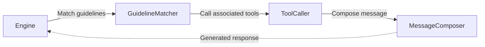
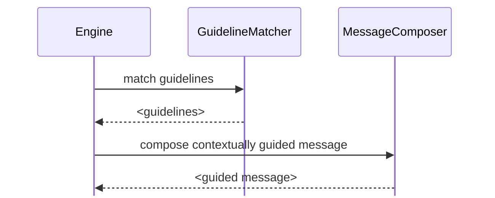

# Guidelines

Guidelines are a powerful customization feature. While they're quite simple in principle, there is a lot to say about them.

### What Are Guidelines?
Guidelines are the primary way to nudge the behavior of [agents](https://parlant.io/docs/concepts/entities/agents) in Parlant in a contextual and targeted manner.

They allow us to instruct how an agent should respond in specific situations, overriding its default behavior, thus ensuring that its behavior aligns with our expectations and business needs.

 Guidelines allow us to shape an [agent](https://parlant.io/docs/concepts/entities/agents)'s behavior in two key scenarios:
 1. When certain out-of-the-box responses don't meet our expectations
 1. When we simply want to ensure consistent behavior across all interactions

> **Guidelines vs. Journeys**
>
> Journeys are the ideal way to provide a structured, step-by-step interaction flow, while guidelines are more about providing contextual nudges to the agent's behavior. Use journeys for complex interactions that require multiple steps, and guidelines for simpler, context-specific adjustments—as well as for simple, general tool-calling triggers that aren't necessarily within any particular journey.

#### Example
Suppose we have an agent that helps customers order products. By default, the agent's behavior might look like this:
> **User:** I'd like to order a new laptop.
>
> **Agent:** Sure, what are your preferences? (e.g., budget, operating system, screen size, use cases?)

But say we want to make our agent more personable by first having it ask simply whether they want Mac or Windows. We can add a guideline to ensure that this happens consistently, like so:

```python
await agent.create_guideline(
    condition="The customer wants to buy a laptop",
    action="First, determine whether they prefer Mac or Windows"
)
```

Resulting in a conversation like this:

> **User:** I'd like to order a new laptop.
>
> **Agent:** Sounds good. Would you prefer Mac or Windows?

> **Careful What You Wish For**
>
> Instructing an LLM is very similar to instructing a human, except that by default it has absolutely zero context of who is instructing it and the context in which the instruction is given. For this reason, when we provide guidelines, we must strive to be as clear and articulate as possible, so that the agent can follow them without ambiguity. More about this later in this page.

### The Structure of Guidelines
In Parlant, each guideline is composed of two parts: the **condition** and the **action**.

1. The **action** part describes what the guideline should accomplish. For example, "Offer a discount."
1. The **condition** is the part the specifies _when the action should take place_. For example, "It is a holiday".

```python
await agent.create_guideline(
    condition="It is a holiday",
    action="Offer a discount on the order"
)
```

When speaking informally about guidelines, we often describe them in _when/then_ form: When <CONDITION>, Then <ACTION>, or in this case, When it is a holiday, Then offer a discount.

> **Guideline Tracking**
>
> Once the action is accomplished in a session, Parlant will deactivate the guideline—unless it has reason to believe the action should re-apply due to a contextual shift (e.g., in the example above, if the customer starts another order).

### Using Tools

One of the foremost issues with most LLMs is their bias toward false-positives. Put simply, they are always looking to please, so they will tend to answer positively to most questions.

This becomes a huge problem when we want to ensure that an agent only performs certain actions when it has the right context or information.

For this reasons, Parlant allows us to associate [tools](https://parlant.io/docs/concepts/customization/tools) (essentially, functions) with guidelines, such that the agent would only consider calling a tool when a guideline's requisite condition is met within the interaction's current context.

Just as importantly, it also allows you to specify contextual information on *how* and *why* you want a particular tool to be called when certain circumstances hold. Here's an example:

```python
@p.tool
async def find_products_in_stock(context: p.ToolContext, query: str) -> p.ToolResult:
  ...

await agent.create_guideline(
    condition="The customer asks about the newest laptops",
    action="First recommend the latest Mac laptops",
    # The guideline's action will ensure the following tool is
    # called with the right query (e.g., "Latest Mac laptops")
    tools=[find_products_in_stock],
)
```


## How Guidelines Work

To understand how guidelines work, we need to look briefly at Parlant's response processing pipeline.

When an agent receives a message, it goes through a response processing pipeline that involves several steps to ensure the response is aligned with the guidelines and expectations.



As the figure above suggests, guidelines are evaluated and matched *before* the agent composes its response.

> **Keep in Mind**
>
> This means that the agent needs to be able to evaluate and apply instructions and tool calls based on the interaction's context *before* generating the response. In other words, guidelines such as "Do X immediately after you've done Y" may not work as you expect.

### How Parlant Uses Guidelines
LLMs are a magnificent creation, built on the principle of [statistical attention](https://arxiv.org/abs/1706.03762) in text; yet, their attention span is painfully finite. When it comes to following instructions, they need help.

Behind the scenes, Parlant ensures that agent responses are aligned with expectations by dynamically managing the LLM's context to only include the relevant guidelines at each point.



Before each response, Parlant only loads the guidelines that are relevant to the conversation's current state. This dynamic management keeps the LLM's "cognitive load" minimal, maximizing its attention and, consequently, the alignment of each response with expected behavior.

> Another important ability that Parlant employs to ensure alignment is supervising the agent's outputs before they reach the [customer](https://parlant.io/docs/concepts/entities/customers), to ensure to the utmost degree that guidelines were correctly adhered to. To achieve this, NLP researchers working on Parlant have devised an innovative prompting technique called **Attentive Reasoning Queries (ARQs)**. You're welcome to explore the research paper on [arxiv.org, Attentive Reasoning Queries: A Systematic Method for Optimizing Instruction-Following in Large Language Models](https://arxiv.org/abs/2503.03669#:~:text=We%20present%20Attentive%20Reasoning%20Queries%20%28ARQs%29%2C%20a%20novel,in%20Large%20Language%20Models%20through%20domain-specialized%20reasoning%20blueprints.).

### Managing Guidelines
Parlant is built to make guideline management as simple as possible.

Often, guidelines are added when business experts request behavioral changes in the agent. Developers can use Parlant to make those changes, iterating quickly and reliably, at the pace of the business experts they're working with.

Here's a practical example. When Sales requests: "The agent should first ask about the customer's needs and pain points before discussing our solution," implementing this feedback takes just a minute by adding the following:

```python
await agent.create_guideline(
  condition="The customer has yet to specify their current pain points",
  action="Seek to understand their pain points before talking about our solution"
)
```

Once added, Parlant takes care of the rest, automatically ensuring this new guideline is followed consistently across all relevant conversations, without degrading your agent's conformance to other guidelines.

### Formulating Guidelines

Think of an LLM as a highly knowledgeable stranger who's just walked into your business. They might have years of general experience, but they don't know your specific context, preferences, or way of doing things. Yet, this stranger is eager to help and will always try to—even when uncertain.

This is where guidelines come in. They're your way of channeling this endless enthusiasm and broad knowledge into focused, appropriate responses.

But specifying effective guidelines is a bit of an art—just like it is with people.

#### The Art of Guidance

Consider a customer service scenario. As a very naive example, we might be tempted to have:

**DON'T**
> * **Condition:** Customer is unhappy
> * **Action:** Make them feel better

While well-intentioned, this is an example of a guideline that is just too vague. The LLM might interpret this in countless ways, from offering discounts it can't actually provide to making jokes that might be inappropriate for your brand. Instead, consider:

**DO**
> * **Condition:** Customer expresses dissatisfaction with our service
> * **Action:** Acknowledge their frustration specifically, express sincere empathy, and ask for details about their experience so we can address it properly.

Notice how this guideline is both specific and bounded.

**DON'T**
> * **Condition:** Customer asks about products
> * **Action:** Recommend something they might like

**DO**
> * **Condition:** Customer asks for product recommendations without specifying preferences
> * **Action:** Ask about their specific needs, previous experience with similar products, and any particular features they're looking for before making recommendations

#### Finding the Right Balance

In principle, we're looking for guidelines that are "just right"—neither over nor under specified. Consider these iterations for a technical support agent:

**DON'T**

Too vague:
> * **Condition:** Customer has a technical problem
> * **Action:** Help them fix it

**DON'T**

Too rigid:
> * **Condition:** Customer reports an error message
> * **Action:** First ask for their operating system version, then their browser version, then their last system update date

**DO**

Just right:
> * **Condition:** Customer reports difficulty accessing our platform
> * **Action:** Express understanding of their situation, ask for key details about their setup (OS and browser), and check if they've tried some concrete troubleshooting steps

Remember, LLMs will usually take your guidance quite literally. If you tell your agent to "always suggest premium features," it might do so even when talking to a customer who's complaining about pricing. Always try to consider the broader context and potential edge cases when formulating your guidelines. It'll pay off in less changes and troubleshooting down the line.

**If in doubt, prefer to err on the side of vagueness.** The goal of Agentic Behavior Modeling isn't to script out every possible interaction but to provide clear, contextual guidance that shapes the LLM's natural generalization abilities into reliable, appropriate responses for your specific use case.
