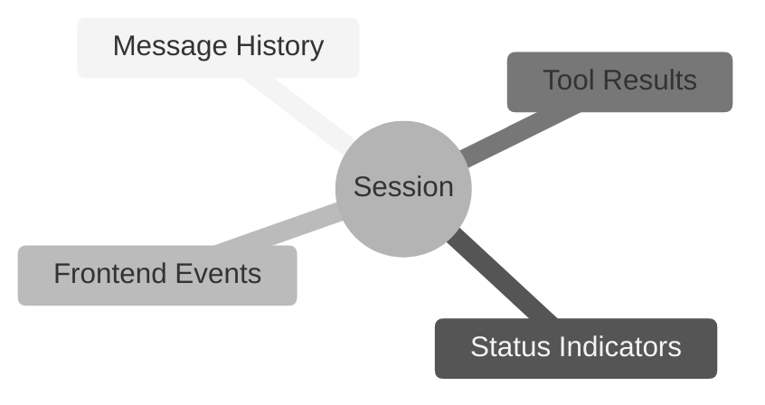
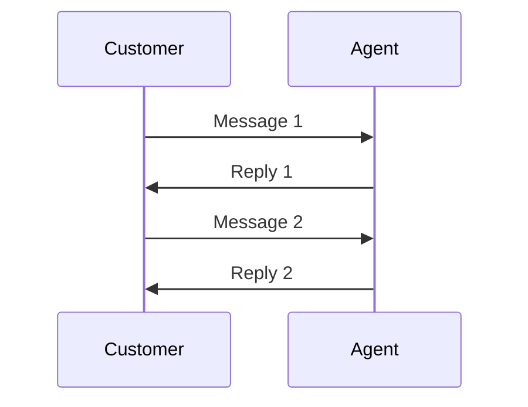
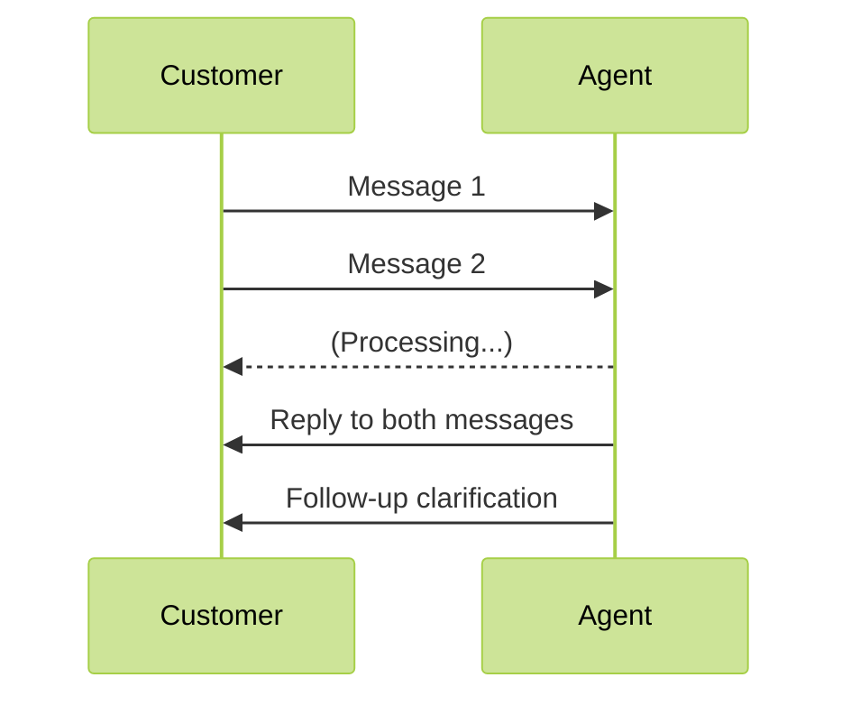
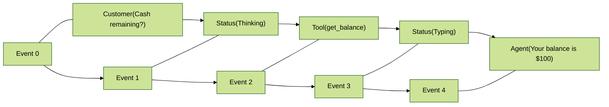
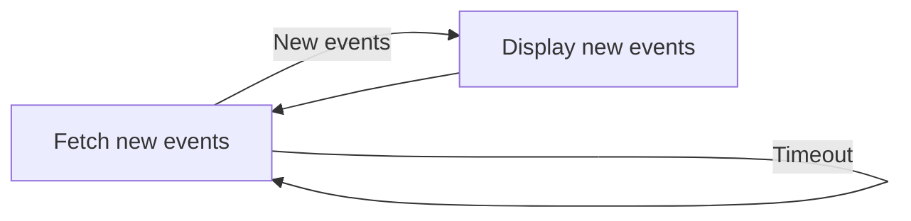

# Sessions

A session represents a continuous interaction between an [agent](https://parlant.io/docs/concepts/entities/agents) and a [customer](https://parlant.io/docs/concepts/entities/customers).

Sessions are the stage for your conversational model, allowing agents to engage with customers in a structured and persistent manner. They encapsulate all the interactions that occur between an agent and a customer, including messages, status updates, frontend events, and tool call results.



> **Agent Memory?**
>
> What some frameworks call "memory" is already built-in into sessions in Parlant. An agent is constantly aware of everything that has happened in the session, using this information to apply the right instructions and generate appropriate responses.

## A Modern Interaction Model

Parlant views interaction sessions in a different manner than most Conversational AI frameworks.

In the past few decades, virtually all forms of conversational AI have assumed that an interaction occurs on a turn-by-turn basis, where a customer sends a message, and the agent responds to it.

Yet this is not how real conversations work. People often send each other multiple subsequent messages to communicate their thoughts. In addition, an agent may say something, put the customer on hold for a moment, and then return to the conversation with a follow-up message.

**Rigid Interaction Model**



**Modern Interaction Model**



Since this is how real conversations work, Parlant provides built-in support for it from the ground up.

> **Multi-Participant Sessions**
>
> A requested feature on Parlant's development roadmap, this will allow you to have multiple agents interact with the customer, or with each other. Another use case for this is transferring the customer to another AI agent.

## Configuring Session Storage

You can choose where you store sessions.

By default, Parlant does not persist sessions, meaning that they are stored in memory and will be lost when the server restarts. This is useful for testing and development purposes.

If you want to persist sessions, you can configure Parlant to use a database of your choice. For local persistence, we recommend using the integrated JSON file storage, as there's zero setup required. For production use, you can use MongoDB, which comes built-in, or another database.

### Persisting to Local Storage
This will save sessions under `$PARLANT_HOME/sessions.json`.

```python
import asyncio
import parlant.sdk as p

async def main():
    async with p.Server(session_store="local") as server:
        # ...

asyncio.run(main())
```

### Persisting to MongoDB
Just specify the connection string to your MongoDB database when starting the server:

```python
import asyncio
import parlant.sdk as p

async def main():
    async with p.Server(session_store="mongodb://path.to.your.host:27017") as server:
        # ...

asyncio.run(main())
```

## Event Driven Communication

Think of a session in Parlant as a timeline of everything that's happened in a conversation.

Each moment in this timeline—whether it's someone speaking, a status update, or a tool call result—is captured as an event. These events line up one after another, each with its own position number (called its _offset_), starting from 0.

When a conversation unfolds, it creates a sequence of events. A customer might start the session by saying _"Hello"_—that's event 0. The system then notes that the agent has acknowledged the message and is preparing a response by outputting a status event—that's event 1. The agent's _"Hi there!"_ becomes event 2, and so on. Each event, whether it's a message being exchanged, the agent typing, or even an error occurring, takes its place in this ordered sequence.



Every event in this sequence carries important information: what type of event it is (like a message or a status update), what actually happened (the data), and when it occurred. This creates a complete record of the conversation that helps us understand exactly how things unfolded, making it easy to track and review the conversation's state when needed.

Each event is also associated with a **trace ID**. This ID primarily helps to trace between AI-generated messages and the engine triggers that produced them, including any generated tool events that may have informed them. This lets us easily fetch and understand the data that went into each generated message. For example, by having your frontend client inspect a message's traced tool events, you can show relevant information in "footnotes" under the message.

## Interacting with an Agent

Once you have a Parlant server up and running, you can interact with its hosted agents through the [REST API](https://parlant.io/docs/api/create-session).

You have three options:
1. Use the official React widget to quickly and easily integrate with the server
2. Use the official client SDKs for Python or TypeScript to build a custom frontend application
3. Use the [REST API](https://parlant.io/docs/api/create-session) directly by making HTTP requests to the server in your language of choice

### Using the Official React Widget

If your frontend project is built with React, the fastest and easiest way to start is to use the official Parlant React widget to integrate with the server.

Here's a basic code example to get started:

```jsx
import React from 'react';
import ParlantChatbox from 'parlant-chat-react';

function App() {
  return (
    <div>
      <h1>My Application</h1>
      <ParlantChatbox
        server="PARLANT_SERVER_URL"
        agentId="AGENT_ID"
      />
    </div>
  );
}

export default App;
```

For more documentation and customization, see the **GitHub repo:** https://github.com/emcie-co/parlant-chat-react.

```bash
npm install parlant-chat-react
```

### Building a Custom Frontend

If you're coding in Python or TypeScript, you can use the official, native client SDKs for a fully-typed experience.

**Python**
```bash
pip install parlant-client
```

**TypeScript**
```bash
npm install parlant-client
```

We'll now cover some basic use cases. The examples will be in Python, but the other SDKs have nearly identical APIs, so you can easily adapt them to your preferred language.

#### Initializing the Client
```python
from parlant.client import AsyncParlantClient

# Change localhost to your server's address
client = AsyncParlantClient(base_url="http://localhost:8800")
```

> **Async Client?**
>
> The examples given here use the asynchronous client, which is the recommended way to interact with Parlant. This allows you to handle events in real-time without blocking your application. It's usually much better for production use.
>
> However, if you prefer a synchronous client—for example, if you're just testing—you can use `ParlantClient` instead of `AsyncParlantClient`. The API remains the same, but you don't have to run within an async event loop.

#### Creating a Session
```python
await client.sessions.create(
    agent_id=AGENT_ID,  # The ID of the agent to interact with
    # Optional parameters
    customer_id=CUSTOMER_ID,  # Optional: defaults to the guest customer's ID
    title=SESSION_TITLE,  # Optional: session can be untitled
)
```

#### Sending Customer Messages to an Agent
You can send messages to an agent by creating a new message event in the session. This is how you initiate a conversation or continue an existing one.

```python
event = await client.sessions.create_event(
    session_id=SESSION_ID,
    kind="message",  # The event is of type 'message'
    source="customer",  # The message is from the customer
    message="Hello, I need help with my order.",
)
```

#### Receiving Messages from an Agent

As stated before, unlike LLM APIs where you send a prompt and wait for a direct response, Parlant agents operate in their own timeline according to triggers, more like real conversation partners.

Much like a human service representative, they process information and decide when and how to respond based on their understanding of the context. This allows you to build much more flexible, ambient agentic experiences that can engage with customers proactively.

However, it also means we need to approach communication with them differently. Here's how you can do that:

```python
new_events = await client.sessions.list_events(
    session_id=SESSION_ID,
    min_offset=EVENT_OFFSET,  # The offset of the last event you received (or created yourself)
    wait_for_data=60,  # Wait for up to 60 seconds for new events, before timing out
)
```

Normally, you'd have this polling in a loop. This way, you can keep checking for new events in the session, allowing you to receive messages from the agent asynchronously, whenever they arrive, due to whatever reason.



### Displaying Messages

Consult the message event's structure below to see how to display messages in your frontend application.

Here's a simple example:

```python
agent_message = next((m for m in new_events if m.kind == "message" and m.source == "ai_agent"), None)

if agent_message:
    print(f"Agent: {agent_message.data['message']}")
```

### Events

If you decide to build a custom frontend, here's a quick overview of Parlant's event structure.

#### Event Types
Parlant defines several event types that you can work with:

1. `"message"`: Represents a message sent by a participant in the conversation.
2. `"status"`: Represents a status update from the AI agent, such as "thinking...", or "typing...".
3. `"tool"`: Represents the result of a tool call made by the AI agent.
4. `"custom"`: Represents a custom event defined by your application. This is useful for feeding custom state updates into your agent, e.g., making it aware of the customer's navigational state within your frontend application.

#### Event Offset
As said above, events are ordered by their offset, which is a number that indicates the order in which they occurred within the session. The first event in a session has an offset of 0, the second has an offset of 1, and so on.

This is useful because, when you list events, you can specify a minimum offset to only receive events that occurred after a certain point in time. This allows you to poll new events without having to re-fetch all previous ones.

#### Event Trace ID
Each event has a trace ID, which is a unique identifier that helps you track related events and their logs.

As one example, when an AI agent generates a message, it may also generate tool events that provide additional context or data used in that message. The trace ID allows you to link these events together, making it easier to understand the flow of information as well as your agent's processing in the session.

#### Event Sources
Events in Parlant can originate from different sources. Here's a quick overview of the possible sources:

1. `"customer"`: The event's data was created by the customer. Currently, this is always a message.
2. `"customer_ui"`: The event was created by the customer's user interface, to feed relevant state into the agent.
3. `"ai_agent"`: The event was generated by an AI agent, such as a message or a status update.
4. `"human_agent"`: The event was manually created by a human, typically in a human-handoff scenario.
5. `"human_agent_on_behalf_of_ai_agent"`: As above, the event was created by a human agent, but it appears to the customer as if it came from an AI agent. This can be useful for maintaining a consistent experience where you don't necessarily want to reveal the fact that a human agent got involved.
6. `"system"`: The event was generated by the system, such as a tool-call result.

#### Message Event
A message event, as its name suggests, represents a message written by someone.

```json
{
    id: EVENT_ID,
    kind: "message",
    source: EVENT_SOURCE,
    offset: N,
    trace_id: TRACE_ID,
    data: {
        message: MESSAGE,
        participant={
            id: PARTICIPANT_ID,
            display_name: PARTICIPANT_DISPLAY_NAME
        },
        draft: OPTIONAL_DRAFT,  // Optional: if the message is a canned response
    }
}
```

#### Status Event
A status event represents an update on the status of the AI agent, and currently always has the source `"ai_agent"`.

Status events are great for displaying conversational updates during a chat with a customer. For example, you can have your frontend indicate when the agent is thinking or typing. There are 6 kinds of status events that you can make use of:

1. `"acknowledged"`: The agent has acknowledged the customer's message and started working on a reply
1. `"cancelled"`: The agent has cancelled its reply in the middle, normally because new data was added to the session
1. `"processing"`: The agent is evaluating the session in preparation for generating an appropriate reply
1. `"typing"`: The agent has finished evaluating the session and is currently generating a message
1. `"ready"`: The agent is idle and ready to receive new events
1. `"error"`: The agent encountered an error while trying to generate a reply

```json
{
    id: EVENT_ID,
    kind: "status",
    source: "ai_agent",
    offset: N,
    trace_id: TRACE_ID,
    data: {
        status: STATUS_KIND,
        data: OPTIONAL_DATA
    }
}
```

#### Tool Event
A tool event represents the result of a tool call made by the AI agent. It contains the result of the tool call, which can be used to inform the agent's next message.

The `result` object for each call comes directly from the [ToolResult](https://parlant.io/docs/concepts/customization/tools#tool-result) object returned by tool calls.

```json
{
    id: EVENT_ID,
    kind: "tool",
    source: "system",
    offset: N,
    trace_id: TRACE_ID,
    data: {
        tool_calls: [
            {
                tool_id: TOOL_ID,
                arguments: {
                    NAME: VALUE,
                    ...
                },
                result: {
                    data: TOOL_RESULT_DATA,  // The result of the tool call
                    metadata: TOOL_RESULT_METADATA,  // Optional metadata about the tool result
                    ... // Other available fields
                }
            },
            ...
        ]
    }
}
```
