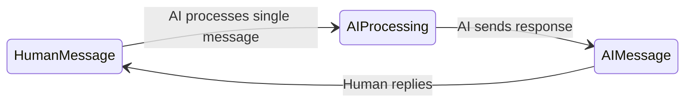
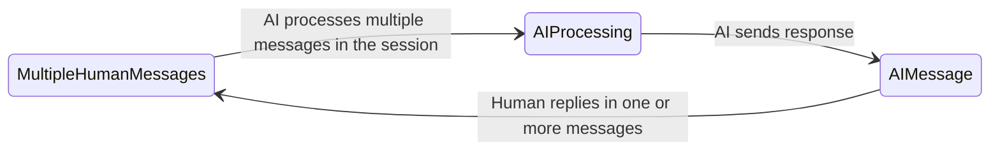
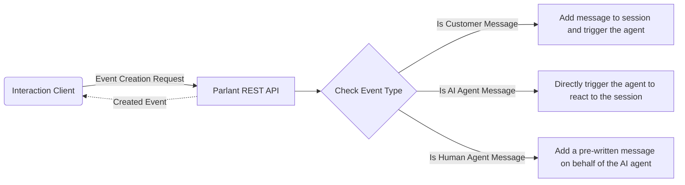
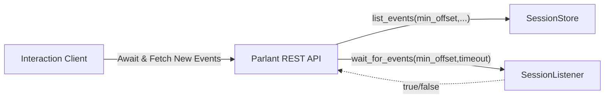

# Interaction Flow

## Motivation

The first thing that's important to understand about the design of the Human/AI interface in Parlant is that it's meant to facilitate conversations that aren't only natural in content, but also in their flow.

Most traditional chatbot systems (and most LLM interfaces) rely on a request-reply mechanism based on a single last message.

However, these days we know that a natural text interface must allow for a few things that are unsupported by that traditional model:

1. A human often expresses themselves in more than a single message event, before they're fully ready for a reply from the other party.
1. Information regarding their intent needs to be captured from not only their last N messages, but from the conversation as a whole.

Moreover, the agent may need to respond not just when triggered by a human message; for example, when it needs to follow-up with the user to ensure their message was received, to try another engagement tactic, or to buy time before replying with further information, e.g., "Let me check that and get back to you in a minute."

## Solution

Parlant's API and engine is meant to work in an asynchronous fashion with respect to the interaction session. In simple terms, this means that both the human customer and the AI agent are free to add events (messages) to the session at any point in time, and in any number—just like in a real IM App conversation between two people.

### Sending Messages

The diagram above shows the API flows for initiating changes to a session.
1. **Customer Message:** This request adds a new message to a session on behalf of the customer, and triggers the AI agent to respond asynchronously. This means that the *Created Event* does not in fact contain the agent's reply—that will come in time—but rather the ID (and other details) of the created and persisted customer event.
1. **AI Agent Message:** This request directly activates the full reaction engine. The agent will match and activate the relevant guidelines and tools, and produce a reply. The *Created Event* here, however, is not the agent's message, since that may take some time. Instead, it returns a *status event* containing the same *Trace ID* as the eventual agent's message event. It's important to note here that, in most frontend clients, this created event is usually ignored, and is provided mainly for diagnostic purposes.
1. **Human Agent Message:** Sometimes it makes sense for a human (perhaps a  developer) to manually add messages on behalf of the AI agent. This request allows you to do that. The *Created Event* here is the created and persisted manually-written agent message.

### Receiving Messages

Since messages are sent asyncrhonously, and potentially simultaneously, receiving them must be done in asynchronous fashion as well. In essence, we are to always wait for new messages, which may arrive at any time, from any party.

Parlant implements this functionality with a long-polling, timeout-restricted API endpoint for listing new events. This is what it does behind the scenes:

When it receives a request for new messages, that request generally has 2 important components: 1) The session ID; and 2) The minimum event offset to return. Normally, when making a request to this endpoint, the frontend client is expected to pass the session ID at hand, and *1 + the offset of its last-known event*. This will make this endpoint return only when *new* messages arrive. It's normal to run this long-polling request in a loop, timing-out every 60 seconds or so and renewing the request while the session is open on the UI. It's this loop that continuously keeps your UI updated with the latest messages, regardless of when they arrive or what caused them to arrive.

In summary, Parlant implements a flexible conversational API that supports natural, modern Human/AI interactions.
