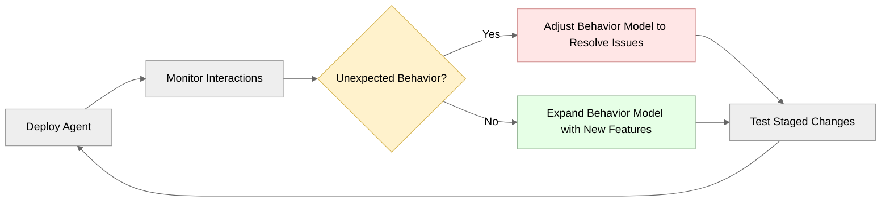

# Agentic Design Methodology

Building AI agents takes a fundamental paradigm shift from traditional software development. This article explores the unique challenges, methodologies, and design principles needed to create effective customer-facing agents.

While Parlant provides the tools for reliable agent behavior, success depends on mastering the art of semantic design—learning how to articulate instructions that work consistently at scale while maintaining natural user interactions.

## Understanding Probabilistic Behavior

AI agents operate differently from traditional software systems. In conventional development, deterministic functions produce consistent outputs for the same inputs. AI agents, however, are built on statistical models where the same input can produce varied responses based on the model's learned patterns and probability distributions.

Naturally, when we're building on top of an inherently uncertain foundation, this requires a different approach to design and implementation. This is the first important thing to pause and come to terms with about agentic design.

### Instruction Interpretation Challenges

While traditional software executes explicit commands with predictable outcomes, LLMs interpret instructions contextually, filling in details and assumptions based on their varied training data. They _have_ to work like this.

Consider this guideline example:
```python
agent.create_guideline(
    condition="Customer is unhappy",
    action="Make them feel better"
)
```

Both the condition and instruction are too vague and could result in undesirable behaviors:
- Offering unauthorized discounts
- Making promises the company cannot fulfill
- Using inappropriate communication styles

> **Warning: Interpretation Variability**
>
> LLMs trained to be helpful will attempt to fulfill requests even when they lack sufficient context or specificity. This can lead to responses that seem appropriate to the model but violate business rules or expectations.

## The Challenge of Complete Control

It's important to understand that, while Parlant adds many compliance mechanisms on top of LLMs, the LLMs themselves cannot be fully constrained from discussing certain topics, for two fundamental reasons:

**1. Pattern Mimicking, Not Reasoning**: LLMs don't actually "reason" in the logical sense. Everything they produce is essentially mimicking patterns of expression observed during training. Think of an LLM as a powerful but wild horse—it has immense capability, but it takes skill and nuance to "ride" it effectively.

**2. Contextual Ambiguity**: Even carefully crafted conditions and actions can become ambiguous across different and variegated interaction contexts. What seems clear in one scenario may be interpreted differently in a different context.

### Strategies for Compliance

For agents that must meet compliance standards and expectations, you need a layered approach:

**The Minimum: Guidance-Based Boundaries**
With guidelines, you can:
1. Set clear boundaries for acceptable behavior
2. Provide deliberate nudges and instructions for handling specific scenarios in intended ways
```python
await agent.create_guideline(
    condition="Customer asks about topics outside your designated scope",
    action="Politely decline to discuss the topic and redirect to what you can help with"
)
```

```python
await agent.create_guideline(
    condition="The patient wants an analysis of their lab results",
    action="Never provide any interpretation of the results. Instead, tell them to "
        "call our office and ask to speak with their doctor for a detailed analysis",
)
```

**The Robust Solution: Canned Responses**
For truly critical interactions where unauthorized communication could cause problems, implement [canned responses](https://parlant.io/docs/concepts/customization/canned-responses) and set your agent's composition mode to `STRICT`:

```python
await agent.create_canned_response(
    template="I can help you with account questions, but I'll need to connect you "
        "with a specialist for policy details. Would you like me to transfer you?"
)
```

Canned responses ensure that in high-risk scenarios, your agent uses pre-approved language and content that eliminates the possibility of unauthorized statements. Yes, this requires more work, but you can add these iteratively. The key insight is building an agent you can trust not to create liability—not even one time in a million interactions.

This "defense in depth" approach acknowledges that working with LLMs means learning to guide, steer and constrain, rather than control completely. It also means that, _as long as the behavior of the agent is within acceptable bounds,_ we must allow for some degree of flexibility and variability in responses.

## Tool Calling Complexities

When agents need to interact with external systems, they use tools (functions that perform specific actions). However, LLMs face unique challenges when calling tools that don't exist in traditional software development.

### The Parameter Guessing Problem

LLMs must determine tool parameters based on conversational context rather than explicit specifications. This creates several common failure patterns:

1. **Missing Information**: Agents may call tools without all required parameters being present in context, encouraging them to guess or hallucinate values.
1. **Type Confusion**: An agent might pass an email address where a user ID is expected, or provide a string where an integer is needed.
1. **Context Misinterpretation**: When multiple entities exist in conversation context, agents may use the wrong one for a parameter.
1. **False Positive Bias**: When multiple tools seem applicable, agents may call the first one that seems relevant, even if it's not the best fit.

Consider a user saying: "Schedule a meeting with Sarah for next week." The agent must determine:
- Which Sarah (if multiple exist)
- What day/time "next week" means
- What type of meeting
- How long the meeting should be
- What calendar system to use

Each ambiguity is a potential failure point. Parlant therefore provides you with specific controls to guide the contextual relevance of tools, as well as their precise parameterization expectations.

> **Tip: Tool Design Deep Dive**
>
> Tool calling presents unique challenges for agents, from parameter interpretation to multi-step orchestration failures. For comprehensive guidance on designing agent-friendly tools, particularly for customer-facing scenarios with Parlant, see:
> 
> - [Tools documentation](https://parlant.io/docs/concepts/customization/tools) - Parlant's approach to guided tool usage
> - [Agentic API Design blog post](https://parlant.io/blog/what-no-one-tells-you-about-agentic-api-design) - Detailed strategies for building reliable agent-friendly APIs

## Iterative Development Process

Realistically, semantic behavior cannot be fully specified upfront like traditional software requirements. Instead, agent design follows an iterative process where behavior is best refined based on observed interactions and feedback.

### Phase 1: Basic Agent Implementation

When you're starting out, focus on implementing the core functionality and happy-paths of your agent, as far as you're able to define them. This means defining the basic guidelines and journeys that cover the most common scenarios.

Focus on getting core functionality to work before addressing edge cases. The good news is that Parlant's framework allows you to start simple and build complexity over time in a fairly straightforward manner.

### Phase 2: Monitoring and Analysis

Deploy the agent in a controlled environment and monitor its interactions. Unexpected behaviors provide insights into how the agent interprets instructions differently than intended. It'll also show you how users _actually_ interact with the agent, which is often somewhat different than most of us initially expect as we're designing them!

Track these interaction patterns:
- Situations where the agent deviates from expected responses
- Triggers that lead to undesired behaviors
- User confusion, frustration points, or peculiar interaction patterns



### Phase 3: Targeted Refinements

Leverage Parlant's structured approach to behavior modeling to address specific issues identified during monitoring. Add [guidelines](https://parlant.io/docs/concepts/customization/guidelines) that target observed problems:

```python
# Problem: Agent was repeating upsell offers after explicit rejection
await agent.create_guideline(
    condition="Customer has explicitly declined a premium upgrade in this conversation",
    action="Do not mention upgrades again in this session"
)
```
```python
# Problem: Agent gave vague responses when appointments were unavailable
await agent.create_guideline(
    condition="Customer requests a specific appointment time that is not available",
    action="Immediately provide the three closest available time slots as concrete alternatives",
    tools=[get_available_slots],
)
```


### Guideline Specificity Requirements
Effective guidelines specify the temporal scope of their application and provide concrete, actionable instructions.

When designing guidelines, it's best to address these common ambiguity sources:

**Action Temporal Scope**: How long should the guideline's effect last?
- "...throughout the conversation" - applies throughout the current session
- "...immediately" - applies to the next response only
- "...until the customer has..." - applies until a specific condition changes

**Action Clarity**: What exactly should the agent do?
- Guide the response content: "Tell them that..."
- Specify objective criteria: "three closest alternatives" not "some alternatives"

**Condition Precision**: When exactly does this guideline apply?
- "Customer has explicitly declined" is clearer than "Customer is unhappy"
- "Customer asks about a specific policy and you don't have the exact answer" is more precise than "You're unsure"

## Managing Probabilistic Behavior

Agent design requires balancing flexibility with predictability. Agents need sufficient freedom to handle varied user inputs naturally while maintaining consistent adherence to business rules.

### Implementing Bounded Flexibility

Effective guidelines provide clear boundaries while allowing natural conversation flow:

```python
# Too rigid - feels scripted
await agent.create_guideline(
    condition="Customer asks about pricing",
    action="Say exactly: 'Our premium plan is $99/month'"
)
```
```python
# Too open - unpredictable behavior
await agent.create_guideline(
    condition="Customer asks about pricing",
    action="Help them understand our pricing"
)
```
```python
# Balanced approach - specific but flexible
await agent.create_guideline(
    condition="Customer asks about pricing",
    action="Explain our pricing tiers clearly, emphasize value, "
        "and ask about their specific needs to recommend the best fit"
)
```

### Handling Edge Cases

Agents will encounter unexpected inputs and edge cases. Design guidelines to handle these situations gracefully:

```python
# Immediate escalation for policy questions
await agent.create_guideline(
    condition="Customer asks about a specific policy and you don't have the exact answer",
    action="Tell them you want to ensure they get accurate policy information, "
        "and offer to connect them to human support who can provide the specifics"
)
```
```python
# Redirect competitor questions once per conversation
await agent.create_guideline(
    condition="Customer asks about competitor products or pricing",
    action="Acknowledge their question, explain that you focus on our own products, "
        "and ask specifically what features or capabilities they're looking for "
        "so you can recommend the best option from our lineup"
)
```

## Structured Interactions

For complex multi-step processes, guidelines alone may not provide sufficient structure. [Journeys](https://parlant.io/docs/concepts/customization/journeys) offer a better approach for these scenarios.

### When to Use Journeys

Consider implementing journeys when agents struggle with complex, multi-step interactions:

```python
# Instead of many guidelines trying to handle booking flow, use a structured journey...
booking_journey = await agent.create_journey(
    title="Book Appointment",
    conditions=["Customer wants to schedule an appointment"],
    description="Guide customer through appointment booking process"
)

# Create a clear, flexible flow
t1 = await booking_journey.initial_state.transition_to(
    chat_state="Ask what type of service they need"
)
t2 = await t1.target.transition_to(
    tool_state=check_availability_for_servic_for_servicee,
)
t3 = await t2.target.transition_to(
    chat_state="Offer available time slots"
)
# ... continue building the journey
```

Journeys provide conversational structure while maintaining flexibility, allowing agents to adapt to different interaction patterns within a defined framework.

## Development Philosophy for Customer-Facing Agents

Building customer-facing agents requires balancing several competing priorities that don't exist in traditional software development.

### User Experience vs. Business Control

Traditional user interfaces provide users with explicit options—buttons, forms, menus. Users can only do what the interface allows. Conversational agents invert this relationship: users can say anything, and the agent must decide how to respond within business constraints.

This creates a unique tension. Users expect natural, helpful interactions, but businesses need predictable, compliant behavior. The agent must feel conversational while operating within defined boundaries.

### Conversational Design Principles

**Context Preservation**: Unlike web forms that capture data step-by-step, conversations are non-linear. Users might provide information out of order, change their minds, stall, repeat themselves, or digress. Agents must maintain compliance while allowing natural conversation flow.

**Progressive Disclosure**: Rather than overwhelming users with all options upfront, agents can reveal capabilities contextually. This requires guidelines that respond to user needs as they emerge.

**Recovery Mechanisms**: When conversations go off-track, agents need explicit strategies to redirect without frustrating users. This often requires journey-scoped guidelines that handle common deviations.

### Protocol Adherence and Communication Standards

Customer-facing agents must follow established protocols and communicate in ways that align with business standards. The primary challenge is ensuring agents never provide misleading information while expressing things in the manner your organization approves of—which includes branding guidelines.

Parlant provides four main tools for maintaining communication standards:

1. **Guidelines:** Set behavioral boundaries and response patterns
1. **Journeys:** Structure complex interactions to ensure proper protocol adherence
1. **Canned Responses:** Guarantee exact wording for tailored communications
1. **Retrievers:** Grounds the agent's responses in accurate, up-to-date information

This layered approach ensures agents accurately follow protocol while maintaining natural conversation flow, never saying something critically misleading, and always expressing information in business-approved ways.

## The Art of Behavior Modeling

The primary challenge in agentic development isn't technical—it's designing effective interactions and then translating those designs into instructions that work reliably at scale, and that customers actually engage with.

Effective behavior modeling often combines:

**Domain Knowledge**: Understanding not just what customers need, but how they express those needs, what frustrates them, and what builds their confidence.

**Conversation Flow Design**: Knowing how to structure multi-turn interactions that feel natural while efficiently gathering necessary information.

**Instruction Design**: The skill of writing guidelines that are clear and precise enough for consistent LLM interpretation but flexible enough for natural conversation and adaptivity.

### Practical Design Strategies

**Start with User Stories, Not Features**: Instead of "the agent should handle returns," put yourself in your customer's shoes, like "As a customer who bought the wrong size, I want to exchange it..."

**Use Progressive Complexity**: Begin with the simplest possible behavior model that handles the common case. Add complexity only when specific edge cases are found. Parlant makes this iteration fairly straightforward.

**Separate Intent from Implementation**: Guidelines should focus on what clear outcome to achieve rather than specific words to use. This allows the agent to adapt its approach while maintaining consistent goals.

## The Twofold Challenge of Agentic Development

Agentic development involves two distinct but related problems:

1. **Articulating Instructions**: Designing a high-quality behavior model that captures your intended behavior
2. **Ensuring Compliance**: Guaranteeing that agents actually follow these instructions consistently at scale

Parlant solves the second challenge effectively. Once you've articulated your expectations clearly, Parlant's guideline matching, journey management, and enforcement mechanisms ensure reliable adherence to your specifications. The framework handles the complex task of dynamically selecting relevant guidelines, managing conversation context, and supervising agent outputs.

However, Parlant cannot solve the first challenge for you. The framework provides powerful tools for expressing conversational behavior, but it's on us as developers to learn how to use these tools effectively. This is where the real expertise lies—not just in understanding Parlant's SDK, but in developing the skills to design conversations and articulate instructions that work in practice.

**The Framework's Role**: Parlant ensures that well-designed guidelines are followed reliably across thousands of interactions. It handles the technical complexity of context management, guideline selection, and behavioral enforcement.

**The Developer's Role**: Learning to write guidelines that are neither too vague nor too rigid, designing journeys that accommodate real user behavior, and developing the judgment to know when to add structure versus when to allow flexibility.

This division of responsibility means that mastering agentic development requires both technical proficiency with Parlant's capabilities and behavior modeling expertise. The most successful implementations recognize that behavior modeling is a specialized skill involving continuous refinement through real-world testing.

## Implementation Guidelines: Summary

Effective agentic design requires understanding how to work with probabilistic behavior effectively:

1. **Begin with basic functionality** - Implement core capabilities before addressing edge cases
2. **Monitor systematically** - Track agent behavior to identify areas for improvement
3. **Refine iteratively** - Add guidelines based on observed rather than hypothetical issues
4. **Balance flexibility and control** - Provide clear boundaries while allowing natural interaction
5. **Structure complex flows** - Use journeys for multi-step processes
6. **Maintain transparency** - Communicate capabilities and limitations clearly

The primary challenge isn't technical mastery of Parlant's features, but developing the behavior modeling expertise to articulate instructions that work reliably at scale. Parlant handles the enforcement—your role is learning the art of clear agentic design.
