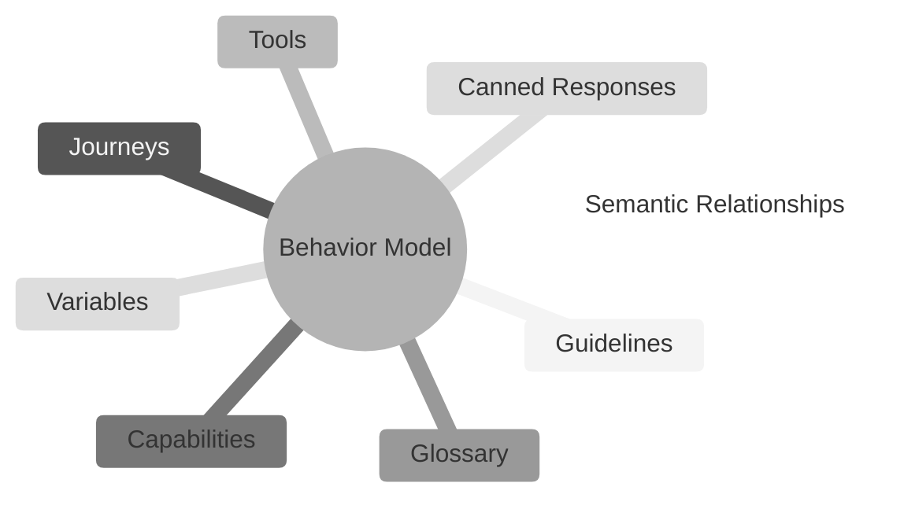
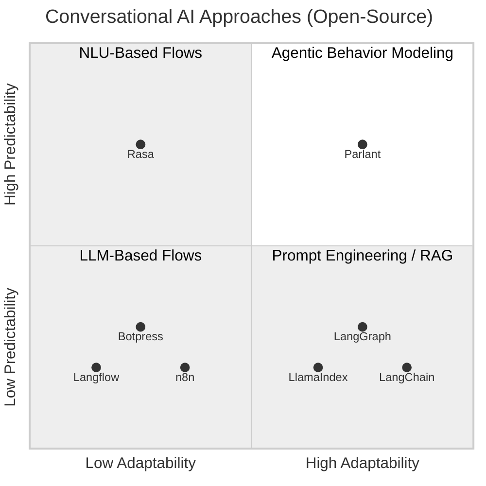

# Motivation

Let's say you downloaded some agent framework and built an AI agent—that's great! However, when you actually test it, you see it's not handling many customer interactions properly. Your business experts are displeased with it. Your prompts are turning into a mess. What do you do?

Enter the world of **Agentic Behavior Modeling (ABM)**: a new powerful approach to controlling how your agents interact with your users.

A behavior model is a structured, custom-tailored set of principles, actions, objectives, and ground-truths that orientates an agent to a particular domain or use case.



#### Why Behavior Modeling?

The problem of getting an LLM agent to say and do what _you_ want it to is a hard one, experienced by virtually anyone building customer-facing agents. Here's how ABM compares to other approaches to solving this problem.

- **Flow engines**, in which you build turn-by-turn conversational flowcharts, _force_ the user to interact according to predefined scripts. This rigid approach tends to lead to poor user engagement and trust. In contrast, an **ABM engine** dynamically _adapts_ to a user's natural interaction patterns while conforming to your business rules.

- **Free-form prompt engineering**, be it with graph-based orchestration or system prompts, frequently leads to _inconsistent and unreliable behavioral conformance_, failing to uphold requirements and expectations. Conversely, an **ABM engine** leverages clear semantical structures and annotations to facilitate conformance to business rules.



## What is Parlant?

Parlant is an open-source **ABM Engine** for LLM agents, which means that you can use it to precisely control how your LLM agent interacts with users in different scenarios.

Parlant is a full-fledged framework, prebuilt with numerous proven features to help you ramp up quickly with customer-facing agents and make the behavior modeling process as easy as possible.

## Why Parlant?

Many conversational AI use cases require strict conformance to business rules when interacting with users. However, until now this has been exceedingly difficult to achieve with LLMs—at least when consistency is a concern.

Parlant was built to solve this challenge. By implementing a structured, developer-friendly approach to modeling conversational behavior, through carefully designed rules, entities, and relationships, Parlant allows you to define, enforce, track, and reason about agent decisions in a simple and elegant manner.

## Behavior Modeling 101: Granular Guidelines

The most basic yet powerful modeling entity in a Behavior Model is the **guideline**. In Parlant, instead of defining your guidelines in free-form fashion (as you might do in a system prompt), you define them in **granular** fashion, where each guideline adds an individual **clarification** that nudges your AI agent on how to approach a particular situation.

To ensure your agent stays focused and consistent conformant to your guidelines, Parlant automatically filters and selects the most relevant set of guidelines for it to apply in any given situation, out of all of the guidelines you provide it. It does this by looking both at a guideline's _condition_ (which describes the circumstances in which it should apply) and its _action_ (describing what it should do).

Finally, it applies enforcement to ensure that the matched guidelines are actually followed, and provides you with explanations for your agent's interpretation of situations and guidelines at every turn.

Working iteratively, adding guidelines wherever you find the need, you can get your LLM agent to approach and handle various different circumstances according to your exact needs and expectations.

```python
await agent.create_guideline(
  condition="you have suggested a solution that did not work for the user",
  action="ask if they'd prefer to talk to a human agent, or continue troubleshooting with you",
)`,
```

Much of what Parlant does behind the scenes is understanding when a guideline should be applied. This is trickier than it may seem. For example, Parlant automatically keeps track of whether a guideline has already been applied in a conversation, so that it doesn't repeat itself unnecessarily. It also distinguishes between guidelines that are _always_ applicable, and those that are only applicable _once_ in a conversation. And it does this while minimizing cost and latency.

> **AI Behavior Explainability**
>
> Once guidelines are installed, you can get clear feedback regarding their evaluation at every turn by inspecting Parlant's logs.
>
> Learn more about this in the section on how Parlant implements [enforcement & explainability](https://parlant.io/docs/advanced/explainability).

## Understanding the Pain Point

By now, while most people building AI agents know hallucinations are an important challenge, still too few are aware of the practical alignment challenges that come with building effective conversational LLM agents.

Here's the thing. An [LLM](https://en.wikipedia.org/wiki/Large_language_model) is like a stranger with an encyclopedic knowledge of different approaches to every possible situation. Although incredibly powerful, **this combination of extreme versatility and inherent lack of context is precisely why it so rarely behaves as we'd expect**—there are too many viable options for it to choose from.

This is why, without a clear and comprehensive set of [guidelines](https://parlant.io/docs/concepts/customization/guidelines), an LLM will always try to draw optimistically from its vast but unfiltered set of training observations. It will easily end up using tones that are out of touch with the customer or the situation, making irrelevant offers, getting into loops, or just losing focus and going off on tangents.


Behavior modeling is an approach whose goal is to streamline LLM agent guidance. Every time you see your agent missing the mark, you narrow it down to a necessary change in the behavior model, and solve it quickly by adjusting it. You do this primarily using [guidelines](https://parlant.io/docs/concepts/customization/guidelines.mdx), as well as other modeling elements that Parlant supports.

To this end, Parlant is designed from the ground up to allow you to **quickly tune-up your agent's behavior whenever you encounter unexpected behavior** or get feedback from customers and business experts. The result is an effective, controlled, and incremental cycle of improvement.


The informed premise behind Parlant is that [poorly guided AI agents are a dead-end](https://parlant.io/about#the-intrinsic-need-for-guidance). Without guidance, AI agents are bound to encounter numerous ambiguities, and end up trying to resolve them using many incorrect or even problematic approaches. **Only you can authoritatively teach your agent how to make the right choices for you**—so you should be able to do so easily, quickly, and reliably.

Instead of an agent that goes around the bush, meanders, and offers irrelevant solutions or answers, **Parlant helps you build an agent that is guided, focused, and feels well-designed**—one that your customers would actually use.


So pack your bags and get ready to model some awesome AI conversations. You've got the controls now. Let's start!
