# PRIME: Predictive Retrieval with Intelligent Memory Embeddings

## Comprehensive Project Overview Document

**Version:** 1.0  
**Date:** January 2026  
**Author:** Tom Mathews
**Status:** Design Phase

---

## Table of Contents

1. [Executive Summary](#1-executive-summary)
2. [Project Overview](#2-project-overview)
3. [Overall System Architecture](#3-overall-system-architecture)
4. [Individual Component Design](#4-individual-component-design)
5. [Data Flow & Integration](#5-data-flow--integration)
6. [User Workflows](#6-user-workflows)
7. [Technology Stack](#7-technology-stack)
8. [Development Roadmap](#8-development-roadmap)
9. [Success Metrics](#9-success-metrics)
10. [Risk Assessment](#10-risk-assessment)
11. [Appendices](#11-appendices)

---

## 1. Executive Summary

### 1.1 Problem Statement

Current RAG (Retrieval-Augmented Generation) systems suffer from three critical inefficiencies:

| Problem | Impact | Current State |
|---------|--------|---------------|
| **Reactive Retrieval** | Suboptimal context selection | Query embedding used directly for retrieval |
| **Over-Retrieval** | Wasted compute, context pollution | Retrieval triggered on every turn |
| **Memory Fragmentation** | Redundant storage, poor recall | Similar memories stored separately |

### 1.2 Proposed Solution

**PRIME** addresses these challenges by applying principles from Meta FAIR's VL-JEPA (Joint Embedding Predictive Architecture) to RAG and memory systems:

```
┌─────────────────────────────────────────────────────────────────┐
│                      PRIME INNOVATION                           │
├─────────────────────────────────────────────────────────────────┤
│  WHEN to retrieve  →  Semantic State Monitor (variance-based)   │
│  WHAT to retrieve  →  Embedding Predictor (JEPA-style)          │
│  HOW to store      →  Memory Cluster Store (consolidation)      │
└─────────────────────────────────────────────────────────────────┘
```

### 1.3 Expected Outcomes

| Metric | Target Improvement | Baseline 
|--------|-------------------|----------|
| Retrieval Frequency | 60-70% reduction | Every turn |
| Retrieval Precision@5 | +15-25% | Standard RAG |
| Memory Storage Efficiency | 3-5x compression | Raw storage |
| End-to-end Latency | 40% reduction | Sequential RAG |

---

## 2. Project Overview

### 2.1 Vision

Build a next-generation retrieval and memory system that **predicts what context is needed** rather than reactively searching, **selectively injects context** only when semantically necessary, and **consolidates memories** into efficient semantic clusters.

### 2.2 Core Principles (from VL-JEPA)

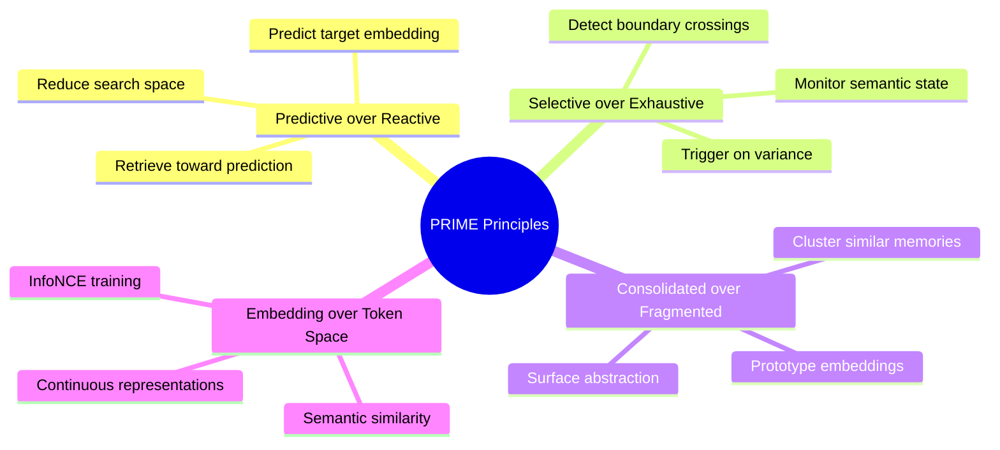
```mermaid
mindmap
  root((PRIME Principles))
    Predictive over Reactive
      Predict target embedding
      Retrieve toward prediction
      Reduce search space
    Selective over Exhaustive
      Monitor semantic state
      Detect boundary crossings
      Trigger on variance
    Consolidated over Fragmented
      Cluster similar memories
      Prototype embeddings
      Surface abstraction
    Embedding over Token Space
      Continuous representations
      InfoNCE training
      Semantic similarity
```

### 2.3 Key Innovations

| Innovation | Description | VL-JEPA Inspiration |
|------------|-------------|---------------------|
| **Predictive Retrieval** | Predict the embedding of ideal context before searching | Predictor: (S_V, X_Q) → Ŝ_Y |
| **Variance-Based Triggering** | Only retrieve when conversation semantic state shifts | Selective decoding via embedding variance |
| **Memory Consolidation** | Collapse similar memories into cluster prototypes | Y-Encoder abstracting surface variability |
| **Dual Encoder Architecture** | Separate encoders for queries (X) and targets (Y) | X-Encoder / Y-Encoder separation |

### 2.4 Target Use Cases

1. **Conversational AI Assistants** - Long-running conversations with evolving context needs
2. **Enterprise Knowledge Bases** - Large document collections with multi-hop reasoning
3. **Personal AI Agents** - Persistent memory across sessions with privacy constraints
4. **Research Assistants** - Complex information synthesis from multiple sources

---

## 3. Overall System Architecture

### 3.1 High-Level Architecture

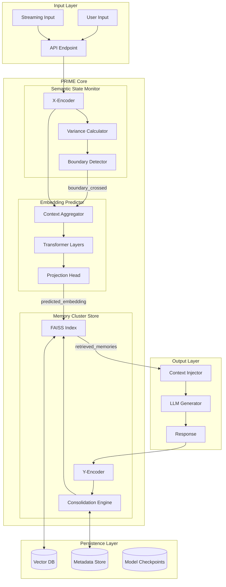
```mermaid
flowchart TB
    subgraph Input["Input Layer"]
        UI[User Input]
        API[API Endpoint]
        STREAM[Streaming Input]
    end

    subgraph PRIME["PRIME Core"]
        subgraph SSM["Semantic State Monitor"]
            ENC1[X-Encoder]
            VAR[Variance Calculator]
            BD[Boundary Detector]
        end

        subgraph PRED["Embedding Predictor"]
            CTX[Context Aggregator]
            TRANS[Transformer Layers]
            PROJ[Projection Head]
        end

        subgraph MCS["Memory Cluster Store"]
            YENC[Y-Encoder]
            FAISS[FAISS Index]
            CONS[Consolidation Engine]
        end
    end

    subgraph Output["Output Layer"]
        CTX_INJ[Context Injector]
        LLM[LLM Generator]
        RESP[Response]
    end

    subgraph Storage["Persistence Layer"]
        VDB[(Vector DB)]
        META[(Metadata Store)]
        CKPT[(Model Checkpoints)]
    end

    UI --> API
    STREAM --> API
    API --> ENC1
    ENC1 --> VAR
    VAR --> BD
    BD -->|boundary_crossed| CTX
    ENC1 --> CTX
    CTX --> TRANS
    TRANS --> PROJ
    PROJ -->|predicted_embedding| FAISS
    FAISS -->|retrieved_memories| CTX_INJ
    CTX_INJ --> LLM
    LLM --> RESP
    RESP --> YENC
    YENC --> CONS
    CONS --> FAISS
    FAISS <--> VDB
    CONS <--> META
```

### 3.2 Component Overview

| Component | Responsibility | Input | Output |
|-----------|---------------|-------|--------|
| **Semantic State Monitor** | Detect when retrieval is needed | User input text | Boundary signal + variance |
| **Embedding Predictor** | Predict target context embedding | Context + query embeddings | Predicted embedding Ŝ_Y |
| **Memory Cluster Store** | Store, retrieve, consolidate memories | Embeddings + content | Retrieved memories |
| **Y-Encoder** | Encode content for memory storage | Text content | Target embedding S_Y |
| **Context Injector** | Format and inject retrieved context | Memories + query | Augmented prompt |

### 3.3 System Boundaries

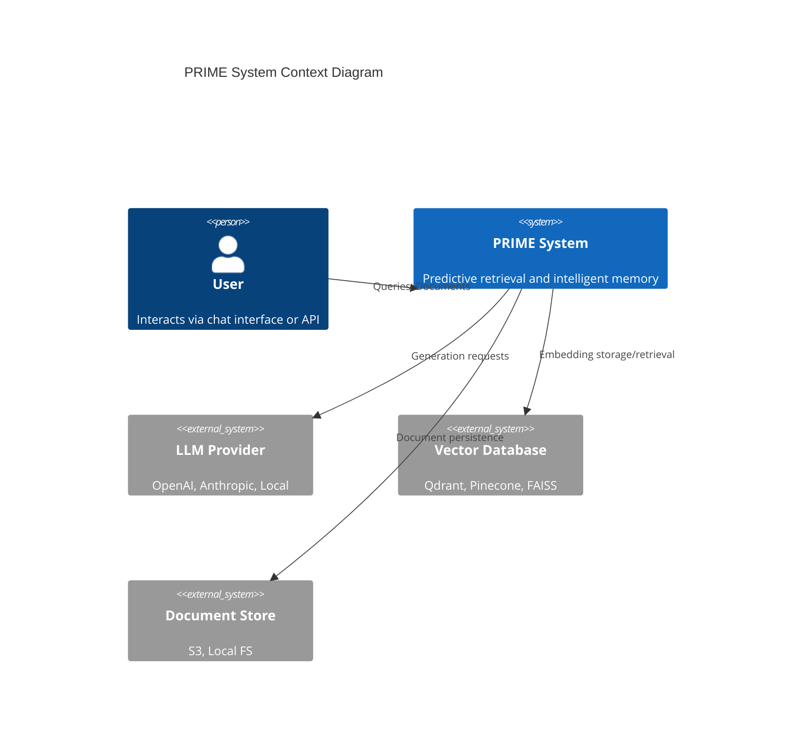
```mermaid
C4Context
    title PRIME System Context Diagram

    Person(user, "User", "Interacts via chat interface or API")
    
    System(prime, "PRIME System", "Predictive retrieval and intelligent memory")
    
    System_Ext(llm, "LLM Provider", "OpenAI, Anthropic, Local")
    System_Ext(vectordb, "Vector Database", "Qdrant, Pinecone, FAISS")
    System_Ext(docstore, "Document Store", "S3, Local FS")

    Rel(user, prime, "Queries, Documents")
    Rel(prime, llm, "Generation requests")
    Rel(prime, vectordb, "Embedding storage/retrieval")
    Rel(prime, docstore, "Document persistence")
```

---

## 4. Individual Component Design

### 4.1 Semantic State Monitor (SSM)

#### 4.1.1 Purpose
Monitor the semantic trajectory of a conversation and trigger retrieval only when a significant semantic boundary is crossed.

#### 4.1.2 Architecture

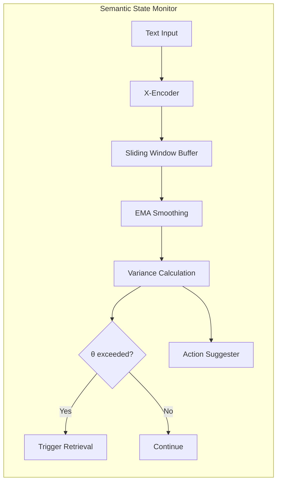
```mermaid
flowchart LR
    subgraph SSM["Semantic State Monitor"]
        INPUT[Text Input] --> ENCODE[X-Encoder]
        ENCODE --> BUFFER[Sliding Window Buffer]
        BUFFER --> SMOOTH[EMA Smoothing]
        SMOOTH --> VARIANCE[Variance Calculation]
        VARIANCE --> THRESHOLD{θ exceeded?}
        THRESHOLD -->|Yes| RETRIEVE[Trigger Retrieval]
        THRESHOLD -->|No| CONTINUE[Continue]
        VARIANCE --> ACTION[Action Suggester]
    end
```

#### 4.1.3 Key Parameters

| Parameter | Default | Description | Tuning Strategy |
|-----------|---------|-------------|-----------------|
| `window_size` | 5 | Number of turns in sliding window | Increase for longer-context conversations |
| `variance_threshold` | 0.15 | Threshold for boundary detection | Lower = more sensitive, more retrievals |
| `smoothing_factor` | 0.3 | EMA smoothing coefficient | Higher = faster response to changes |
| `prepare_threshold` | 0.7 × θ | Pre-warm threshold | Enables predictive caching |

#### 4.1.4 Variance Calculation

```
Variance = Var(||e_i - centroid||) for e_i in window

where:
  - e_i = embedding of turn i
  - centroid = mean(e_1, ..., e_n)
  - Window = [t-window_size, t]
```

#### 4.1.5 Action States

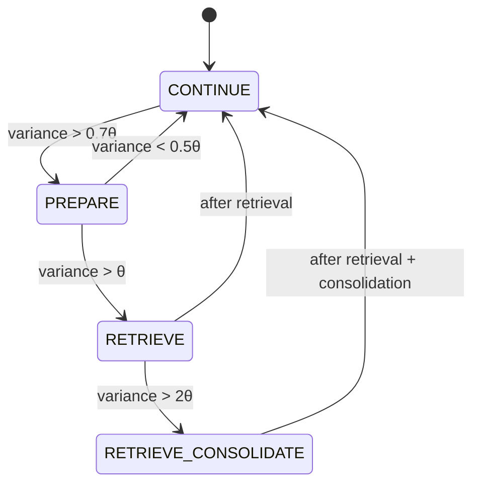
```mermaid
stateDiagram-v2
    [*] --> CONTINUE
    CONTINUE --> PREPARE: variance > 0.7θ
    PREPARE --> RETRIEVE: variance > θ
    RETRIEVE --> RETRIEVE_CONSOLIDATE: variance > 2θ
    PREPARE --> CONTINUE: variance < 0.5θ
    RETRIEVE --> CONTINUE: after retrieval
    RETRIEVE_CONSOLIDATE --> CONTINUE: after retrieval + consolidation
```

---

### 4.2 Embedding Predictor (JEPA Core)

#### 4.2.1 Purpose
Predict the embedding of the ideal context/answer BEFORE retrieval, enabling more targeted search.

#### 4.2.2 Architecture

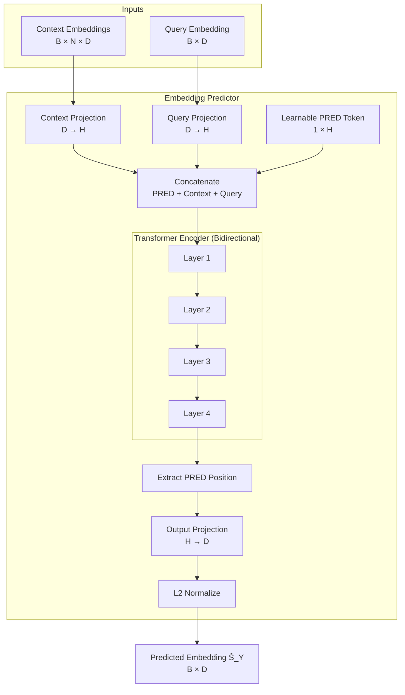
```mermaid
flowchart TB
    subgraph Inputs
        CTX_EMB[Context Embeddings<br/>B × N × D]
        QUERY_EMB[Query Embedding<br/>B × D]
    end

    subgraph Predictor["Embedding Predictor"]
        PROJ_C[Context Projection<br/>D → H]
        PROJ_Q[Query Projection<br/>D → H]
        PRED_TOK[Learnable PRED Token<br/>1 × H]
        
        CONCAT[Concatenate<br/>PRED + Context + Query]
        
        subgraph Transformer["Transformer Encoder (Bidirectional)"]
            L1[Layer 1]
            L2[Layer 2]
            L3[Layer 3]
            L4[Layer 4]
        end
        
        EXTRACT[Extract PRED Position]
        OUT_PROJ[Output Projection<br/>H → D]
        NORM[L2 Normalize]
    end

    CTX_EMB --> PROJ_C
    QUERY_EMB --> PROJ_Q
    PROJ_C --> CONCAT
    PROJ_Q --> CONCAT
    PRED_TOK --> CONCAT
    CONCAT --> L1 --> L2 --> L3 --> L4
    L4 --> EXTRACT
    EXTRACT --> OUT_PROJ
    OUT_PROJ --> NORM
    NORM --> OUTPUT[Predicted Embedding Ŝ_Y<br/>B × D]
```

#### 4.2.3 Model Specifications

| Specification | Value | Rationale |
|---------------|-------|-----------|
| Hidden Dimension | 2048 | Sufficient capacity for complex prediction |
| Output Dimension | 1024 | Match Y-Encoder embedding size |
| Num Layers | 4-8 | Trade-off between quality and latency |
| Num Heads | 8-16 | Standard transformer configuration |
| Attention Type | Bidirectional | Query must attend to full context |
| Initialization | Llama-3.2-1B (layers 8-16) | Transfer learning from language understanding |

#### 4.2.4 Training Objective

**InfoNCE Loss** (following VL-JEPA):

```
L = -log(exp(sim(Ŝ_Y, S_Y⁺) / τ) / Σ exp(sim(Ŝ_Y, S_Y⁻) / τ))

where:
  - Ŝ_Y = predicted embedding
  - S_Y⁺ = Y-Encoder(positive context)
  - S_Y⁻ = Y-Encoder(negative contexts)
  - τ = temperature (0.07)
  - sim = cosine similarity
```

#### 4.2.5 Training Data Sources

| Source | Type | Size | Use Case |
|--------|------|------|----------|
| HotpotQA | Multi-hop QA | 113K | Multi-hop reasoning |
| Natural Questions | Single-hop QA | 307K | Direct retrieval |
| MS MARCO | Passage retrieval | 8.8M | General retrieval |
| Conversation logs | Multi-turn | Variable | Conversational context |

---

### 4.3 Memory Cluster Store (MCS)

#### 4.3.1 Purpose
Store memories as embeddings with automatic consolidation of semantically similar content into cluster prototypes.

#### 4.3.2 Architecture

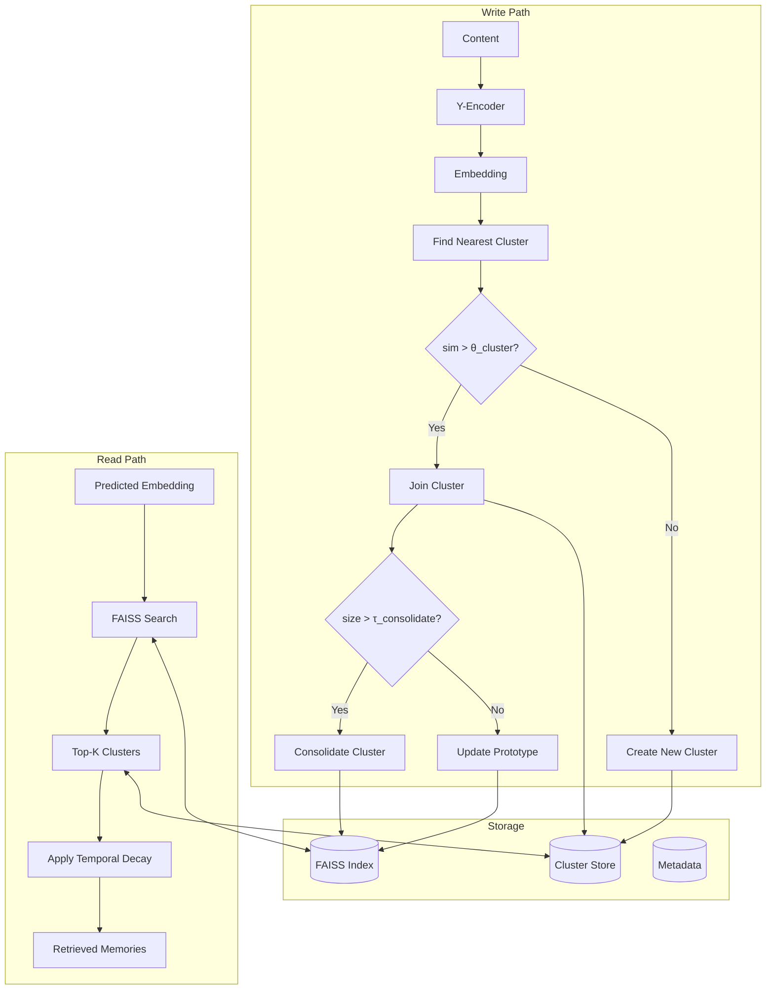
```mermaid
flowchart TB
    subgraph Write["Write Path"]
        CONTENT[Content] --> YENC[Y-Encoder]
        YENC --> EMB[Embedding]
        EMB --> SEARCH[Find Nearest Cluster]
        SEARCH --> DECISION{sim > θ_cluster?}
        DECISION -->|Yes| JOIN[Join Cluster]
        DECISION -->|No| CREATE[Create New Cluster]
        JOIN --> CHECK{size > τ_consolidate?}
        CHECK -->|Yes| CONSOLIDATE[Consolidate Cluster]
        CHECK -->|No| UPDATE[Update Prototype]
    end

    subgraph Read["Read Path"]
        QUERY_EMB[Predicted Embedding] --> FAISS_SEARCH[FAISS Search]
        FAISS_SEARCH --> TOP_K[Top-K Clusters]
        TOP_K --> DECAY[Apply Temporal Decay]
        DECAY --> RESULTS[Retrieved Memories]
    end

    subgraph Storage["Storage"]
        CLUSTERS[(Cluster Store)]
        INDEX[(FAISS Index)]
        META[(Metadata)]
    end

    JOIN --> CLUSTERS
    CREATE --> CLUSTERS
    CONSOLIDATE --> INDEX
    UPDATE --> INDEX
    FAISS_SEARCH <--> INDEX
    TOP_K <--> CLUSTERS
```

#### 4.3.3 Cluster Data Structure

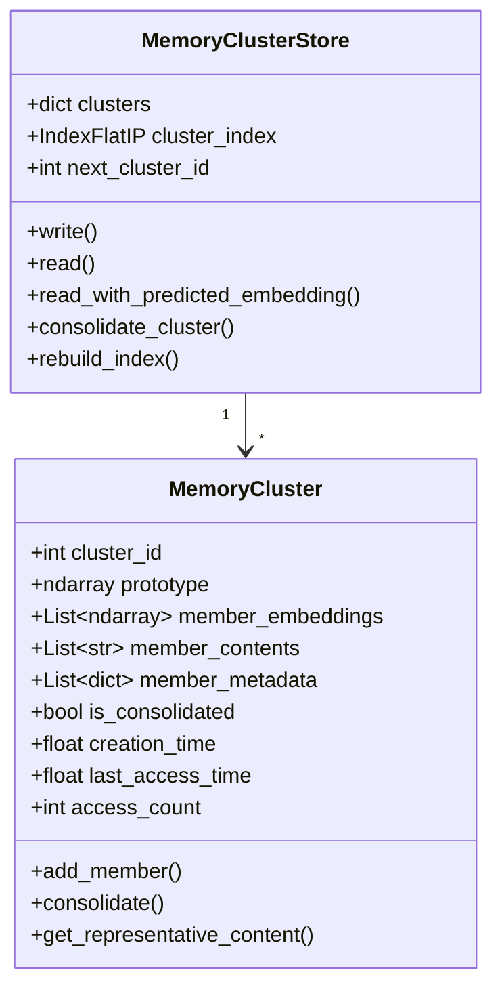
```mermaid
classDiagram
    class MemoryCluster {
        +int cluster_id
        +ndarray prototype
        +List~ndarray~ member_embeddings
        +List~str~ member_contents
        +List~dict~ member_metadata
        +bool is_consolidated
        +float creation_time
        +float last_access_time
        +int access_count
        +add_member()
        +consolidate()
        +get_representative_content()
    }

    class MemoryClusterStore {
        +dict clusters
        +IndexFlatIP cluster_index
        +int next_cluster_id
        +write()
        +read()
        +read_with_predicted_embedding()
        +consolidate_cluster()
        +rebuild_index()
    }

    MemoryClusterStore "1" --> "*" MemoryCluster
```

#### 4.3.4 Key Parameters

| Parameter | Default | Description |
|-----------|---------|-------------|
| `embedding_dim` | 1024 | Dimension of stored embeddings |
| `consolidation_threshold` | 5 | Min cluster size to trigger consolidation |
| `similarity_threshold` | 0.85 | Cosine similarity for cluster membership |
| `max_clusters` | 10000 | Maximum number of clusters |
| `decay_factor` | 0.99 | Temporal decay for access recency |

#### 4.3.5 Consolidation Algorithm

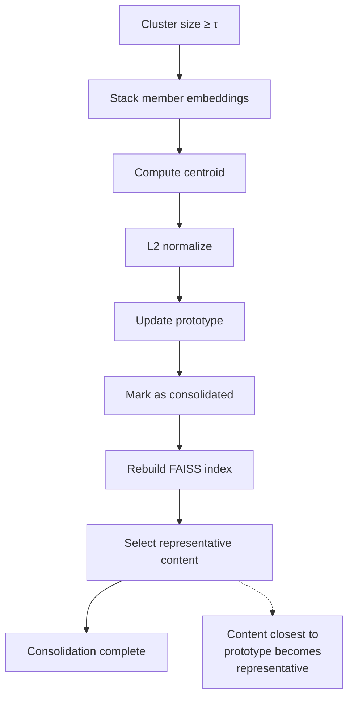
```mermaid
flowchart TD
    START[Cluster size ≥ τ] --> STACK[Stack member embeddings]
    STACK --> CENTROID[Compute centroid]
    CENTROID --> NORMALIZE[L2 normalize]
    NORMALIZE --> UPDATE_PROTO[Update prototype]
    UPDATE_PROTO --> MARK[Mark as consolidated]
    MARK --> REBUILD[Rebuild FAISS index]
    REBUILD --> SELECT_REP[Select representative content]
    SELECT_REP --> END[Consolidation complete]
    
    SELECT_REP -.-> NOTE[Content closest to<br/>prototype becomes<br/>representative]
```

---

### 4.4 Y-Encoder

#### 4.4.1 Purpose
Encode target content (responses, documents) into embedding space optimized for being a prediction target.

#### 4.4.2 Architecture


```mermaid
flowchart LR
    INPUT[Text Content] --> TOKENIZE[Tokenizer]
    TOKENIZE --> BASE[Base Encoder<br/>EmbeddingGemma-300M]
    BASE --> POOL[Mean Pooling]
    POOL --> PROJ[Linear Projection]
    PROJ --> NORM[L2 Normalize]
    NORM --> OUTPUT[Target Embedding S_Y]
```

#### 4.4.3 Training Configuration

| Parameter | Value | Rationale (from VL-JEPA) |
|-----------|-------|--------------------------|
| Learning Rate Multiplier | 0.05× | Slower update preserves embedding quality |
| Max Context Length | 512 | Handle detailed content |
| Projection Dimension | 1536 → 1024 | Shared space with predictor |
| Freeze Strategy | Gradual unfreezing | Prevent early collapse |

#### 4.4.4 Alternative Y-Encoders

| Model | Parameters | Strengths | Use Case |
|-------|------------|-----------|----------|
| EmbeddingGemma-300M | 300M | Balanced, default choice | General purpose |
| Qwen3-Embedding-0.6B | 600M | Multilingual | International deployments |
| Qwen3-Embedding-8B | 8B | Highest quality | Quality-critical applications |
| PE-Core-L | 356M | Vision-aligned | Multimodal memory |

---

## 5. Data Flow & Integration

### 5.1 Complete Request Flow

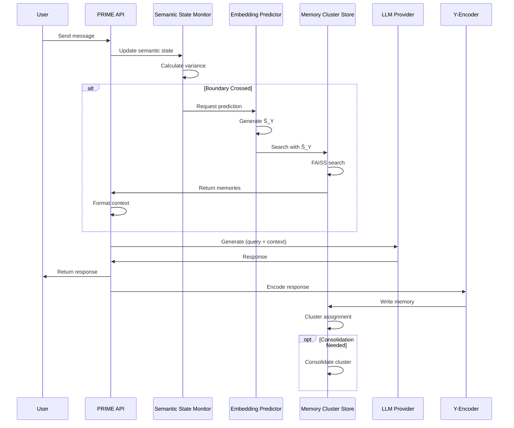
```mermaid
sequenceDiagram
    participant U as User
    participant API as PRIME API
    participant SSM as Semantic State Monitor
    participant PRED as Embedding Predictor
    participant MCS as Memory Cluster Store
    participant LLM as LLM Provider
    participant YENC as Y-Encoder

    U->>API: Send message
    API->>SSM: Update semantic state
    SSM->>SSM: Calculate variance
    
    alt Boundary Crossed
        SSM->>PRED: Request prediction
        PRED->>PRED: Generate Ŝ_Y
        PRED->>MCS: Search with Ŝ_Y
        MCS->>MCS: FAISS search
        MCS->>API: Return memories
        API->>API: Format context
    end
    
    API->>LLM: Generate (query + context)
    LLM->>API: Response
    API->>U: Return response
    
    API->>YENC: Encode response
    YENC->>MCS: Write memory
    MCS->>MCS: Cluster assignment
    
    opt Consolidation Needed
        MCS->>MCS: Consolidate cluster
    end
```

### 5.2 Integration Points

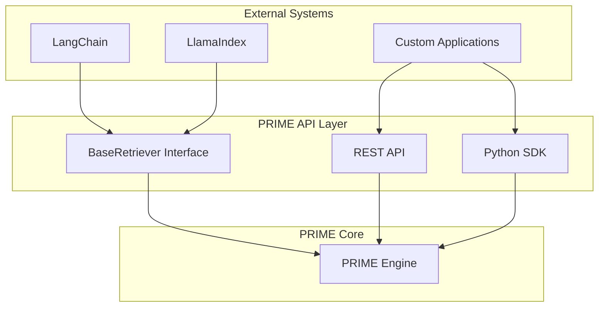
```mermaid
flowchart TB
    subgraph External["External Systems"]
        LANGCHAIN[LangChain]
        LLAMAINDEX[LlamaIndex]
        CUSTOM[Custom Applications]
    end

    subgraph PRIME_API["PRIME API Layer"]
        REST[REST API]
        PYTHON[Python SDK]
        RETRIEVER[BaseRetriever Interface]
    end

    subgraph Core["PRIME Core"]
        PRIME_MAIN[PRIME Engine]
    end

    LANGCHAIN --> RETRIEVER
    LLAMAINDEX --> RETRIEVER
    CUSTOM --> REST
    CUSTOM --> PYTHON
    RETRIEVER --> PRIME_MAIN
    REST --> PRIME_MAIN
    PYTHON --> PRIME_MAIN
```

### 5.3 API Endpoints

| Endpoint | Method | Description | Request Body |
|----------|--------|-------------|--------------|
| `/process` | POST | Process conversation turn | `{input: str, force_retrieval: bool}` |
| `/memory/write` | POST | Write external knowledge | `{content: str, metadata: dict}` |
| `/memory/search` | POST | Direct memory search | `{query: str, k: int}` |
| `/diagnostics` | GET | System diagnostics | - |
| `/clusters` | GET | List memory clusters | `{limit: int, offset: int}` |
| `/clusters/{id}` | GET | Get cluster details | - |
| `/config` | PUT | Update configuration | `{config: PRIMEConfig}` |

---

## 6. User Workflows

### 6.1 Conversational Assistant Workflow

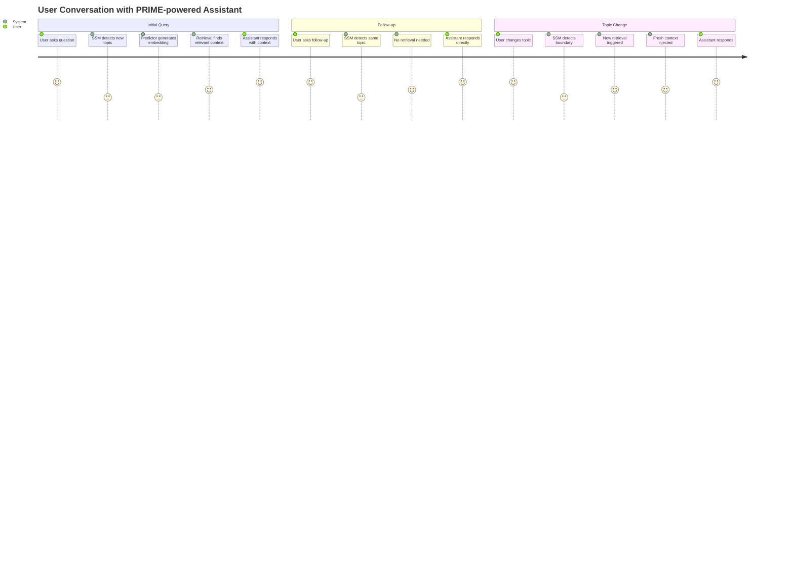
```mermaid
journey
    title User Conversation with PRIME-powered Assistant
    section Initial Query
      User asks question: 5: User
      SSM detects new topic: 3: System
      Predictor generates embedding: 3: System
      Retrieval finds relevant context: 4: System
      Assistant responds with context: 5: User
    section Follow-up
      User asks follow-up: 5: User
      SSM detects same topic: 3: System
      No retrieval needed: 4: System
      Assistant responds directly: 5: User
    section Topic Change
      User changes topic: 5: User
      SSM detects boundary: 3: System
      New retrieval triggered: 4: System
      Fresh context injected: 4: System
      Assistant responds: 5: User
```

### 6.2 Knowledge Ingestion Workflow

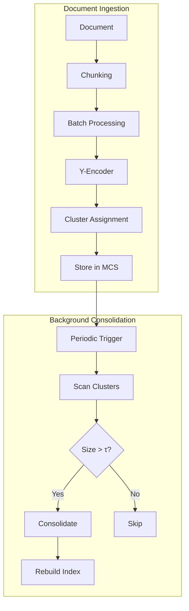
```mermaid
flowchart TD
    subgraph Ingestion["Document Ingestion"]
        DOC[Document] --> CHUNK[Chunking]
        CHUNK --> BATCH[Batch Processing]
        BATCH --> YENC[Y-Encoder]
        YENC --> CLUSTER[Cluster Assignment]
        CLUSTER --> STORE[Store in MCS]
    end

    subgraph Consolidation["Background Consolidation"]
        TIMER[Periodic Trigger] --> SCAN[Scan Clusters]
        SCAN --> CHECK{Size > τ?}
        CHECK -->|Yes| CONS[Consolidate]
        CHECK -->|No| SKIP[Skip]
        CONS --> REBUILD[Rebuild Index]
    end

    STORE --> TIMER
```

### 6.3 MIMIR Integration Workflow (Observability)

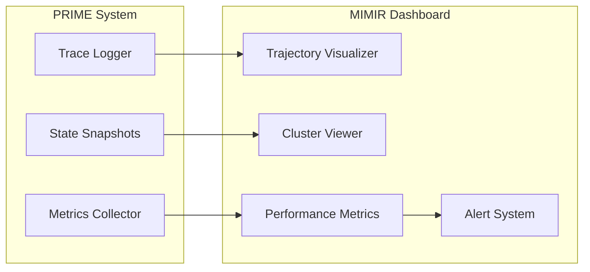
```mermaid
flowchart LR
    subgraph PRIME["PRIME System"]
        METRICS[Metrics Collector]
        TRACE[Trace Logger]
        STATE[State Snapshots]
    end

    subgraph MIMIR["MIMIR Dashboard"]
        TRAJ[Trajectory Visualizer]
        CLUST[Cluster Viewer]
        PERF[Performance Metrics]
        ALERTS[Alert System]
    end

    METRICS --> PERF
    TRACE --> TRAJ
    STATE --> CLUST
    PERF --> ALERTS
```

---

## 7. Technology Stack

### 7.1 Core Stack Overview

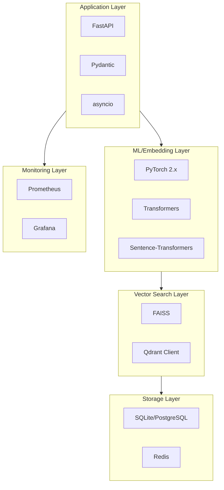
```mermaid
flowchart TB
    subgraph Application["Application Layer"]
        FASTAPI[FastAPI]
        PYDANTIC[Pydantic]
        ASYNC[asyncio]
    end

    subgraph ML["ML/Embedding Layer"]
        TORCH[PyTorch 2.x]
        TRANSFORMERS[Transformers]
        SENTENCE[Sentence-Transformers]
    end

    subgraph Vector["Vector Search Layer"]
        FAISS[FAISS]
        QDRANT[Qdrant Client]
    end

    subgraph Storage["Storage Layer"]
        SQLITE[SQLite/PostgreSQL]
        REDIS[Redis]
    end

    subgraph Monitoring["Monitoring Layer"]
        PROMETHEUS[Prometheus]
        GRAFANA[Grafana]
    end

    Application --> ML
    ML --> Vector
    Vector --> Storage
    Application --> Monitoring
```

### 7.2 Detailed Technology Choices

#### 7.2.1 Core Framework

| Component | Technology | Version | Rationale |
|-----------|------------|---------|-----------|
| **API Framework** | FastAPI | 0.109+ | Async support, automatic OpenAPI docs |
| **Data Validation** | Pydantic | 2.x | Type safety, serialization |
| **Task Queue** | Celery + Redis | 5.x | Background consolidation jobs |
| **Configuration** | Dynaconf | 3.x | Environment-based config |

#### 7.2.2 ML/Embedding Stack

| Component | Technology | Version | Rationale |
|-----------|------------|---------|-----------|
| **Deep Learning** | PyTorch | 2.2+ | Industry standard, good CUDA support |
| **Transformers** | HuggingFace | 4.37+ | Model hub, easy fine-tuning |
| **Embeddings** | Sentence-Transformers | 2.x | Pre-trained embedding models |
| **Training** | PyTorch Lightning | 2.x | Clean training loops |
| **Experiment Tracking** | Weights & Biases | - | Training visualization |

#### 7.2.3 Vector Search & Storage

| Component | Technology | Rationale |
|-----------|------------|-----------|
| **Vector Index (Dev)** | FAISS | Fast, CPU/GPU, no server needed |
| **Vector Index (Prod)** | Qdrant | Persistent, scalable, filtering |
| **Metadata Store** | PostgreSQL | Relational, JSON support |
| **Cache** | Redis | Fast KV, pub/sub for events |
| **Object Storage** | MinIO / S3 | Model checkpoints, exports |

#### 7.2.4 Development & Testing

| Component | Technology | Purpose |
|-----------|------------|---------|
| **Testing** | pytest + pytest-asyncio | Unit and integration tests |
| **Mocking** | responses, pytest-mock | API mocking |
| **Linting** | ruff | Fast Python linter |
| **Type Checking** | mypy | Static type analysis |
| **Pre-commit** | pre-commit | Git hooks |

### 7.3 Model Specifications

| Model | Source | Size | Use |
|-------|--------|------|-----|
| **X-Encoder** | all-MiniLM-L6-v2 | 22M | Query encoding (fast) |
| **X-Encoder (quality)** | BAAI/bge-large-en-v1.5 | 335M | Query encoding (quality) |
| **Y-Encoder** | google/gemma-embedding-300m | 300M | Target encoding |
| **Predictor Init** | meta-llama/Llama-3.2-1B | 490M (8 layers) | Transfer learning |
| **LLM (default)** | Claude 3.5 Sonnet | - | Generation |

### 7.4 Infrastructure Requirements

#### Development Environment

| Resource | Minimum | Recommended |
|----------|---------|-------------|
| CPU | 8 cores | 16 cores |
| RAM | 16 GB | 32 GB |
| GPU | - | RTX 3080 (10GB) |
| Storage | 50 GB SSD | 200 GB NVMe |

#### Production Environment

| Resource | Small | Medium | Large |
|----------|-------|--------|-------|
| CPU | 8 cores | 16 cores | 32 cores |
| RAM | 32 GB | 64 GB | 128 GB |
| GPU | T4 (16GB) | A10 (24GB) | A100 (40GB) |
| Vector DB | 1M vectors | 10M vectors | 100M vectors |

### 7.5 Dependencies (requirements.txt)

```txt
# Core
fastapi>=0.109.0
uvicorn[standard]>=0.27.0
pydantic>=2.5.0
python-dotenv>=1.0.0

# ML/Embeddings
torch>=2.2.0
transformers>=4.37.0
sentence-transformers>=2.3.0
einops>=0.7.0

# Vector Search
faiss-cpu>=1.7.4  # or faiss-gpu
qdrant-client>=1.7.0

# Storage
sqlalchemy>=2.0.0
asyncpg>=0.29.0
redis>=5.0.0
aioredis>=2.0.0

# Training
pytorch-lightning>=2.1.0
wandb>=0.16.0

# Utilities
numpy>=1.26.0
scipy>=1.12.0
scikit-learn>=1.4.0
tqdm>=4.66.0

# Testing
pytest>=8.0.0
pytest-asyncio>=0.23.0
pytest-cov>=4.1.0
httpx>=0.26.0

# Dev
ruff>=0.1.0
mypy>=1.8.0
pre-commit>=3.6.0
```

---

## 8. Development Roadmap

### 8.1 Phase Overview

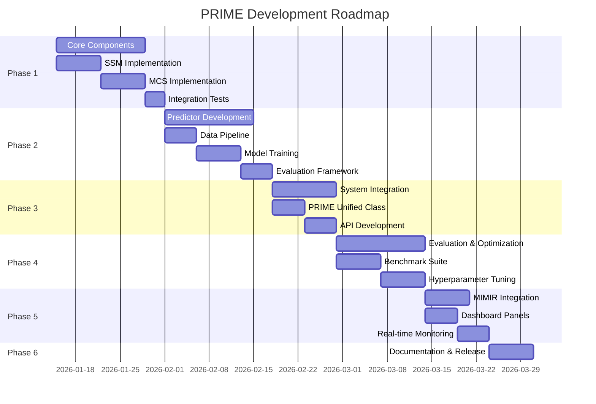
```mermaid
gantt
    title PRIME Development Roadmap
    dateFormat  YYYY-MM-DD
    section Phase 1
    Core Components           :p1, 2026-01-15, 14d
    SSM Implementation        :p1a, 2026-01-15, 7d
    MCS Implementation        :p1b, 2026-01-22, 7d
    Integration Tests         :p1c, after p1b, 3d
    
    section Phase 2
    Predictor Development     :p2, after p1c, 14d
    Data Pipeline             :p2a, after p1c, 5d
    Model Training            :p2b, after p2a, 7d
    Evaluation Framework      :p2c, after p2b, 5d
    
    section Phase 3
    System Integration        :p3, after p2c, 10d
    PRIME Unified Class       :p3a, after p2c, 5d
    API Development           :p3b, after p3a, 5d
    
    section Phase 4
    Evaluation & Optimization :p4, after p3b, 14d
    Benchmark Suite           :p4a, after p3b, 7d
    Hyperparameter Tuning     :p4b, after p4a, 7d
    
    section Phase 5
    MIMIR Integration         :p5, after p4b, 7d
    Dashboard Panels          :p5a, after p4b, 5d
    Real-time Monitoring      :p5b, after p5a, 5d
    
    section Phase 6
    Documentation & Release   :p6, after p5b, 7d
```

### 8.2 Detailed Phase Breakdown

#### Phase 1: Core Components (Weeks 1-2)

| Task | Description | Deliverable | Effort |
|------|-------------|-------------|--------|
| 1.1 | Implement SemanticStateMonitor | `semantic_state_monitor.py` | 3 days |
| 1.2 | Implement variance calculation | Ward distance algorithm | 1 day |
| 1.3 | Implement MemoryClusterStore | `memory_cluster_store.py` | 4 days |
| 1.4 | Implement FAISS integration | Index management | 2 days |
| 1.5 | Unit tests for components | Test suite | 2 days |
| 1.6 | Integration tests | E2E tests | 2 days |

**Milestone:** SSM + MCS working independently ✓

#### Phase 2: Predictor Training (Weeks 3-4)

| Task | Description | Deliverable | Effort |
|------|-------------|-------------|--------|
| 2.1 | Training data pipeline | Data loaders, preprocessing | 3 days |
| 2.2 | Implement EmbeddingPredictor | `embedding_predictor.py` | 3 days |
| 2.3 | InfoNCE loss implementation | Training objective | 1 day |
| 2.4 | Training loop | PyTorch Lightning module | 2 days |
| 2.5 | Y-Encoder integration | Dual encoder setup | 2 days |
| 2.6 | Evaluation metrics | Precision, recall, MRR | 2 days |

**Milestone:** Trained predictor with >baseline retrieval ✓

#### Phase 3: System Integration (Week 5)

| Task | Description | Deliverable | Effort |
|------|-------------|-------------|--------|
| 3.1 | PRIME unified class | `prime.py` | 3 days |
| 3.2 | FastAPI endpoints | REST API | 2 days |
| 3.3 | LangChain adapter | `PRIMERetriever` | 1 day |
| 3.4 | Configuration system | Dynaconf setup | 1 day |
| 3.5 | Docker containerization | Dockerfile, compose | 1 day |

**Milestone:** Working end-to-end system ✓

#### Phase 4: Evaluation & Optimization (Weeks 6-7)

| Task | Description | Deliverable | Effort |
|------|-------------|-------------|--------|
| 4.1 | Benchmark suite | HotpotQA, NQ evaluation | 3 days |
| 4.2 | Ablation studies | Component contribution | 3 days |
| 4.3 | Hyperparameter tuning | Optimal configs | 4 days |
| 4.4 | Performance profiling | Latency optimization | 2 days |
| 4.5 | Memory optimization | Embedding compression | 2 days |

**Milestone:** Validated performance improvements ✓

#### Phase 5: MIMIR Integration (Week 8)

| Task | Description | Deliverable | Effort |
|------|-------------|-------------|--------|
| 5.1 | Observability plugin | MIMIR adapter | 2 days |
| 5.2 | Trajectory visualization | UMAP projections | 2 days |
| 5.3 | Cluster viewer | Interactive panel | 2 days |
| 5.4 | Real-time metrics | WebSocket streaming | 1 day |

**Milestone:** Full observability dashboard ✓

#### Phase 6: Documentation & Release (Week 9)

| Task | Description | Deliverable | Effort |
|------|-------------|-------------|--------|
| 6.1 | API documentation | OpenAPI spec | 1 day |
| 6.2 | User guide | Getting started, tutorials | 2 days |
| 6.3 | Architecture docs | Technical documentation | 2 days |
| 6.4 | PyPI packaging | `pip install prime-rag` | 1 day |
| 6.5 | Release announcement | Blog post, demo | 1 day |

**Milestone:** Public release ✓

### 8.3 Risk Mitigation Schedule

| Risk | Mitigation | Timeline |
|------|------------|----------|
| Predictor underperforms | Fallback to query embedding | Week 4 checkpoint |
| Memory consolidation too aggressive | Tunable thresholds | Week 2 |
| Latency too high | Async processing, caching | Week 6 |
| Scale issues | Qdrant migration path | Week 7 |

---

## 9. Success Metrics

### 9.1 Key Performance Indicators

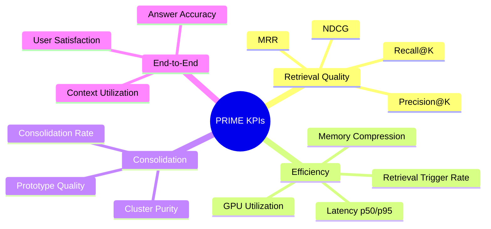
```mermaid
mindmap
  root((PRIME KPIs))
    Retrieval Quality
      Precision@K
      Recall@K
      MRR
      NDCG
    Efficiency
      Retrieval Trigger Rate
      Latency p50/p95
      Memory Compression
      GPU Utilization
    Consolidation
      Cluster Purity
      Consolidation Rate
      Prototype Quality
    End-to-End
      Answer Accuracy
      Context Utilization
      User Satisfaction
```

### 9.2 Quantitative Targets

#### 9.2.1 Retrieval Quality Metrics

| Metric | Baseline (Standard RAG) | Target | Measurement |
|--------|------------------------|--------|-------------|
| **Precision@1** | 0.45 | 0.55 (+22%) | HotpotQA test set |
| **Precision@5** | 0.35 | 0.45 (+28%) | HotpotQA test set |
| **Recall@5** | 0.60 | 0.72 (+20%) | HotpotQA test set |
| **MRR** | 0.52 | 0.63 (+21%) | HotpotQA test set |
| **NDCG@10** | 0.48 | 0.58 (+20%) | MS MARCO dev |

#### 9.2.2 Efficiency Metrics

| Metric | Baseline | Target | Measurement |
|--------|----------|--------|-------------|
| **Retrieval Trigger Rate** | 100% | 30-40% | Conversation benchmark |
| **Avg Latency (retrieval)** | 150ms | 100ms | p50 latency |
| **Latency p95** | 400ms | 250ms | Production monitoring |
| **Memory per 1M docs** | 4 GB | 1.5 GB | Cluster compression |
| **Throughput** | 50 QPS | 100 QPS | Load testing |

#### 9.2.3 Memory Consolidation Metrics

| Metric | Target | Measurement |
|--------|--------|-------------|
| **Cluster Purity** | >0.85 | Silhouette score |
| **Consolidation Rate** | 60-80% | % clusters consolidated |
| **Compression Ratio** | 3-5× | Total memories / active clusters |
| **Prototype Quality** | >0.90 | Avg similarity to members |

#### 9.2.4 End-to-End Quality Metrics

| Metric | Baseline | Target | Measurement |
|--------|----------|--------|-------------|
| **Answer Accuracy** | 0.65 | 0.72 | QA benchmark |
| **Context Utilization** | 0.70 | 0.85 | % responses using context |
| **Hallucination Rate** | 15% | 8% | Manual evaluation |
| **User Satisfaction** | 3.8/5 | 4.3/5 | User study |

### 9.3 Evaluation Framework

#### 9.3.1 Automated Benchmarks

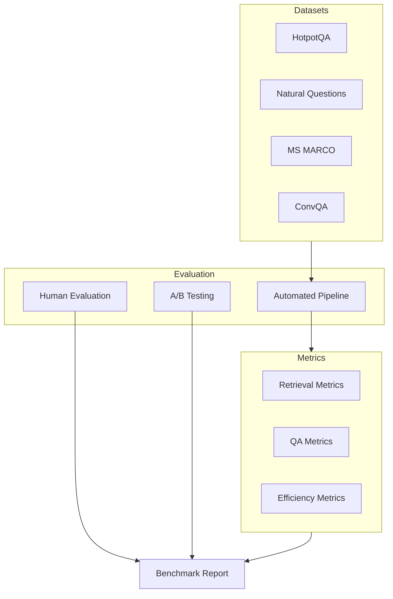
```mermaid
flowchart TD
    subgraph Datasets
        HOTPOT[HotpotQA]
        NQ[Natural Questions]
        MARCO[MS MARCO]
        CONV[ConvQA]
    end

    subgraph Metrics
        RET[Retrieval Metrics]
        QA[QA Metrics]
        EFF[Efficiency Metrics]
    end

    subgraph Evaluation
        AUTO[Automated Pipeline]
        HUMAN[Human Evaluation]
        AB[A/B Testing]
    end

    Datasets --> AUTO
    AUTO --> Metrics
    Metrics --> REPORT[Benchmark Report]
    HUMAN --> REPORT
    AB --> REPORT
```

#### 9.3.2 Benchmark Suite

| Benchmark | Focus | Size | Metrics |
|-----------|-------|------|---------|
| **HotpotQA** | Multi-hop reasoning | 7.4K | EM, F1, Retrieval P/R |
| **Natural Questions** | Single-hop QA | 7.8K | EM, F1 |
| **MS MARCO** | Passage retrieval | 6.9K | MRR@10, NDCG |
| **ConvQA** | Conversational | 4.4K | F1, Context Utilization |
| **Custom Conv** | Selective injection | 500 | Trigger Precision/Recall |

### 9.4 Monitoring Dashboard

| Panel | Metrics | Update Frequency |
|-------|---------|------------------|
| **Retrieval Health** | P@K, MRR, latency | Real-time |
| **Trigger Analysis** | Trigger rate, variance distribution | Per conversation |
| **Cluster Status** | Count, sizes, consolidation rate | Hourly |
| **System Performance** | CPU, GPU, memory, QPS | Real-time |
| **Quality Trends** | Daily accuracy, user feedback | Daily |

### 9.5 Success Criteria

#### 9.5.1 Phase Gate Criteria

| Phase | Success Criteria | Go/No-Go |
|-------|------------------|----------|
| **Phase 1** | SSM variance threshold reduces triggers by 50% | Proceed if >40% |
| **Phase 2** | Predictor P@5 > query baseline by 10% | Proceed if >5% |
| **Phase 3** | E2E latency <200ms p50 | Proceed if <300ms |
| **Phase 4** | HotpotQA F1 improvement >5% | Release if >3% |

#### 9.5.2 Release Criteria

| Criterion | Requirement |
|-----------|-------------|
| **Performance** | All primary metrics within 90% of target |
| **Reliability** | <0.1% error rate in 24h stress test |
| **Documentation** | API docs, user guide, architecture docs complete |
| **Testing** | >80% code coverage, all E2E tests passing |
| **Security** | No critical vulnerabilities in dependency scan |

---

## 10. Risk Assessment

### 10.1 Risk Matrix

| Risk | Probability | Impact | Mitigation |
|------|-------------|--------|------------|
| Predictor fails to outperform baseline | Medium | High | Fallback to hybrid approach |
| Memory consolidation loses information | Low | High | Conservative thresholds, audit logs |
| Latency exceeds requirements | Medium | Medium | Async processing, caching |
| Scale limitations with FAISS | Medium | Medium | Qdrant migration path |
| Training data quality issues | Low | Medium | Multiple data sources, filtering |
| Y-Encoder drift during training | Low | Medium | Learning rate scheduling |

### 10.2 Contingency Plans

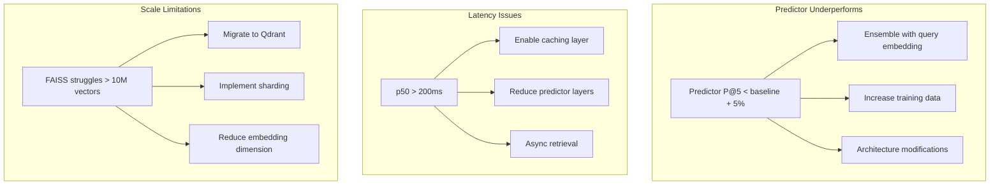
```mermaid
flowchart TD
    subgraph Risk1["Predictor Underperforms"]
        R1[Predictor P@5 < baseline + 5%]
        M1A[Ensemble with query embedding]
        M1B[Increase training data]
        M1C[Architecture modifications]
        R1 --> M1A
        R1 --> M1B
        R1 --> M1C
    end

    subgraph Risk2["Latency Issues"]
        R2[p50 > 200ms]
        M2A[Enable caching layer]
        M2B[Reduce predictor layers]
        M2C[Async retrieval]
        R2 --> M2A
        R2 --> M2B
        R2 --> M2C
    end

    subgraph Risk3["Scale Limitations"]
        R3[FAISS struggles > 10M vectors]
        M3A[Migrate to Qdrant]
        M3B[Implement sharding]
        M3C[Reduce embedding dimension]
        R3 --> M3A
        R3 --> M3B
        R3 --> M3C
    end
```

---

## 11. Appendices

### Appendix A: Glossary

| Term | Definition |
|------|------------|
| **JEPA** | Joint Embedding Predictive Architecture - predicts in embedding space |
| **SSM** | Semantic State Monitor - tracks conversation semantic trajectory |
| **MCS** | Memory Cluster Store - embedding-based memory with consolidation |
| **InfoNCE** | Noise Contrastive Estimation loss for embedding learning |
| **Y-Encoder** | Encoder for target content (what we predict toward) |
| **X-Encoder** | Encoder for input/query content |
| **Consolidation** | Merging similar memories into cluster prototypes |
| **Variance Threshold** | Trigger point for semantic boundary detection |

### Appendix B: API Reference

#### B.1 Core Classes

```python
class PRIME:
    """Main system class."""
    def process_turn(input: str, force_retrieval: bool = False) -> PRIMEResponse
    def record_response(response: str, write_to_memory: bool = True) -> MemoryWriteResult
    def write_external_knowledge(content: str, metadata: dict = None) -> MemoryWriteResult
    def get_diagnostics() -> PRIMEDiagnostics

class SemanticStateMonitor:
    """Monitors semantic state."""
    def update(text: str) -> SemanticStateUpdate

class EmbeddingPredictor:
    """Predicts target embeddings."""
    def forward(context_embeddings, query_embedding) -> Tensor

class MemoryClusterStore:
    """Stores and retrieves memories."""
    def write(content: str, metadata: dict = None) -> MemoryWriteResult
    def read(query_embedding, k: int = 5) -> List[MemoryReadResult]
    def read_with_predicted_embedding(predicted_embedding, k: int = 5) -> List[MemoryReadResult]
```

### Appendix C: Configuration Schema

```yaml
prime:
  # Semantic State Monitor
  monitor:
    window_size: 5
    variance_threshold: 0.15
    smoothing_factor: 0.3
  
  # Embedding Predictor
  predictor:
    context_window: 10
    hidden_dim: 2048
    num_layers: 4
    checkpoint: "models/predictor_v1.pt"
  
  # Memory Cluster Store
  memory:
    consolidation_threshold: 5
    similarity_threshold: 0.85
    max_clusters: 10000
    decay_factor: 0.99
  
  # Encoders
  encoders:
    x_encoder: "BAAI/bge-large-en-v1.5"
    y_encoder: "google/gemma-embedding-300m"
  
  # Infrastructure
  infrastructure:
    vector_db: "faiss"  # or "qdrant"
    cache_enabled: true
    cache_ttl: 3600
```

### Appendix D: Research References

1. Chen et al. (2025). "VL-JEPA: Joint Embedding Predictive Architecture for Vision-language." arXiv:2512.10942
2. Assran et al. (2025). "V-JEPA 2: Self-supervised video models enable understanding, prediction and planning."
3. Radford et al. (2021). "Learning Transferable Visual Models From Natural Language Supervision."
4. Lewis et al. (2020). "Retrieval-Augmented Generation for Knowledge-Intensive NLP Tasks."
5. Bardes et al. (2021). "VICReg: Variance-Invariance-Covariance Regularization."

---

**Document Version History**

| Version | Date | Author | Changes |
|---------|------|--------|---------|
| 1.0 | 2026-01-07 | Tom | Initial document |

---

*This document is part of the PRIME project. For questions or contributions, please contact the project maintainer.*
