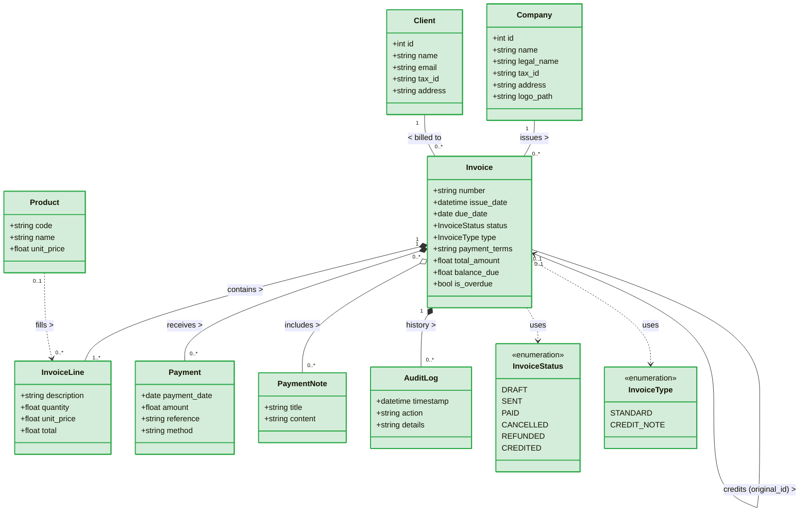

# System Architecture

```mermaid
classDiagram
    %% Core Entities
    class Company {
        +int id
        +string name
        +string legal_name
        +string tax_id
        +string address
        +string logo_path
    }

    class Client {
        +int id
        +string name
        +string email
        +string tax_id
        +string address
    }

    class Invoice {
        +string number
        +datetime issue_date
        +date due_date
        +InvoiceStatus status
        +InvoiceType type
        +string payment_terms
        +float total_amount
        +float balance_due
        +bool is_overdue
    }

    class InvoiceLine {
        +string description
        +float quantity
        +float unit_price
        +float total
    }

    class Payment {
        +date payment_date
        +float amount
        +string reference
        +string method
    }

    %% Supporting Entities
    class Product {
        +string code
        +string name
        +float unit_price
    }

    class PaymentNote {
        +string title
        +string content
        %% e.g., "Bank Transfer Details"
    }

    class AuditLog {
        +datetime timestamp
        +string action
        +string details
    }

    %% Enums
    class InvoiceStatus {
        <<enumeration>>
        DRAFT
        SENT
        PAID
        CANCELLED
        REFUNDED
        CREDITED
    }

    class InvoiceType {
        <<enumeration>>
        STANDARD
        CREDIT_NOTE
    }

    %% Relationships
    Company "1" -- "0..*" Invoice : issues >
    Client "1" -- "0..*" Invoice : < billed to
    
    Invoice "1" *-- "1..*" InvoiceLine : contains >
    Invoice "1" *-- "0..*" Payment : receives >
    Invoice "1" *-- "0..*" AuditLog : history >
    
    Invoice "0..1" --> "0..1" Invoice : credits (original_id) >
    
    Invoice ..> InvoiceStatus : uses
    Invoice ..> InvoiceType : uses
    
    %% Optional / Loose relationships
    Product "0..1" ..> "0..*" InvoiceLine : fills >
    Invoice "0..*" o-- "0..*" PaymentNote : includes >

    %% Styling for Implemented Entities
    style Company fill:#d4edda,stroke:#28a745,stroke-width:2px;
    style Client fill:#d4edda,stroke:#28a745,stroke-width:2px;
    style Invoice fill:#d4edda,stroke:#28a745,stroke-width:2px;
    style InvoiceLine fill:#d4edda,stroke:#28a745,stroke-width:2px;
    style Payment fill:#d4edda,stroke:#28a745,stroke-width:2px;
    style Product fill:#d4edda,stroke:#28a745,stroke-width:2px;
    style PaymentNote fill:#d4edda,stroke:#28a745,stroke-width:2px;
    style AuditLog fill:#d4edda,stroke:#28a745,stroke-width:2px;
    style InvoiceStatus fill:#d4edda,stroke:#28a745,stroke-width:2px;
    style InvoiceType fill:#d4edda,stroke:#28a745,stroke-width:2px;
```

**Legend:**
- 🟢 **Green**: Implemented
- ⚪ **White**: Planned / Not Implemented

