<p align="center">
  
</p>

<p align="center">
  
  
  
</p>

# PyGhidra-MCP - Ghidra Model Context Protocol Server


### Overview

**`pyghidra-mcp`** is a command-line Model Context Protocol (MCP) server that brings the full analytical power of [Ghidra](https://ghidra-sre.org/), a robust software reverse engineering (SRE) suite, into the world of intelligent agents and LLM-based tooling.
It bridges Ghidra’s [ProgramAPI](https://ghidra.re/ghidra_docs/api/ghidra/program/model/listing/Program.html) and [FlatProgramAPI](https://ghidra.re/ghidra_docs/api/ghidra/program/flatapi/FlatProgramAPI.html) to Python using `pyghidra` and `jpype`, then exposes that functionality via the Model Context Protocol. 

MCP is a unified interface that allows language models, development tools (like VS Code), and autonomous agents to access structured context, invoke tooling, and collaborate intelligently. Think of MCP as the bridge between powerful analysis tools and the LLM ecosystem. 

With `pyghidra-mcp`, Ghidra becomes an intelligent backend—ready to respond to context-rich queries, automate deep reverse engineering tasks, and integrate into AI-assisted workflows.


> [!NOTE]
> This beta project is under active development. We would love your feedback, bug reports, feature requests, and code.

## Yet another Ghidra MCP?

Yes, the original [ghidra-mcp](https://github.com/LaurieWired/GhidraMCP) is fantastic. But `pyghidra-mcp` takes a different approach:

- 🐍 **No GUI required** – Run entirely via CLI for streamlined automation and scripting.
- 🔁 **Designed for automation** – Ideal for integrating with LLMs, CI pipelines, and tooling that needs repeatable behavior.
- ✅ **CI/CD friendly** – Built with robust unit and integration tests for both client and server sessions.
- 🚀 **Quick startup** – Asynchronous startup allows the server to start handling requests while binaries are still being analyzed in the background. Supports fast command-line launching with minimal setup.
- 📦 **Project-wide analysis** – Enables concurrent reverse engineering of all binaries in a Ghidra project
- 🤖 **Agent-ready** – Built for intelligent agent-driven workflows and large-scale reverse engineering automation.
- 🔍 Semantic code search – Uses vector embeddings (via ChromaDB) to enable fast, fuzzy lookup across decompiled functions, comments, and symbols—perfect for pseudo-C exploration and agent-driven triage.

This project provides a Python-first experience optimized for local development, headless environments, and testable workflows.

```mermaid
graph TD
    subgraph Clients
        A[🤖 LLM / Agent]
        B[💻 Local CLI User]
        C[🔧 CI/CD Pipeline]
    end

    subgraph Startup Command
        direction LR
        cmd("`pyghidra-mcp --project-path /path/to/project --threaded /path/to/binary1`")
    end

    subgraph "pyghidra-mcp Server"
        D[MCP Server]
        E[pyghidra ]
        F[Ghidra Headless]

      subgraph "Ghidra Project Analysis"
          G[Binary 1]
          H[Binary 2]
          I[...]
      end
    end



    cmd --> D

    A -- "MCP (stdio/http)" --> D
    B -- "stdio/http" --> D
    C -- "stdio/sse" --> D

    D -- "Initializes" --> E
    E -- "Controls" --> F

    F -- "Analyzes Concurrently" --> G
    F -- "Analyzes Concurrently" --> H
    F -- "Analyzes Concurrently" --> I

    subgraph "Exposed MCP API"
        J[decompile_function]
    end

    D -- "Exposes Tools" --> J

    J -- "Results" --> A
```



## Contents

- [PyGhidra-MCP - Ghidra Model Context Protocol Server](#pyghidra-mcp---ghidra-model-context-protocol-server)
    - [Overview](#overview)
  - [Yet another Ghidra MCP?](#yet-another-ghidra-mcp)
  - [Contents](#contents)
  - [Getting started](#getting-started)
  - [Development](#development)
    - [Setup](#setup)
    - [Testing and Quality](#testing-and-quality)
  - [API](#api)
    - [Tools](#tools)
      - [Code Search](#code-search)
      - [Cross-References](#cross-references)
      - [Decompile Function](#decompile-function)
      - [Generate Call Graph](#generate-call-graph)
      - [Import Binary](#import-binary)
      - [Delete Project Binary](#delete-project-binary)
      - [List Exports](#list-exports)
      - [List Imports](#list-imports)
      - [List Project Binaries](#list-project-binaries)
      - [List Project Binary Metadata](#list-project-binary-metadata)
      - [Read Bytes](#read-bytes)
      - [Search Strings](#search-strings)
      - [Search Symbols](#search-symbols)
    - [Prompts](#prompts)
    - [Resources](#resources)
  - [Usage](#usage)
    - [Mapping Binaries with Docker](#mapping-binaries-with-docker)
    - [Using with OpenWeb-UI and MCPO](#using-with-openweb-ui-and-mcpo)
      - [With `uvx`](#with-uvx)
      - [With Docker](#with-docker)
    - [Standard Input/Output (stdio)](#standard-inputoutput-stdio)
      - [Python](#python)
      - [Docker](#docker)
    - [Streamable HTTP](#streamable-http)
      - [Python](#python-1)
      - [Docker](#docker-1)
    - [Server-sent events (SSE)](#server-sent-events-sse)
      - [Python](#python-2)
      - [Docker](#docker-2)
  - [Integrations](#integrations)
    - [Claude Desktop](#claude-desktop)
  - [Inspiration](#inspiration)
  - [Contributing, community, and running from source](#contributing-community-and-running-from-source)
    - [Contributor workflow](#contributor-workflow)

## Getting started

Run the [Python package](https://pypi.org/p/pyghidra-mcp) as a CLI command using [`uv`](https://docs.astral.sh/uv/guides/tools/):

```bash
uvx pyghidra-mcp # see --help for more options
```

Or, run as a [Docker container](https://ghcr.io/clearbluejar/pyghidra-mcp):

```bash
docker run -i --rm ghcr.io/clearbluejar/pyghidra-mcp -t stdio
```

## Development

This project uses a `Makefile` to streamline development and testing. `ruff` is used for linting and formatting, and `pre-commit` hooks are used to ensure code quality.

### Setup

1.  **Install `uv`**: If you don't have `uv` installed, you can install it using pip:
    ```bash
    pip install uv
    ```
    Or, follow the official `uv` installation guide: [https://docs.astral.sh/uv/install/](https://docs.astral.sh/uv/install/)

2.  **Create a virtual environment and install dependencies**:
    ```bash
    make dev-setup
    source ./.venv/bin/activate
    ```

3.  **Set Ghidra Environment Variable**: Download and install Ghidra, then set the `GHIDRA_INSTALL_DIR` environment variable to your Ghidra installation directory.
    ```bash
    # For Linux / Mac
    export GHIDRA_INSTALL_DIR="/path/to/ghidra/"

    # For Windows PowerShell
    [System.Environment]::SetEnvironmentVariable('GHIDRA_INSTALL_DIR','C:\ghidra_10.2.3_PUBLIC_20230208\ghidra_10.2.3_PUBLIC')
    ```

### Testing and Quality

The `Makefile` provides several targets for testing and code quality:

- `make run`: Run the MCP server.
- `make test`: Run the full test suite (unit and integration).
- `make test-unit`: Run unit tests.
- `make test-integration`: Run integration tests.
- `make lint`: Check code style with `ruff`.
- `make format`: Format code with `ruff`.
- `make typecheck`: Run type checking with `ruff`.
- `make check`: Run all quality checks.
- `make dev`: Run the development workflow (format and check).
- `make build`: Build distribution packages.
- `make clean`: Clean build artifacts and cache.

## API

### Tools

Enable LLMs to perform actions, make deterministic computations, and interact with external services.

#### Code Search

- `search_code(binary_name: str, query: str, limit: int = 5)`: Search for code within a binary by similarity using vector embeddings.

#### Cross-References

- `list_cross_references(binary_name: str, name_or_address: str)`: Finds and lists all cross-references (x-refs) to a given function or address.

#### Generate Call Graph

- `gen_callgraph(binary_name: str, function_name_or_address: str, direction: str = "calling", display_type: str = "flow", include_refs: bool = True, max_depth: int | None = None, max_run_time: int = 60, condense_threshold: int = 50, top_layers: int = 5, bottom_layers: int = 5)`: Generates a MermaidJS call graph for a specified function. Supports both "calling" (functions called by the target) and "called" (functions that call the target) directions with multiple visualization types.

#### Decompile Function

- `decompile_function(binary_name: str, name: str)`: Decompile a function from a given binary.

#### Import Binary

- `import_binary(binary_path: str)`: Imports a binary from a designated path into the current Ghidra project. If the path is a directory, it will recursively scan and import all supported binary files, preserving the directory structure within the Ghidra project.

#### List Exports

- `list_exports(binary_name: str, query: str = ".*", offset: int = 0, limit: int = 25)`: Lists all exported functions and symbols from a specified binary (regex supported for query).

#### List Imports

- `list_imports(binary_name: str, query: str = ".*", offset: int = 0, limit: int = 25)`: Lists all imported functions and symbols for a specified binary (regex supported for query).

#### List Project Binaries

- `list_project_binaries()`: Lists the names of all binaries currently loaded in the Ghidra project.

#### List Project Binary Metadata

- `list_project_binary_metadata(binary_name: str)`: Retrieves detailed metadata for a specific binary, including architecture, compiler, executable format, analysis metrics, and file hashes.

#### Delete Project Binary

- `delete_project_binary(binary_name: str)`: Deletes a binary (program) from the Ghidra project.

#### Read Bytes

- `read_bytes(binary_name: str, address: str, size: int = 32)`: Reads raw bytes from memory at a specified address. Returns raw hex data. Useful for inspecting memory contents, data structures, or confirming analysis findings.


#### Search Strings

- `search_strings(binary_name: str, query: str, limit: int = 100)`: Searches for strings within a binary by name.

#### Search Symbols

- `search_symbols_by_name(binary_name: str, query: str, offset: int = 0, limit: int = 25)`: Search for symbols within a binary by name (case-insensitive substring).

### Prompts

Reusable prompts to standardize common LLM interactions.

- `write_ghidra_script`: Return a prompt to help write a Ghidra script.

### Resources

Expose data and content to LLMs

- `ghidra://program/{program_name}/function/{function_name}/decompiled`: Decompiled code of a specific function.

## Usage

This Python package is published to PyPI as [pyghidra-mcp](https://pypi.org/p/pyghidra-mcp) and can be installed and run with [pip](https://packaging.python.org/en/latest/guides/installing-using-pip-and-virtual-environments/#install-a-package), [pipx](https://pipx.pypa.io/), [uv](https://docs.astral.sh/uv/), [poetry](https://python-poetry.org/), or any Python package manager.

```text
$ uvx pyghidra-mcp --help
Usage: pyghidra-mcp [OPTIONS] [INPUT_PATHS]...

  PyGhidra Command-Line MCP server

  - input_paths: Path to one or more binaries to import, analyze, and expose with pyghidra-mcp
  - transport: Supports stdio, streamable-http, and sse transports.
  For stdio, it will read from stdin and write to stdout.
  For streamable-http and sse, it will start an HTTP server on the specified port (default 8000).

Options:
  -v, --version                     Show version and exit.
  -t, --transport [stdio|streamable-http|sse]
                                    Transport protocol to use: stdio,
                                    streamable-http, or sse (legacy).
  --project-path PATH               Location on disk which points to the Ghidra
                                    project to use. Can be an existing file.
                                    [default: pyghidra_mcp_projects/pyghidra_mcp]
  -p, --port INTEGER                Port to listen on for HTTP-based transports
                                    (streamable-http, sse). [default: 8000]
  -o, --host TEXT                   Host to listen on for HTTP-based transports
                                    (streamable-http, sse). [default: 127.0.0.1]
  --threaded / --no-threaded        Allow threaded analysis. Disable for debug.
                                    [default: threaded]
  --force-analysis / --no-force-analysis
                                    Force a new binary analysis each run.
                                    [default: no-force-analysis]
  --verbose-analysis / --no-verbose-analysis
                                    Verbose logging for analysis step.
                                    [default: no-verbose-analysis]
  --no-symbols / --with-symbols     Turn off symbols for analysis.
                                    [default: no-symbols]
  --gdt PATH                        Path to a GDT file for analysis. Can be
                                    specified multiple times.
  --program-options PATH            Path to a JSON file containing program
                                    options (custom analyzer settings).
  --gzfs-path PATH                  Location to store GZFs of analyzed
                                    binaries.
  --max-workers INTEGER             Number of workers for threaded analysis.
                                    Defaults to CPU count. [default: 0]
  --wait-for-analysis / --no-wait-for-analysis
                                    Wait for initial project analysis to
                                    complete before starting the server.
                                    [default: no-wait-for-analysis]
  -h, --help                        Show this message and exit.
```

### Mapping Binaries with Docker

When using the Docker container, you can map a local directory containing your binaries into the container's workspace. This allows `pyghidra-mcp` to analyze your files.

```bash
# Create and populate the new directory
mkdir -p ./binaries
cp /path/to/your/binaries/* ./binaries/

# Run the Docker container with volume mapping
docker run -i --rm \
  -v "$(pwd)/binaries:/binaries" \
  ghcr.io/clearbluejar/pyghidra-mcp \
  /binaries/*
```

### Using with OpenWeb-UI and MCPO

You can integrate `pyghidra-mcp` with [OpenWeb-UI](https://github.com/open-webui/open-webui) using [MCPO](https://github.com/open-webui/mcpo), an MCP-to-OpenAPI proxy. This allows you to expose `pyghidra-mcp`'s tools through a standard RESTful API, making them accessible to web interfaces and other tools.


https://github.com/user-attachments/assets/3d56ea08-ed2d-471d-9ed2-556fb8ee4c95


#### With `uvx`

You can run `pyghidra-mcp` and `mcpo` together using `uvx`:

```bash
uvx mcpo -- \
  pyghidra-mcp /bin/ls
```

#### With Docker

You can combine mcpo with Docker:

```bash
uvx mcpo -- docker run  ghcr.io/clearbluejar/pyghidra-mcp /bin/ls
```

### Standard Input/Output (stdio)

The stdio transport enables communication through standard input and output streams. This is particularly useful for local integrations and command-line tools. See the [spec](https://modelcontextprotocol.io/docs/concepts/transports#built-in-transport-types) for more details.

#### Python

```bash
pyghidra-mcp
```

By default, the Python package will run in `stdio` mode. Because it's using the standard input and output streams, it will look like the tool is hanging without any output, but this is expected.

#### Docker

This server is published to Github's Container Registry ([ghcr.io/clearbluejar/pyghidra-mcp](http://ghcr.io/clearbluejar/pyghidra-mcp))

```
docker run -i --rm ghcr.io/clearbluejar/pyghidra-mcp -t stdio
```

By default, the Docker container is in `SSE` mode, so you will have to include `-t stdio` after the image name and run with `-i` to run in [interactive](https://docs.docker.com/reference/cli/docker/container/run/#interactive) mode.

### Streamable HTTP

Streamable HTTP enables streaming responses over JSON RPC via HTTP POST requests. See the [spec](https://modelcontextprotocol.io/specification/draft/basic/transports#streamable-http) for more details.

By default, the server listens on [127.0.0.1:8000/mcp](https://127.0.0.1/mcp) for client connections. To change any of this, set [FASTMCP_*](https://github.com/modelcontextprotocol/python-sdk/blob/main/src/mcp/server/fastmcp/server.py#L78) environment variables. _The server must be running for clients to connect to it._

#### Python

```bash
pyghidra-mcp -t streamable-http
```

By default, the Python package will run in `stdio` mode, so you will have to include `-t streamable-http`.

#### Docker

```
docker run -p 8000:8000 ghcr.io/clearbluejar/pyghidra-mcp
```

### Server-sent events (SSE)

> [!WARNING]
> The MCP communiity considers this a legacy transport portcol and is really intended for backwards compatibility. [Streamable HTTP](#streamable-http) is the recommended replacement.

SSE transport enables server-to-client streaming with Server-Send Events for client-to-server and server-to-client communication. See the [spec](https://modelcontextprotocol.io/docs/concepts/transports#server-sent-events-sse) for more details.

By default, the server listens on [127.0.0.1:8000/sse](https://127.0.0.1/sse) for client connections. To change any of this, set [FASTMCP_*](https://github.com/modelcontextprotocol/python-sdk/blob/main/src/mcp/server/fastmcp/server.py#L78) environment variables. _The server must be running for clients to connect to it._

#### Python

```bash
pyghidra-mcp -t sse
```

By default, the Python package will run in `stdio` mode, so you will have to include `-t sse`.

#### Docker

```
docker run -p 8000:8000 ghcr.io/clearbluejar/pyghidra-mcp -t sse
```

## Integrations

> [!NOTE]
> This section is a work in progress. We will be adding examples for specific integrations soon.

### Claude Desktop

Add the following JSON block to your `claude_desktop_config.json` file:

```json
{
    "mcpServers": {
        "pyghidra-mcp": {
            "command": "uvx",
            "args": [
                "--from",
                "git+https://github.com/clearbluejar/pyghidra-mcp",
                "pyghidra-mcp",
                "--project-path",
                "/tmp/pyghidra", // or path to writeable directory
                "/bin/ls" //
            ],
            "env": {
                "GHIDRA_INSTALL_DIR": "/path/to/ghidra/ghidra_12.0_PUBLIC"
            }
        }
    }
}
```
## Inspiration

This project implementation and design was inspired by these awesome projects:

* [GhidraMCP](https://github.com/lauriewired/GhidraMCP)
* [semgrep-mcp](https://github.com/semgrep/mcp)
* [ghidrecomp](https://github.com/clearbluejar/ghidrecomp)
* [BinAssistMCP](https://github.com/jtang613/BinAssistMCP)

---

## Contributing, community, and running from source

We believe the future of reverse engineering is agentic, contextual, and scalable.  
`pyghidra-mcp` is a step toward that future—making full Ghidra projects accessible to AI agents and automation pipelines.

We’re actively developing the project and welcome feedback, issues, and contributions.

> [!NOTE]
> We love your feedback, bug reports, feature requests, and code.

### Contributor workflow

If you're adding a new tool or integration, here’s the recommended workflow:

- Label your branch with the prefix `feature/` to indicate a new capability.
- Add your tool using the same style and structure as existing tools in `pyghidra/tools/`.
- Write an integration test that exercises your tool using a `StdioClient` instance. Place it in `tests/integration/`.
- Extend concurrent testing by adding a call to your tool in `tests/integration/test_concurrent_streamable_client.py`.
- Run make test and make format to ensure your changes pass all tests and conform to linting rules.

This ensures consistency across the codebase and helps us maintain robust, scalable tooling for reverse engineering workflows.

______________________________________________________________________

Made with ❤️ by the [PyGhidra-MCP Team](https://github.com/clearbluejar/pyghidra-mcp)


