# Security

QWED is built with enterprise-grade security as a first-class citizen.

## OWASP LLM Top 10 2025 Compliance

QWED implements defenses against all major LLM security vulnerabilities:

| Vulnerability | QWED Defense |
|---------------|--------------|
| **LLM01: Prompt Injection** | Pre-flight scanning with EnhancedSecurityGateway |
| **LLM02: Insecure Output Handling** | Output sanitization and schema validation |
| **LLM03: Training Data Poisoning** | N/A (we don't train models) |
| **LLM04: Model Denial of Service** | Rate limiting and token budgets |
| **LLM05: Supply Chain Vulnerabilities** | Dependency scanning, minimal attack surface |
| **LLM06: Sensitive Information Disclosure** | PII redaction in logs and responses |
| **LLM07: Insecure Plugin Design** | Sandboxed code execution |
| **LLM08: Excessive Agency** | Symbolic verification of all actions |
| **LLM09: Overreliance** | Counter-model explanations for rejections |
| **LLM10: Model Theft** | N/A (we use external LLMs) |

---

## Prompt Injection Defense

All user inputs are scanned for injection patterns before reaching the LLM:

```python
# Patterns we detect and block
INJECTION_PATTERNS = [
    "ignore previous instructions",
    "disregard all prior",
    "forget everything above",
    "you are now",
    "new persona",
    "jailbreak",
    ...
]
```

!!! danger "Blocked Request Example"
    ```json
    {
      "status": "BLOCKED",
      "error": "Security Policy Violation: Potential Prompt Injection detected"
    }
    ```

---

## SQL Injection Prevention

The SQL Verifier (Engine 6) uses AST-based analysis to block:

- **Destructive Commands**: `DROP`, `DELETE`, `TRUNCATE`, `ALTER`
- **Sensitive Columns**: `password`, `ssn`, `credit_card`, etc.
- **Injection Patterns**: `UNION SELECT`, `; --`, time-based attacks

```mermaid
graph TD
    SQL[AI-Generated SQL] --> Parser[SQLGlot Parser]
    Parser --> AST[Abstract Syntax Tree]
    AST --> Check1{Destructive Commands?}
    Check1 -->|Yes| Block[🛑 BLOCK]
    Check1 -->|No| Check2{Sensitive Columns?}
    Check2 -->|Yes| Block
    Check2 -->|No| Check3{Injection Patterns?}
    Check3 -->|Yes| Block
    Check3 -->|No| Pass[✅ ALLOW]
```



---

## Sandboxed Code Execution

When verifying code, QWED runs it in an isolated Docker container:

| Protection | Implementation |
|------------|----------------|
| **Container Isolation** | Docker with no network access |
| **Memory Limit** | 512MB max |
| **CPU Limit** | 50% of one core |
| **Timeout** | 10 seconds |
| **Pre-flight Check** | AST analysis blocks dangerous patterns |

---

## Audit Logging

Every verification is logged with:

- **Timestamp**: When the request was made
- **Organization ID**: Multi-tenant isolation
- **Request Hash**: Cryptographic hash of input
- **Result**: Full verification response
- **Latency**: Performance metrics

!!! info "Compliance Ready"
    Audit logs are designed for SOC2, GDPR, and financial regulatory compliance.

---

## Multi-Tenancy

QWED supports complete tenant isolation:

- **Per-Tenant Rate Limits**: Each organization has independent quotas
- **Per-Tenant API Keys**: Keys are scoped to organizations
- **Data Isolation**: No cross-tenant data leakage

```python
# Example: Per-tenant rate limiting
if organization_id:
    limiter = self._get_tenant_limiter(organization_id)
    if not limiter.allow():
        return "Rate limit exceeded for your organization"
```

---

## Observability & Monitoring

QWED provides comprehensive observability for production deployments:

### Infrastructure Services

| Service | URL | Purpose |
|---------|-----|---------|
| **QWED API** | http://localhost:8000 | Main API server |
| **Jaeger** | http://localhost:16686 | Distributed tracing |
| **Prometheus** | http://localhost:9090 | Metrics collection |
| **Grafana** | http://localhost:3000 | Dashboards (admin/qwed_admin) |
| **Redis** | localhost:6379 | Caching & rate limiting |

### Prometheus Metrics

All security events are exported as Prometheus metrics:

| Metric | Description |
|--------|-------------|
| `qwed_security_blocks_total{block_type}` | Security policy violations blocked |
| `qwed_rate_limit_hits_total{action}` | Rate limit enforcement events |
| `qwed_verification_total{status}` | All verification outcomes |

### Grafana Dashboard

The **QWED Verification Dashboard** includes:
- Security Blocks counter
- Rate Limits Blocked counter
- Active Tenants gauge
- Verification Latency (p95)

---

## Reporting Security Issues

If you discover a security vulnerability, please report it responsibly:

📧 **rahul@qwedai.com**

We will respond within 24 hours and work with you to resolve the issue.

