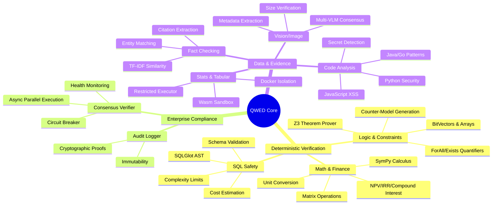
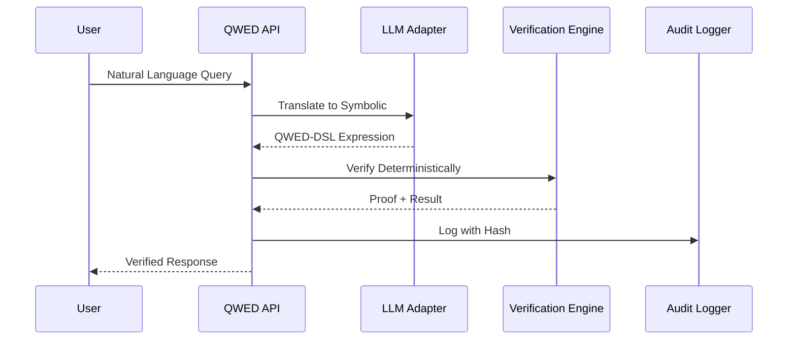

# QWED: The Global Standard for Verifiable AI 🛡️

> **The Future of AI is Not Just Intelligence—It is Trust.**

In a world increasingly driven by probabilistic models, QWED (Query With Evidence & Determinism) serves as the **Critical Verification Layer**. We bridge the gap between AI intuition and mathematical reality.

---

## 🌟 The Vision: A Safe, Auditable AI Future

QWED is more than just a verifier; it is an **Infrastructure for Accountability**. Our mission is to make the most powerful AIs in the world safe for enterprise, compliant for regulators, and trusted by humanity.

### The Problem: The "Hallucination Gap"
LLMs are brilliant translators but unreliable calculators. They can generate perfect-sounding code that deletes your database, or convincing financial reports with subtle math errors.

### The Solution: The Symbolic Firewall
QWED treats LLMs as **Untrusted Translators** and Symbolic Engines as **Trusted Verifiers**.


---

## 🏛️ The 8-Engine Specialized Architecture

We don't rely on one engine for everything. QWED uses **8 Specialized Deterministic Engines**, each a master of its domain.



---

## Engine Deep Dives

### 1. 🏦 Math & Finance Engine
Supports **calculus** (derivatives, integrals, limits), **matrix operations** (determinant, inverse, eigenvalues), **financial formulas** (NPV, IRR, compound interest), **statistics** (mean, variance, correlation), and **unit conversion**.

!!! success "Example"
    ```python
    # Calculus: derivative of x^2 = 2x ✓
    # Matrix: det([[1,2],[3,4]]) = -2 ✓
    # Finance: NPV at 10% for [100,200,300] = $481.59 ✓
    ```

### 2. 🧠 Formal Logic Engine
Using the **Microsoft Z3 Theorem Prover** with support for:
- **Quantifiers**: ForAll(∀), Exists(∃)
- **BitVectors**: 8/16/32/64-bit operations for crypto verification
- **Array Theory**: Select/Store operations
- **Theorem Proving**: Equivalence, implication, counter-models

!!! example "Counter-Model Example"
    > *"UNSAT. Violation: ForAll x. (x > 0) => (x * 2 > x) - Cannot prove for x = 0"*

### 3. 🛡️ SQL Armor Engine
We parse AI-generated SQL through an AST firewall with:
- **Complexity Limits**: Max tables, joins, subqueries, columns
- **Cost Estimation**: Query cost scoring
- **Injection Detection**: Tautologies, stacked queries, comments
- **Schema Validation**: Table/column existence checks

### 4. 📊 Statistics Engine
Executes statistical queries in secure sandboxes:
- **Docker**: Full isolation (production)
- **Wasm**: Portable (works anywhere)
- **Restricted**: AST-validated Python subset (fallback)

### 5. ✅ Fact Checker Engine
**No LLM required for most claims!** Uses deterministic methods:
- TF-IDF semantic similarity
- Keyword overlap analysis
- Entity matching (numbers, dates, names)
- Citation extraction with relevance scoring

### 6. 🔐 Code Security Engine
Multi-language AST analysis:
- **Python**: eval, exec, pickle, weak crypto
- **JavaScript/TypeScript**: XSS, prototype pollution, eval
- **Java**: SQL injection, deserialization
- **Go**: Command injection, path traversal
- **Secret Detection**: AWS keys, GitHub tokens, OpenAI keys

### 7. 🖼️ Image Verification Engine
**Deterministic first, VLM fallback:**
- Metadata extraction (dimensions, format)
- Size/dimension claim verification (100% accurate)
- Multi-VLM consensus for semantic claims

### 8. 🤖 Reasoning & Consensus Engine
- **Chain-of-Thought Validation**: Parse and verify reasoning steps
- **Result Caching**: LRU + Redis for repeated queries
- **Multi-Provider**: Anthropic, Azure, OpenAI
- **Circuit Breaker**: Auto-disable failing engines
- **Async Parallel**: Execute engines concurrently

---

## 🔒 Enterprise Safeguards: The Foundation of Trust

QWED is designed for the most regulated industries on Earth.

| Feature | Description |
|---------|-------------|
| **Auditable Proofs** | Every verification result comes with a "Proof of Correctness" |
| **Cryptographic Audit Logs** | Every action is logged with immutable hashes, ready for regulatory audits |
| **Shadow Execution** | Code verification happens in an ephemeral, isolated sandbox |
| **Policy Engine** | Define granular "Golden Rules" that the AI can never cross |

---

## 🛠️ Deep Technical Integration

For developers, QWED is an integrated protocol that fits seamlessly into your stack.

### The Integration Flow



!!! tip "Explore the Specs"
    For deep-dive technical documentation, including file structures and API schemas, check out the [API Reference](api.md).

### 🆕 QWEDLocal: Client-Side Deployment (v2.1.0)

For use cases that don't need a backend server, **QWEDLocal** provides client-side verification:

```mermaid
sequenceDiagram
    participant User
    participant SDK as QWEDLocal (Client-Side)
    participant LLM as User's LLM (Direct)
    participant Engine as Local Verifiers
    
    User->>SDK: verify("What is 2+2?")
    SDK->>LLM: API call (OpenAI/Ollama/etc)
    LLM-->>SDK: "4"
    SDK->>Engine: SymPy/Z3/AST (Local)
    Engine-->>SDK: Verified ✓
    SDK->>SDK: Cache result (SQLite)
    SDK-->>User: VerificationResult(verified=True, value=4)
    
    Note over SDK,Engine: No QWED backend!<br/>Data stays on user's machine
```



**Key Differences:**
- **Backend API**: Needs server infrastructure, centralized audit logs, enterprise features
- **QWEDLocal**: No infrastructure, 100% privacy, works offline, $0 with Ollama

**Use Cases:**
- Privacy-first applications (HIPAA, GDPR)
- Individual developers / prototyping
- Offline environments
- Cost-sensitive projects
- Edge computing

📖 **[QWEDLocal Guide →](QWED_LOCAL.md)**

---

## 🖥️ Developer Tools & Infrastructure

### Local Development Stack

Start the full stack with Docker Compose:

```bash
docker-compose up -d
```

| Service | URL | Purpose |
|---------|-----|---------|
| **QWED API** | http://localhost:8000/docs | API Documentation |
| **Jaeger** | http://localhost:16686 | Distributed Tracing |
| **Prometheus** | http://localhost:9090 | Metrics |
| **Grafana** | http://localhost:3000 | Dashboards (admin/qwed_admin) |
| **Redis** | localhost:6379 | Caching |
| **PostgreSQL** | localhost:5432 | Database |

> 🏢 **Enterprise Support Coming Soon:** Managed dashboards, hosted observability, and SLA guarantees. Contact rahul@qwedai.com

### Grafana Dashboards

- **QWED Verification Dashboard**: Real-time metrics, latency percentiles, cache hit rates

### Python SDK

```bash
pip install qwed
```

```python
from qwed_sdk import QWEDClient

client = QWEDClient(api_key="qwed_...")
result = client.verify("What is 2+2?")
```

### CLI Tool

```bash
export QWED_API_KEY="qwed_..."
qwed verify "Is 2+2 equal to 4?"
qwed verify-math "x**2 - y**2 = (x-y)*(x+y)"
qwed batch queries.json -o results.json
```

---

### "Safe AI is the only AI that can change the world."

*Built with ❤️ for a deterministic future.*

