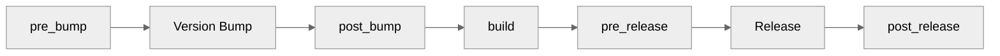

# Release Hooks

:material-hook: Run custom scripts at release lifecycle points.

---

## Overview

Hooks let you execute commands at specific points in the release process:



---

## Hook Types

| Hook | When It Runs | Use Case |
|------|--------------|----------|
| `pre_bump` | Before version bump | Run tests, validate |
| `post_bump` | After version bump | Update related files |
| `build` | Before publishing | Build package |
| `pre_release` | Before creating release | Final validation |
| `post_release` | After successful release | Notify, deploy |

---

## Configuration

### Basic Hooks

```toml title=".releasio.toml"
[hooks]
pre_bump = ["pytest"]
post_release = ["./scripts/notify.sh"]
```

### Multiple Commands

```toml title=".releasio.toml"
[hooks]
pre_bump = [
    "pytest",
    "ruff check .",
    "mypy src/",
]

post_release = [
    "./scripts/notify-slack.sh",
    "./scripts/update-docs.sh",
]
```

### With Variables

```toml title=".releasio.toml"
[hooks]
build = "make build VERSION={version}"
post_release = [
    "./scripts/notify.sh {version}",
    "./scripts/tag-docker.sh {version} {tag}",
]
```

---

## Available Variables

| Variable | Description | Example |
|----------|-------------|---------|
| `{version}` | New version number | `1.2.0` |
| `{tag}` | Git tag | `v1.2.0` |
| `{old_version}` | Previous version | `1.1.0` |
| `{branch}` | Current branch | `main` |
| `{repo}` | Repository name | `my-package` |
| `{date}` | Release date | `2024-01-15` |

---

## Hook Examples

### Pre-bump: Validation

```toml title=".releasio.toml"
[hooks]
pre_bump = [
    "pytest",
    "ruff check .",
    "mypy src/",
    "./scripts/check-changelog.sh",
]
```

### Post-bump: Update Files

```toml title=".releasio.toml"
[hooks]
post_bump = [
    "npm version {version} --no-git-tag-version",
    "./scripts/update-version-badge.sh {version}",
]
```

### Build: Custom Build Process

```toml title=".releasio.toml"
[hooks]
build = "make build VERSION={version}"
```

Or with uv:

```toml title=".releasio.toml"
[hooks]
build = "uv build"
```

### Pre-release: Final Checks

```toml title=".releasio.toml"
[hooks]
pre_release = [
    "./scripts/validate-release.sh {version}",
    "twine check dist/*",
]
```

### Post-release: Notifications

```toml title=".releasio.toml"
[hooks]
post_release = [
    "./scripts/notify-slack.sh {version}",
    "./scripts/update-docs.sh {version}",
    "./scripts/tweet-release.sh {version}",
]
```

---

## Script Examples

### Slack Notification

```bash title="scripts/notify-slack.sh"
#!/bin/bash
VERSION=$1

curl -X POST "$SLACK_WEBHOOK_URL" \
  -H "Content-Type: application/json" \
  -d "{
    \"text\": \"🚀 Released version $VERSION!\",
    \"blocks\": [
      {
        \"type\": \"section\",
        \"text\": {
          \"type\": \"mrkdwn\",
          \"text\": \"*New Release: v$VERSION*\n<https://github.com/user/repo/releases/tag/v$VERSION|View Release>\"
        }
      }
    ]
  }"
```

### Docker Tag

```bash title="scripts/tag-docker.sh"
#!/bin/bash
VERSION=$1
TAG=$2

docker build -t myapp:$VERSION .
docker tag myapp:$VERSION myapp:latest
docker push myapp:$VERSION
docker push myapp:latest
```

### Update Documentation

```bash title="scripts/update-docs.sh"
#!/bin/bash
VERSION=$1

# Update version in docs
sed -i "s/version: .*/version: $VERSION/" docs/mkdocs.yml

# Build and deploy docs
mkdocs build
aws s3 sync site/ s3://docs.example.com/
```

### Validate Release

```bash title="scripts/validate-release.sh"
#!/bin/bash
VERSION=$1

# Check version format
if ! [[ "$VERSION" =~ ^[0-9]+\.[0-9]+\.[0-9]+(-[a-z]+\.[0-9]+)?$ ]]; then
    echo "Invalid version format: $VERSION"
    exit 1
fi

# Check changelog has entry
if ! grep -q "## \[$VERSION\]" CHANGELOG.md; then
    echo "No changelog entry for $VERSION"
    exit 1
fi

# Check dist files exist
if [ ! -d "dist" ] || [ -z "$(ls -A dist)" ]; then
    echo "No distribution files in dist/"
    exit 1
fi

echo "✓ Release validation passed for $VERSION"
```

---

## Error Handling

### Hook Failure

If a hook fails, the release process stops:

```toml title=".releasio.toml"
[hooks]
pre_bump = [
    "pytest",  # If this fails...
    "mypy",    # ...this won't run
]
```

### Continue on Error

To continue despite failures (use with caution):

```bash title="scripts/optional-check.sh"
#!/bin/bash
# Run check but don't fail
some-optional-check || true
```

### Exit Codes

| Exit Code | Meaning |
|-----------|---------|
| 0 | Success, continue |
| Non-zero | Failure, stop release |

---

## Environment Variables

Hooks inherit environment variables:

```yaml title=".github/workflows/release.yml"
- uses: mikeleppane/releasio@v2
  with:
    command: release
    github-token: ${{ secrets.GITHUB_TOKEN }}
  env:
    SLACK_WEBHOOK_URL: ${{ secrets.SLACK_WEBHOOK }}
    AWS_ACCESS_KEY_ID: ${{ secrets.AWS_KEY }}
    AWS_SECRET_ACCESS_KEY: ${{ secrets.AWS_SECRET }}
```

Access in scripts:

```bash title="scripts/notify.sh"
#!/bin/bash
curl -X POST "$SLACK_WEBHOOK_URL" -d "..."
```

---

## Working Directory

Hooks run from the project root:

```toml title=".releasio.toml"
[hooks]
# These paths are relative to project root
pre_bump = ["./scripts/check.sh"]
build = "make -C build/"
```

---

## Conditional Hooks

### By Environment

```bash title="scripts/maybe-notify.sh"
#!/bin/bash
if [ "$CI" = "true" ]; then
    # Only notify in CI
    ./scripts/notify-slack.sh "$1"
fi
```

### By Branch

```bash title="scripts/deploy.sh"
#!/bin/bash
BRANCH=$(git branch --show-current)

if [ "$BRANCH" = "main" ]; then
    ./scripts/deploy-production.sh "$1"
else
    ./scripts/deploy-staging.sh "$1"
fi
```

---

## Common Patterns

### Full CI Integration

```toml title=".releasio.toml"
[hooks]
# Validate before bump
pre_bump = [
    "pytest --cov",
    "ruff check .",
    "mypy src/",
]

# Update lock file after bump
post_bump = [
    "uv lock",
]

# Build artifacts
build = "uv build"

# Final validation
pre_release = [
    "twine check dist/*",
]

# Notify on success
post_release = [
    "./scripts/notify-slack.sh {version}",
    "./scripts/update-badge.sh {version}",
]
```

### Docker Release

```toml title=".releasio.toml"
[hooks]
build = "docker build -t myapp:{version} ."
post_release = [
    "docker push myapp:{version}",
    "docker tag myapp:{version} myapp:latest",
    "docker push myapp:latest",
]
```

### Documentation Site

```toml title=".releasio.toml"
[hooks]
post_release = [
    "mkdocs build",
    "aws s3 sync site/ s3://docs.example.com/",
    "aws cloudfront create-invalidation --distribution-id XXX --paths '/*'",
]
```

---

## Debugging

### Verbose Output

```bash
releasio release --verbose
```

### Test Hooks Locally

```bash
# Test pre_bump hooks
pytest && ruff check . && mypy src/

# Test with version variable
VERSION=1.2.3 ./scripts/notify.sh $VERSION
```

---

## Best Practices

### Do

- [x] Keep hooks idempotent
- [x] Use exit codes properly
- [x] Log hook actions
- [x] Test hooks locally first
- [x] Use variables for flexibility

### Don't

- [ ] Put critical logic only in hooks
- [ ] Ignore hook failures
- [ ] Make hooks too complex
- [ ] Hardcode values

---

## See Also

- [Configuration Reference](../user-guide/configuration/reference.md) - All options
- [GitHub Actions](../github/actions/index.md) - CI/CD setup
- [Full Workflow](../github/actions/full-workflow.md) - Complete example
