# Data Flow

:material-transit-connection-variant: How data moves through releasio.

---

## Release Workflow

The complete release flow:

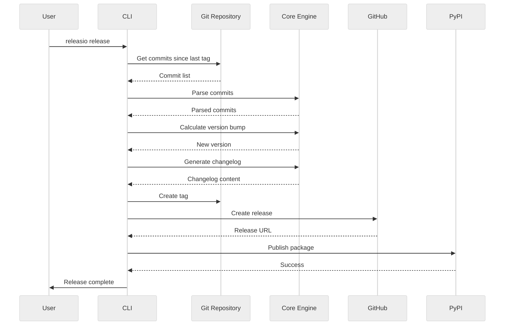

---

## Command Data Flows

### check Command

Preview release without changes:

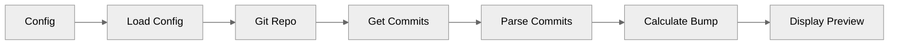

**Data transformations:**

1. **Config** → Validated `ReleasePyConfig`
2. **Git log** → List of `Commit` objects
3. **Commits** → List of `ParsedCommit` objects
4. **Parsed commits** → `BumpType` (major/minor/patch)
5. **Current version + bump** → New `Version`

### update Command

Update version and changelog locally:

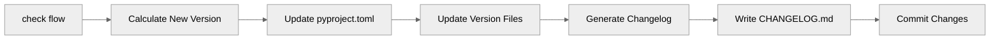

**File modifications:**

```
pyproject.toml    → version = "1.2.0"
__init__.py       → __version__ = "1.2.0"
CHANGELOG.md      → ## [1.2.0] - 2024-01-15
```

### release-pr Command

Create a pull request:

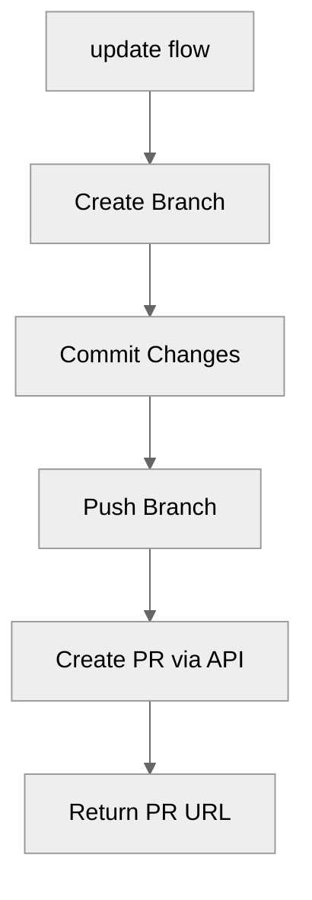

**API calls:**

1. `POST /repos/{owner}/{repo}/pulls` - Create PR

### release Command

Tag and publish:

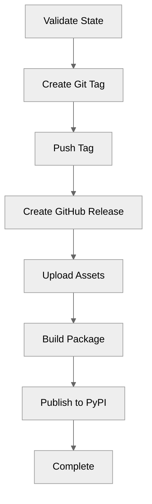

**API calls:**

1. `POST /repos/{owner}/{repo}/releases` - Create release
2. `POST /releases/{id}/assets` - Upload each asset
3. PyPI upload via build tool

---

## Commit Parsing Pipeline

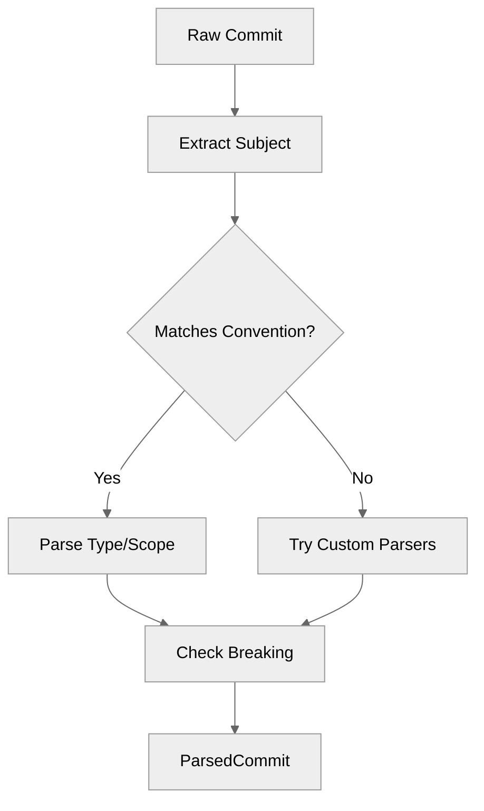

### Parsing Rules

```python
# Input: "feat(api)!: add user endpoint"

# Step 1: Match pattern
pattern = r"^(?P<type>\w+)(\((?P<scope>[^)]+)\))?(?P<breaking>!)?:\s*(?P<desc>.+)$"

# Step 2: Extract groups
type = "feat"
scope = "api"
breaking = True  # from "!"
description = "add user endpoint"

# Step 3: Create ParsedCommit
ParsedCommit(
    commit=commit,
    commit_type="feat",
    scope="api",
    description="add user endpoint",
    is_breaking=True,
    is_conventional=True,
)
```

---

## Version Calculation

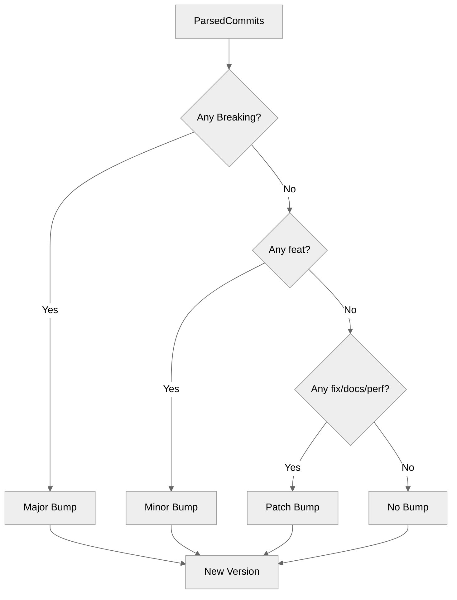

### Bump Priority

```python
def calculate_bump(commits: list[ParsedCommit]) -> BumpType:
    if any(c.is_breaking for c in commits):
        return BumpType.MAJOR
    if any(c.commit_type == "feat" for c in commits):
        return BumpType.MINOR
    if any(c.commit_type in PATCH_TYPES for c in commits):
        return BumpType.PATCH
    return BumpType.NONE
```

---

## Changelog Generation

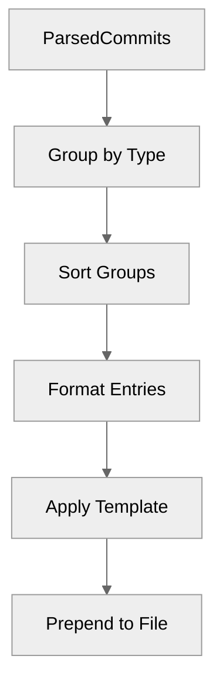

### Grouping

```python
# Input commits
commits = [
    ParsedCommit(type="feat", desc="add dashboard"),
    ParsedCommit(type="fix", desc="resolve bug"),
    ParsedCommit(type="feat", desc="add settings"),
]

# Grouped
groups = {
    "feat": [
        ParsedCommit(desc="add dashboard"),
        ParsedCommit(desc="add settings"),
    ],
    "fix": [
        ParsedCommit(desc="resolve bug"),
    ],
}
```

### Template Application

```markdown
## [1.2.0] - 2024-01-15

### Features
- Add dashboard
- Add settings

### Bug Fixes
- Resolve bug
```

---

## Configuration Loading

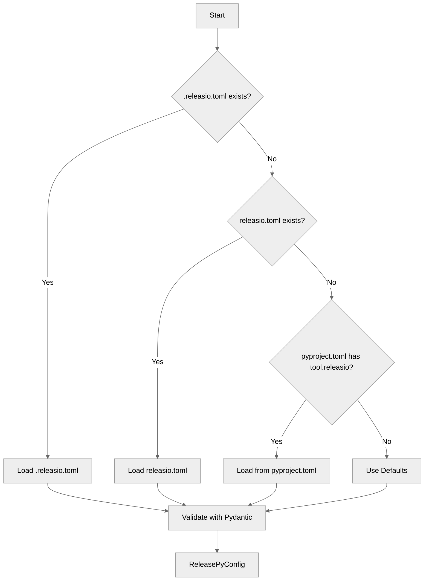

### Merge Strategy

```python
# Defaults < pyproject.toml < releasio.toml < .releasio.toml
config = ReleasePyConfig()  # Defaults
config = merge(config, pyproject_config)
config = merge(config, releasio_config)
config = merge(config, dotreleasio_config)
```

---

## Publishing Pipeline

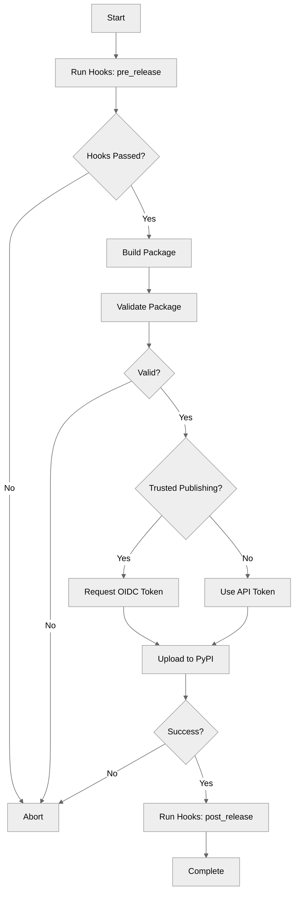

### Build Commands

| Tool | Build | Publish |
|------|-------|---------|
| uv | `uv build` | `uv publish` |
| poetry | `poetry build` | `poetry publish` |
| pdm | `pdm build` | `pdm publish` |

---

## GitHub Release Creation

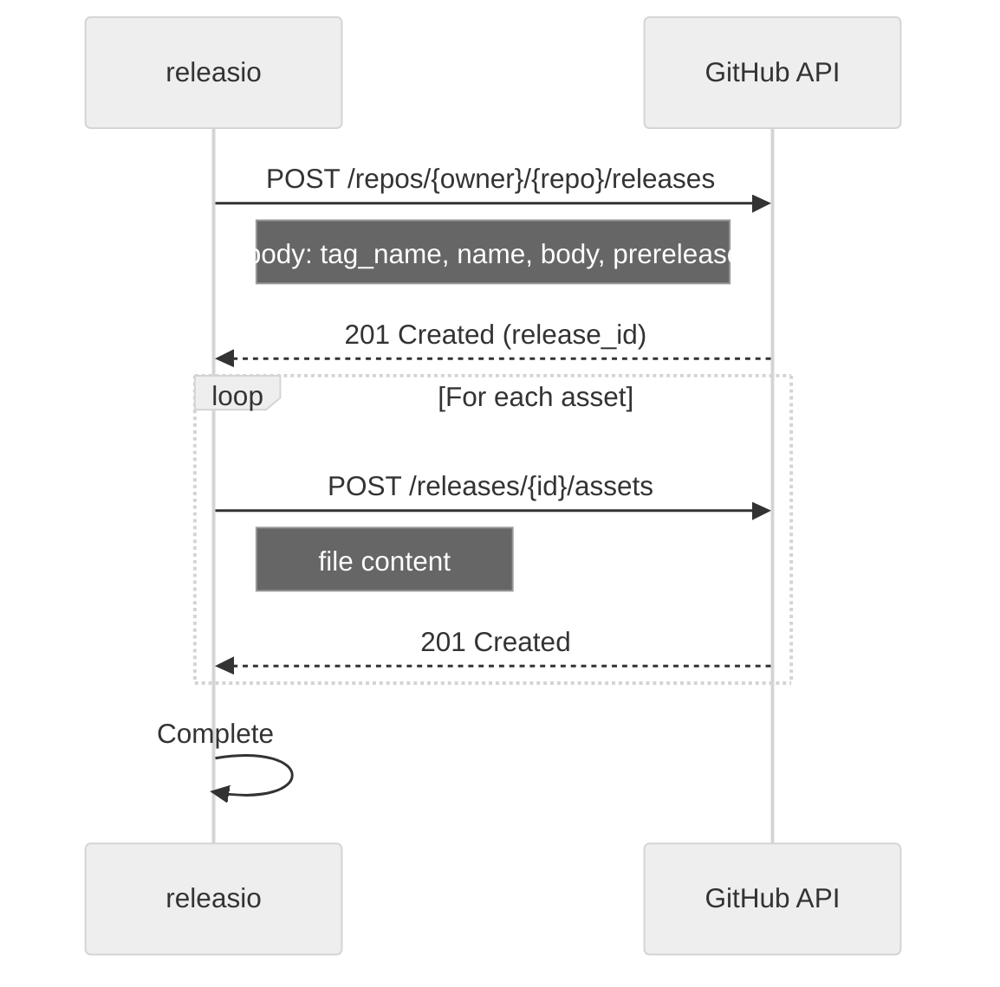

### Request Payload

```json
{
  "tag_name": "v1.2.0",
  "name": "v1.2.0",
  "body": "## What's Changed\n\n- Added dashboard\n- Fixed bug",
  "draft": false,
  "prerelease": false
}
```

---

## Error Propagation

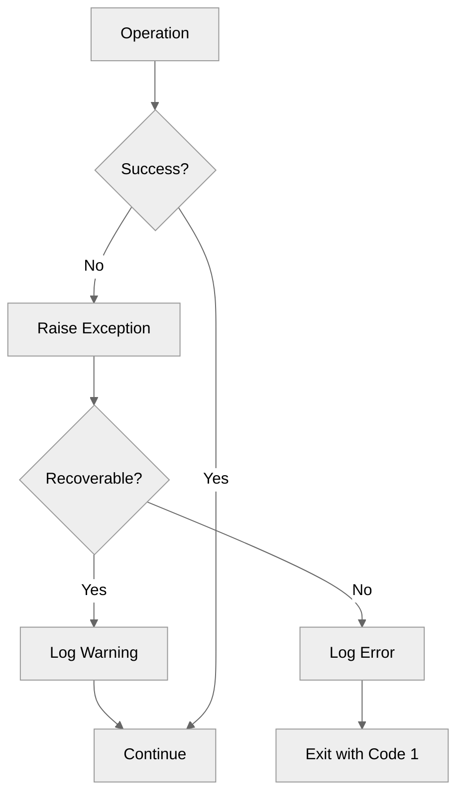

### Exception Hierarchy

```
ReleaseError
├── ConfigError
├── GitError
│   ├── TagExistsError
│   └── PushError
├── GitHubError
│   ├── AuthenticationError
│   └── RateLimitError
└── PublishError
    ├── BuildError
    └── UploadError
```

---

## See Also

- [System Overview](overview.md) - Component architecture
- [Configuration](../user-guide/configuration/reference.md) - Config options
- [API Reference](../reference/index.md) - Code documentation
